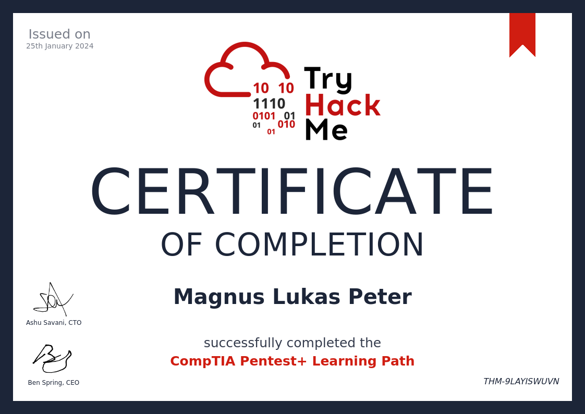

# Meine Zertifikate

In diesem Dokument liste ich alle meine Zertifikate auf und erkläre kurz ihre Bedeutung.

## Zertifikate

### CompTIA-Pentest+ Zertifikat

Das CompTIA Pentest+ Zertifikat wurde mir von TryHackMe verliehen und bescheinigt fortgeschrittene Kenntnisse und Fähigkeiten im Bereich der Penetrationstests und Schwachstellenbewertungen. Inhaber dieses Zertifikats haben nachgewiesen, dass sie in der Lage sind:

- **Penetrationstests durchzuführen**: Systeme, Netzwerke und Anwendungen auf Schwachstellen zu prüfen und zu analysieren.
- **Schwachstellen zu identifizieren**: Sicherheitslücken und potenzielle Angriffsvektoren zu erkennen.
- **Risikobewertungen vorzunehmen**: Risiken zu bewerten und Empfehlungen zur Sicherheitsverbesserung zu geben.
- **Berichterstattung und Dokumentation**: Ergebnisse klar und präzise zu dokumentieren und Berichte zu erstellen.

Dieses Zertifikat ist besonders wertvoll für IT-Sicherheitsexperten, Penetrationstester, Sicherheitsanalysten und alle, die in der Cybersecurity-Branche tätig sind und ihre Fähigkeiten im Bereich der Netzwerksicherheit und Schwachstellenmanagement vertiefen möchten.

### Complete Beginner Zertifikat

Das Complete Beginner Zertifikat wird von TryHackMe verliehen und richtet sich an Einsteiger in die Welt der Cybersecurity und des Ethical Hackings. Inhaber dieses Zertifikats haben grundlegende Kenntnisse und Fähigkeiten erworben, um:

- **Einführung in Cybersecurity**: Grundlegende Konzepte und Prinzipien der Cybersecurity verstehen.
- **Grundlagen des Ethical Hackings**: Einführung in Werkzeuge und Techniken für ethisches Hacking.
- **Praktische Übungen**: Durchführung von praktischen Herausforderungen und Übungen auf der TryHackMe-Plattform.

Dieses Zertifikat ist ideal für alle, die ihre ersten Schritte in der Cybersecurity machen möchten und sich mit den Grundlagen von Hacking und Sicherheitskonzepten vertraut machen wollen.

### Zertifikat 3

Dieses Zertifikat bedeutet, dass ich den Kurs "Machine Learning" von Andrew Ng auf Coursera erfolgreich abgeschlossen habe. Es bestätigt meine Fähigkeiten in den Bereichen überwachtes und unüberwachtes Lernen sowie andere wichtige Themen des maschinellen Lernens.

### Zertifikat 4

Dieses Zertifikat bedeutet, dass ich das "Web Development Bootcamp" auf Udemy erfolgreich abgeschlossen habe. Es belegt meine Kenntnisse in HTML, CSS, JavaScript und den grundlegenden Konzepten des Webentwicklungsprozesses.

### Zertifikat 5

Dieses Zertifikat bedeutet, dass ich die "Project Management Professional (PMP)"-Zertifizierung erhalten habe. Es bestätigt meine Fähigkeiten im Projektmanagement und meine Erfahrung in der Leitung und Abwicklung von Projekten.

## Weitere Zertifikate

- **Zertifikat 6**: 
  Dieses Zertifikat bedeutet XYZ.
- **Zertifikat 7**: 
  Dieses Zertifikat bedeutet XYZ.
- **Zertifikat 8**: 
  Dieses Zertifikat bedeutet XYZ.

