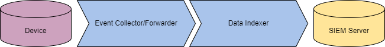
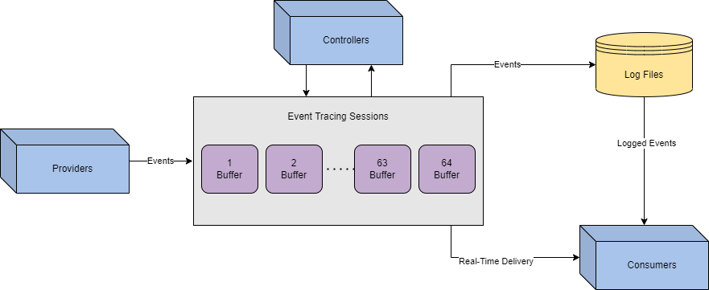
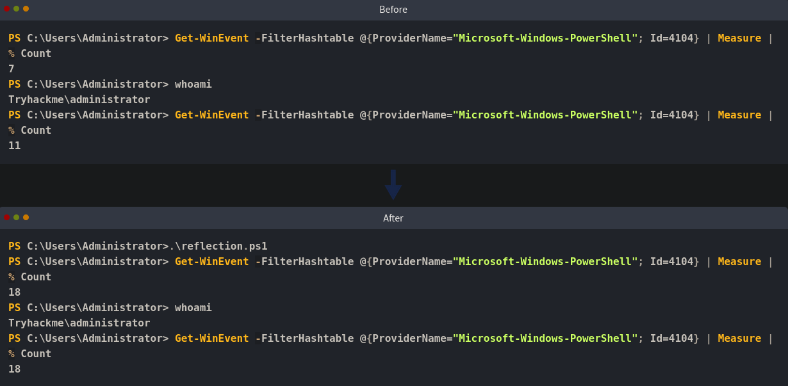
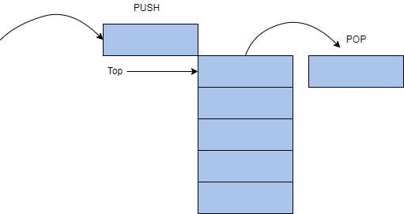
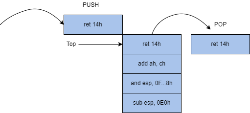
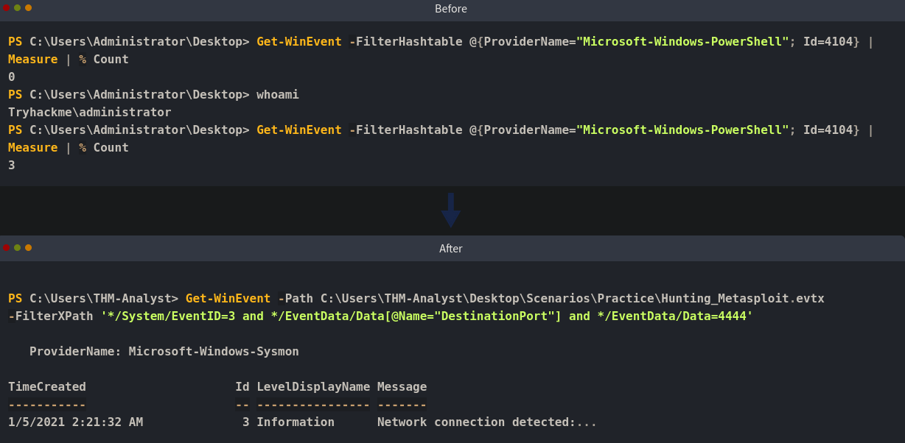

# Task 1 - Umgehung der Protokollierung und Überwachung
Eines der größten Hindernisse auf dem Weg eines Angreifers ist das Logging und Monitoring. Im Gegensatz zu Anti-Virus- und **EDR**-Lösungen (**E**ndpoint **D**etection and **R**esponse) erstellt das Logging eine physische Aufzeichnung der Aktivitäten, die auf bösartige Aktivitäten analysiert werden kann.

Wie ein Gerät überwacht wird, hängt von der Umgebung und den Vorlieben des Unternehmens ab. Teams können sich entscheiden, einige Geräte überhaupt nicht zu überwachen. Im Allgemeinen beginnt eine Überwachungslösung am Host-Gerät und sammelt Anwendungs- oder Ereignisprotokolle. Sobald Protokolle erstellt wurden, können sie auf dem Gerät gespeichert oder an einen Ereignissammler/Forwarder gesendet werden. Sobald sie sich nicht mehr auf dem Gerät befinden, entscheidet das Verteidigungsteam, wie sie aggregiert werden; dies wird im Allgemeinen mit einem Indexer und einem **SIEM** (**S**ecurity **I**nformation and **E**vent **M**anager) durchgeführt.


Ein Angreifer hat möglicherweise wenig Kontrolle, sobald Protokolle von einem Gerät entfernt wurden, kann jedoch steuern, was sich auf dem Gerät befindet und wie es aufgenommen wird. Das primäre Ziel für einen Angreifer sind die Ereignisprotokolle, die von **ETW** (**E**vent **T**racing for **W**indows) verwaltet und kontrolliert werden.

Dieser Raum wird sich mit der Ereignisverfolgung und ihren Schwachstellen befassen, um einem Angreifer zu ermöglichen, ETW-basierte Lösungen zu umgehen oder zu deaktivieren.

### Lernziele:

- Verstehen der Technologie und Implementierung der Ereignisverfolgung.
- Verstehen, wie Techniken zur Umgehung von ETW erstellt werden.
- Erlernen, wie theoretische Umgehungskonzepte auf Code angewendet werden.

Bevor Sie mit diesem Raum beginnen, machen Sie sich mit der grundlegenden Windows-Nutzung und -Funktionalität vertraut; wir empfehlen, den [Windows Internals](https://tryhackme.com/room/windowsinternals) Raum abzuschließen. Grundlegende Programmierkenntnisse in C und PowerShell sind ebenfalls empfehlenswert, aber nicht erforderlich.

Wir haben eine grundlegende Windows-Maschine mit den benötigten Dateien bereitgestellt, um diesen Raum abzuschließen. Sie können auf die Maschine im Browser oder über RDP mit den unten stehenden Anmeldedaten zugreifen.

Machine IP: `MACHINE_IP` Benutzername: `Administrator` Passwort: `Tryhackme!`

# Task 2 - Ereignisverfolgung
Wie bereits erwähnt, wird fast die gesamte Ereignisprotokollierungsfunktionalität in Windows sowohl auf Anwendungs- als auch auf Kernelebene von ETW (Event Tracing for Windows) gehandhabt. Während es andere Dienste wie Event Logging und Trace Logging gibt, sind diese entweder Erweiterungen von ETW oder für Angreifer weniger relevant.
| Komponente | Zweck |
|------------|-------|
| Steuerungen | Sitzungen erstellen und konfigurieren |
| Anbieter    | Ereignisse generieren |
| Verbraucher | Ereignisse interpretieren |

Wir werden jedes dieser Komponenten und deren Instrumentierung im nächsten Abschnitt ausführlicher behandeln.
##
Obwohl für einen Angreifer weniger wichtig als die Komponenten selbst, sind Ereignis-IDs ein zentrales Merkmal der Windows-Protokollierung. Ereignisse werden im XML-Format (Extensible Markup Language) gesendet und übertragen, was der Standard für die Definition und Implementierung von Ereignissen durch Anbieter ist. Unten ist ein Beispiel für die Ereignis-ID 4624: Ein Konto wurde erfolgreich angemeldet.
```
Event ID:4624
Source:Security
Category:Logon/Logoff
Message:An account was successfully logged on.

Subject:
Security ID: NT AUTHORITY\\SYSTEM
Account Name: WORKSTATION123$
...
[ snip ]
...
Logon Type: 7

New Logon:
Security ID: CORPDOMAIN\\john.doe
Account Name: john.doe
...
[ snip ]
...
Process Information:
Process ID: 0x314
```

Für weitere Informationen zur Ereignisprotokollierung, besuchen Sie den Raum [Windows Event Logs](https://tryhackme.com/r/room/windowseventlogs).

An diesem Punkt verstehen wir, warum Protokollierung für einen Angreifer störend sein kann, aber wie genau ist ETW für einen Angreifer relevant? ETW bietet Sichtbarkeit über den Großteil des Betriebssystems, während die Protokollierung im Allgemeinen begrenzte Sichtbarkeit oder Details hat.

Aufgrund der Sichtbarkeit von ETW sollte ein Angreifer stets die Ereignisse im Auge behalten, die bei der Durchführung ihrer Operationen generiert werden könnten. Der beste Ansatz, um ETW auszuschalten, besteht darin, seine Einsicht in das, was Sie konkret tun, so weit wie möglich zu begrenzen und gleichzeitig die Integrität der Umgebung aufrechtzuerhalten.

In den kommenden Aufgaben werden wir die Instrumentierung von ETW, die Umgehung von ETW und andere auf ETW basierende Lösungen behandeln.

## Fragen:
Welche ETW-Komponente wird Sitzungen erstellen und konfigurieren?
```

```

Welche Ereignis-ID protokolliert, wenn ein Benutzerkonto gelöscht wurde?
```

```

# Task 3 - Ansätze zur Log-Umgehung
Bevor wir uns den moderneren und technischeren Ausweichtechniken widmen, betrachten wir zunächst die verschiedenen Ansätze und ihre Auswirkungen auf Angreifer und Verteidiger.

Wenn man erstmals über Log-Evasion nachdenkt und diese bewertet, könnte man meinen, dass einfaches Zerstören oder Manipulieren der Logs eine brauchbare Option wäre.

Nach den besten Sicherheitspraktiken ist es in einer modernen Umgebung üblich, Log-Weiterleitungen zu verwenden. Log-Weiterleitung bedeutet, dass das SOC (Security Operations Center) Logs von der Hostmaschine auf einen zentralen Server oder Indexer verschiebt oder "weiterleitet". Selbst wenn ein Angreifer Logs von der Hostmaschine löschen kann, könnten diese bereits vom Gerät entfernt und gesichert sein.

Angenommen, ein Angreifer hat alle Logs gelöscht, bevor sie weitergeleitet wurden, oder sie wurden nicht weitergeleitet, wie würde dies einen Alarm auslösen? Ein Angreifer muss zuerst die Integrität der Umgebung berücksichtigen; wenn von einem Gerät keine Logs stammen, kann dies ernsthafte Verdachtsmomente hervorrufen und zu einer Untersuchung führen. Selbst wenn ein Angreifer kontrolliert, welche Logs entfernt und weitergeleitet wurden, könnten Verteidiger die Manipulation dennoch verfolgen.
| Event ID | Zweck                                                      |
|----------|------------------------------------------------------------|
| 1102     | Protokolliert, wenn das Windows-Sicherheitsaudit-Log gelöscht wurde |
| 104      | Protokolliert, wenn die Log-Datei gelöscht wurde           |
| 1100     | Protokolliert, wenn der Windows-Ereignisprotokolldienst heruntergefahren wurde |


Die oben genannten Ereignis-IDs können den Prozess des Zerstörens von Logs oder des "Log-Smashings" überwachen. Dies stellt ein klares Risiko für Angreifer dar, die versuchen, Logs zu manipulieren oder zu zerstören. Obwohl es möglich ist, diese Gegenmaßnahmen weiter zu umgehen oder die Logs zu manipulieren, muss ein Angreifer das Risiko bewerten. Beim Annähern an eine Umgebung ist man sich in der Regel der Sicherheitspraktiken nicht bewusst und geht ein OPSEC (Operational Security) Risiko ein, indem man diesen Ansatz versucht.

Wenn der vorherige Ansatz zu aggressiv ist, wie können wir das Problem strategisch angehen?

Ein Angreifer muss sich darauf konzentrieren, welche Logs eine bösartige Technik zur Folge haben könnte, um die Integrität der Umgebung aufrechtzuerhalten. Indem er weiß, was gegen ihn instrumentiert werden könnte, kann er veröffentlichte Methoden nutzen oder anpassen.

Die meisten veröffentlichten Techniken zielen auf ETW-Komponenten (Event Tracing for Windows) ab, da diese einem Angreifer die meiste Kontrolle über den Tracing-Prozess ermöglichen.

Dieser Raum wird einige der häufigsten veröffentlichten Techniken und eine modernere Technik, die eine breite Palette von Kontrollmöglichkeiten bietet, aufschlüsseln.

## Fragen:
Wie viele Ereignisse insgesamt können verwendet werden, um Ereignismanipulation zu verfolgen?
```

```

Welche Ereignis-ID protokolliert, wenn die Log-Datei gelöscht wurde?
```

```

# Task 4 - Verfolgungsinstrumentierung
ETW ist in drei separate Komponenten unterteilt, die zusammenarbeiten, um Daten zu verwalten und zu korrelieren. Ereignisprotokolle in Windows unterscheiden sich nicht von generischen XML-Daten, was ihre Verarbeitung und Interpretation erleichtert.

Ereignis Controller werden verwendet, um Sitzungen zu erstellen und zu konfigurieren. Um diese Definition zu erweitern, können wir den Controller als die Anwendung betrachten, die bestimmt, wie und wohin die Daten fließen. Aus den [Microsoft-Dokumenten](https://learn.microsoft.com/en-us/windows/win32/etw/about-event-tracing#controllers): „Controller sind Anwendungen, die die Größe und den Speicherort der Protokolldatei definieren, Sitzungen zur Ereignisverfolgung starten und stoppen, Anbieter aktivieren, damit sie Ereignisse in die Sitzung protokollieren können, die Größe des Pufferpools verwalten und Ausführungsstatistiken für Sitzungen erhalten.“

Ereignis Anbieter werden verwendet, um Ereignisse zu generieren. Um diese Definition zu erweitern, wird der Controller dem Anbieter mitteilen, wie er arbeiten soll, und dann Protokolle von der zugewiesenen Quelle sammeln. Aus den [Microsoft-Dokumenten](https://docs.microsoft.com/en-us/windows/win32/etw/about-event-tracing#providers): „Anbieter sind Anwendungen, die Instrumentierung zur Ereignisverfolgung enthalten. Nachdem sich ein Anbieter registriert hat, kann ein Controller die Ereignisverfolgung im Anbieter aktivieren oder deaktivieren. Der Anbieter definiert seine Interpretation von aktiviert oder deaktiviert sein. Im Allgemeinen generiert ein aktivierter Anbieter Ereignisse, während ein deaktivierter Anbieter dies nicht tut.“

Es gibt auch vier verschiedene Arten von Anbietern, die verschiedene Funktionen und Legacy-Systeme unterstützen.
| Anbieter                 | Zweck                                                                                     |
|--------------------------|-------------------------------------------------------------------------------------------|
| **MOF** (**M**anaged **O**bject **F**ormat)  | Definiert Ereignisse aus MOF-Klassen. Wird jeweils von einer Trace-Sitzung aktiviert.   |
| **WPP** (**W**indows **S**oftware **T**race **P**reprocessor) | Verknüpft mit [TMF (Trace Message Format)](https://docs.microsoft.com/en-us/windows-hardware/drivers/devtest/trace-message-format-file) Dateien zur Dekodierung von Informationen. Wird jeweils von einer Trace-Sitzung aktiviert. |
| Manifest-Basiert         | Definiert Ereignisse aus einem Manifest. Wird von bis zu acht Trace-Sitzungen gleichzeitig aktiviert. |
| TraceLogging             | Selbstbeschreibende Ereignisse, die alle erforderlichen Informationen enthalten. Wird von bis zu acht Trace-Sitzungen gleichzeitig aktiviert. |

**Ereignis-Verbraucher** werden verwendet, um Ereignisse zu interpretieren. Um diese Definition zu erweitern, wählt der Verbraucher Sitzungen aus und parst Ereignisse aus dieser oder mehreren Sitzungen gleichzeitig. Dies ist am häufigsten im „Event Viewer“ zu sehen. Aus den [Microsoft-Dokumenten](https://docs.microsoft.com/en-us/windows/win32/etw/about-event-tracing#consumers): „Verbraucher sind Anwendungen, die eine oder mehrere Ereignisverfolgungssitzungen als Ereignisquelle auswählen. Ein Verbraucher kann Ereignisse aus mehreren Ereignisverfolgungssitzungen gleichzeitig anfordern; das System liefert die Ereignisse in chronologischer Reihenfolge. Verbraucher können Ereignisse erhalten, die in Protokolldateien gespeichert sind, oder aus Sitzungen, die Ereignisse in Echtzeit liefern.“

Jede dieser Komponenten kann zusammengebracht werden, um den Daten- und Sitzungsfluss innerhalb von ETW vollständig zu verstehen und darzustellen.  


Von Anfang bis Ende stammen die Ereignisse von den Anbietern. Controller bestimmen, wohin die Daten gesendet und wie sie durch Sitzungen verarbeitet werden. Verbraucher speichern oder liefern Protokolle zur Interpretation oder Analyse.

Nun, da wir verstehen, wie ETW instrumentiert wird, wie wirkt sich dies auf Angreifer aus? Wir haben zuvor das Ziel erwähnt, die Sichtbarkeit zu begrenzen und gleichzeitig die Integrität aufrechtzuerhalten. Wir können einen bestimmten Aspekt der Einsicht einschränken, indem wir Komponenten gezielt ansprechen und gleichzeitig den Großteil des Datenflusses aufrechterhalten. Unten ist eine kurze Liste spezifischer Techniken aufgeführt, die auf jede ETW-Komponente abzielen.
| Komponente  | Techniken                                 |
|-------------|--------------------------------------------|
| Provider    | PSEtwLogProvider-Modifikation, Übernahme der Gruppenrichtlinie, Missbrauch der Log-Pipeline, Typenerstellung |
| Controller  | Patching EtwEventWrite, Manipulation der Laufzeitverfolgung |
| Consumer    | Log-Smashing, Log-Manipulation             |

Wir werden jede dieser Techniken in den kommenden Aufgaben ausführlich behandeln, um eine große Toolbox an Möglichkeiten bereitzustellen.

## Fragen:
Lesen Sie das oben Gesagte und fahren Sie mit der nächsten Aufgabe fort.
```
Keine Antwort nötig
```

# Task 5 - Reflexion für Spaß und Stille
In PowerShell werden ETW-Anbieter aus einer **.NET-Assembly** namens `PSEtwLogProvider` in die Sitzung geladen. Laut [Microsoft-Dokumentation](https://docs.microsoft.com/en-us/dotnet/standard/assembly/) bilden "Assemblies die grundlegenden Einheiten für Bereitstellung, Versionskontrolle, Wiederverwendung, Aktivierungsbereich und Sicherheitsberechtigungen für .NET-basierte Anwendungen". .NET-Assemblies mögen fremd erscheinen, jedoch können wir sie besser verstehen, wenn wir wissen, dass sie in vertrauten Formaten wie exe (ausführbare Datei) oder dll (Dynamiklink-Bibliothek) vorliegen.

In einer PowerShell-Sitzung werden die meisten .NET-Assemblies beim Start mit demselben Sicherheitskontext wie der Benutzer geladen. Da die Sitzung dasselbe Berechtigungsniveau wie die geladenen Assemblies hat, können wir die Assemblyfelder und -werte durch PowerShell-Reflexion modifizieren. Gemäß [O'Reilly](https://www.oreilly.com/library/view/professional-windows-powershell/9780471946939/9780471946939_using_.net_reflection.html) erlaubt "Reflection, einen Blick in eine Assembly zu werfen und ihre Eigenschaften herauszufinden. Innerhalb einer .NET-Assembly werden Informationen gespeichert, die beschreiben, was die Assembly enthält. Dies wird Metadaten genannt. Eine .NET-Assembly ist in gewisser Weise selbstbeschreibend, zumindest wenn sie korrekt abgefragt wird."

Im Kontext von **ETW** (**E**vent **T**racing for **W**indows) kann ein Angreifer die ETW-Ereignisanbieterassembly reflektieren und das Feld `m_enabled` auf `$null` setzen.

Auf hoher Ebene kann PowerShell-Reflexion in vier Schritte unterteilt werden:

1. Beschaffung der .NET-Assembly für `PSEtwLogProvider`.
2. Speichern eines Nullwerts für das `etwProvider` Feld.
3. Setzen des Felds `m_enabled` auf den zuvor gespeicherten Wert.

Im ersten Schritt müssen wir den Typ für die `PSEtwLogProvider` Assembly erhalten. Die Assembly wird gespeichert, um in den nächsten Schritten auf ihre internen Felder zugreifen zu können.
```cs
$logProvider = [Ref].Assembly.GetType('System.Management.Automation.Tracing.PSEtwLogProvider')
```

Im zweiten Schritt speichern wir einen Wert ($null) aus der vorherigen Assembly, um ihn später zu verwenden.
```cs
$etwProvider = $logProvider.GetField('etwProvider','NonPublic,Static').GetValue($null)
```

Im dritten Schritt kombinieren wir diese Schritte, um das Feld m_enabled mit dem im vorherigen Schritt gespeicherten Wert zu überschreiben.
```cs
[System.Diagnostics.Eventing.EventProvider].GetField('m_enabled','NonPublic,Instance').SetValue($etwProvider,0);
```

Wir können diese Schritte zusammenfügen und sie einem bösartigen PowerShell-Skript anhängen. Verwenden Sie das bereitgestellte PowerShell-Skript und experimentieren Sie mit dieser Technik.

Um die Wirksamkeit des Skripts zu beweisen, können wir es ausführen und die Anzahl der zurückgegebenen Ereignisse für einen bestimmten Befehl messen.


In der ersten Konsole sehen wir vier Ereignisse, die beim Ausführen des Befehls `whoami` generiert werden. Nachdem das Skript in der zweiten Konsole ausgeführt wurde, sehen wir keine Ereignisse mehr, die beim Ausführen eines Befehls generiert werden. Anhand dieses Vergleichs können wir auch sehen, dass das PowerShell-Skript sieben Ereignisse erstellt; dies sollte bei der Bewertung des Ansatzes berücksichtigt werden.

## Fragen:
Welche Reflexionsassembly wird verwendet?
```

```

Welches Feld wird überschrieben, um ETW zu deaktivieren?
```

```

# Task 6 - Patching-Tracing-Funktionen
ETW wird bei jedem neuen Prozess aus der Laufzeit geladen, die üblicherweise aus der **CLR** (**C**ommon **L**anguage **R**untime) stammt. Innerhalb eines neuen Prozesses werden ETW-Ereignisse aus der Benutzerlandanwendung gesendet und direkt aus dem aktuellen Prozess ausgegeben. Ein Angreifer kann vordefinierte Opcodes an eine In-Memory-Funktion von ETW schreiben, um Funktionalitäten zu patchen und zu deaktivieren. Bevor wir uns in die spezifischen Details dieser Technik vertiefen, betrachten wir auf hoher Ebene, wie Patching aussehen könnte. In seiner grundlegendsten Definition versuchen wir, eine Anwendung zu zwingen, vor Erreichen der zu patchenden Funktion zu beenden oder zurückzukehren.

Um dieses Konzept besser zu verstehen, haben wir eine einfache Pseudofunktion erstellt, die mathematische Operationen ausführt und dann eine Ganzzahl zurückgibt. Wenn ein Return vor dem originalen Return eingefügt wird, wird das Programm die nachfolgenden Zeilen nicht abschließen.
```cs
int x = 1
int y = 3
return x + y

// output: 4  
```
```cs
int x = 1
return  x
int y = 3
return x + y

// output: 1 
```
Indem wir dieses Konzept auf unser Ziel anwenden, können wir identifizieren, wie der Return im Speicher aufgerufen wird, und ihn in die Funktion schreiben, mit der Erwartung, dass er vor allen anderen Zeilen ausgeführt wird. Wir erwarten, dass der Return oben platziert wird, da der Stack eine LIFO (Last In First Out) Struktur verwendet. Rechts sehen Sie eine kurze Darstellung, wie die LIFO-Struktur funktioniert. Wir werden im Verlauf dieser Aufgabe genauer darauf eingehen, wie die LIFO-Struktur arbeitet.  


Nun, da wir etwas mehr über Return-Anweisungen und die LIFO-Struktur verstehen, kehren wir zurück, um zu sehen, wie dies auf das Ereignis-Tracing angewendet wird. Bevor wir Code schreiben oder Schritte zur Patchung einer Funktion identifizieren, müssen wir eine bösartige Funktion identifizieren und mögliche Punkte finden, an denen wir zurückkehren können. Dank früherer Forschung wissen wir, dass aus der CLR ETW aus der Funktion `EtwEventWrite` geschrieben wird. Um "Patchpunkte" oder Returns zu identifizieren, können wir die Disassembly der Funktion betrachten.
```asm
779f2459 33cc		       xor	ecx, esp
779f245b e8501a0100	   call	ntdll!_security_check_cookie
779f2460 8be5		       mov	esp, ebp
779f2462 5d		         pop	ebp
779f2463 c21400		     ret	14h 
```

Bei der Beobachtung der Funktion suchen wir nach einem Opcode, der die Funktion beendet oder die Ausführung der Funktion stoppt. Durch Recherche oder Vertrautheit mit Assemblie-Anweisungen können wir feststellen, dass `ret 14h` die Funktion beendet und zur vorherigen Anwendung zurückkehrt.

Laut [IA-32-Dokumentation](https://docs.oracle.com/cd/E19455-01/806-3773/instructionset-67/index.html) "überträgt die ret-Anweisung die Steuerung zur Rückkehradresse, die sich auf dem Stack befindet."

Technisch gesehen wird durch ret der zuletzt auf den Stack gelegte Wert entfernt. Der Parameter von ret (`14h`) gibt die Anzahl der Bytes oder Wörter an, die freigegeben werden, sobald der Stack entfernt ist.

Um die Funktion zu deaktivieren, kann ein Angreifer die Opcode-Bytes von `ret14h`, `c21400`, in den Speicher schreiben, um die Funktion zu patchen.

Um besser zu verstehen, was wir auf dem Stack erreichen wollen, können wir den Opcode auf unserem vorherigen LIFO-Diagramm anwenden.  


Nun, da wir die grundlegenden Grundlagen der Technik verstanden haben, schauen wir uns an, wie sie technisch angewendet wird.

Auf hoher Ebene kann ETW-Patching in fünf Schritte unterteilt werden:

1. Beschaffen eines Handles für `EtwEventWrite`
2. Ändern der Speicherberechtigungen der Funktion
3. Schreiben von Opcode-Bytes in den Speicher
4. Zurücksetzen der Speicherberechtigungen der Funktion (optional)
5. Leeren des Instruktionscaches (optional)

Im ersten Schritt müssen wir einen Handle für die Adresse von `EtwEventWrite` erhalten. Diese Funktion ist in `ntdll` gespeichert. Wir laden zunächst die Bibliothek mit `LoadLibrary` und erhalten dann den Handle mit `GetProcAddress`.
```cs
var ntdll = Win32.LoadLibrary("ntdll.dll");
var etwFunction = Win32.GetProcAddress(ntdll, "EtwEventWrite");
```

Im zweiten Schritt müssen wir die Speicherberechtigungen der Funktion ändern, um das Schreiben in die Funktion zu ermöglichen. Die Berechtigung der Funktion wird durch den Parameter `flNewProtect` definiert; `0x40` ermöglicht X, R oder RW Zugriff ([Speicherschutzbeschränkungen](https://docs.microsoft.com/en-us/windows/win32/memory/memory-protection-constants)).
```cs
uint oldProtect;
Win32.VirtualProtect(
	etwFunction, 
	(UIntPtr)patch.Length, 
	0x40, 
	out oldProtect
);
```

Im dritten Schritt hat die Funktion die Berechtigungen, die wir zum Schreiben benötigen, und wir haben den vordefinierten Opcode zum Patchen. Da wir in eine Funktion und nicht in einen Prozess schreiben, können wir das berüchtigte `Marshal.Copy` verwenden, um unseren Opcode zu schreiben.
```cs
patch(new byte[] { 0xc2, 0x14, 0x00 });
Marshal.Copy(
	patch, 
	0, 
	etwEventSend, 
	patch.Length
);
```

Im vierten Schritt können wir beginnen, unsere Schritte zum Zurücksetzen der Speicherberechtigungen zu bereinigen.
```cs
VirtualProtect(etwFunction, 4, oldProtect, &oldOldProtect);
```

Im fünften Schritt können wir sicherstellen, dass die gepatchte Funktion aus dem Instruktionscache ausgeführt wird.
```cs
Win32.FlushInstructionCache(
	etwFunction,
	NULL
);
```

Wir können diese Schritte zusammenführen und sie einem bösartigen Skript oder einer Sitzung anhängen. Verwenden Sie das bereitgestellte C#-Skript und experimentieren Sie mit dieser Technik.

Nachdem der Opcode in den Speicher geschrieben wurde, können wir die disassemblierte Funktion erneut anzeigen, um die Patch-Anwendung zu beobachten.
```asm
779f23c0 c21400		    ret	14h
779f23c3 00ec		      add	ah, ch
779f23c5 83e4f8		    and	esp, 0FFFFFFF8h
779f23c8 81ece0000000	sub	esp, 0E0h
```

In der obigen Disassembly sehen wir genau das, was wir in unserem LIFO-Diagramm (Abbildung 2) dargestellt haben.

Sobald die Funktion im Speicher gepatcht ist, wird sie bei jedem Aufruf von `EtwEventWrite` immer zurückkehren.

Obwohl dies eine sehr raffinierte Technik ist, könnte es je nach Umgebung möglicherweise nicht der beste Ansatz sein, da sie mehr Logs einschränken könnte, als für die Integrität erwünscht ist.

## Fragen:
Welche Basisadresse wird für die ETW-Sicherheitsüberprüfung verwendet, bevor sie gepatcht wird?
```

```

Welcher nicht abgegrenzte Opcode wird verwendet, um ETW für die x64-Architektur zu patchen?
```

```

# Task 7 - Anbieter über Richtlinien
ETW bietet von Haus aus eine umfangreiche Abdeckung, schaltet jedoch einige Funktionen ab, es sei denn, sie werden spezifiziert, aufgrund der Menge an Protokollen, die sie erstellen können. Diese Funktionen können aktiviert werden, indem die **GPO** (**G**roup **P**olicy **O**bject)-Einstellungen ihrer übergeordneten Richtlinie geändert werden. Zwei der beliebtesten GPO-Anbieter bieten Abdeckung für PowerShell, einschließlich **Skriptblock-Protokollierung** und **Modul-Protokollierung**.

Die Skriptblock-Protokollierung protokolliert alle Skriptblöcke, die innerhalb einer PowerShell-Sitzung ausgeführt werden. Eingeführt in PowerShell v4 und verbessert in PowerShell v5, hat der ETW-Anbieter zwei Ereignis-IDs, über die er berichtet.
| Event ID | Zweck                          |
|----------|--------------------------------|
| 4103     | Protokolliert Befehlsaufrufe    |
| 4104     | Protokolliert Skriptblockausführung |

Ereignis-ID 4104 ist für Angreifer am häufigsten und kann ihre Skripte offenlegen, wenn sie nicht ordnungsgemäß obfuskiert oder versteckt sind. Hier ist ein verkürztes Beispiel dafür, wie ein Log von 4104 aussehen könnte.
```
Event ID:4104
Source:Microsoft-Windows-PowerShell
Category:Execute a Remote Command
Log:Microsoft-Windows-PowerShell/Operational
Message:Creating Scriptblock text (1 of 1):
Write-Host PowerShellV5ScriptBlockLogging

ScriptBlock ID: 6d90e0bb-e381-4834-8fe2-5e076ad267b3
Path:
```

Die Modul-Protokollierung ist ein sehr ausführlicher Anbieter, der alle Module und die von ihnen gesendeten Daten protokolliert. Eingeführt in PowerShell v3, fungiert jedes Modul innerhalb einer PowerShell-Sitzung als Anbieter und protokolliert sein eigenes Modul. Ähnlich wie beim vorherigen Anbieter schreiben die Module Ereignisse zur Ereignis-ID 4103. Hier ist ein Beispiel dafür, wie ein Log von 4103 aussehen könnte.
```
Event ID:4103
Source:Microsoft-Windows-PowerShell
Category:Executing Pipeline
Log:Microsoft-Windows-PowerShell/Operational

Message:CommandInvocation(Write-Host): "Write-Host"
ParameterBinding(Write-Host): name="Object"; 
value="TestPowerShellV5"

Context:
Severity = Informational
Host Name = ConsoleHost
...
[snip]
...
User = DOMAIN\\username
Connected User =
Shell ID = Microsoft.PowerShell
```

Ereignis-ID 4103 ist für Angreifer weniger präsent aufgrund der Menge an Protokollen, die erstellt werden. Dies führt oft dazu, dass es mit weniger Schwere behandelt oder vollständig deaktiviert wird.

Obwohl Angreifer ETW-Patches zur Verfügung haben, sind diese möglicherweise nicht immer praktisch oder der beste Ansatz, um die Protokollierung zu umgehen. Alternativ können Angreifer diese Anbieter ins Visier nehmen, um die Sichtbarkeit langsam zu begrenzen, ohne so offensichtlich oder laut wie andere Techniken zu sein.

Das allgemeine Ziel der Deaktivierung dieser Anbieter ist es, die Sichtbarkeit der benötigten Komponenten zu begrenzen, während die Umgebung unverändert erscheint.

## Fragen:
Wie viele Gesamtereignisse sind durch die Skriptblock- und Modul-Anbieter aktiviert?
```

```

Welche Ereignis-ID protokolliert die Ausführung von Skriptblöcken?
```

```

# Task 8 - Übernahme von Gruppenrichtlinien
Die Module-Logging- und Skriptblock-Logging-Provider werden beide über eine Gruppenrichtlinie aktiviert, speziell unter `Administrative Vorlagen -> Windows-Komponenten -> Windows PowerShell`. Wie bereits in Aufgabe 4 erwähnt, werden in einer PowerShell-Sitzung Systemassemblys im gleichen Sicherheitskontext wie Benutzer geladen. Das bedeutet, ein Angreifer hat das gleiche Berechtigungsniveau wie die Assemblys, die die GPO-Einstellungen zwischenspeichern. Mithilfe von Reflection kann ein Angreifer das Utility-Wörterbuch abrufen und die Gruppenrichtlinie für jeden PowerShell-Provider ändern.

Auf einer höheren Ebene lässt sich eine Übernahme der Gruppenrichtlinie in drei Schritte unterteilen:

1. Abrufen der Gruppenrichtlinieneinstellungen aus dem Utility-Cache.
2. Modifizieren des generischen Providers auf `0`.
3. Modifizieren der Aufruf- oder Moduldefinition.

Wir werden ein Beispiel für ein PowerShell-Skript aufschlüsseln, um jeden Schritt zu identifizieren und ausführlich zu erklären.

Im ersten Schritt müssen wir Reflection verwenden, um den Typ von `System.Management.Automation.Utils` zu erhalten und das Feld für den GPO-Cache zu identifizieren: `cachedGroupPolicySettings`.
```powershell
$GroupPolicySettingsField = [ref].Assembly.GetType('System.Management.Automation.Utils').GetField('cachedGroupPolicySettings', 'NonPublic,Static')
$GroupPolicySettings = $GroupPolicySettingsField.GetValue($null)
```

Im zweiten Schritt können wir die GPO-Variable nutzen, um entweder die Einstellung des Event-Providers auf `0` zu ändern. `EnableScriptBlockLogging` wird die **4104** Ereignisse steuern und die Sichtbarkeit der Skriptausführung einschränken. Die Modifikation kann durch direktes Schreiben zum Objekt oder zur Registrierung erfolgen.
```powershell
$GroupPolicySettings['ScriptBlockLogging']['EnableScriptBlockLogging'] = 0
```

Im dritten Schritt können wir den vorherigen Schritt mit anderen Provider-Einstellungen wiederholen, die wir möchten. `EnableScriptBlockInvocationLogging` wird die **4103** Ereignisse steuern und die Sichtbarkeit von Cmdlet- und Pipeline-Ausführung einschränken.
```powershell
$GroupPolicySettings['ScriptBlockLogging']['EnableScriptBlockInvocationLogging'] = 0
```

Wir können diese Schritte zusammenfassen und sie einem bösartigen PowerShell-Skript hinzufügen. Verwenden Sie das bereitgestellte PowerShell-Skript und experimentieren Sie mit dieser Technik.

Hinweis: Die Kernfunktionalität des Skripts ist identisch mit dem obigen Code, jedoch leicht modifiziert, um den Aktualisierungen von PowerShell v.5.1 zu entsprechen.

Um die Effektivität des Skripts zu beweisen, können wir es ausführen und die Anzahl der zurückgegebenen Ereignisse für einen bestimmten Befehl messen.  


Im ersten Terminal sehen wir, dass beim Ausführen des PowerShell-Skripts drei Ereignisse generiert werden. Im zweiten Terminal sehen wir nach der Ausführung des Skripts, dass keine Ereignisse beim Ausführen eines Befehls generiert werden.

## Fragen:
Welche Ereignis-IDs können mithilfe dieser Technik deaktiviert werden? (vom niedrigsten zum höchsten, getrennt durch ein Komma)
```

```

Welche Provider-Einstellung steuert die 4104-Ereignisse?
```

```

 # Task 9 - Missbrauch der Log-Pipeline
 Hier ist die Übersetzung des Textes:

In PowerShell hat jedes Modul oder Snap-In eine Einstellung, die jeder verwenden kann, um dessen Protokollierungsfunktionalität zu ändern. Laut [Microsoft-Dokumentation](https://docs.microsoft.com/en-us/powershell/module/microsoft.powershell.core/about/about_eventlogs?view=powershell-5.1#logging-module-events) "schreibt Windows PowerShell, wenn der Wert der Eigenschaft LogPipelineExecutionDetails TRUE (`$true`) ist, Cmdlet- und Funktionsexecution-Ereignisse in der Sitzung in das Windows PowerShell-Protokoll im Ereignisbetrachter". Ein Angreifer kann diesen Wert in jeder PowerShell-Sitzung auf `$false` ändern, um die Modulprotokollierung für diese spezifische Sitzung zu deaktivieren. Die Microsoft-Dokumentation erwähnt sogar die Möglichkeit, die Protokollierung von einer Benutzersitzung aus zu deaktivieren: "Um die Protokollierung zu deaktivieren, verwenden Sie die gleiche Befolge, um den Eigenschaftswert auf FALSE (`$false`) festzulegen."

Auf einer höheren Ebene lässt sich die Log-Pipeline-Technik in vier Schritte unterteilen:

1. Das Zielmodul abrufen.
2. Die Ausführungsdetails des Moduls auf `$false` setzen.
3. Das Snap-In des Moduls abrufen.
4. Die Ausführungsdetails des Snap-Ins auf `$false` setzen.
```powershell
$module = Get-Module Microsoft.PowerShell.Utility # Get target module
$module.LogPipelineExecutionDetails = $false # Set module execution details to false
$snap = Get-PSSnapin Microsoft.PowerShell.Core # Get target ps-snapin
$snap.LogPipelineExecutionDetails = $false # Set ps-snapin execution details to false
```

Der obige Skriptblock kann jedem PowerShell-Skript angehängt oder in einer Sitzung ausgeführt werden, um die Modulprotokollierung der aktuell importierten Module zu deaktivieren.

## Fragen:
Welche Art von Protokollierung verhindert diese Methode?
```

```

Welches Zielmodul deaktiviert die Protokollierung für alle Microsoft-Dienstprogramm-Module?
```

```

# Task 10 - Szenario der realen Welt
In diesem Szenario sind Sie ein Red-Team-Operator, der beauftragt ist, ein ausweichendes Skript zu erstellen, um ETW zu deaktivieren und eine kompilierte Binärdatei auszuführen. Die Umgebung muss intakt bleiben, da das Blue Team die Umgebung aktiv überwacht. Ihr Team hat Ihnen mitgeteilt, dass sie sich hauptsächlich um die Überwachung des Webverkehrs kümmern; bei einer Unterbrechung könnten sie möglicherweise Ihre Verbindung alarmieren. Es wird auch angenommen, dass das Blue Team nach verdächtigen Protokollen sucht, jedoch diese nicht weiterleitet. Nutzen Sie das Wissen, das Sie in diesem Raum gewonnen haben, um ein Skript zu erstellen, das eine Binärdatei oder einen Befehl ohne Störungen ausführt.

### Walktrough:
Um dieses Szenario zu beginnen, müssen wir die Umgebung berücksichtigen, in der wir uns befinden. Wir haben die Information erhalten, dass der Webverkehr überwacht wird, aber wie wird das erreicht? Haben sie PowerShell-Protokollierung aktiviert? Ist Sysmon installiert? Die meisten dieser Fragen können durch manuelle Aufzählung oder durch die Suche nach Einstellungen beantwortet werden, um Funktionen zu aktivieren, wie in diesem Raum besprochen.

Durch eine Aufzählung können wir feststellen, dass sowohl das Protokollieren von PowerShell-Skriptblöcken als auch von Modulen aktiviert ist. Unser bester Ansatz für dieses Problem besteht darin, beide GPO-Einstellungen für unsere PowerShell-Sitzung aus dem Cache zu deaktivieren. Dies kann durch Verwendung des auf dem Desktop befindlichen GPO-Bypasses erfolgen, wie in Aufgabe 8 diskutiert.

Perfekt! Ab sofort ist unsere Sitzung lautlos, aber was ist mit den lästigen Protokollen, die generiert wurden, als das Skript lief? Aus den bereitgestellten Informationen wissen wir, dass die Protokolle nicht weitergeleitet werden, daher können wir alle 4104- oder 4103-Protokolle löschen, die generiert wurden. Da die Internetverbindung nicht von PowerShell ausgeht, müssen wir uns keine Sorgen machen, dass sie in unserer stillen Sitzung gestört wird. Um die Protokolle zu entfernen, können wir den Event Viewer GUI verwenden oder Remove-EventLog in PowerShell. PowerShell-Skriptblock-Protokolle befinden sich in Microsoft/Windows/PowerShell/Operational oder Microsoft-Windows-PowerShell. Sie können dann im GUI unter Aktionen auf "Protokoll leeren" klicken oder das PowerShell-Cmdlet ausführen, um die erforderlichen Protokolle zu entfernen.

An diesem Punkt sollten alle Parameter erfüllt sein:

- Protokollierung deaktivieren, wo nötig
- Umgebungsinformationen wahren
- Unsere Spuren verwischen

Nun können wir unsere Methodik testen, indem wir die Binärdatei "agent.exe" ausführen. Wenn sie ordnungsgemäß implementiert wurde, wird eine Flagge auf dem Desktop zurückgegeben. Wenn sie nicht ordnungsgemäß implementiert wurde, erscheint "Binary leaked, you got caught", was bedeutet, dass die Binärdatei irgendwann in den Protokollen aufgetaucht ist und das Szenario fehlgeschlagen ist.

## Fragen:
Geben Sie die Flagge ein, die vom Desktop erhalten wurde, nachdem die Binärdatei ausgeführt wurde.
```

```

# Task 11 - Abschluss
Wie bereits in diesem Raum erwähnt, besteht das Hauptziel der Umgehung von Ereigniserkennungen darin, die Umgebung so sauber und intakt wie möglich zu halten und gleichzeitig zu verhindern, dass Ihre Sitzung oder Ihr Code protokolliert wird.

Wir haben einige bemerkenswerte Techniken behandelt, die meisten von ihnen sind in ihrem Ansatz aggressiv. Um ein angemessenes Maß an "normalen" Protokollen zu erhalten, müssen Sie mehrere dieser Skripte modifizieren oder kombinieren, um andere normale Funktionalitäten zu manipulieren.
