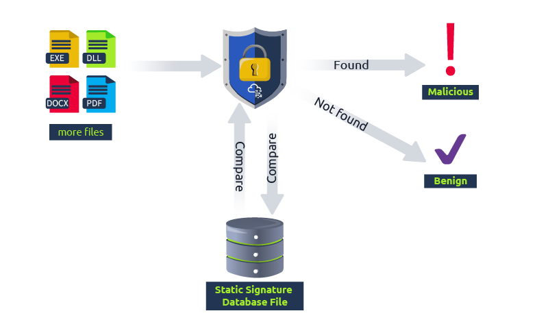
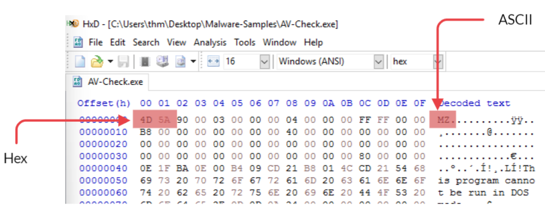

# Task 1 - Einführung
Willkommen bei Einführung in AV

Antivirensoftware (AV) ist eine der wichtigsten hostbasierten Sicherheitslösungen, die verfügbar sind, um Malware-Angriffe auf dem Rechner des Endbenutzers zu erkennen und zu verhindern. AV-Software besteht aus verschiedenen Modulen, Funktionen und Erkennungstechniken, die in diesem Raum besprochen werden.

Als Red Teamer oder Pentester ist es wichtig, die Funktionsweise von AV-Software und deren Erkennungstechniken zu verstehen. Mit diesem Wissen wird es einfacher, Techniken zur Umgehung von AV zu entwickeln.

Lernziele

- Was ist Antivirensoftware?
- Erkennungsansätze von Antivirensoftware
- Auflistung der installierten AV-Software auf dem Zielrechner
- Testen in einer simulierten Umgebung

Voraussetzungen für den Raum

- Allgemeine Kenntnisse über hostbasierte Erkennungslösungen; weitere Informationen im Raum [The Lay of the Land](https://tryhackme.com/r/room/thelayoftheland).
- Allgemeine Erfahrungen mit Hashing-Kryptografie; weitere Informationen im Raum [Hashing - Crypto 101](https://tryhackme.com/r/room/hashingcrypto101).
- Grundkenntnisse über Yara-Regeln; weitere Informationen im THM [Yara](https://tryhackme.com/r/room/yara) Raum.

## Fragen:
Fangen wir an!
```
Keine Antwort nötig
```

# Task 2 - Antivirus Software
### Was ist Antivirensoftware?

Antivirensoftware (AV) ist eine zusätzliche Sicherheitsschicht, die darauf abzielt, die Ausführung und Verbreitung bösartiger Dateien in einem Zielbetriebssystem zu erkennen und zu verhindern.

Es handelt sich um eine hostbasierte Anwendung, die in Echtzeit (im Hintergrund) läuft, um die aktuellen und neu heruntergeladenen Dateien zu überwachen und zu überprüfen. Die AV-Software untersucht und entscheidet mithilfe verschiedener Techniken, ob Dateien bösartig sind, welche später in diesem Raum behandelt werden.

Interessanterweise war die erste Antivirensoftware ausschließlich dazu konzipiert, [Computerviren](https://malware-history.fandom.com/wiki/Virus) zu erkennen und zu entfernen. Heutzutage hat sich das geändert; moderne Antivirenprogramme können nicht nur Computerviren, sondern auch andere schädliche Dateien und Bedrohungen erkennen und entfernen.

### Was sucht Antivirensoftware?

Traditionelle Antivirensoftware sucht nach Malware mit vordefinierten bösartigen Mustern oder Signaturen. Malware ist schädliche Software, deren Hauptziel es ist, Schaden auf einem Zielrechner zu verursachen, einschließlich, aber nicht beschränkt auf:

- Vollständigen Zugriff auf einen Zielrechner erlangen.
- Sensible Informationen wie Passwörter stehlen.
- Dateien verschlüsseln und beschädigen.
- Andere bösartige Software oder unerwünschte Werbung einschleusen.
- Die kompromittierte Maschine nutzen, um weitere Angriffe wie Botnet-Attacken durchzuführen.

### AV vs. andere Sicherheitsprodukte

Neben Antivirensoftware bieten auch andere hostbasierte Sicherheitslösungen Echtzeitschutz für Endgeräte. Endpoint Detection and Response (EDR) ist eine Sicherheitslösung, die Echtzeitschutz basierend auf Verhaltensanalysen bietet. Eine Antivirenanwendung führt das Scannen, Erkennen und Entfernen bösartiger Dateien durch. EDR hingegen überwacht verschiedene Sicherheitsüberprüfungen auf dem Zielrechner, einschließlich Dateiaktivitäten, Speicher, Netzwerkverbindungen, Windows-Registrierung, Prozesse usw.

Moderne Antivirenprodukte sind so konzipiert, dass sie die traditionellen Antivirenfunktionen und andere erweiterte Funktionalitäten (ähnlich den EDR-Funktionalitäten) in einem Produkt integrieren, um umfassenden Schutz vor digitalen Bedrohungen zu bieten. Für weitere Informationen über hostbasierte Sicherheitslösungen empfehlen wir den THM-Raum: [The Lay of the Land](https://tryhackme.com/r/room/thelayoftheland) zu besuchen.

### Antivirensoftware in Vergangenheit und Gegenwart

[McAfee Associates, Inc](https://de.wikipedia.org/wiki/McAfee). begann 1987 mit der ersten Implementierung von Antivirensoftware. Diese wurde "VirusScan" genannt und hatte damals das Hauptziel, einen Virus namens "Brain" zu entfernen, der John McAfees Computer infiziert hatte. Später schlossen sich andere Unternehmen dem Kampf gegen Viren an. Antivirensoftware wurde Scanner genannt und war eine Kommandozeilen-Software, die nach bösartigen Mustern in Dateien suchte.

Seitdem haben sich die Dinge verändert. Heutzutage verwendet Antivirensoftware eine grafische Benutzeroberfläche (GUI), um Scans nach bösartigen Dateien und andere Aufgaben durchzuführen. Auch Schadprogramme haben sich weiterentwickelt und zielen nun auf Opfer unter Windows und anderen Betriebssystemen ab. Moderne Antivirensoftware unterstützt die meisten Geräte und Plattformen, einschließlich Windows, Linux, macOS, Android und iOS. Sie hat sich verbessert und ist intelligenter und ausgeklügelter geworden, da sie ein Bündel vielseitiger Funktionen enthält, darunter Antivirus, Anti-Exploit, Firewall, Verschlüsselungstool usw.

Wir werden einige dieser AV-Funktionen in der nächsten Aufgabe besprechen.

## Fragen:
Was bedeutet AV?:
```
Antivirus
```

Welcher PC-Antivirenhersteller brachte die erste AV-Software auf den Markt?
```
McAfee
```

Antiviren-Software ist eine auf _____ basierende Sicherheitslösung.
```
Host
```

# Task 3 - Antivirus Funktionen
### Antivirus Engines

Eine AV-Engine ist dafür verantwortlich, bösartigen Code und Dateien zu finden und zu entfernen. Gute Antivirensoftware implementiert einen effektiven und soliden AV-Kern, der bösartige Dateien genau und schnell analysiert. Außerdem sollte sie verschiedene Dateitypen unterstützen und verarbeiten können, einschließlich Archivdateien, bei denen sie sich selbst extrahieren und alle komprimierten Dateien überprüfen kann.

Die meisten AV-Produkte teilen die gleichen grundlegenden Funktionen, die jedoch unterschiedlich implementiert sind. Dazu gehören unter anderem:

- Scanner
- Erkennungstechniken
- Kompressoren und Archive
- Entpacker
- Emulatoren

### Scanner

Die Scanner-Funktion ist in den meisten AV-Produkten enthalten: Antivirensoftware läuft und scannt in Echtzeit oder auf Abruf. Diese Funktion ist in der grafischen Benutzeroberfläche (GUI) oder über die Eingabeaufforderung verfügbar. Der Benutzer kann sie bei Bedarf verwenden, um Dateien oder Verzeichnisse zu überprüfen. Die Scanner-Funktion muss die bekanntesten bösartigen Dateitypen unterstützen, um die Bedrohung zu erkennen und zu entfernen. Darüber hinaus kann sie je nach AV-Software auch andere Arten des Scannens unterstützen, einschließlich Schwachstellen, E-Mails, Windows-Speicher und Windows-Registrierung.

### Erkennungstechniken

Eine AV-Erkennungstechnik sucht nach und erkennt bösartige Dateien; verschiedene Erkennungstechniken können innerhalb der AV-Engine verwendet werden, darunter:

- Signaturbasierte Erkennung ist die traditionelle AV-Technik, die nach vordefinierten bösartigen Mustern und Signaturen in Dateien sucht.
- Heuristische Erkennung ist eine fortschrittlichere Technik, die verschiedene Verhaltensmethoden einbezieht, um verdächtige Dateien zu analysieren.
- Dynamische Erkennung ist eine Technik, die Systemaufrufe und APIs überwacht sowie Tests und Analysen in einer isolierten Umgebung durchführt.

Wir werden diese Techniken in der nächsten Aufgabe behandeln. Eine gute AV-Engine erkennt bösartige Dateien genau und schnell mit weniger falsch-positiven Ergebnissen. Wir werden mehrere AV-Produkte vorstellen, die ungenaue Ergebnisse liefern und eine Datei falsch klassifizieren.

### Kompressoren und Archive

Die Funktion "Kompressoren und Archive" sollte in jeder Antivirensoftware enthalten sein. Sie muss verschiedene Systemdateitypen unterstützen und verarbeiten können, einschließlich komprimierter oder archivierter Dateien: ZIP, TGZ, 7z, XAR, RAR usw. Bösartiger Code versucht oft, hostbasierte Sicherheitslösungen zu umgehen, indem er sich in komprimierten Dateien versteckt. Aus diesem Grund muss die Antivirensoftware alle Dateien dekomprimieren und scannen, bevor ein Benutzer eine Datei im Archiv öffnet.

### PE (Portable Executable) Parsing und Entpacker

Malware versteckt und packt seinen bösartigen Code, indem es ihn innerhalb eines Payloads komprimiert und verschlüsselt. Es dekomprimiert und entschlüsselt sich während der Laufzeit, um die statische Analyse zu erschweren. Daher muss Antivirensoftware in der Lage sein, die meisten bekannten Packer (UPX, Armadillo, ASPack usw.) vor der Laufzeit zu erkennen und zu entpacken, um eine statische Analyse durchzuführen.

Malware-Entwickler verwenden verschiedene Techniken, wie das Packen, um die Größe zu reduzieren und die Struktur der bösartigen Datei zu verändern. Beim Packen wird die ursprüngliche ausführbare Datei komprimiert, um die Analyse zu erschweren. Daher muss Antivirensoftware über eine Entpackerfunktion verfügen, um geschützte oder komprimierte ausführbare Dateien in den Originalcode zu entpacken.

Eine weitere Funktion, die Antivirensoftware haben muss, ist ein Parser für Windows Portable Executable (PE) Header. Das Parsen der PE-Header ausführbarer Dateien hilft, bösartige von legitimer Software (.exe-Dateien) zu unterscheiden. Das PE-Dateiformat in Windows (32 und 64 Bit) enthält verschiedene Informationen und Ressourcen, wie Objektcode, DLLs, Symboldateien, Schriftdateien und Speicherabbilder.

### Emulatoren

Ein Emulator ist eine Antivirenfunktion, die eine weitergehende Analyse verdächtiger Dateien durchführt. Sobald ein Emulator eine Anfrage erhält, führt der Emulator die verdächtigen (exe, DLL, PDF usw.) Dateien in einer virtualisierten und kontrollierten Umgebung aus. Er überwacht das Verhalten der ausführbaren Dateien während der Ausführung, einschließlich der Windows-API-Aufrufe, der Registrierung und anderer Windows-Dateien. Die folgenden sind Beispiele für Artefakte, die der Emulator sammeln kann:

- API-Aufrufe
- Speicherabbilder
- Änderungen im Dateisystem
- Protokollereignisse
- Laufende Prozesse
- Webanfragen

Ein Emulator stoppt die Ausführung einer Datei, wenn genügend Artefakte gesammelt wurden, um Malware zu erkennen.

### Weitere gängige Funktionen

Die folgenden sind einige gängige Funktionen, die in Antivirenprodukten zu finden sind:

- Ein Selbstschutztreiber, um das AV vor Angriffen durch Malware zu schützen.
- Firewall- und Netzwerkanalyse-Funktionalität.
- Kommandozeilen- und grafische Schnittstellen-Tools.
- Ein Daemon oder Dienst.
- Eine Managementkonsole.

## Fragen:
Welche AV-Funktion analysiert Malware in einer sicheren und isolierten Umgebung?
```
Emulator
```

Die _______ Funktion ermöglicht die Wiederherstellung oder Entschlüsselung der komprimierten ausführbaren Dateien in das Original.
```
Unpacker
```

Lesen Sie die obigen Ausführungen, um mit der nächsten Aufgabe fortzufahren, in der wir die AV-Erkennungstechniken besprechen.
```
Keine Antwort nötig
```

# Task 4 - Bereitstellen der VM
Wir haben eine Windows 10 Pro-Maschine zur Verfügung gestellt, um diesen Raum zu vervollständigen. Die virtuelle Maschine (VM) kann über die In-Browser-Funktion aufgerufen werden.

Sie können sich auch über RDP verbinden. Stellen Sie sicher, dass Sie die AttackBox bereitstellen oder sich mit dem VPN verbinden.

Verwenden Sie die folgenden Anmeldedaten:
```
user@machine$ xfreerdp /v:10.10.183.155 /u:thm /p:TryHackM3
```

## Fragen:
Sobald Sie die VM bereitgestellt haben, dauert es ein paar Minuten, bis sie hochgefahren ist. Gehen Sie dann zur nächsten Aufgabe über!
```
Keine Antwort nötig
```

# Task 5 - AV Statische Erkennung
Im Allgemeinen kann die AV-Erkennung in drei Hauptansätze unterteilt werden:

- Statische Erkennung
- Dynamische Erkennung
- Heuristische und Verhaltensbasierte Erkennung

**Statische Erkennung**

Eine statische Erkennungstechnik ist die einfachste Art der Antivirus-Erkennung, die auf vordefinierten Signaturen bösartiger Dateien basiert. Einfach ausgedrückt, verwendet sie Musterabgleichstechniken bei der Erkennung, wie das Finden einer eindeutigen Zeichenfolge, CRC (Checksummen), Bytecode/Hex-Wert-Sequenzen und kryptografische Hashes (MD5, SHA1 usw.).

Anschließend führt sie eine Reihe von Vergleichen zwischen vorhandenen Dateien im Betriebssystem und einer Signaturdatenbank durch. Wenn die Signatur in der Datenbank vorhanden ist, wird sie als bösartig eingestuft. Diese Methode ist effektiv gegen statische Malware.


In dieser Aufgabe werden wir eine signaturbasierte Erkennungsmethode verwenden, um zu sehen, wie Antivirenprodukte bösartige Dateien erkennen. Es ist wichtig zu beachten, dass diese Technik nur gegen bekannte bösartige Dateien mit vorab generierten Signaturen in einer Datenbank funktioniert. Daher muss die Datenbank von Zeit zu Zeit aktualisiert werden.

Wir werden die ClamAV-Antivirensoftware verwenden, um zu demonstrieren, wie die signaturbasierte Erkennung bösartige Dateien identifiziert. Die ClamAV-Software ist auf der bereitgestellten VM vorinstalliert, und wir können darauf unter folgendem Pfad zugreifen: c:\Program Files\ClamAV\clamscan.exe. Wir werden auch einige Malware-Beispiele scannen, die auf dem Desktop zu finden sind. Der Ordner "Malware samples" enthält die folgenden Dateien:

- **EICAR** ist eine Testdatei, die ASCII-Zeichenfolgen enthält und verwendet wird, um die Effektivität von Antivirensoftware zu testen, anstatt echter Malware, die Ihren Rechner beschädigen könnte. Für weitere Informationen können Sie die offizielle EICAR-Website besuchen, [hier](https://www.eicar.org/?page_id=3950).
- **Backdoor 1** ist ein C#-Programm, das eine bekannte Technik verwendet, um eine Rückverbindung herzustellen, einschließlich der Erstellung eines Prozesses und der Ausführung eines Metasploit Framework-Shellcodes.
- **Backdoor 2** ist ein C#-Programm, das Prozessinjektion und Verschlüsselung verwendet, um eine Rückverbindung herzustellen, einschließlich der Injektion eines Metasploit-Shellcodes in einen bestehenden und laufenden Prozess.
- **AV-Check** ist ein C#-Programm, das Antivirensoftware auf einem Zielrechner auflistet. Beachten Sie, dass diese Datei nicht bösartig ist. Wir werden dieses Tool in Aufgabe 6 genauer besprechen.
- **notes.txt** ist eine Textdatei, die eine Befehlszeile enthält. Beachten Sie, dass diese Datei nicht bösartig ist.

ClamAV wird mit einer eigenen Datenbank geliefert, und während der Installation müssen wir die kürzlich aktualisierte Version herunterladen. Lassen Sie uns versuchen, den Ordner "Malware samples" mit der clamscan.exe-Binärdatei zu scannen und überprüfen, wie ClamAV gegen diese Beispiele abschneidet.
```cmd
c:\>"c:\Program Files\ClamAV\clamscan.exe" c:\Users\thm\Desktop\Samples
Loading:    22s, ETA:   0s [========================>]    8.61M/8.61M sigs
Compiling:   4s, ETA:   0s [========================>]       41/41 tasks

C:\Users\thm\Desktop\Samples\AV-Check.exe: OK
C:\Users\thm\Desktop\Samples\backdoor1.exe: Win.Malware.Swrort-9872015-0 FOUND
C:\Users\thm\Desktop\Samples\backdoor2.exe: OK
C:\Users\thm\Desktop\Samples\eicar.com: Win.Test.EICAR_HDB-1 FOUND
C:\Users\thm\Desktop\Samples\notes.txt: OK
```

Die obenstehende Ausgabe zeigt, dass die ClamAV-Software zwei unserer getesteten Dateien (EICAR, backdoor1, AV-Check und notes.txt) korrekt analysiert und als bösartig markiert hat. Jedoch wurde backdoor2 fälschlicherweise als nicht bösartig identifiziert, obwohl es dies ist.

Sie können `clamscan.exe --debug <file_to_scan>` ausführen, um alle geladenen Module während des Scannens zu sehen. Zum Beispiel verwendet es die Entpackungsmethode, um die Dateien zu zerlegen und nach einer vordefinierten bösartigen Sequenz von Bytecode-Werten zu suchen, und so konnte es die C# Backdoor 1 erkennen. Der Bytecode-Wert des Metasploit-Shellcodes, der in Backdoor 1 verwendet wurde, wurde zuvor identifiziert und zur ClamAV-Datenbank hinzugefügt.

Jedoch verwendet Backdoor 2 eine Verschlüsselungstechnik (XOR) für den Metasploit-Shellcode, was zu unterschiedlichen Sequenzen von Bytecode-Werten führt, die in der ClamAV-Datenbank nicht gefunden werden.

Obwohl ClamAV in der Lage war, die EICAR.COM Testdatei als bösartig unter Verwendung der MD5 signaturbasierten Technik zu erkennen. Um dies zu bestätigen, können wir die EICAR.COM Testdatei erneut im Debug-Modus (--debug) scannen. Irgendwann in der Ausgabe werden Sie die folgende Nachricht sehen:
```
LibClamAV debug: FP SIGNATURE: 44d88612fea8a8f36de82e1278abb02f:68:Win.Test.EICAR_HDB-1  # Name: eicar.com, Type: CL_TYPE_TEXT_ASCII
```

Jetzt generieren wir den MD5-Wert der Datei EICAR.COM und prüfen, ob er mit dem übereinstimmt, was wir in der vorherigen Nachricht aus der Ausgabe gesehen haben. Dafür verwenden wir das Sigtool:
```cmd
c:\>"c:\Program Files\ClamAV\sigtool.exe" --md5 c:\Users\thm\Desktop\Samples\eicar.com
44d88612fea8a8f36de82e1278abb02f:68:eicar.com
```

Wenn Sie den generierten MD5-Wert, `44d88612fea8a8f36de82e1278abb02f`, genau überprüfen, werden Sie feststellen, dass er übereinstimmt.

Erstellen Ihrer eigenen Signatur-Datenbank

Eine der Funktionen von ClamAV ist das Erstellen Ihrer eigenen Datenbank, mit der Sie Elemente hinzufügen können, die nicht in der offiziellen ClamAV-Datenbank enthalten sind. Lassen Sie uns versuchen, eine Signatur für Backdoor 2 zu erstellen, die von ClamAV bereits übersehen wurde, und diese zur Datenbank hinzufügen. Die folgenden Schritte sind erforderlich:

1. Generieren Sie eine MD5-Signatur für die Datei.
2. Fügen Sie die generierte Signatur in eine Datenbank mit der Erweiterung ".hdb" ein.
3. Führen Sie einen erneuten Scan mit ClamAV gegen die Datei unter Verwendung unserer neuen Datenbank durch.

Zunächst verwenden wir das Tool `sigtool`, das in der ClamAV-Suite enthalten ist, um einen MD5-Hash von `backdoor2.exe` mit dem Argument `--md5` zu generieren.
```cmd
C:\Users\thm\Desktop\Samples>"c:\Program Files\ClamAV\sigtool.exe" --md5 backdoor2.exe
75047189991b1d119fdb477fef333ceb:6144:backdoor2.exe 
```

Wie in der Ausgabe gezeigt, enthält der generierte Hash-String die folgende Struktur: `Hash:Size-in-Byte:FileName`. Beachten Sie, dass ClamAV den generierten Wert während des Scans zum Vergleich verwendet.

Nun, da wir den MD5-Hash haben, erstellen wir unsere eigene Datenbank. Wir werden das Tool `sigtool` verwenden und die Ausgabe in eine Datei mit > `thm.hdb` speichern, wie folgt:
```cmd
C:\Users\thm\Desktop\Samples>"c:\Program Files\ClamAV\sigtool.exe" --md5 backdoor2.exe > thm.hdb
```

Als Ergebnis wird eine `thm.hdb` Datei im aktuellen Verzeichnis erstellt, das den Befehl ausführt.

Wir wissen bereits, dass ClamAV die backdoor2.exe nicht mithilfe der offiziellen Datenbank erkannt hat! Lassen Sie uns jetzt eine erneute Prüfung mit der von uns erstellten Datenbank `thm.hdb` durchführen und das Ergebnis sehen!
```cmd
C:\Users\thm\Desktop\Samples>"c:\Program Files\ClamAV\clamscan.exe" -d thm.hdb backdoor2.exe
Loading:     0s, ETA:   0s [========================>]        1/1 sigs
Compiling:   0s, ETA:   0s [========================>]       10/10 tasks

C:\Users\thm\Desktop\Samples\backdoor2.exe: backdoor2.exe.UNOFFICIAL FOUND
```

Wie erwartet hat das ClamAV-Tool die Datei backdoor2.exe basierend auf der von uns bereitgestellten Datenbank als bösartig markiert. Als Übung fügen Sie die MD5-Signatur von AV-Check.exe in dieselbe Datenbank ein, die wir bereits erstellt haben, und überprüfen Sie dann, ob ClamAV AV-Check.exe als bösartig kennzeichnen kann.

### Yara-Regeln für die statische Erkennung

Ein Werkzeug, das bei der statischen Erkennung hilft, ist [Yara](http://virustotal.github.io/yara/). Yara ermöglicht es Malware-Analytikern, Malware zu klassifizieren und zu erkennen. Yara verwendet regelbasierte Erkennung, daher müssen wir eine neue Regel erstellen, um neue Malware zu erkennen. ClamAV kann auch Yara-Regeln verwenden, um bösartige Dateien zu erkennen. Die Regel wird dieselbe sein wie in unserer Datenbank im vorherigen Abschnitt.

Um eine Regel zu erstellen, müssen wir die Malware untersuchen und analysieren; basierend auf den Erkenntnissen schreiben wir eine Regel. Lassen Sie uns AV-Check.exe als Beispiel nehmen und eine Regel dafür schreiben.

Zunächst analysieren wir die Datei und listen alle für Menschen lesbaren Zeichenfolgen in der Binärdatei mit dem Tool "strings" auf. Als Ergebnis werden wir alle Funktionen, Variablen und sinnlosen Zeichenfolgen sehen. Wenn wir jedoch genauer hinschauen, können wir einige der einzigartigen Zeichenfolgen in unseren Regeln verwenden, um diese Datei in Zukunft zu erkennen. AV-Check verwendet eine Programmdatenbank (.pdb), die während des Kompilierens Typ- und symbolische Debuginformationen des Programms enthält.
```cmd
C:\Users\thm\Desktop\Samples>strings AV-Check.exe | findstr pdb
C:\Users\thm\source\repos\AV-Check\AV-Check\obj\Debug\AV-Check.pdb
```

Wir werden den Pfad aus der Ausgabe des vorherigen Befehls als Beispiel für eine eindeutige Zeichenfolge in der Yara-Regel verwenden, die wir erstellen werden. Die Signatur könnte in der realen Welt etwas anderes sein, wie z.B. Registry-Schlüssel, Befehle usw. Wenn Sie mit Yara nicht vertraut sind, empfehlen wir, den [Yara-THM-Raum](https://tryhackme.com/r/room/yara) zu überprüfen. Folgend ist die Yara-Regel, die wir für unsere Erkennung verwenden werden:
```yara
rule thm_demo_rule {
	meta:
		author = "THM: Intro-to-AV-Room"
		description = "Look at how the Yara rule works with ClamAV"
	strings:
		$a = "C:\\Users\\thm\\source\\repos\\AV-Check\\AV-Check\\obj\\Debug\\AV-Check.pdb"
	condition:
		$a
}
```

Lassen Sie uns diese Yara-Regel etwas genauer erklären.

- Die Regel beginnt mit rule thm_demo_rule, was der Name unserer Regel ist. ClamAV verwendet diesen Namen, wenn eine Regel übereinstimmt.
- Der Metadatenabschnitt enthält allgemeine Informationen wie Autor und Beschreibung, die vom Benutzer ausgefüllt werden können.
- Der Strings-Abschnitt enthält die Zeichenfolgen oder Bytecode, nach denen wir suchen. In diesem Fall verwenden wir den Pfad zur Programmdatenbank der C#-Anwendung. Beachten Sie, dass wir in diesem Pfad ein zusätzliches \ hinzufügen, um das Sonderzeichen zu escapen und die Regel nicht zu unterbrechen.
 - Im Bedingungsabschnitt geben wir an, dass wenn die definierte Zeichenfolge im Strings-Abschnitt gefunden wird, die Datei markiert werden soll.

Beachten Sie, dass Yara-Regeln in einer Datei mit der Erweiterung `.yara` gespeichert werden müssen, damit ClamAV damit umgehen kann. Lassen Sie uns den Ordner `c:\Users\thm\Desktop\Samples` erneut mit der von uns erstellten Yara-Regel scannen. Eine Kopie der Yara-Regel finden Sie auf dem Desktop unter `c:\Users\thm\Desktop\Files\thm-demo-1.yara`.
```cmd
C:\Users\thm>"c:\Program Files\ClamAV\clamscan.exe" -d Desktop\Files\thm-demo-1.yara Desktop\Samples
Loading:     0s, ETA:   0s [========================>]        1/1 sigs
Compiling:   0s, ETA:   0s [========================>]       40/40 tasks

C:\Users\thm\Desktop\Samples\AV-Check.exe: YARA.thm_demo_rule.UNOFFICIAL FOUND
C:\Users\thm\Desktop\Samples\backdoor1.exe: OK
C:\Users\thm\Desktop\Samples\backdoor2.exe: OK
C:\Users\thm\Desktop\Samples\eicar.com: OK
C:\Users\thm\Desktop\Samples\notes.txt: YARA.thm_demo_rule.UNOFFICIAL FOUND
```

Als Ergebnis kann ClamAV die `AV-Check.exe` Binärdatei als bösartig basierend auf der von uns bereitgestellten Yara-Regel erkennen. Allerdings lieferte ClamAV ein falsch positives Ergebnis, indem es die Datei `notes.txt` als bösartig markierte. Wenn wir die `notes.txt` Datei öffnen, sehen wir, dass der Text denselben Pfad enthält, den wir in der Regel angegeben haben.

Lassen Sie uns unsere Yara-Regel verbessern, um das falsch positive Ergebnis zu reduzieren. Wir werden den Dateityp in unserer Regel spezifizieren. Oft können Dateitypen anhand von Magischen Zahlen identifiziert werden, die die ersten beiden Bytes der Binärdatei sind. Zum Beispiel beginnen [ausführbare Dateien](https://en.wikipedia.org/wiki/DOS_MZ_executable) (.exe) immer mit dem ASCII-Wert "MZ" oder "4D 5A" in hexadezimal.

Um dies zu bestätigen, verwenden wir die [HxD](https://mh-nexus.de/en/hxd/) Anwendung, einen freien Hex-Editor, um die AV-Check.exe Binärdatei zu untersuchen und die ersten beiden Bytes zu sehen. Beachten Sie, dass HxD bereits in der bereitgestellten VM verfügbar ist.


Dieses Wissen wird helfen, die Erkennung zu verbessern. Lassen Sie uns dies in unsere Yara-Regel aufnehmen, um nur die .exe-Dateien zu kennzeichnen, die unsere Signaturzeichenfolge als bösartig enthalten. Hier ist die verbesserte Yara-Regel:
```yara
rule thm_demo_rule {
	meta:
		author = "THM: Intro-to-AV-Room"
		description = "Look at how the Yara rule works with ClamAV"
	strings:
		$a = "C:\\Users\\thm\\source\\repos\\AV-Check\\AV-Check\\obj\\Debug\\AV-Check.pdb"
		$b = "MZ"
	condition:
		$b at 0 and $a
}
```

In der neuen Yara-Regel haben wir eine eindeutige Zeichenfolge ($b) definiert, die gleich MZ ist, als Kennzeichnung für den Dateityp .exe. Außerdem haben wir den Bedingungsabschnitt aktualisiert, der nun folgende Bedingungen enthält:

1. Wenn die Zeichenfolge "MZ" an der Position 0, dem Anfang der Datei, gefunden wird.
2. Wenn die eindeutige Zeichenfolge (der Pfad) innerhalb der Binärdatei vorkommt.
3. Im Bedingungsabschnitt haben wir den `AND` Operator verwendet, damit beide Definitionen 1 und 2 erfüllt sein müssen, um eine Übereinstimmung zu erzielen.

Die aktualisierte Regel finden Sie unter `Desktop\Files\thm-demo-2.yara`. Jetzt, da wir unsere aktualisierte Yara-Regel haben, lassen Sie uns sie erneut ausprobieren.
```cmd
C:\Users\thm>"c:\Program Files\ClamAV\clamscan.exe" -d Desktop\Files\thm-demo-2.yara Desktop\Samples
Loading:     0s, ETA:   0s [========================>]        1/1 sigs
Compiling:   0s, ETA:   0s [========================>]       40/40 tasks

C:\Users\thm\Desktop\Samples\AV-Check.exe: YARA.thm_demo_rule.UNOFFICIAL FOUND
C:\Users\thm\Desktop\Samples\backdoor1.exe: OK
C:\Users\thm\Desktop\Samples\backdoor2.exe: OK
C:\Users\thm\Desktop\Samples\eicar.com: OK
C:\Users\thm\Desktop\Samples\notes.txt: OK
```

Die Ausgabe zeigt, dass wir unsere Yara-Regel verbessert haben, um die Anzahl der falsch positiven Ergebnisse zu reduzieren. Das war ein einfaches Beispiel dafür, wie AV-Software funktioniert. Daher arbeiten AV-Software-Anbieter hart daran, gegen Malware zu kämpfen und ihre Produkte sowie ihre Datenbanken zu verbessern, um die Leistung und Genauigkeit der Ergebnisse zu erhöhen.

Der Nachteil der signaturbasierten Erkennung besteht darin, dass Dateien einen anderen Hash-Wert haben werden, wenn die Binärdatei geändert wird. Daher ist es für jemanden einfach, signaturbasierte Erkennungstechniken zu umgehen, wenn sie wissen, wonach AV-Software sucht und wie man Binärdateien analysiert, wie in späteren Abschnitten gezeigt wird.

## Fragen:
Wie lautet die Ausgabe des `sigtool` tool zur Generierung eines MD5-Hashs der `AV-Check.exe` Binärdatei?
```

```

Verwenden Sie das strings-Werkzeug, um alle menschenlesbaren Zeichenfolgen der AV-Check-Binärdatei aufzulisten. Was ist die Kennzeichnung (Flagge)?
```

```

# Task 6 - Andere Erkennungstechniken
