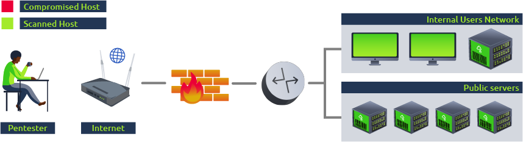
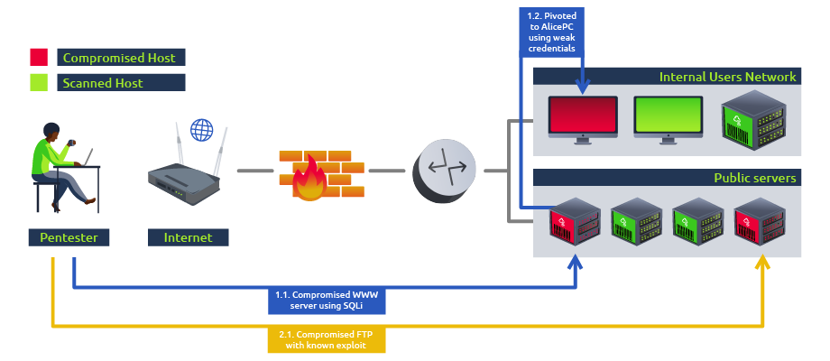
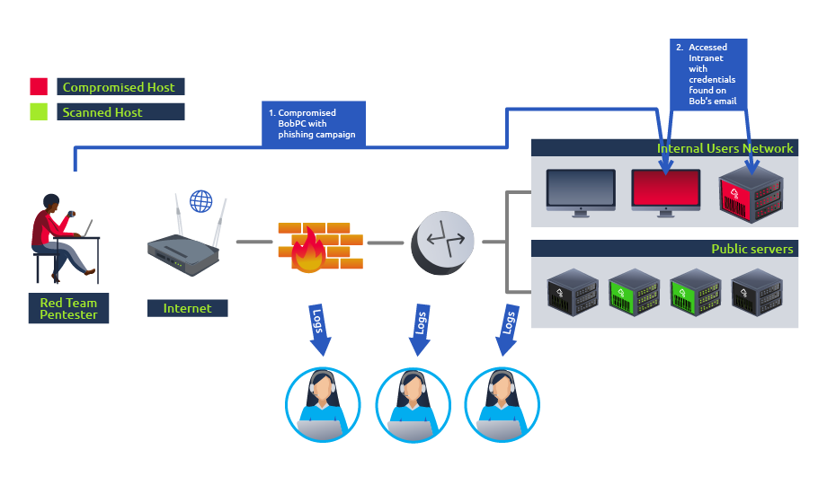
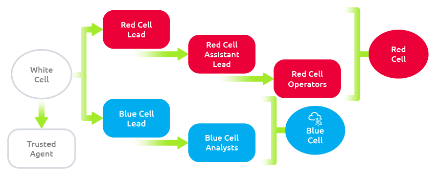

# Task 1 - introduction
Cybersicherheit ist ein ständiges Rennen zwischen White-Hat-Hackern und Black-Hat-Hackern. Da sich die Bedrohungen in der Cyberwelt weiterentwickeln, wächst auch der Bedarf an spezialisierten Dienstleistungen, die es Unternehmen ermöglichen, sich bestmöglich auf echte Angriffe vorzubereiten.

Während konventionelle Sicherheitsmaßnahmen wie Schwachstellenbewertungen und Penetrationstests einen hervorragenden Überblick über die technische Sicherheitslage eines Unternehmens bieten können, könnten sie einige andere Aspekte übersehen, die ein echter Angreifer ausnutzen kann. In diesem Sinne könnten wir sagen, dass herkömmliche Penetrationstests gut darin sind, Schwachstellen aufzuzeigen, damit proaktive Maßnahmen ergriffen werden können, aber möglicherweise nicht lehren, wie auf einen tatsächlichen laufenden Angriff eines motivierten Gegners reagiert werden kann.

Ziele des Raums:

- Lerne die Grundlagen von Red-Team-Einsätzen kennen
- Identifiziere die Hauptkomponenten und beteiligten Akteure bei einem Red-Team-Einsatz
- Verstehe die Hauptunterschiede zwischen Red-Teaming und anderen Arten von Cybersecurity-Einsätzen

Voraussetzungen für den Raum:

Bevor du mit diesem Raum beginnst, ist Vertrautheit mit allgemeinen Hacking-Techniken erforderlich. Obwohl nicht unbedingt notwendig, wird empfohlen, den Lernpfad für Jr. Penetration Tester abzuschließen.

# Task 2 - Vulnerability Assessment and Penetration Tests Limitations
### Verwundbarkeitsbewertungen

Dies ist die einfachste Form der Sicherheitsbewertung, und ihr Hauptziel ist es, so viele Schwachstellen in so vielen Systemen im Netzwerk wie möglich zu identifizieren. Zu diesem Zweck können Zugeständnisse gemacht werden, um dieses Ziel effektiv zu erreichen. Beispielsweise kann die Angreifermaschine auf die Whitelist der verfügbaren Sicherheitslösungen gesetzt werden, um Störungen im Schwachstellenerkennungsprozess zu vermeiden. Dies macht Sinn, da das Ziel darin besteht, jeden Host im Netzwerk zu untersuchen und seine Sicherheitslage einzeln zu bewerten, während dem Unternehmen die meisten Informationen darüber bereitgestellt werden, wo es seine Abhilfemaßnahmen konzentrieren sollte.

Zusammengefasst konzentriert sich eine Verwundbarkeitsbewertung darauf, Hosts als einzelne Einheiten auf Schwachstellen zu scannen, damit Sicherheitsmängel identifiziert und wirksame Sicherheitsmaßnahmen priorisiert im Netzwerk implementiert werden können. Die meiste Arbeit kann mit automatisierten Tools durchgeführt werden und erfordert keine großen technischen Kenntnisse.

Ein Beispiel: Wenn Sie eine Verwundbarkeitsbewertung über ein Netzwerk durchführen würden, würden Sie normalerweise versuchen, so viele Hosts wie möglich zu scannen, jedoch keine Schwachstellen tatsächlich ausnutzen:  


### Penetrationstests

Zusätzlich zum Scannen jedes einzelnen Hosts auf Schwachstellen müssen wir oft verstehen, wie diese Schwachstellen unser Netzwerk als Ganzes beeinflussen. Penetrationstests erweitern Verwundbarkeitsbewertungen, indem sie dem Pentester erlauben, die Auswirkungen eines Angreifers auf das gesamte Netzwerk zu untersuchen, indem zusätzliche Schritte unternommen werden, die Folgendes umfassen:

- **Versuch, die gefundenen Schwachstellen auf jedem System auszunutzen.** Dies ist wichtig, da manchmal eine Schwachstelle in einem System existieren kann, aber durch bestehende Kompensationsmaßnahmen ihre Ausnutzung effektiv verhindert wird. Es ermöglicht uns auch zu testen, ob wir die erkannten Schwachstellen nutzen können, um einen bestimmten Host zu kompromittieren.
- **Durchführung von Post-Exploitation-Aufgaben auf jedem kompromittierten Host,** wodurch wir feststellen können, ob wir nützliche Informationen extrahieren können oder ob wir diese Hosts nutzen können, um zu anderen Hosts zu pivotieren, die vorher von unserem Standpunkt aus nicht zugänglich waren.

Penetrationstests beginnen möglicherweise mit dem Scannen nach Schwachstellen wie bei einer regulären Verwundbarkeitsbewertung, bieten jedoch weitere Informationen darüber, wie ein Angreifer Schwachstellen verketten kann, um spezifische Ziele zu erreichen. Während der Fokus weiterhin auf der Identifizierung von Schwachstellen und der Festlegung von Maßnahmen zum Schutz des Netzwerks liegt, wird das Netzwerk auch als gesamtes Ökosystem betrachtet und wie ein Angreifer von den Interaktionen zwischen seinen Komponenten profitieren könnte.

Wenn wir einen Penetrationstest im selben Beispielnetzwerk wie zuvor durchführen würden, würden wir zusätzlich zum Scannen aller Hosts im Netzwerk auf Schwachstellen versuchen, zu bestätigen, ob sie ausgenutzt werden können, um zu zeigen, welchen Einfluss ein Angreifer auf das Netzwerk haben könnte:  


Durch die Analyse, wie sich ein Angreifer in unserem Netzwerk bewegen könnte, erhalten wir auch grundlegende Einblicke in mögliche Umgehungen von Sicherheitsmaßnahmen und unsere Fähigkeit, einen echten Bedrohungsakteur bis zu einem gewissen Grad zu erkennen. Diese Einsichten sind jedoch begrenzt, da der Umfang eines Penetrationstests normalerweise umfassend ist und Penetrationstester sich oft nicht darum kümmern, laut zu sein oder viele Warnungen auf Sicherheitsgeräten zu erzeugen, da zeitliche Einschränkungen solche Projekte oft erfordern, dass das Netzwerk in kurzer Zeit überprüft wird.

### Fortgeschrittene Anhaltende Bedrohungen und warum regelmäßige Penetrationstests nicht ausreichen

Während die herkömmlichen Sicherheitsengagements, die wir erwähnt haben, die meisten technischen Schwachstellen aufdecken, gibt es Einschränkungen bei solchen Prozessen und bei dem Ausmaß, in dem sie ein Unternehmen effektiv gegen einen echten Angreifer vorbereiten können. Zu diesen Einschränkungen gehören:  


Als Konsequenz können sich einige Aspekte von Penetrationstests erheblich von einem echten Angriff unterscheiden, wie zum Beispiel:

- **Penetrationstests sind LAUT:** Normalerweise werden Pentester nicht viel Aufwand darauf verwenden, unentdeckt zu bleiben. Im Gegensatz zu echten Angreifern stören sie sich nicht daran, leicht entdeckt zu werden, da sie beauftragt wurden, so viele Schwachstellen wie möglich in so vielen Hosts wie möglich zu finden.
- **Nicht-technische Angriffsvektoren könnten übersehen werden:** Angriffe, die auf Social Engineering oder physische Eindringversuche basieren, sind normalerweise nicht Teil der Tests.
- **Entspannung der Sicherheitsmechanismen:** Während eines regulären Penetrationstests können einige Sicherheitsmechanismen vorübergehend deaktiviert oder für das Pentesting-Team gelockert werden, um die Effizienz zu erhöhen. Auch wenn das kontraintuitiv erscheinen mag, ist es wichtig zu bedenken, dass Pentester nur begrenzte Zeit haben, um das Netzwerk zu überprüfen. Daher wird normalerweise angestrebt, ihre Zeit nicht mit exotischen Methoden zur Umgehung von IDS/IPS, WAF, Intrusionstäuschung oder anderen Sicherheitsmaßnahmen zu verschwenden, sondern sich auf die Überprüfung kritischer technologischer Infrastruktur auf Schwachstellen zu konzentrieren.

Andererseits werden echte Angreifer keinen ethischen Code befolgen und sind in ihren Handlungen weitgehend unbeschränkt. Heutzutage werden die prominentesten Bedrohungsakteure als Advanced Persistent Threats (APT) bezeichnet, die hochqualifizierte Gruppen von Angreifern sind, die in der Regel von Nationen oder organisierten kriminellen Gruppen gesponsert werden. Sie zielen hauptsächlich auf kritische Infrastrukturen, Finanzorganisationen und Regierungsinstitutionen ab. Sie werden als „persistent“ bezeichnet, weil die Operationen dieser Gruppen auf kompromittierten Netzwerken über lange Zeiträume unentdeckt bleiben können.

Wenn ein Unternehmen von einem APT betroffen ist, wäre es dann vorbereitet, um effektiv zu reagieren? Könnten sie die Methoden erkennen, die verwendet wurden, um Zugang zu ihren Netzwerken zu erhalten und aufrechtzuerhalten, wenn der Angreifer schon seit mehreren Monaten dort ist? Was ist, wenn der erste Zugang erhalten wurde, weil John in der Buchhaltung einen verdächtigen E-Mail-Anhang geöffnet hat? Was, wenn ein Zero-Day-Exploit beteiligt war? Bereiten uns frühere Penetrationstests auf dies vor?

Um einen realistischeren Ansatz zur Sicherheit zu bieten, wurden Red Team Engagements ins Leben gerufen.

## Fragen:
Würden Schwachstellenbewertungen uns darauf vorbereiten, einen echten Angreifer in unseren Netzwerken zu erkennen? (Ja/Nein)
```
Nein
```

Sorgen Sie sich während eines Penetrationstests darüber, vom Kunden entdeckt zu werden? (Ja/Nein)
```
Nein
```

Hochorganisierte Gruppen von qualifizierten Angreifern werden heutzutage als ... bezeichnet
```
Advanced Persistent Threats
```

# Task 3 - Red Team Engagements
Um mit den sich entwickelnden Bedrohungen Schritt zu halten, wurden Red Team Engagements entwickelt, um den Fokus von regulären Penetrationstests auf einen Prozess zu verlagern, der es uns ermöglicht, die Fähigkeiten unseres Verteidigungsteams bei der **Erkennung** und **Reaktion** auf echte Bedrohungsakteure klar zu sehen. Sie ersetzen keine traditionellen Penetrationstests, sondern ergänzen sie, indem sie sich auf Erkennung und Reaktion anstatt auf Prävention konzentrieren.

Der Begriff "Red Teaming" stammt aus dem Militär. In militärischen Übungen übernimmt eine Gruppe die Rolle des Red Teams, um Angriffstechniken zu simulieren und die Reaktionsfähigkeit des verteidigenden Teams, allgemein als Blue Team bekannt, gegen bekannte Gegnerstrategien zu testen. Übertragen in die Welt der Cybersicherheit bestehen Red Team Engagements darin, die **Taktiken**, **Techniken und Verfahren (TTPs)** eines echten Bedrohungsakteurs nachzuahmen, damit wir messen können, wie gut unser Blue Team darauf reagiert und letztendlich vorhandene Sicherheitskontrollen verbessern können.

Jedes Red Team Engagement beginnt mit der Festlegung klarer Ziele, oft als „**jewels**“ oder „**Flags**“ bezeichnet, die von der Kompromittierung eines bestimmten kritischen Hosts bis zum Diebstahl sensibler Informationen vom Ziel reichen. In der Regel wird das Blue Team nicht über solche Übungen informiert, um Verzerrungen in ihrer Analyse zu vermeiden. Das Red Team wird alles tun, um die Ziele zu erreichen, während es unentdeckt bleibt und vorhandene Sicherheitsmechanismen wie Firewalls, Antivirus, EDR, IPS und andere umgeht. Beachten Sie, dass bei einem Red Team Engagement nicht alle Hosts im Netzwerk auf Schwachstellen überprüft werden. Ein echter Angreifer müsste nur einen einzigen Weg zu seinem Ziel finden und ist nicht daran interessiert, laute Scans durchzuführen, die vom Blue Team erkannt werden könnten.

Nehmen wir dasselbe Netzwerk wie zuvor: Bei einem Red Team Engagement, bei dem das Ziel darin besteht, den Intranet-Server zu kompromittieren, würden wir einen Plan entwickeln, um unser Ziel zu erreichen, während wir möglichst wenig mit anderen Hosts interagieren. Gleichzeitig kann die Fähigkeit des Blue Teams zur Erkennung und angemessenen Reaktion auf den Angriff bewertet werden.  


Es ist wichtig zu beachten, dass das endgültige Ziel solcher Übungen niemals darin bestehen sollte, dass das Red Team das Blue Team „besiegt“, sondern vielmehr darin, genügend TTPs zu simulieren, damit das Blue Team lernt, angemessen auf eine echte laufende Bedrohung zu reagieren. Bei Bedarf könnten sie ihre Sicherheitskontrollen anpassen oder ergänzen, um ihre Erkennungsfähigkeiten zu verbessern.

Red Team Engagements verbessern regelmäßige Penetrationstests, indem sie mehrere Angriffsflächen berücksichtigen:

- **Technische Infrastruktur**: Wie bei einem regulären Penetrationstest wird ein Red Team versuchen, technische Schwachstellen aufzudecken, jedoch mit deutlich höherem Fokus auf Tarnung und Umgehung.
- **Social Engineering**: Menschen durch Phishing-Kampagnen, Anrufe oder soziale Medien zu täuschen, um sie dazu zu bringen, Informationen preiszugeben, die privat bleiben sollten.
- **Physische Eindringung**: Techniken wie Lockpicking, RFID-Klonen, Ausnutzen von Schwachstellen in elektronischen Zugangskontrollsystemen, um Zugang zu eingeschränkten Bereichen von Einrichtungen zu erhalten.

Je nach verfügbaren Ressourcen kann die Red Team Übung auf verschiedene Weisen durchgeführt werden:

- **Vollständiges Engagement**: Den vollständigen Workflow eines Angreifers simulieren, von der anfänglichen Kompromittierung bis zum Erreichen der Endziele.
- **Angenommene Verletzung**: Davon ausgehen, dass der Angreifer bereits Kontrolle über einige Vermögenswerte erlangt hat, und von dort aus die Ziele erreichen. Zum Beispiel könnte das Red Team Zugang zu den Anmeldeinformationen eines Benutzers oder sogar zu einem Arbeitsplatz im internen Netzwerk erhalten.
- **Tischübung**: Eine Simulation, bei der Szenarien zwischen dem Red und Blue Team besprochen werden, um zu bewerten, wie sie theoretisch auf bestimmte Bedrohungen reagieren würden. Ideal für Situationen, in denen Live-Simulationen kompliziert sein könnten.

## Fragen:
Die Ziele eines Red Team Engagements werden oft als Flags oder ... bezeichnet.
```
crown jewels
```

Während eines Red Team Engagements werden gängige Methoden, die von Angreifern verwendet werden, gegen das Ziel emuliert. Solche Methoden werden normalerweise als TTPs bezeichnet. Wofür steht TTP?
```
Tactics, techniques and procedures
```

Das Hauptziel eines Red Team Engagements ist es, so viele Schwachstellen in so vielen Hosts wie möglich zu entdecken (Ja/Nein).
```
Nein
```

# Task 4 - Teams and Functions of an Engagement
Es gibt mehrere Faktoren und Personen, die an einem Red Team Engagement beteiligt sind. Jeder wird seine eigene Denkweise und Methodik haben, um das Engagement zu angehen; jedoch kann jedes Engagement in drei Teams oder Zellen unterteilt werden. Unten finden Sie eine kurze Tabelle, die jedes dieser Teams und eine kurze Erklärung ihrer Verantwortlichkeiten darstellt.

| Team         | Definition                                                                                                               |
|--------------|--------------------------------------------------------------------------------------------------------------------------|
| Red Cell     | Eine Red Cell ist der Bestandteil, der den offensiven Teil eines Red Team Engagements ausmacht und die strategischen und taktischen Reaktionen des Zielobjekts simuliert. |
| Blue Cell    | Die Blue Cell ist die Gegenpartei der Red Cell. Sie umfasst alle Komponenten, die ein Zielnetzwerk verteidigen. Die Blue Cell besteht typischerweise aus Blue Team-Mitgliedern, Verteidigern, internem Personal und der Leitung einer Organisation. |
| White Cell   | Agiert als Schiedsrichter zwischen den Aktivitäten der Red Cell und den Reaktionen der Blue Cell während eines Engagements. Kontrolliert die Engagement-Umgebung/das Netzwerk. Überwacht die Einhaltung der ROE. Koordiniert die für das Erreichen der Engagement-Ziele erforderlichen Aktivitäten. Korrelation der Aktivitäten der Red Cell mit den Abwehrmaßnahmen. Stellt sicher, dass das Engagement unparteiisch gegenüber beiden Seiten durchgeführt wird. |

Die Definitionen stammen von [redteam.guide](https://redteam.guide/docs/definitions).

Diese Teams oder Zellen können weiter in eine Engagement-Hierarchie unterteilt werden.  


Da dies ein auf das Red Team ausgerichteter Raum ist, werden wir uns auf die Verantwortlichkeiten der Red Cell konzentrieren. Unten finden Sie eine Tabelle, die die Rollen und Verantwortlichkeiten der Mitglieder des Red Teams umreißt.

| Rolle                  | Zweck                                                                                                 |
|------------------------|-------------------------------------------------------------------------------------------------------|
| Red Team Lead          | Plant und organisiert Engagements auf hoher Ebene – delegiert Aufgaben an den Assistant Lead und die Operatoren. |
| Red Team Assistant Lead | Unterstützt den Team Lead bei der Überwachung der Engagement-Operationen und der Operatoren. Kann auch bei der Erstellung von Engagement-Plänen und Dokumentationen helfen, falls erforderlich. |
| Red Team Operator      | Führt Aufgaben aus, die vom Team Lead delegiert wurden. Interpretiert und analysiert Engagement-Pläne des Team Leads. |

Wie bei den meisten Red Team-Funktionen wird jedes Team und Unternehmen seine eigene Struktur und Rollen für jedes Teammitglied haben. Die obige Tabelle dient nur als Beispiel für die typischen Verantwortlichkeiten jeder Rolle.

## Fragen:
Welche Zelle ist für die offensiven Operationen eines Engagements verantwortlich?
```
Red Cell
```

Zu welcher Zelle wird der vertrauenswürdige Agent gezählt?
```
White Cell
```

# Task 5 - Engagement Structure
Eine zentrale Funktion des Red Teams ist die Nachstellung von Gegnern. Auch wenn es nicht obligatorisch ist, wird es häufig verwendet, um zu bewerten, was ein tatsächlicher Gegner in einer Umgebung tun würde, wobei dessen Werkzeuge und Methoden zum Einsatz kommen. Das Red Team kann verschiedene Cyber-Kill-Chain-Modelle nutzen, um die Schritte und Verfahren eines Engagements zusammenzufassen und zu bewerten.

Das Blue Team verwendet üblicherweise Cyber-Kill-Chains, um Verhaltensweisen abzubilden und die Bewegungen eines Gegners zu analysieren. Das Red Team kann diese Idee anpassen, um die TTPs (Taktiken, Techniken und Verfahren) eines Gegners den Komponenten eines Engagements zuzuordnen.

Viele Regulierungs- und Standardisierungsorganisationen haben ihre eigenen Cyber-Kill-Chains veröffentlicht. Jede Kill Chain folgt ungefähr derselben Struktur, wobei einige detaillierter sind oder die Ziele unterschiedlich definieren. Nachfolgend finden Sie eine kleine Liste von standardisierten Cyber-Kill-Chains:

- [Lockheed Martin Cyber Kill Chain](https://www.lockheedmartin.com/en-us/capabilities/cyber/cyber-kill-chain.html)
- [Unified Kill Chain](https://unifiedkillchain.com/)
- [Varonis Cyber Kill Chain](https://www.varonis.com/blog/cyber-kill-chain/)
- [Active Directory Attack Cycle](https://github.com/infosecn1nja/AD-Attack-Defense)
- [MITRE ATT&CK Framework](https://attack.mitre.org/)

In diesem Raum werden wir häufig auf die "Lockheed Martin Cyber Kill Chain" verweisen. Diese ist standardisierter als andere und wird sehr häufig von Red- und Blue-Teams verwendet.

Die Lockheed Martin Kill Chain konzentriert sich auf einen Perimeter- oder externen Angriff. Im Gegensatz zu anderen Kill Chains bietet sie keine detaillierte Analyse der internen Bewegungen. Man kann sich diese Kill Chain als Zusammenfassung aller Verhaltensweisen und Operationen vorstellen, die vorhanden sind.  


**Komponenten der Kill Chain**

Die Komponenten der Kill Chain sind in der folgenden Tabelle aufgeführt.

| Technik              | Zweck                                                        | Beispiele                                |
|----------------------|--------------------------------------------------------------|------------------------------------------|
| Reconnaissance       | Informationen über das Ziel sammeln                          | E-Mail-Ernte, OSINT                       |
| Weaponization        | Das Ziel mit einem Exploit kombinieren. Führt normalerweise zu einem auslieferbaren Payload. | Exploit mit Backdoor, bösartiges Office-Dokument |
| Delivery             | Wie wird die bewaffnete Funktion an das Ziel übermittelt?     | E-Mail, Web, USB                         |
| Exploitation         | Das System des Ziels ausnutzen, um Code auszuführen           | MS17-010, Zero-Logon, etc.                |
| Installation         | Malware oder andere Werkzeuge installieren                    | Mimikatz, Rubeus, etc.                    |
| Command & Control    | Das kompromittierte Asset von einem zentralen Remote-Controller aus steuern | Empire, Cobalt Strike, etc.              |
| Actions on Objectives | Alle Endziele: Ransomware, Datenexfiltration, etc.            | Conti, LockBit2.0, etc.                  |

## Fragen:
Wenn ein Gegner Mimikatz auf einem Zielsystem eingesetzt hat, wo würden sie sich in der Lockheed Martin Cyber Kill Chain befinden?
```
Installation
```

Welcher Technik dient dazu, das System des Ziels auszunutzen, um Code auszuführen?
```
Exploitation
```

# Task 6 - Overview of a Red Team Engagement
Alle Aspekte, die wir besprochen haben, kommen bei der Durchführung eines Red Team Engagements zusammen. Um besser zu verstehen, wie die Komponenten und Beteiligten miteinander interagieren, werden wir ein vereinfachtes Beispiel für ein Engagement analysieren. Klicken Sie auf den grünen „View Site“-Button, um fortzufahren.

Beachten Sie, wie die Cyber Kill Chain sich natürlich mit der Übung deckt: Wir beginnen mit einer Recon-Phase, in der wir so viele Informationen wie möglich über unser Ziel sammeln, gefolgt von der Waffisierung und Lieferung, indem wir eine Phishing-E-Mail mit einem bösartigen Anhang senden. Es folgen die Phasen der Ausnutzung und Installation, bei denen wir lokale Exploits verwenden, um Privilegien auf BOB-PC zu erhöhen und Werkzeuge auf kompromittierten Hosts zu installieren, um Passwort-Hashes zu extrahieren und seitliche Bewegungen durchzuführen, und schließlich kommen wir zu den Aktionen auf Ziele, wo eine Verbindung zu unserem Ziel hergestellt wird.

## Fragen:
Klicken Sie auf den "View Site"-Button und folgen Sie dem Beispiel-Engagement, um das Flag zu erhalten.
```
THM{RED_TEAM_ROCKS}
```

# Task 7 - Conclusion
Ein vereinfachter Überblick über Red Team Engagements wurde in diesem Raum gegeben. Die Hauptkonzepte, Komponenten und Beteiligten wurden vorgestellt, um ein erstes Verständnis für solche Übungen zu erhalten. In den folgenden Räumen werden Sie lernen, wie die Planung eines echten Engagements aussieht, sowie viele interessante Techniken, die ein echter Angreifer auf dem Weg verwenden würde. Dazu gehört, wie man Bedrohungsinformationen zu seinem Vorteil nutzt, Sicherheitsmechanismen moderner Hosts umgeht, seitliche Bewegungen durchführt und versucht, jegliche Entdeckung um jeden Preis zu vermeiden.
