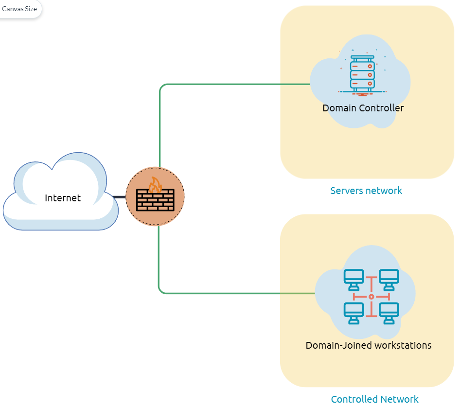
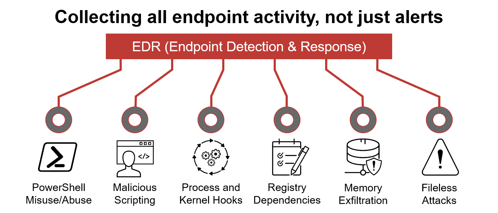

# Task 1 - Introduction
Es ist entscheidend, sich mit der Umgebung vertraut zu machen, in der Sie während eines Red-Team-Einsatzes anfänglichen Zugriff auf eine kompromittierte Maschine haben. Daher ist das Durchführen von Aufklärung und Enumeration ein wesentlicher Teil, und das Hauptziel besteht darin, so viele Informationen wie möglich zu sammeln, um diese im nächsten Schritt zu verwenden.

Mit einem anfänglichen Fuß in der Tür beginnt der Post-Exploitation-Prozess!

Dieser Raum führt in häufig verwendete Konzepte, Technologien und Sicherheitsprodukte ein, die wir kennen müssen.

In diesem Raum wird davon ausgegangen, dass wir bereits Zugriff auf die Maschine haben und bereit sind, unser Wissen über die Umgebung zu erweitern, indem wir die folgenden Punkte untersuchen:

- Netzwerkinfrastruktur
- Active Directory-Umgebung
- Benutzer und Gruppen
- Host-basierte Sicherheitslösungen
- Netzwerk-basierte Sicherheitslösungen
- Anwendungen und Dienste

# Task 2 - Deploy the VM
Um den Aufgabeninhalt zu verfolgen und das Gegebene in diesem Raum anzuwenden, müssen Sie die beigefügte Maschine starten, indem Sie die grüne Startmaschine-Taste in dieser Aufgabe verwenden und einige Minuten warten, bis sie hochgefahren ist. Um auf die angehängte Maschine zuzugreifen, können Sie entweder die geteilte Browseransicht verwenden oder sich über RDP verbinden.

Wenn Sie die Verbindung über RDP bevorzugen, stellen Sie sicher, dass Sie die AttackBox bereitstellen oder sich mit dem VPN verbinden.
Verwenden Sie die folgenden Anmeldeinformationen: `kkidd:Pass123321@`.
```shell
user@machine$ xfreerdp /v:MACHINE_IP /u:kkidd
```

# Task 3 - Network Infrastructure
Sobald wir in ein unbekanntes Netzwerk gelangen, besteht unser erstes Ziel darin, herauszufinden, wo wir uns befinden und auf was wir zugreifen können. Während eines Red-Team-Einsatzes müssen wir verstehen, mit welchem Zielsystem wir es zu tun haben, welche Dienste die Maschine bereitstellt und in welchem Netzwerk wir uns befinden. Daher ist die Aufzählung der kompromittierten Maschine nach dem Erlangen des ersten Zugangs der Schlüssel, um diese Fragen zu beantworten. Diese Aufgabe wird die üblichen Netzwerktypen, denen wir während des Einsatzes begegnen können, besprechen.

Netzwerksegmentierung ist eine zusätzliche Schicht der Netzwerksicherheit, die in mehrere Subnetze unterteilt ist. Sie wird verwendet, um die Sicherheit und Verwaltung des Netzwerks zu verbessern. Zum Beispiel wird sie verwendet, um unbefugten Zugriff auf die wertvollsten Unternehmensressourcen wie Kundendaten, Finanzaufzeichnungen usw. zu verhindern.

Die Virtual Local Area Networks (VLANs) ist eine Netzwerktechnik, die in der Netzwerksegmentierung verwendet wird, um Netzwerkprobleme wie Broadcast-Probleme im lokalen Netzwerk zu kontrollieren und die Sicherheit zu verbessern. Hosts innerhalb des VLANs können nur mit anderen Hosts im selben VLAN-Netzwerk kommunizieren.

Wenn Sie mehr über Netzwerkgrundlagen erfahren möchten, empfehlen wir den folgenden TryHackMe-Kurs: [Netzwerkgrundlagen](https://tryhackme.com/module/network-fundamentals).

### Interne Netzwerke

Interne Netzwerke sind Subnetzwerke, die basierend auf der Wichtigkeit des internen Geräts oder der Wichtigkeit der Zugänglichkeit seiner Daten segmentiert und getrennt sind. Der Hauptzweck der internen Netzwerke besteht darin, Informationen zu teilen, schnellere und einfachere Kommunikation, Kollaborationstools, Betriebssysteme und Netzwerkdienste innerhalb einer Organisation bereitzustellen. In einem Unternehmensnetzwerk beabsichtigen die Netzwerkadministratoren, die Netzwerksegmentierung aus verschiedenen Gründen zu verwenden, einschließlich der Kontrolle des Netzwerkverkehrs, der Optimierung der Netzwerkleistung und der Verbesserung der Sicherheitslage.  


Das vorherige Diagramm ist ein Beispiel für das einfache Konzept der Netzwerksegmentierung, da das Netzwerk in zwei Netzwerke unterteilt ist. Das erste ist für Arbeitsstationen und persönliche Geräte der Mitarbeiter. Das zweite ist für private und interne Netzwerkgeräte, die interne Dienste wie DNS, interne Web-, E-Mail-Dienste usw. bereitstellen.

### Eine Demilitarisierte Zone (DMZ)

Ein DMZ-Netzwerk ist ein Randnetzwerk, das das interne lokale Netzwerk eines Unternehmens vor nicht vertrauenswürdigem Datenverkehr schützt und eine zusätzliche Sicherheitsschicht hinzufügt. Ein gängiges Design für eine DMZ ist ein Subnetz, das zwischen dem öffentlichen Internet und internen Netzwerken sitzt.

Die Gestaltung eines Netzwerks innerhalb des Unternehmens hängt von den Anforderungen und Bedürfnissen des Unternehmens ab. Wenn ein Unternehmen beispielsweise öffentliche Dienste wie eine Website, DNS, FTP, Proxy, VPN usw. anbietet, kann es ein DMZ-Netzwerk entwerfen, um den öffentlichen Netzwerkverkehr zu isolieren und den Zugriff darauf zu kontrollieren.  


Im vorherigen Diagramm stellen wir den Netzwerkverkehr zum DMZ-Netzwerk in roter Farbe dar, der nicht vertrauenswürdig ist (direkt aus dem Internet kommt). Der grüne Netzwerkverkehr zwischen den internen Netzwerken ist der kontrollierte Verkehr, der möglicherweise durch ein oder mehrere Netzwerksicherheitsgeräte geleitet wird.

Das Enumerieren des Systems und des internen Netzwerks ist die Entdeckungsphase, die es dem Angreifer ermöglicht, Informationen über das System und das interne Netzwerk zu sammeln. Basierend auf den gewonnenen Informationen nutzen wir diese, um seitliche Bewegungen oder Privilegieneskalationen durchzuführen, um mehr Privilegien im System oder der AD-Umgebung zu erlangen.

### Netzwerk-Enumeration

Es gibt verschiedene Aspekte des Netzwerks zu überprüfen, wie z.B. TCP- und UDP-Ports sowie etablierte Verbindungen, Routing-Tabellen, ARP-Tabellen usw.

Beginnen wir mit der Überprüfung der offenen TCP- und UDP-Ports auf der Zielmaschine. Dies kann mit dem Befehl `netstat` durchgeführt werden, wie unten gezeigt.  
```plaintext
PS C:\Users\thm> netstat -na

Active Connections

  Proto  Local Address          Foreign Address        State
  TCP    0.0.0.0:80             0.0.0.0:0              LISTENING
  TCP    0.0.0.0:88             0.0.0.0:0              LISTENING
  TCP    0.0.0.0:135            0.0.0.0:0              LISTENING
  TCP    0.0.0.0:389            0.0.0.0:0              LISTENING
```

Die Ausgabe zeigt die offenen Ports sowie die etablierten Verbindungen an. Als nächstes listen wir die ARP-Tabelle auf, die die IP-Adresse und die physikalische Adresse der Computer enthält, die mit den Zielmaschinen innerhalb des Netzwerks kommuniziert haben. Dies kann hilfreich sein, um die Kommunikation innerhalb des Netzwerks zu sehen und andere Maschinen auf offene Ports und Schwachstellen zu scannen.
```
PS C:\Users\thm> arp -a

Schnittstelle: 10.10.141.51 --- 0xa
  Internetadresse      Physikalische Adresse      Typ
  10.10.0.1             02-c8-85-b5-5a-aa     dynamisch
  10.10.255.255         ff-ff-ff-ff-ff-ff     statisch
```

### Interne Netzwerkdienste

Sie bieten privaten und internen Netzwerkzugang für interne Netzwerkgeräte. Ein Beispiel für Netzwerkdienste sind internes DNS, Webserver, benutzerdefinierte Anwendungen usw. Es ist wichtig zu beachten, dass interne Netzwerkdienste außerhalb des Netzwerks nicht zugänglich sind. Sobald wir jedoch Zugang zu einem der Netzwerke haben, die auf diese Netzwerkdienste zugreifen, sind sie erreichbar und für die Kommunikation verfügbar.

Wir werden in Aufgabe 9 mehr über Windows-Anwendungen und -Dienste sprechen, einschließlich DNS und benutzerdefinierter Webanwendungen.

# Task 4 - Active Directory (AD) environment
Was ist die Active Directory (AD)-Umgebung?

Active Directory ist ein auf Windows basierender Verzeichnisdienst, der Datenobjekte für die interne Netzwerkumgebung speichert und bereitstellt. Es ermöglicht die zentrale Verwaltung von Authentifizierung und Autorisierung. Das AD enthält wesentliche Informationen über das Netzwerk und die Umgebung, einschließlich Benutzer, Computer, Drucker usw. Zum Beispiel kann AD Details über Benutzer enthalten, wie Berufsbezeichnung, Telefonnummer, Adresse, Passwörter, Gruppen, Berechtigungen usw.  


Das Diagramm ist ein mögliches Beispiel dafür, wie Active Directory gestaltet sein kann. Der AD-Controller befindet sich in einem Subnetz für Server (im Diagramm oben als Servernetzwerk dargestellt), und die AD-Clients sind in einem separaten Netzwerk, in dem sie der Domäne beitreten und die AD-Dienste über die Firewall nutzen können.

Hier ist eine Liste von Active Directory-Komponenten, mit denen wir vertraut sein müssen:

- **Domänencontroller**  
  Ein Domänencontroller ist ein Windows-Server, der Active Directory-Dienste bereitstellt und die gesamte Domäne verwaltet. Er ermöglicht zentrale Benutzerverwaltung, Verschlüsselung von Benutzerdaten und die Kontrolle über den Zugriff auf das Netzwerk, einschließlich Benutzer, Gruppen, Richtlinien und Computer. Außerdem ermöglicht er den Zugriff auf und die Freigabe von Ressourcen.

- **Organizational Units (OUs)**  
  Organisationseinheiten sind Container innerhalb einer Domäne, die zur Organisation von Benutzern, Gruppen, Computern und anderen OUs verwendet werden. Sie helfen bei der Verwaltung und Anwendung von Gruppenrichtlinien.

- **AD-Objekte**  
  Dies sind die verschiedenen Entitäten innerhalb des Active Directory, darunter Benutzerkonten, Computerobjekte, Gruppen, Drucker und andere Ressourcen.

- **AD-Domänen**  
  Eine Domäne ist eine logische Gruppe von Netzwerkinformationen und Objekten, die unter der Kontrolle eines Domänencontrollers steht. Sie stellt die Struktur dar, in der Active Directory Informationen speichert und verwaltet.

- **Forest**  
  Ein Forest ist die oberste logische Struktur in Active Directory, die eine Sammlung von Domänen umfasst, die durch Vertrauensstellungen miteinander verbunden sind. Er stellt eine gemeinsame Konfiguration, Schema und globales Katalogverzeichnis für alle enthaltenen Domänen bereit.

- **AD-Dienstkonten**  
  Dazu gehören eingebettete lokale Benutzer, Domänenbenutzer und verwaltete Dienstkonten, die für die Ausführung von Diensten und Anwendungen innerhalb des Active Directory verwendet werden.

- **Domänenadministratoren**  
  Diese Benutzerkonten haben erweiterte Berechtigungen innerhalb der Domäne und umfassende Verwaltungsrechte auf dem Domänencontroller und den Computern in der Domäne.

Ein **Domänencontroller** ist ein Windows-Server, der Active Directory-Dienste bereitstellt und die gesamte Domäne verwaltet. Er ermöglicht eine zentrale Benutzerverwaltung, bietet Verschlüsselung von Benutzerdaten und kontrolliert den Zugriff auf das Netzwerk, einschließlich Benutzer, Gruppen, Richtlinien und Computer. Er ermöglicht auch den Zugriff auf und die Freigabe von Ressourcen. Diese Eigenschaften machen den Domänencontroller zu einem attraktiven Ziel für Angreifer, da er eine Vielzahl wertvoller Informationen enthält.  


Organizational Units (OUs) sind Container innerhalb der Active Directory-Domäne mit einer hierarchischen Struktur.

Active Directory-Objekte können Einzelbenutzer oder Gruppen, aber auch Hardwarekomponenten wie Computer oder Drucker sein. Jede Domäne besitzt eine Datenbank, die Identitätsinformationen der Objekte enthält und die AD-Umgebung bildet. Dazu gehören:

- **Benutzer**: Ein Sicherheitsprinzipal, der berechtigt ist, sich an Maschinen in der Domäne zu authentifizieren.
- **Computer**: Eine spezielle Art von Benutzerkonten.
- **GPOs (Gruppenrichtlinienobjekte)**: Sammlungen von Richtlinien, die auf andere AD-Objekte angewendet werden.

**AD-Domänen** sind eine Sammlung von Microsoft-Komponenten innerhalb eines AD-Netzwerks.

**AD-Wald** ist eine Sammlung von Domänen, die einander vertrauen.


Um zu überprüfen, ob der Windows-Computer Teil der Active Directory-Umgebung ist, kann der Befehl `systeminfo` in der Eingabeaufforderung verwendet werden. Der Befehl gibt Informationen über das System, einschließlich des Betriebssystemnamens und der Version, des Hostnamens und anderer Hardwareinformationen sowie der AD-Domäne aus.

Hier ist ein Beispiel für die Verwendung des `systeminfo`-Befehls und die Interpretation der Ausgabe:

```powershell
PS C:\Users\thm> systeminfo | findstr Domain
OS Configuration:          Primary Domain Controller
Domain:                    thmdomain.com
```

In der obigen Ausgabe sehen wir, dass der Computer Teil einer AD-Domäne namens `thmdomain.com` ist, was bestätigt, dass er zur AD-Umgebung gehört.

Wenn im Abschnitt "Domain" `WORKGROUP` angezeigt wird, bedeutet dies, dass der Computer Teil einer lokalen Arbeitsgruppe und nicht einer AD-Domäne ist.

## Fragen:
Ist der angegebene Computer Teil der AD-Umgebung? (Y|N)
```
Y
```

Falls er Teil der AD-Umgebung ist, wie lautet der Domänenname der AD?
```
thmdomain.com
```

# Task 5 - Users and Groups Management
In dieser Aufgabe werden wir mehr über Benutzer und Gruppen lernen, insbesondere innerhalb der Active Directory. Das Sammeln von Informationen über die kompromittierte Maschine ist entscheidend und kann in der nächsten Phase verwendet werden. Die Entdeckung von Konten ist der erste Schritt, nachdem wir anfänglichen Zugriff auf die kompromittierte Maschine erhalten haben, um zu verstehen, was wir haben und welche anderen Konten im System vorhanden sind.

Eine Active Directory-Umgebung enthält verschiedene Konten mit den notwendigen Berechtigungen, Zugriffsrechten und Rollen für unterschiedliche Zwecke. Häufige Active Directory-Dienstkonten sind:

- **Die eingebauten lokalen Benutzerkonten** werden verwendet, um das System lokal zu verwalten und sind nicht Teil der AD-Umgebung.
- **Domänenbenutzerkonten**, die Zugang zu einer Active Directory-Umgebung haben, können die AD-Dienste nutzen (verwaltet durch AD).
- **AD-verwalte Dienstkonten** sind eingeschränkte Domänenbenutzerkonten mit höheren Berechtigungen zur Verwaltung der AD-Dienste.
- **Domänenadministratoren** sind Benutzerkonten, die Informationen in einer Active Directory-Umgebung verwalten können, einschließlich AD-Konfigurationen, Benutzer, Gruppen, Berechtigungen, Rollen, Dienste usw. Eines der Ziele des Red Teams bei einem Engagement ist es, Informationen zu finden, die zu einem Domänenadministrator führen, der vollständige Kontrolle über die AD-Umgebung hat.

Die folgenden Active Directory-Administrator-Konten sind:
| **Konto**             | **Beschreibung**                                                |
|-----------------------|-----------------------------------------------------------------|
| BUILTIN\Administrator | Lokaler Administratorzugang auf einem Domänencontroller         |
| Domain Admins         | Administrative Zugriffsrechte auf alle Ressourcen in der Domäne |
| Enterprise Admins     | Nur im Root der Forest verfügbar                                |
| Schema Admins         | Kann Domänen/Forest ändern; nützlich für Red Teamer             |
| Server Operators      | Kann Domänenserver verwalten                                    |
| Account Operators      | Kann Benutzer verwalten, die nicht in privilegierten Gruppen sind |

Hier ist die Übersetzung:

Jetzt, da wir über verschiedene Kontotypen innerhalb der AD-Umgebung Bescheid wissen, wollen wir die Windows-Maschine, auf die wir während der Anfangszugriffsphase Zugriff haben, auflisten. Als aktueller Benutzer haben wir spezifische Berechtigungen, um Dinge innerhalb der Maschine und der AD-Umgebung anzuzeigen oder zu verwalten.

**Active Directory (AD) Enumeration**

Das Auflisten von Informationen in der AD-Umgebung erfordert unterschiedliche Werkzeuge und Techniken. Sobald wir bestätigen, dass die Maschine Teil der AD-Umgebung ist, können wir damit beginnen, nach variablen Informationen zu suchen, die später verwendet werden könnten. In diesem Schritt verwenden wir PowerShell, um Benutzer und Gruppen aufzulisten.

Der folgende PowerShell-Befehl dient dazu, alle Active Directory-Benutzerkonten abzurufen. Beachten Sie, dass wir das Argument `-Filter` verwenden müssen.
```
PS C:\Users\thm> Get-ADUser  -Filter *
DistinguishedName : CN=Administrator,CN=Users,DC=thmredteam,DC=com
Enabled           : True
GivenName         :
Name              : Administrator
ObjectClass       : user
ObjectGUID        : 4094d220-fb71-4de1-b5b2-ba18f6583c65
SamAccountName    : Administrator
SID               : S-1-5-21-1966530601-3185510712-10604624-500
Surname           :
UserPrincipalName :
PS C:\Users\thm>
```

Wir können auch die hierarchische [LDAP-Baumstruktur verwenden](http://www.ietf.org/rfc/rfc2253.txt), um einen Benutzer innerhalb der AD-Umgebung zu finden. Der Distinguished Name (DN) ist eine Sammlung von durch Kommas getrennten Schlüssel-Wert-Paaren, die verwendet werden, um eindeutige Datensätze im Verzeichnis zu identifizieren. Der DN besteht aus Domain Component (DC), OrganizationalUnitName (OU), Common Name (CN) und anderen. Das folgende Beispiel „CN=User1,CN=Users,DC=thmredteam,DC=com“ ist ein Beispiel für einen DN, der wie folgt visualisiert werden kann:  


Mit der Option `SearchBase` geben wir einen spezifischen Common Name (CN) im Active Directory an. Zum Beispiel können wir angeben, dass alle Benutzer aufgelistet werden sollen, die Teil der Gruppe „Users“ sind.
```
PS C:\Users\thm> Get-ADUser -Filter * -SearchBase "CN=Users,DC=THMREDTEAM,DC=COM"


DistinguishedName : CN=Administrator,CN=Users,DC=thmredteam,DC=com
Enabled           : True
GivenName         :
Name              : Administrator
ObjectClass       : user
ObjectGUID        : 4094d220-fb71-4de1-b5b2-ba18f6583c65
SamAccountName    : Administrator
SID               : S-1-5-21-1966530601-3185510712-10604624-500
Surname           :
UserPrincipalName :
```

Beachte, dass das Ergebnis je nach Konfiguration des CN mehrere Benutzer enthalten kann. Versuche den Befehl, um alle Benutzer innerhalb der THM OU zu finden, und beantworte die folgende Frage.

## Fragen:
Verwende den Befehl `Get-ADUser -Filter * -SearchBase`, um die verfügbaren Benutzerkonten innerhalb der `THM`  OU in der Domain `thmredteam.com` aufzulisten. Wie viele Benutzer sind verfügbar?
```
6
```

Nachdem du den vorherigen Befehl ausgeführt hast, wie lautet der UserPrincipalName (E-Mail-Adresse) des Administrator-Kontos?
```
thmadmin@thmredteam.com
```

# Task 6 - Host Security Solution #1
Bevor wir weitere Aktionen durchführen, müssen wir allgemeine Kenntnisse über die vorhandenen Sicherheitslösungen erwerben. Es ist wichtig, Antiviren- und Sicherheitsüberwachungsmethoden auf einem Endpunkt zu ermitteln, um möglichst unentdeckt zu bleiben und die Wahrscheinlichkeit zu reduzieren, entdeckt zu werden.

Diese Aufgabe behandelt gängige Sicherheitslösungen, die in Unternehmensnetzwerken verwendet werden, unterteilt in `Host`- und `Netzwerk`-Sicherheitslösungen.

### Host-Sicherheitslösungen

Dies sind eine Reihe von Software-Anwendungen, die dazu verwendet werden, abnormale und bösartige Aktivitäten auf dem Host zu überwachen und zu erkennen, einschließlich:

- Antiviren-Software
- Microsoft Windows Defender
- Host-basierte Firewall
- Sicherheitsereignisprotokollierung und -überwachung
- Host-basiertes Intrusion Detection System (HIDS) / Host-basiertes Intrusion Prevention System (HIPS)
- Endpoint Detection and Response (EDR)

Lassen Sie uns genauer auf die host-basierten Sicherheitslösungen eingehen, denen wir während des Red-Team-Einsatzes begegnen könnten.

### Antiviren-Software (AV

Antiviren-Software, auch bekannt als Anti-Malware, wird hauptsächlich verwendet, um bösartige Software auf dem Host zu überwachen, zu erkennen und zu verhindern. Die meisten Antiviren-Software-Anwendungen nutzen bekannte Funktionen wie Hintergrundscans, vollständige Systemscans und Virendefinitionen. Beim Hintergrundscan arbeitet die Antiviren-Software in Echtzeit und scannt alle offenen und verwendeten Dateien im Hintergrund. Der vollständige Systemscan ist besonders wichtig, wenn Sie die Antiviren-Software erstmals installieren. Das Interessanteste sind die Virendefinitionen, bei denen die Antiviren-Software auf vordefinierte Viren reagiert. Deshalb muss Antiviren-Software regelmäßig aktualisiert werden.

Es gibt verschiedene Erkennungstechniken, die von Antiviren-Software verwendet werden, darunter:

- **Signaturbasierte Erkennung**: Eine der häufigsten und traditionellen Techniken, um bösartige Dateien zu identifizieren. Forscher oder Benutzer reichen infizierte Dateien zur weiteren Analyse bei Antiviren-Anbietern ein, und wenn diese als bösartig bestätigt werden, wird die Signatur in deren Datenbank registriert. Die Antiviren-Software vergleicht die gescannte Datei mit einer Datenbank bekannter Signaturen für mögliche Angriffe und Malware auf der Client-Seite. Wenn ein Treffer vorliegt, wird dies als Bedrohung betrachtet.

- **Heuristische Erkennung**: Verwendet maschinelles Lernen, um zu entscheiden, ob es sich um eine bösartige Datei handelt oder nicht. Sie scannt und analysiert in Echtzeit, um verdächtige Eigenschaften im Code der Anwendung zu finden oder zu überprüfen, ob ungewöhnliche Windows- oder System-APIs verwendet werden. Sie verlässt sich nicht unbedingt auf signaturbasierte Angriffe bei der Entscheidungsfindung, manchmal schon. Dies hängt von der Implementierung der Antiviren-Software ab.

- **Verhaltensbasierte Erkennung**: Vertraut auf die Überwachung und Untersuchung der Ausführung von Anwendungen, um abnormale Verhaltensweisen und ungewöhnliche Aktivitäten zu finden, wie das Erstellen/Aktualisieren von Werten in Registrierungsschlüsseln, das Beenden/Erstellen von Prozessen usw.

Als Red Teamer ist es wichtig zu wissen, ob eine Antiviren-Software vorhanden ist oder nicht, da sie unsere Aktivitäten verhindern kann. Wir können AV-Software mit Windows-Bordmitteln wie `wmic` auflisten.

```powershell
PS C:\Users\thm> wmic /namespace:\\root\securitycenter2 path antivirusproduct
```

Das kann auch mit PowerShell durchgeführt werden, was dasselbe Ergebnis liefert.

```powershell
PS C:\Users\thm> Get-CimInstance -Namespace root/SecurityCenter2 -ClassName AntivirusProduct


displayName              : Bitdefender Antivirus
instanceGuid             : {BAF124F4-FA00-8560-3FDE-6C380446AEFB}
pathToSignedProductExe   : C:\Program Files\Bitdefender\Bitdefender Security\wscfix.exe
pathToSignedReportingExe : C:\Program Files\Bitdefender\Bitdefender Security\bdservicehost.exe
productState             : 266240
timestamp                : Wed, 15 Dec 2021 12:40:10 GMT
PSComputerName           :

displayName              : Windows Defender
instanceGuid             : {D58FFC3A-813B-4fae-9E44-DA132C9FAA36}
pathToSignedProductExe   : windowsdefender://
pathToSignedReportingExe : %ProgramFiles%\Windows Defender\MsMpeng.exe
productState             : 393472
timestamp                : Fri, 15 Oct 2021 22:32:01 GMT
PSComputerName           :
```

Als Ergebnis sehen wir, dass sowohl eine Drittanbieter-Antiviren-Software (Bitdefender Antivirus) als auch Windows Defender auf dem Computer installiert sind. Beachten Sie, dass Windows-Server möglicherweise keinen SecurityCenter2-Namespace haben, was auf der angehängten VM nicht funktionieren kann. Stattdessen funktioniert es bei Windows-Workstations!

### Microsoft Windows Defender

Microsoft Windows Defender ist ein vorinstalliertes Antiviren-Sicherheitswerkzeug, das auf Endpunkten ausgeführt wird. Es verwendet verschiedene Algorithmen zur Erkennung, einschließlich maschinelles Lernen, Big-Data-Analyse, tiefgehende Bedrohungsforschung und Microsoft-Cloud-Infrastruktur zum Schutz vor Malware und Viren. MS Defender arbeitet in drei Schutzmodi: Aktiv, Passiv, Deaktiviert.

- Der **Aktiv-Modus** wird verwendet, wenn der MS Defender als primäre Antiviren-Software auf dem Computer läuft und Schutz sowie Behebung bietet.
- Der **Passiv-Modus** wird ausgeführt, wenn eine Drittanbieter-Antiviren-Software installiert ist. Daher fungiert es als sekundäre Antiviren-Software, die Dateien scannt und Bedrohungen erkennt, aber keine Behebung bietet.
- Der **Deaktiviert-Modus** ist, wenn der MS Defender deaktiviert oder vom System deinstalliert ist.

Wir können den folgenden PowerShell-Befehl verwenden, um den Dienststatus von Windows Defender zu überprüfen:

```powershell
PS C:\Users\thm> Get-Service WinDefend

Status   Name               DisplayName
------   ----               -----------
Running  WinDefend          Windows Defender Antivirus Service
```

Anschließend können wir das Cmdlet `Get-MpComputerStatus` verwenden, um den aktuellen Windows Defender-Status zu ermitteln. Es liefert den aktuellen Status der Sicherheitslösungselemente, einschließlich Anti-Spyware, Antiviren-Schutz, Laufwerkschutz, Echtzeitschutz usw. Wir können `select` verwenden, um genau das anzugeben, was wir benötigen:

```powershell
PS C:\Users\thm> Get-MpComputerStatus | select RealTimeProtectionEnabled

RealTimeProtectionEnabled
-------------------------
                    False
```

Als Ergebnis zeigt `MpComputerStatus`, ob Windows Defender aktiviert ist oder nicht.

**Host-basierte Firewall:** Dies ist ein Sicherheitswerkzeug, das auf einem Host-Computer installiert und ausgeführt wird, um Angriffe oder Versuche von Red Teamern zu verhindern und zu blockieren. Daher ist es wichtig, Details zur Firewall und ihren Regeln auf dem Computer zu ermitteln, auf den wir anfänglichen Zugriff haben.
Hier ist die Übersetzung:

Der Hauptzweck der host-basierten Firewall besteht darin, den eingehenden und ausgehenden Datenverkehr zu steuern, der über die Schnittstelle des Geräts geht. Sie schützt den Host vor nicht vertrauenswürdigen Geräten im selben Netzwerk. Eine moderne host-basierte Firewall verwendet mehrere Ebenen der Verkehrsüberprüfung, einschließlich Paket-Analyse, während die Verbindung hergestellt wird.

Eine Firewall fungiert als Zugangskontrolle auf der Netzwerkschicht. Sie ist in der Lage, Netzwerkpakete zuzulassen oder zu blockieren. Zum Beispiel kann eine Firewall so konfiguriert werden, dass sie ICMP-Pakete blockiert, die über den `Ping`-Befehl von anderen Maschinen im selben Netzwerk gesendet werden. Next-Generation-Firewalls können auch andere OSI-Schichten, wie die Anwendungsschicht, inspizieren. Daher können sie SQL-Injection und andere Angriffe auf Anwendungsebene erkennen und blockieren.

```powershell
PS C:\Users\thm> Get-NetFirewallProfile | Format-Table Name, Enabled

Name    Enabled
----    -------
Domain     True
Private    True
Public     True
```

Wenn wir Administratorrechte für den aktuellen Benutzer haben, mit dem wir angemeldet sind, können wir versuchen, ein oder mehrere Firewall-Profile mit dem Cmdlet `Set-NetFirewallProfile` zu deaktivieren.

```powershell
PS C:\Windows\system32> Set-NetFirewallProfile -Profile Domain, Public, Private -Enabled False
PS C:\Windows\system32> Get-NetFirewallProfile | Format-Table Name, Enabled
---- -------
Domain False
Private False
Public False
```

Wir können auch die aktuellen Firewall-Regeln überprüfen, um zu sehen, welche vom Firewall zugelassen oder blockiert werden.

```powershell
PS C:\Users\thm> Get-NetFirewallRule | select DisplayName, Enabled, Description

DisplayName                                                                  Enabled
-----------                                                                  -------
Virtual Machine Monitoring (DCOM-In)                                           False
Virtual Machine Monitoring (Echo Request - ICMPv4-In)                          False
Virtual Machine Monitoring (Echo Request - ICMPv6-In)                          False
Virtual Machine Monitoring (NB-Session-In)                                     False
Virtual Machine Monitoring (RPC)                                               False
SNMP Trap Service (UDP In)                                                     False
SNMP Trap Service (UDP In)                                                     False
Connected User Experiences and Telemetry                                        True
Delivery Optimization (TCP-In)                                                  True
```

Während des Red-Team-Einsatzes haben wir keine Ahnung, was die Firewall blockiert. Wir können jedoch einige PowerShell-Cmdlets wie `Test-NetConnection` und `TcpClient` nutzen. Angenommen, wir wissen, dass eine Firewall vorhanden ist und wir müssen eine eingehende Verbindung ohne zusätzliche Werkzeuge testen, können wir Folgendes tun:

```powershell
PS C:\Users\thm> Test-NetConnection -ComputerName 127.0.0.1 -Port 80


ComputerName     : 127.0.0.1
RemoteAddress    : 127.0.0.1
RemotePort       : 80
InterfaceAlias   : Loopback Pseudo-Interface 1
SourceAddress    : 127.0.0.1
TcpTestSucceeded : True

PS C:\Users\thm> (New-Object System.Net.Sockets.TcpClient("127.0.0.1", "80")).Connected
True
```

Als Ergebnis können wir bestätigen, dass die eingehende Verbindung auf Port 80 geöffnet und in der Firewall erlaubt ist. Beachten Sie, dass wir auch Remote-Ziele im selben Netzwerk oder Domänennamen testen können, indem wir dies im `-ComputerName`-Argument für `Test-NetConnection` angeben.

## Fragen
Zählen Sie die angehängte Windows-Maschine auf und prüfen Sie, ob die host-basierte Firewall aktiviert ist oder nicht! (J|N)
```
N
```

Verwenden Sie PowerShell-Cmdlets wie `Get-MpThreat`, um uns Details zu den von MS Defender erkannten Bedrohungen zu geben. Führen Sie es aus und beantworten Sie Folgendes: Wie lautet der Dateiname, der diesen Alarm auslöst?
```
PowerView.ps1
```

Zählen Sie die Firewall-Regeln der angehängten Windows-Maschine auf. Welcher Port wird unter der Regel `THM-Connection` erlaubt?
```
17337
```

Im nächsten Abschnitt werden wir weiterhin über die Sicherheitslösungen für Hosts sprechen. Ich bin bereit!
```
Keine Antwort nötig
```

# Task 7 - Host Security Solution #2
In dieser Aufgabe werden wir weiterhin über Sicherheitslösungen für Hosts sprechen.

### Sicherheitsereignisprotokollierung und Überwachung

Standardmäßig protokollieren Betriebssysteme verschiedene Aktivitätsereignisse im System mittels Protokolldateien. Die Ereignisprotokollierungsfunktion steht IT-System- und Netzwerkadministratoren zur Verfügung, um wichtige Ereignisse sowohl auf dem Host als auch im Netzwerk zu überwachen und zu analysieren. In Unternehmensnetzwerken nutzen Sicherheitsteams die Protokollierungstechnik, um Sicherheitsvorfälle nachzuverfolgen und zu untersuchen.

Es gibt verschiedene Kategorien, in denen das Windows-Betriebssystem Ereignisinformationen protokolliert, darunter Anwendung, System, Sicherheit, Dienste usw. Darüber hinaus speichern Sicherheits- und Netzwerkgeräte Ereignisinformationen in Protokolldateien, um den Systemadministratoren Einblick in die Vorgänge zu geben.

Wir können eine Liste der verfügbaren Ereignisprotokolle auf der lokalen Maschine mit dem Cmdlet `Get-EventLog` abrufen.

```powershell
PS C:\Users\thm> Get-EventLog -List

  Max(K) Retain OverflowAction        Entries Log
  ------ ------ --------------        ------- ---
     512      7 OverwriteOlder             59 Active Directory Web Services
  20,480      0 OverwriteAsNeeded         512 Application
     512      0 OverwriteAsNeeded         170 Directory Service
 102,400      0 OverwriteAsNeeded          67 DNS Server
  20,480      0 OverwriteAsNeeded       4,345 System
  15,360      0 OverwriteAsNeeded       1,692 Windows PowerShell
```

Manchmal gibt die Liste der verfügbaren Ereignisprotokolle Aufschluss darüber, welche Anwendungen und Dienste auf der Maschine installiert sind! Beispielsweise sehen wir, dass die lokale Maschine Active Directory, DNS-Server usw. hat. Weitere Informationen zum Cmdlet `Get-EventLog` mit Beispielen finden Sie auf der [Microsoft-Dokumentationsseite](https://docs.microsoft.com/en-us/powershell/module/microsoft.powershell.management/get-eventlog?view=powershell-5.1).

In Unternehmensnetzwerken wird Log-Agent-Software auf Clients installiert, um Protokolle von verschiedenen Sensoren zu sammeln und zu sammeln, um Aktivitäten innerhalb des Netzwerks zu analysieren und zu überwachen. Wir werden dies im Abschnitt über Netzwerksicherheitslösungen näher besprechen.

### Systemmonitor (Sysmon)

Der **Windows-Systemmonitor** `Sysmon` ist ein Dienst und ein Gerätetreiber. Er ist Teil der Microsoft Sysinternals Suite. Das `Sysmon`-Tool ist kein essentielles Werkzeug (nicht standardmäßig installiert), beginnt jedoch, Ereignisse zu sammeln und zu protokollieren, sobald es installiert ist. Diese Protokollindikatoren können Systemadministratoren und Blue-Teamer erheblich dabei helfen, bösartige Aktivitäten nachzuverfolgen und zu untersuchen sowie allgemeine Fehlersuche zu unterstützen.

Eine der großartigen Funktionen des `Sysmon`-Tools ist, dass es viele wichtige Ereignisse protokollieren kann, und Sie können auch eigene Regeln und Konfigurationen erstellen, um Folgendes zu überwachen:

- Prozess-Erstellung und -Beendigung
- Netzwerkverbindungen
- Dateiänderungen
- Remote-Bedrohungen
- Prozess- und Speicherzugriff
- und vieles mehr

Für weitere Informationen über `Sysmon` besuchen Sie die Windows-Dokumentationsseite [hier](https://docs.microsoft.com/en-us/sysinternals/downloads/sysmon).

Als Red Teamer ist es eines der Hauptziele, unentdeckt zu bleiben. Daher ist es wichtig, sich über diese Werkzeuge im Klaren zu sein und zu vermeiden, Ereignisse zu erzeugen oder Warnungen auszulösen. Hier sind einige Tricks, um zu erkennen, ob Sysmon auf dem Zielrechner verfügbar ist oder nicht:

Wir können nach einem Prozess oder Dienst suchen, der den Namen „Sysmon“ trägt, innerhalb der aktuellen Prozesse oder Dienste wie folgt:

```powershell
PS C:\Users\thm> Get-Process | Where-Object { $_.ProcessName -eq "Sysmon" }

Handles  NPM(K)    PM(K)      WS(K)     CPU(s)     Id  SI ProcessName
-------  ------    -----      -----     ------     --  -- -----------
    373      15    20212      31716              3316   0 Sysmon
```

oder nach Diensten suchen:

```powershell
PS C:\Users\thm> Get-CimInstance win32_service -Filter "Description = 'System Monitor service'"
# oder
Get-Service | where-object {$_.DisplayName -like "*sysm*"}
```

Es kann auch überprüft werden, indem die Windows-Registrierung überprüft wird:

```powershell
PS C:\Users\thm> reg query HKLM\SOFTWARE\Microsoft\Windows\CurrentVersion\WINEVT\Channels\Microsoft-Windows-Sysmon/Operational
# or
Get-Service | where-object {$_.DisplayName -like "*sysm*"}
```

Alle diese Befehle bestätigen, ob das `Sysmon`-Tool installiert ist. Sobald wir es erkennen, können wir versuchen, die Sysmon-Konfigurationsdatei zu finden, wenn wir Leserechte haben, um zu verstehen, was die Systemadministratoren überwachen.

```powershell
PS C:\Users\thm> findstr /si '<ProcessCreate onmatch="exclude">' C:\tools\*
C:\tools\Sysmon\sysmonconfig.xml:      
C:\tools\Sysmon\sysmonconfig.xml:      
```

Für detailliertere Informationen über das Windows-`Sysmon`-Tool und wie man es auf Endpunkten verwendet, empfehlen wir, den TryHackMe-Raum „Sysmon“ auszuprobieren.

### Host-basierte Intrusion Detection/Prevention Systeme (HIDS/HIPS)

**HIDS** steht für Host-basierte Intrusion Detection System. Es handelt sich um Software, die in der Lage ist, ungewöhnliche und bösartige Aktivitäten auf einem Host zu überwachen und zu erkennen. Der Hauptzweck von HIDS ist es, verdächtige Aktivitäten zu erkennen und nicht zu verhindern. Es gibt zwei Methoden, wie das host-basierte oder netzwerkbasierte Intrusion Detection System funktioniert:

- **Signature-basiertes IDS** - es überprüft Prüfziffern und Nachrichtenauthentifizierung.
- **Anomaly-basiertes IDS** - es sucht nach unerwarteten Aktivitäten, einschließlich abnormalem Bandbreitenverbrauch, Protokollen und Ports.

Host-basierte Intrusion Prevention Systeme (**HIPS**) sichern die Betriebssystemaktivitäten des Geräts, auf dem sie installiert sind. Es handelt sich um eine Erkennungs- und Präventionslösung gegen bekannte Angriffe und anormales Verhalten. HIPS kann die Protokolldateien des Hosts überprüfen, Prozesse überwachen und Systemressourcen schützen. HIPS kombiniert viele Produktmerkmale wie Antivirus, Verhaltensanalyse, Netzwerk-, Anwendungsfirewall usw.

Es gibt auch ein netzwerkbasiertes IDS/IPS, das wir im nächsten Abschnitt behandeln werden.

### Endpoint Detection and Response (EDR)


Es ist auch bekannt als Endpoint Detection and Threat Response (EDTR). Das EDR ist eine Cybersicherheitslösung, die gegen Malware und andere Bedrohungen schützt. EDRs können nach bösartigen Dateien suchen, Endpunkte, System- und Netzwerkereignisse überwachen und diese in einer Datenbank für weitere Analysen, Erkennung und Untersuchung aufzeichnen. EDRs stellen die nächste Generation von Antiviruslösungen dar und erkennen bösartige Aktivitäten auf dem Host in Echtzeit.

EDRs analysieren Systemdaten und -verhalten, um Bedrohungen zu erkennen, einschließlich:

- Malware, einschließlich Viren, Trojanern, Adware, Keyloggern
- Exploit-Ketten
- Ransomware

Hier sind einige gängige EDR-Softwarelösungen für Endpunkte:

- Cylance
- Crowdstrike
- Symantec
- SentinelOne
- Viele weitere

Auch wenn ein Angreifer es erfolgreich geschafft hat, seine Nutzlast zu liefern und die EDR zu umgehen, um eine Reverse-Shell zu erhalten, läuft die EDR weiterhin und überwacht das System. Sie könnte uns daran hindern, etwas anderes zu tun, wenn sie einen Alarm auslöst.

Wir können Skripte verwenden, um Sicherheitsprodukte innerhalb des Systems zu ermitteln, wie zum Beispiel [Invoke-EDRChecker](https://github.com/PwnDexter/Invoke-EDRChecker) und [SharpEDRChecker](https://github.com/PwnDexter/SharpEDRChecker). Diese überprüfen häufig verwendete Antivirus-, EDR-, Protokollüberwachungsprodukte, indem sie Metadaten von Dateien, Prozesse, in aktuelle Prozesse geladene DLLs, Dienste, Treiber und Verzeichnisse überprüfen.

# Task 8 - Network Security Solutions
Diese Aufgabe behandelt Netzwerksicherheitslösungen, die häufig in Unternehmensnetzwerken zu sehen und zu verwenden sind.

### Netzwerksicherheitslösungen

Netzwerksicherheitslösungen können Software oder Hardware-Appliances sein, die verwendet werden, um bösartige Aktivitäten im Netzwerk zu überwachen, zu erkennen und zu verhindern. Sie konzentrieren sich auf den Schutz von Clients und Geräten, die mit dem Unternehmensnetzwerk verbunden sind. Zu den Netzwerksicherheitslösungen gehören, aber sind nicht beschränkt auf:

- Netzwerkfirewall
- SIEM
- IDS/IPS

### Netzwerkfirewall

Eine Firewall ist der erste Kontrollpunkt für nicht vertrauenswürdigen Datenverkehr, der in ein Netzwerk eintritt. Die Firewall filtert den nicht vertrauenswürdigen Datenverkehr gemäß Regeln und Richtlinien, bevor sie ihn ins Netzwerk weiterleitet. Darüber hinaus können Firewalls verwendet werden, um Netzwerke von externen Datenquellen, internen Datenquellen oder sogar spezifischen Anwendungen zu trennen. Heutzutage sind Firewall-Produkte häufig in Netzwerkroutern oder anderen Sicherheitsprodukten integriert, die verschiedene Sicherheitsfunktionen bieten. Hier sind einige Firewall-Typen, die Unternehmen verwenden können:

- Paketfilter-Firewalls
- Proxy-Firewalls
- NAT-Firewalls
- Webanwendungsfirewalls

### Security Information and Event Management (SIEM)

SIEM kombiniert Security Information Management (SIM) und Security Event Management (SEM), um Ereignisse in Echtzeit zu überwachen und zu analysieren sowie Daten zu verfolgen und zu protokollieren. SIEM hilft Systemadministratoren und Blue Teams dabei, potenzielle Sicherheitsbedrohungen und Schwachstellen zu überwachen und zu verfolgen, bevor sie Schaden anrichten.

SIEM-Lösungen fungieren als Zentrum für die Aggregation von Protokolldaten, bei dem Protokolldateien von Sensoren gesammelt und Funktionen auf die gesammelten Daten angewendet werden, um Sicherheitsbedrohungen oder Angriffe zu identifizieren und zu erkennen. Zu den Funktionen, die ein SIEM bieten kann, gehören:

- Protokollmanagement: Es erfasst und sammelt Daten für das gesamte Unternehmensnetzwerk in Echtzeit.
- Ereignisanalyse: Es wendet fortschrittliche Analysen an, um abnormale Muster oder Verhaltensweisen zu erkennen, die im Dashboard mit Diagrammen und Statistiken verfügbar sind.
- Vorfallüberwachung und Sicherheitswarnungen: Es überwacht das gesamte Netzwerk, einschließlich verbundener Benutzer, Geräte, Anwendungen usw., und benachrichtigt die Administratoren sofort, sobald Angriffe erkannt werden, um geeignete Maßnahmen zur Minderung zu ergreifen.
- Compliance-Management und Reporting: Es erstellt in Echtzeit Berichte zu jeder Zeit.

SIEM ist in der Lage, fortgeschrittene und unbekannte Bedrohungen mit integrierter Bedrohungsintelligenz und KI-Technologien zu erkennen, einschließlich Insider-Bedrohungen, Sicherheitsanfälligkeiten, Phishing-Angriffe, Web-Angriffe, DDoS-Angriffe, Datenexfiltration usw.

Hier sind einige SIEM-Produkte, die in vielen Unternehmen häufig vorkommen:

- Splunk
- LogRhythm NextGen SIEM Platform
- SolarWinds Security Event Manager
- Datadog Security Monitoring
- Viele weitere

### Intrusion Detection System und Intrusion Prevention System (NIDS/NIPS)

Netzwerkbasierte IDS/IPS haben ein ähnliches Konzept wie die hostbasierten IDS/IPS. Der Hauptunterschied besteht darin, dass sich die netzwerkbasierten Produkte auf die Sicherheit eines Netzwerks anstelle eines Hosts konzentrieren. Die netzwerkbasierte Lösung basiert auf Sensoren und Agenten, die in den Netzwerkgeräten und Hosts verteilt sind, um Daten zu sammeln. IDS und IPS sind beides Überwachungs- und Erkennungslösungen für Cybersicherheit, die ein Unternehmen zum Schutz seiner internen Systeme verwendet. Beide lesen Netzwerkpakete, um abnormale Verhaltensweisen und bekannte Bedrohungen, die in einer vorherigen Datenbank vorab geladen wurden, zu suchen. Der wesentliche Unterschied zwischen beiden Lösungen besteht darin, dass das IDS menschliches Eingreifen oder eine Drittanbieter-Software zur Datenanalyse benötigt, um Maßnahmen zu ergreifen. Das IPS ist ein Kontrollsystem, das Pakete basierend auf Richtlinien und Regeln akzeptiert oder ablehnt.

Hier sind einige gängige IDS/IPS-Produkte für Unternehmen:

- Palo Alto Networks
- Cisco's Next-Generation
- McAfee Network Security Platform (NSP)
- Trend Micro TippingPoint
- Suricata

Für weitere Informationen zu IDS/IPS besuchen Sie den [Referenzlink](https://geekflare.com/ids-vs-ips-network-security-solutions/).

# Task 9 - Applications and Services
Diese Aufgabe wird unser Wissen erweitern, das notwendig ist, um mehr über das System zu erfahren. In den vorherigen Aufgaben haben wir die Entdeckung von Konten und Sicherheitsprodukten innerhalb des Systems behandelt. Wir werden nun weiter lernen, einschließlich:

- Installierte Anwendungen
- Dienste und Prozesse
- Dateifreigaben und Druckerfreigaben
- Interne Dienste: DNS und lokale Webanwendungen

Es ist notwendig, zu verstehen, was das System bietet, um den Nutzen der Informationen zu erkennen.

### Installierte Anwendungen

Zunächst beginnen wir damit, das System nach installierten Anwendungen zu durchsuchen, indem wir den Namen und die Version der Anwendungen überprüfen. Als Red Team Member wird uns diese Information zugutekommen. Möglicherweise finden wir anfällige Software, die wir ausnutzen und zur Eskalation unserer Systemprivilegien verwenden können. Auch könnten wir Informationen finden, wie z.B. Klartext-Anmeldeinformationen, die auf dem System verbleiben und zu anderen Systemen oder Diensten gehören.

Wir werden den Windows-Befehl `wmic` verwenden, um alle installierten Anwendungen und deren Version aufzulisten.
```PowerShell
PS C:\Users\thm> wmic product get name,version
Name                                                            Version
Microsoft Visual C++ 2019 X64 Minimum Runtime - 14.28.29910     14.28.29910
AWS Tools for Windows                                           3.15.1248
Amazon SSM Agent                                                3.0.529.0
aws-cfn-bootstrap                                               2.0.5
AWS PV Drivers                                                  8.3.4
Microsoft Visual C++ 2019 X64 Additional Runtime - 14.28.29910  14.28.29910
```

Eine weitere interessante Sache ist, nach bestimmten Textzeichenfolgen, versteckten Verzeichnissen und Backup-Dateien zu suchen. Dafür können wir die PowerShell-Cmdlets `Get-ChildItem` verwenden:
```PowerShell
PS C:\Users\thm> Get-ChildItem -Hidden -Path C:\Users\kkidd\Desktop\
```

### Dienste und Prozesse

Windows-Dienste ermöglichen es dem Systemadministrator, dauerhaft ausgeführte Anwendungen in unseren eigenen Windows-Sitzungen zu erstellen. Manchmal haben Windows-Dienste Fehlkonfigurationen der Berechtigungen, die das aktuelle Benutzerzugriffslevel eskalieren können. Daher müssen wir laufende Dienste untersuchen und eine Erkundung der Dienste und Prozesse durchführen. Weitere Details finden Sie zur Prozessentdeckung in den [MITRE-Angriffsframeworks](https://attack.mitre.org/techniques/T1057/).

Die Prozessentdeckung ist ein Schritt zur Enumeration, um zu verstehen, was das System bietet. Das Red Team sollte Informationen und Details über laufende Dienste und Prozesse auf einem System sammeln. Wir müssen so viel wie möglich über unsere Ziele verstehen. Diese Informationen könnten uns helfen, gängige Software zu erkennen, die auf anderen Systemen im Netzwerk läuft. Zum Beispiel könnte das kompromittierte System eine benutzerdefinierte Client-Anwendung für interne Zwecke haben. Intern entwickelte benutzerdefinierte Software ist die häufigste Ursache für Eskalationsvektoren. Daher lohnt es sich, mehr über den aktuellen Prozess herauszufinden.

Weitere Details zu Kern-Windows-Prozessen aus der Sicht des Blue Teams finden Sie im TryHackMe-Raum: [Core Windows Process](https://tryhackme.com/room/btwindowsinternals).

### Dateifreigaben und Druckerfreigaben

Datei- und Netzwerkressourcenfreigaben sind in persönlichen und Unternehmensumgebungen üblich. Systemadministratoren konfigurieren möglicherweise Zugriffberechtigungen falsch, und dies kann nützliche Informationen über andere Konten und Systeme enthalten. Für mehr Informationen über Druckerhacking empfehlen wir, den folgenden TryHackMe-Raum auszuprobieren: [Printer Hacking 101](https://tryhackme.com/room/printerhacking101).

### Interne Dienste: DNS, lokale Webanwendungen usw.

Interne Netzwerkdienste sind eine weitere Informationsquelle, um unser Wissen über andere Systeme und die gesamte Umgebung zu erweitern. Um mehr über Netzwerkdienste, die für externe und interne Netzwerkdienste verwendet werden, zu erfahren, empfehlen wir, die folgenden Räume auszuprobieren: [Network Service](https://tryhackme.com/room/networkservices), [Network Service2](https://tryhackme.com/room/networkservices2).

Hier sind einige der häufig verwendeten internen Dienste, die uns interessieren:

- DNS-Dienste
- E-Mail-Dienste
- Netzwerk-Dateifreigabe
- Webanwendungen
- Datenbankdienste

## Fragen:
Versuchen wir, die laufenden Dienste aufzulisten, indem wir die Windows-Eingabeaufforderung `net start` verwenden, um zu überprüfen, ob es interessante laufende Dienste gibt.
```PowerShell
PS C:\Users\thm> net start
Diese Windows-Dienste sind gestartet:

Active Directory Web Services
Amazon SSM Agent
Application Host Helper Service
Cryptographic Services
DCOM Server Process Launcher
DFS Namespace
DFS Replication
DHCP Client
Diagnostic Policy Service
THM Demo
DNS Client
```

Wir sehen einen Dienst mit dem Namen `THM Demo`, über den wir mehr erfahren möchten.

Nun suchen wir nach dem genauen Dienstnamen, um weitere Informationen zu erhalten.
```PowerShell
PS C:\Users\thm> wmic service where "name like 'THM Demo'" get Name,PathName
Name         PathName
THM Service  c:\Windows\thm-demo.exe
```

Wir haben den Dateinamen und den Pfad gefunden. Jetzt suchen wir nach weiteren Details mit dem Cmdlet `Get-Process`.
```PowerShell
PS C:\Users\thm> Get-Process -Name thm-demo

Handles  NPM(K)    PM(K)      WS(K)     CPU(s)     Id  SI ProcessName
-------  ------    -----      -----     ------     --  -- -----------
     82       9    13128       6200              3212   0 thm-service
```

Sobald wir die Prozess-ID gefunden haben, überprüfen wir, ob ein Netzwerkdienst bereitgestellt wird, indem wir die offenen Ports im System auflisten.
```PowerShell
PS C:\Users\thm> netstat -noa |findstr "LISTENING" |findstr "3212"
  TCP    0.0.0.0:8080          0.0.0.0:0              LISTENING       3212
  TCP    [::]:8080             [::]:0                 LISTENING       3212
```

Wir sehen, dass auf Port 8080 gelauscht wird. Versuchen Sie nun, das Besprochene anzuwenden und den Port für den `THM Service` zu finden. Was ist die Portnummer?
```
13337
```

Besuchen Sie `localhost` auf dem von Ihnen in Frage 1 gefundenen Port. Was ist die Flagge?
```
THM{S3rv1cs_1s_3numerat37ed}
```

Wir haben erwähnt, dass der DNS-Dienst ein häufig verwendetes Protokoll in jeder Active Directory-Umgebung und im Netzwerk ist. Die angehängte Maschine bietet DNS-Dienste für AD an. Lassen Sie uns den DNS durchführen, indem wir eine Zonentransfer-DNS-Anfrage durchführen und sehen, ob wir alle Einträge auflisten können.

Wir werden den DNS-Zonentransfer mit dem Microsoft-Tool `nslookup.exe` durchführen.
```PowerShell
PS C:\Users\thm> nslookup.exe
Standardserver:  UnKnown
Adresse:  ::1
```

Sobald wir es ausführen, geben wir den DNS-Server an, den wir abfragen müssen, der in diesem Fall die Zielmaschine ist.
```NSlookup
> server MACHINE_IP
Standardserver:  [MACHINE_IP]
Adresse:  MACHINE_IP
```

Nun versuchen wir den DNS-Zonentransfer für die Domain, die wir in der AD-Umgebung gefunden haben.
```NSlookup
> ls -d thmredteam.com
[[MACHINE_IP]]
 thmredteam.com.                SOA    ad.thmredteam.com hostmaster.thmredteam.com. (732 900 600 86400 3600)
 thmredteam.com.                A      MACHINE_IP
 thmredteam.com.                NS     ad.thmredteam.com
***
 ad                             A      MACHINE_IP
```

Die obige Ausgabe ist ein Beispiel für einen erfolgreich durchgeführten DNS-Zonentransfer.

Nun listen Sie den Domainnamen des Domaincontrollers, `thmredteam.com`, mit `nslookup.exe` auf und führen Sie einen DNS-Zonentransfer durch. Was ist die Flagge für einen der Einträge?
```
THM{DNS-15-Enumerated!}
```

# Task 10 - Conclusion
Dieser Raum ist eine Einführung in Client-Systeme in Unternehmensumgebungen. Die Lernenden sollten ein besseres Verständnis dafür entwickeln, wie Clients in einem Unternehmensnetzwerk verwendet werden, einschließlich:

- Netzwerk-Infrastruktur
- AD-Umgebung
- Sicherheitsmaßnahmen (HIPS, AV, usw.)
- Interne Anwendungen und Dienste
