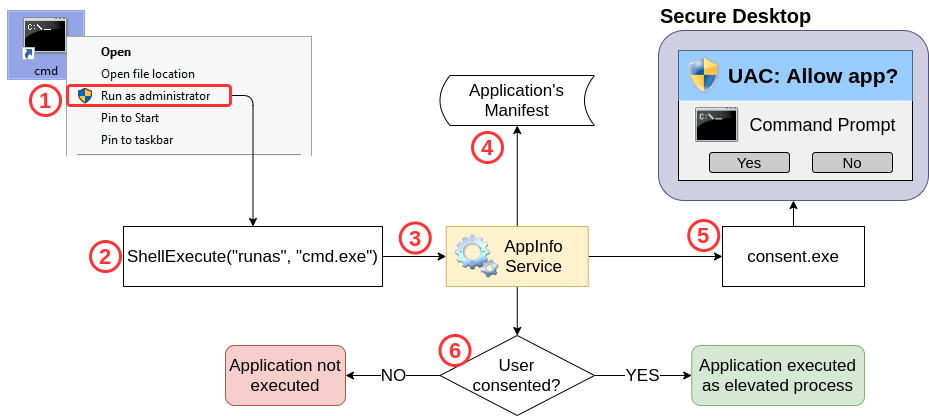

# Task 1 - Einführung
In diesem Raum werden wir uns mit gängigen Methoden befassen, um eine Sicherheitsfunktion zu umgehen, die in Windows-Systemen als **Benutzerkontensteuerung** Englisch - **User Account Control** (**UAC**) bekannt ist. Diese Funktion ermöglicht es jedem Prozess, unabhängig davon, wer ihn ausführt (ein normaler Benutzer oder ein Administrator), mit geringen Privilegien ausgeführt zu werden.

Aus der Perspektive eines Angreifers ist es entscheidend, die UAC zu umgehen, um aus stark eingeschränkten Umgebungen auszubrechen und vollständig Berechtigungen auf Zielrechnern zu erlangen. Während wir die Umgehungstechniken erlernen, werden wir auch auf mögliche Alarme achten, die ausgelöst werden könnten, und Artefakte betrachten, die auf dem Zielsystem entstehen könnten und die das Blue Team erkennen könnte.

### Raumziele

- Erlernen der verschiedenen Techniken, die Angreifer verwenden können, um die UAC zu umgehen.

### Voraussetzungen für diesen Raum

Es wird empfohlen, vorher den [Windows Internals](https://tryhackme.com/r/room/windowsinternals) Raum durchzugehen.

# Task 2 - User Account Control (UAC)
### Was ist UAC?
User Account Control (UAC) ist eine Windows-Sicherheitsfunktion, die bewirkt, dass jeder neue Prozess standardmäßig im Sicherheitskontext eines nicht privilegierten Kontos ausgeführt wird. Diese Richtlinie gilt für Prozesse, die von jedem Benutzer gestartet werden, einschließlich der Administratoren selbst. Die Idee dahinter ist, dass wir uns nicht allein auf die Identität des Benutzers verlassen können, um zu bestimmen, ob bestimmte Aktionen autorisiert werden sollten.

Obwohl dies auf den ersten Blick kontraproduktiv erscheinen mag, stellen Sie sich folgendes Szenario vor: Benutzer BOB lädt unwissentlich eine bösartige Anwendung aus dem Internet herunter. Wenn BOB Teil der Administratorengruppe ist, erbt jede von ihm gestartete Anwendung die Zugriffsrechte seines Zugriffstokens. Wenn also BOB beschließt, die bösartige Anwendung zu starten und UAC deaktiviert ist, würde die bösartige Anwendung sofort Administratorrechte erlangen. Stattdessen wird die bösartige Anwendung eingeschränkt auf ein Zugriffstoken ohne Administratorrechte beschränkt, wenn UAC aktiviert ist.

### UAC Elevation

Wenn ein Administrator für eine privilegierte Aufgabe erforderlich ist, bietet UAC eine Möglichkeit zur Erhöhung der Rechte. Die **Erhöhung** funktioniert, indem dem Benutzer ein einfaches Dialogfeld angezeigt wird, um zu bestätigen, dass er ausdrücklich zustimmt, die Anwendung im administrativen Sicherheitskontext auszuführen:


Integritätsstufen

UAC ist eine **Mandatory Integrity Control** (**MIC**), ein Mechanismus, der es ermöglicht, Benutzer, Prozesse und Ressourcen durch Zuweisung einer **Integritätsstufe** (**IL**) voneinander zu unterscheiden. Im Allgemeinen können Benutzer oder Prozesse mit einem höheren IL-Zugriffstoken auf Ressourcen mit niedrigeren oder gleichen ILs zugreifen. MIC hat Vorrang vor den regulären Windows-DACLs (Discretionary Access Control Lists), daher kann es sein, dass Sie gemäß der DACL auf eine Ressource zugreifen dürfen, aber es spielt keine Rolle, wenn Ihre IL nicht hoch genug ist.

Windows verwendet die folgenden 4 ILs, geordnet von niedrigster bis höchster:
| Integritätsstufe | Verwendung |
| -----------------|----------- |
| Niedrig | Wird üblicherweise für die Interaktion mit dem Internet verwendet (z. B. Internet Explorer). Hat sehr begrenzte Berechtigungen.|
| Mittel | Wird Standardbenutzern und Administratoren mit gefilterten Tokens zugewiesen. |
| Hoch | Wird von Administratoren mit erhöhten Tokens verwendet, wenn UAC aktiviert ist. Wenn UAC deaktiviert ist, verwenden alle Administratoren immer ein Token mit hoher IL.|
| System | Reserviert für den Systemgebrauch. |

Wenn ein Prozess auf eine Ressource zugreifen muss, erbt er das Zugriffstoken des aufrufenden Benutzers und die damit verbundene IL. Dasselbe geschieht, wenn ein Prozess einen Kindprozess erzeugt.

Gefilterte Tokens

Um diese Rollentrennung zu erreichen, behandelt UAC normale Benutzer und Administratoren während der Anmeldung etwas unterschiedlich:

- **Nicht-Administratoren** erhalten bei der Anmeldung ein einzelnes Zugriffstoken, das für alle vom Benutzer durchgeführten Aufgaben verwendet wird. Dieses Token hat eine mittlere IL.
- **Administratoren** erhalten zwei Zugriffstoken:
    - **Gefiltertes Token**: Ein Token, dem Administratorrechte entzogen wurden, das für reguläre Operationen verwendet wird. Dieses Token hat eine mittlere IL.
    - **Erhöhtes Token**: Ein Token mit vollen Administratorrechten, das verwendet wird, wenn etwas mit administrativen Rechten ausgeführt werden muss. Dieses Token hat eine hohe IL.

Auf diese Weise verwenden Administratoren ihr gefiltertes Token, es sei denn, sie fordern explizit über UAC administrative Berechtigungen an.

### Öffnen einer Anwendung auf übliche Weise

Wenn wir versuchen, eine normale Konsole zu öffnen, können wir sie entweder als nicht privilegierter Benutzer oder als Administrator öffnen. Abhängig von unserer Wahl wird dem gestarteten Prozess entweder ein Token mit mittlerer oder hoher Integritätsstufe zugewiesen:  


Wenn wir beide Prozesse mit dem Process Hacker analysieren, können wir die zugehörigen Tokens und ihre Unterschiede sehen:  


Links sehen Sie ein gefiltertes Token mit mittlerem IL und kaum zugewiesenen Berechtigungen. Rechts können Sie sehen, dass der Prozess mit hohem IL läuft und wesentlich mehr Berechtigungen zur Verfügung hat. Ein weiterer Unterschied, der vielleicht nicht so offensichtlich ist, besteht darin, dass der Prozess mit mittlerem IL effektiv jegliche Berechtigungen verweigert sind, die mit der Zugehörigkeit zur Administratorengruppe zusammenhängen.

### UAC-Einstellungen

Je nach unseren Sicherheitsanforderungen kann UAC auf vier verschiedene Benachrichtigungsstufen eingestellt werden:

- **Immer benachrichtigen**: Benachrichtigen und zur Autorisierung auffordern, wenn Änderungen an den Windows-Einstellungen vorgenommen werden oder wenn ein Programm versucht, Anwendungen zu installieren oder Änderungen am Computer vorzunehmen.
- **Benachrichtigen, wenn Programme versuchen, Änderungen am Computer vorzunehmen**: Benachrichtigen und zur Autorisierung auffordern, wenn ein Programm versucht, Anwendungen zu installieren oder Änderungen am Computer vorzunehmen. Administratoren werden nicht zur Autorisierung aufgefordert, wenn sie Windows-Einstellungen ändern.
- **Benachrichtigen, wenn Programme versuchen, Änderungen am Computer vorzunehmen (Desktop nicht abdunkeln)**: Wie oben, aber der UAC-Prompt wird nicht auf einem sicheren Desktop ausgeführt.
-** Nie benachrichtigen**: UAC-Prompt deaktivieren. Administratoren führen alles mit einem Token hoher Privilegien aus.

Standardmäßig ist UAC auf die **Benachrichtigen, wenn Programme versuchen, Änderungen am Computer vorzunehmen-Ebene** eingestellt.


Vom Standpunkt eines Angreifers aus betrachtet sind die drei niedrigeren Sicherheitsstufen äquivalent, und nur die Einstellung "Immer benachrichtigen" stellt einen Unterschied dar.

UAC-Internas

Im Kern von UAC haben wir den Anwendungsinformationsdienst oder Appinfo. Wenn ein Benutzer eine Erhöhung benötigt, geschieht Folgendes:

1. Der Benutzer fordert an, eine Anwendung als Administrator auszuführen.
2. Ein Aufruf der ShellExecute-API mit dem Verb "runas" wird gemacht.
3. Die Anfrage wird an Appinfo weitergeleitet, um die Erhöhung zu handhaben.
4. Es wird überprüft, ob im Anwendungsmanifest die AutoElevation erlaubt ist (mehr dazu später).
5. Appinfo führt consent.exe aus, die den UAC-Prompt auf einem sicheren Desktop anzeigt. Ein sicherer Desktop ist einfach ein separater Desktop, der Prozesse von dem isoliert, was auf dem tatsächlichen Desktop des Benutzers läuft, um zu verhindern, dass andere Prozesse den UAC-Prompt auf irgendeine Weise manipulieren.
6. Wenn der Benutzer zustimmt, die Anwendung als Administrator auszuführen, wird der Appinfo-Dienst die Anfrage mit einem erhöhten Token des Benutzers ausführen. Anschließend setzt Appinfo die Elternprozess-ID des neuen Prozesses so, dass sie auf die Shell zeigt, von der aus die Erhöhung angefordert wurde.  


### Umgehung der Benutzerkontensteuerung (UAC)

Aus der Perspektive eines Angreifers gibt es möglicherweise Situationen, in denen Sie eine entfernte Shell zu einem Windows-Host über Powershell oder cmd.exe erhalten. Möglicherweise haben Sie sogar Zugriff über ein Konto, das Teil der Administratorengruppe ist. Wenn Sie jedoch versuchen, einen Hintertür-Benutzer für zukünftigen Zugriff zu erstellen, erhalten Sie folgenden Fehler:
```powershell
PS C:\Users\attacker> net user backdoor Backd00r /add
System error 5 has occurred.

Access is denied.
```

Indem wir unsere zugewiesenen Gruppen überprüfen, können wir bestätigen, dass unsere Sitzung mit einem mittleren IL läuft, was bedeutet, dass wir effektiv ein gefiltertes Token verwenden:
```powershell
PS C:\Users\attacker> whoami /groups
	
GROUP INFORMATION
-----------------

Group Name                                                    Attributes
============================================================= ==================================================
Everyone                                                      Mandatory group, Enabled by default, Enabled group
NT AUTHORITY\Local account and member of Administrators group Group used for deny only
BUILTIN\Administrators                                        Group used for deny only
BUILTIN\Users                                                 Mandatory group, Enabled by default, Enabled group
NT AUTHORITY\REMOTE INTERACTIVE LOGON                         Mandatory group, Enabled by default, Enabled group
NT AUTHORITY\INTERACTIVE                                      Mandatory group, Enabled by default, Enabled group
NT AUTHORITY\Authenticated Users                              Mandatory group, Enabled by default, Enabled group
NT AUTHORITY\This Organization                                Mandatory group, Enabled by default, Enabled group
NT AUTHORITY\Local account                                    Mandatory group, Enabled by default, Enabled group
LOCAL                                                         Mandatory group, Enabled by default, Enabled group
NT AUTHORITY\NTLM Authentication                              Mandatory group, Enabled by default, Enabled group
Mandatory Label\Medium Mandatory Level
```

Even wenn wir eine Powershell-Sitzung mit einem administrativen Benutzer öffnen, hindert uns die Benutzerkontensteuerung (UAC) daran, administrative Aufgaben auszuführen, da wir momentan nur ein gefiltertes Token verwenden. Um volle Kontrolle über unser Ziel zu erlangen, müssen wir die UAC umgehen.

Interessanterweise betrachtet Microsoft die UAC nicht als Sicherheitsgrenze, sondern eher als eine einfache Annehmlichkeit für den Administrator, um unnötiges Ausführen von Prozessen mit administrativen Rechten zu vermeiden. In diesem Sinne dient der UAC-Prompt eher als Erinnerung für den Benutzer, dass er mit hohen Privilegien arbeitet, anstatt Malware oder einem Angreifer den Zugriff zu erschweren. Da es keine Sicherheitsgrenze ist, werden Umgehungstechniken nicht als Sicherheitslücke von Microsoft betrachtet, weshalb einige davon bis heute ungepatcht sind.

Im Allgemeinen basieren die meisten Umgehungstechniken darauf, dass wir in der Lage sind, einen Prozess mit einem hohen Integritätslevel (IL) zu nutzen, um etwas in unserem Auftrag auszuführen. Da jeder Prozess, der von einem Elternprozess mit hohem IL erstellt wird, das gleiche Integritätsniveau erbt, genügt dies, um ein erhöhtes Token zu erhalten, ohne dass wir den UAC-Prompt durchlaufen müssen.

In allen Szenarien, die in diesem Kontext behandelt werden, gehen wir davon aus, dass wir Zugriff auf den Server mit einem administrativen Konto haben, jedoch nur über eine Konsole mit mittlerem IL. Unser Ziel ist es immer, Zugang zu einer Konsole mit hohem IL zu erlangen, ohne die UAC zu umgehen.

## Fragen:
Was ist das höchste Integritätslevel (IL), das auf Windows verfügbar ist?
```

```

Welches IL ist mit einem erhöhten Token eines Administrators verbunden?
```

```

Wie lautet der vollständige Name des Dienstes, der für die Verarbeitung von UAC-Erhebungsanfragen zuständig ist?
```

```

# Task 3 - UAC: GUI-basierte Umgehungen
Wir werden damit beginnen, uns GUI-basierte Umgehungen anzuschauen, da sie eine einfache Möglichkeit bieten, die grundlegenden Konzepte zu verstehen. Diese Beispiele sind normalerweise nicht auf reale Szenarien anwendbar, da sie darauf basieren, dass wir Zugang zu einer grafischen Sitzung haben, von der aus wir die Standard-UAC zur Erhöhung verwenden könnten.

Klicken Sie auf die Schaltfläche "Start Machine", um Ihre virtuelle Maschine bereitzustellen und eine Verbindung dazu herzustellen, entweder über RDP oder im Nebeneinander-Ansicht im Browser:

xfreerdp /v:MACHINE_IP /u:attacker /p:Password321

Diese Maschine wird für alle Aufgaben in diesem Raum verwendet werden.


Fallstudie: msconfig

Unser Ziel ist es, Zugang zu einer Eingabeaufforderung mit hohem Integritätslevel zu erlangen, ohne die UAC zu durchlaufen. Zuerst öffnen wir msconfig, entweder über das Startmenü oder das Dialogfeld "Ausführen":  


Wenn wir den msconfig-Prozess mit dem Process Hacker analysieren (verfügbar auf Ihrem Desktop), bemerken wir etwas Interessantes. Selbst wenn uns kein UAC-Prompt angezeigt wurde, läuft msconfig als Prozess mit hohem Integritätslevel:  


Das ist dank einer Funktion namens automatische Erhebung möglich, die bestimmten Binärdateien ermöglicht, sich ohne Interaktion des Benutzers zu erhöhen. Weitere Details dazu folgen später.

Wenn es uns gelingen würde, msconfig dazu zu bringen, eine Shell für uns zu starten, würde die Shell dasselbe Zugriffstoken erben, das von msconfig verwendet wird, und daher als Prozess mit hohem Integritätslevel ausgeführt werden. Indem wir zum Register "Tools" navigieren, finden wir eine Option, genau das zu tun:  


Wenn wir auf "Launch" klicken, erhalten wir eine Eingabeaufforderung mit hohem Integritätslevel, ohne dabei mit der UAC in irgendeiner Weise interagieren zu müssen.
```powershell
C:\> C:\flags\GetFlag-msconfig.exe
```

### Fallstudie: azman.msc

Wie bei msconfig erfolgt bei azman.msc eine automatische Erhebung ohne Benutzerinteraktion. Wenn es uns gelingt, eine Shell aus diesem Prozess heraus zu starten, umgehen wir die UAC. Beachten Sie, dass azman.msc im Gegensatz zu msconfig keinen vorgesehenen eingebauten Weg hat, um eine Shell zu starten. Dies können wir jedoch leicht mit etwas Kreativität überwinden.

Lassen Sie uns zuerst azman.msc ausführen:
Um die msconfig-Flagge abzurufen, verwenden Sie die erlangte Konsole mit hohem Integritätslevel, um folgendes auszuführen:  


Wir können bestätigen, dass ein Prozess mit hohem Integritätslevel gestartet wurde, indem wir den Process Hacker verwenden. Beachten Sie, dass alle .msc Dateien von mmc.exe (Microsoft Management Console) ausgeführt werden:  


Um eine Shell auszuführen, werden wir die Hilfe der Anwendung missbrauchen:  


Auf dem Hilfemenü werden wir mit der rechten Maustaste auf einen beliebigen Teil des Hilfeartikels klicken und **Quelltext anzeigen** auswählen:  


Dies wird einen Notepad-Prozess erzeugen, den wir nutzen können, um eine Shell zu erhalten. Gehen Sie dazu zu **Datei** **->** **Öffnen** und stellen Sie sicher, dass Sie "Alle Dateien" in der Kombinationsbox unten rechts auswählen. Navigieren Sie zu `C:\Windows\System32` und suchen Sie nach `cmd.exe`. Klicken Sie mit der rechten Maustaste, um "Öffnen" auszuwählen:  


Dies wird erneut die UAC umgehen und uns Zugang zu einer Eingabeaufforderung mit hoher Integrität geben. Sie können den Prozessbaum im Process Hacker überprüfen, um zu sehen, wie das Zugriffstoken mit hoher Integrität von mmc (Microsoft Management Console, gestartet über Azman) bis zu cmd.exe weitergereicht wird:  


Um die Azman-Flagge abzurufen, verwenden Sie die erlangte Konsole mit hoher Integrität, um Folgendes auszuführen:
```powershell
C:\> C:\flags\GetFlag-azman.exe
```

## Fragen:
Welche Flagge wird durch Ausführen des msconfig-Exploits zurückgegeben?
```

```

Welche Flagge wird durch Ausführen des azman.msc-Exploits zurückgegeben?
```

```

# Task 4 - UAC: Prozesse automatisch erhöhen
### AutoElevate

Wie bereits erwähnt, können einige ausführbare Dateien automatisch auf ein hohes IL-Niveau angehoben werden, ohne dass eine Benutzerinteraktion erforderlich ist. Dies gilt für die meisten Funktionen der Systemsteuerung und einige ausführbare Dateien, die mit Windows bereitgestellt werden.

Für eine Anwendung müssen einige Voraussetzungen erfüllt sein, um automatisch aufzusteigen:

- Die ausführbare Datei muss vom Windows-Publisher signiert sein.
- Die ausführbare Datei muss sich in einem vertrauenswürdigen Verzeichnis befinden, wie z.B. `%SystemRoot%/System32/` oder `%ProgramFiles%/`

Je nach Art der Anwendung können zusätzliche Anforderungen gelten:

- Ausführbare Dateien (.exe) müssen das **autoElevate**-Element in ihren Manifesten deklarieren. Um das Manifest einer Datei zu überprüfen, können wir das Tool [sigcheck](https://learn.microsoft.com/en-us/sysinternals/downloads/sigcheck) verwenden, das Teil der Sysinternals-Suite ist. Eine Kopie von sigcheck finden Sie auf Ihrem Rechner unter `C:\tools\`. Wenn wir das Manifest für msconfig.exe überprüfen, finden wir die Eigenschaft autoElevate:
```powershell
C:\tools\> sigcheck64.exe -m c:/windows/system32/msconfig.exe
...
<asmv3:application>
	<asmv3:windowsSettings xmlns="http://schemas.microsoft.com/SMI/2005/WindowsSettings">
		<dpiAware>true</dpiAware>
		<autoElevate>true</autoElevate>
	</asmv3:windowsSettings>
</asmv3:application>
```

- **mmc.exe wird je nach dem .msc-Snap-In, das vom Benutzer angefordert wird, automatisch erhöht. Die meisten .msc-Dateien, die mit Windows mitgeliefert werden, werden automatisch erhöht.
- Windows führt eine zusätzliche Liste von ausführbaren Dateien, die auch dann automatisch erhöht werden, wenn sie nicht im Manifest angefordert werden. Diese Liste umfasst beispielsweise pkgmgr.exe und spinstall.exe.
- COM-Objekte können ebenfalls eine automatische Erhebung durch Konfiguration bestimmter [Registrierungsschlüssel anfordern](https://docs.microsoft.com/en-us/windows/win32/com/the-com-elevation-moniker).

### Fallstudie: Fodhelper

Fodhelper.exe ist eine der standardmäßigen ausführbaren Dateien von Windows, die für die Verwaltung optionaler Windows-Funktionen zuständig ist, einschließlich zusätzlicher Sprachen, Anwendungen, die nicht standardmäßig installiert sind, oder anderer Betriebssystemmerkmale. Wie die meisten Programme zur Systemkonfiguration kann fodhelper bei Verwendung der Standard-UAC-Einstellungen automatisch erhöht werden, sodass Administratoren nicht zur Erhöhung aufgefordert werden, wenn sie Standardadministrationsaufgaben ausführen. Während wir bereits eine autoElevate-Executable betrachtet haben, kann fodhelper im Gegensatz zu msconfig missbraucht werden, ohne Zugang zu einer grafischen Benutzeroberfläche zu haben.  


Von der Perspektive eines Angreifers aus betrachtet bedeutet dies, dass es über eine Remote-Shell mit mittlerer Integrität verwendet werden kann und in einen voll funktionsfähigen Prozess mit hoher Integrität umgewandelt werden kann. Diese spezielle Technik wurde von [@winscripting](https://winscripting.blog/2017/05/12/first-entry-welcome-and-uac-bypass/) entdeckt und wurde bereits von der [Glupteba-Malware](https://www.cybereason.com/blog/research/glupteba-expands-operation-and-toolkit-with-lolbins-cryptominer-and-router-exploit) in freier Wildbahn eingesetzt.

Was an fodhelper bemerkt wurde, ist, dass es die Registry nach einem spezifischen interessanten Schlüssel durchsucht:


Wenn Windows eine Datei öffnet, überprüft es die Registrierung, um zu erfahren, welche Anwendung verwendet werden soll. Die Registrierung enthält einen Schlüssel namens Programmatic ID (**ProgID**) für jeden Dateityp, wo die entsprechende Anwendung zugeordnet ist. Angenommen, Sie versuchen, eine HTML-Datei zu öffnen. Ein Teil der Registrierung, bekannt als **HKEY_CLASSES_ROOT**, wird überprüft, damit das System weiß, dass es Ihren bevorzugten Webclient verwenden muss, um sie zu öffnen. Der Befehl zur Verwendung wird unter dem Unterschlüssel `shell/open/command` für jedes ProgID der Datei angegeben. Nehmen wir den ProgID "htmlfile" als Beispiel:  


In Wirklichkeit ist HKEY_CLASSES_ROOT nur eine zusammengeführte Ansicht von zwei verschiedenen Pfaden in der Registrierung:
| Path                                  | Beschreibung                            |
|---------------------------------------|-----------------------------------------|
| HKEY_LOCAL_MACHINE\Software\Classes    | Systemweite Dateizuordnungen            |
| HKEY_CURRENT_USER\Software\Classes     | Dateizuordnungen des aktiven Benutzers  |

Beim Überprüfen von HKEY_CLASSES_ROOT hat eine benutzerspezifische Zuordnung unter **HKEY_CURRENT_USER (HKCU)** Vorrang. Falls keine benutzerspezifische Zuordnung konfiguriert ist, wird stattdessen die systemweite Zuordnung unter **HKEY_LOCAL_MACHINE (HKLM)** verwendet. Auf diese Weise kann jeder Benutzer separat seine bevorzugten Anwendungen auswählen, wenn gewünscht.

Zurück zu fodhelper sehen wir nun, dass versucht wird, eine Datei unter dem ProgID ms-settings zu öffnen. Durch das Erstellen einer Zuordnung für diesen ProgID im Kontext des aktuellen Benutzers unter HKCU überschreiben wir die standardmäßige systemweite Zuordnung und kontrollieren somit, welcher Befehl zur Dateiöffnung verwendet wird. Da fodhelper ein autoElevate-Executable ist, erbt jeder von ihm gestartete Unterprozess ein Token mit hoher Integrität und umgeht somit effektiv die UAC.

### Alles zusammengefasst:

Einer unserer Agenten hat für Ihre Bequemlichkeit eine Hintertür auf dem Zielserver platziert. Er konnte ein Konto innerhalb der Administratorengruppe erstellen, jedoch verhindert UAC die Ausführung privilegierter Aufgaben. Um die Flagge zu erhalten, benötigt er, dass Sie die UAC umgehen und eine voll funktionsfähige Shell mit hoher Integrität erhalten.

Um sich mit der Hintertür zu verbinden, können Sie folgenden Befehl verwenden:

`nc MACHINE_IP 9999`

Sobald verbunden, überprüfen wir, ob unser Benutzer Teil der Administratorengruppe ist und dass er mit einem Token mittlerer Integrität läuft:
