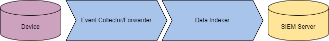

# Task 1 - Umgehung der Protokollierung und Überwachung
Eines der größten Hindernisse auf dem Weg eines Angreifers ist das Logging und Monitoring. Im Gegensatz zu Anti-Virus- und EDR-Lösungen (Endpoint Detection and Response) erstellt das Logging eine physische Aufzeichnung der Aktivitäten, die auf bösartige Aktivitäten analysiert werden kann.

Wie ein Gerät überwacht wird, hängt von der Umgebung und den Vorlieben des Unternehmens ab. Teams können sich entscheiden, einige Geräte überhaupt nicht zu überwachen. Im Allgemeinen beginnt eine Überwachungslösung am Host-Gerät und sammelt Anwendungs- oder Ereignisprotokolle. Sobald Protokolle erstellt wurden, können sie auf dem Gerät gespeichert oder an einen Ereignissammler/Forwarder gesendet werden. Sobald sie sich nicht mehr auf dem Gerät befinden, entscheidet das Verteidigungsteam, wie sie aggregiert werden; dies wird im Allgemeinen mit einem Indexer und einem SIEM (Security Information and Event Manager) durchgeführt.

Ein Angreifer hat möglicherweise wenig Kontrolle, sobald Protokolle von einem Gerät entfernt wurden, kann jedoch steuern, was sich auf dem Gerät befindet und wie es aufgenommen wird. Das primäre Ziel für einen Angreifer sind die Ereignisprotokolle, die von ETW (Event Tracing for Windows) verwaltet und kontrolliert werden.

Dieser Raum wird sich mit der Ereignisverfolgung und ihren Schwachstellen befassen, um einem Angreifer zu ermöglichen, ETW-basierte Lösungen zu umgehen oder zu deaktivieren.

Lernziele:

- Verstehen der Technologie und Implementierung der Ereignisverfolgung.
- Verstehen, wie Techniken zur Umgehung von ETW erstellt werden.
- Erlernen, wie theoretische Umgehungskonzepte auf Code angewendet werden.

Bevor Sie mit diesem Raum beginnen, machen Sie sich mit der grundlegenden Windows-Nutzung und -Funktionalität vertraut; wir empfehlen, den Windows Internals Raum abzuschließen. Grundlegende Programmierkenntnisse in C und PowerShell sind ebenfalls empfehlenswert, aber nicht erforderlich.

Wir haben eine grundlegende Windows-Maschine mit den benötigten Dateien bereitgestellt, um diesen Raum abzuschließen. Sie können auf die Maschine im Browser oder über RDP mit den unten stehenden Anmeldedaten zugreifen.

Machine IP: `MACHINE_IP` Benutzername: `Administrator` Passwort: `Tryhackme!`

# Task 2 - Ereignisverfolgung
Wie bereits erwähnt, wird fast die gesamte Ereignisprotokollierungsfunktionalität in Windows sowohl auf Anwendungs- als auch auf Kernelebene von ETW (Event Tracing for Windows) gehandhabt. Während es andere Dienste wie Event Logging und Trace Logging gibt, sind diese entweder Erweiterungen von ETW oder für Angreifer weniger relevant.

Wir werden jedes dieser Komponenten und deren Instrumentierung im nächsten Abschnitt ausführlicher behandeln.

Obwohl für einen Angreifer weniger wichtig als die Komponenten selbst, sind Ereignis-IDs ein zentrales Merkmal der Windows-Protokollierung. Ereignisse werden im XML-Format (Extensible Markup Language) gesendet und übertragen, was der Standard für die Definition und Implementierung von Ereignissen durch Anbieter ist. Unten ist ein Beispiel für die Ereignis-ID 4624: Ein Konto wurde erfolgreich angemeldet.

Für weitere Informationen zur Ereignisprotokollierung, besuchen Sie den Raum "Windows Event Logs".

An diesem Punkt verstehen wir, warum Protokollierung für einen Angreifer störend sein kann, aber wie genau ist ETW für einen Angreifer relevant? ETW bietet Sichtbarkeit über den Großteil des Betriebssystems, während die Protokollierung im Allgemeinen begrenzte Sichtbarkeit oder Details hat.

Aufgrund der Sichtbarkeit von ETW sollte ein Angreifer stets die Ereignisse im Auge behalten, die bei der Durchführung ihrer Operationen generiert werden könnten. Der beste Ansatz, um ETW auszuschalten, besteht darin, seine Einsicht in das, was Sie konkret tun, so weit wie möglich zu begrenzen und gleichzeitig die Integrität der Umgebung aufrechtzuerhalten.

In den kommenden Aufgaben werden wir die Instrumentierung von ETW, die Umgehung von ETW und andere auf ETW basierende Lösungen behandeln.

**Welche ETW-Komponente wird Sitzungen erstellen und konfigurieren?**

**Welche Ereignis-ID protokolliert, wenn ein Benutzerkonto gelöscht wurde?**
