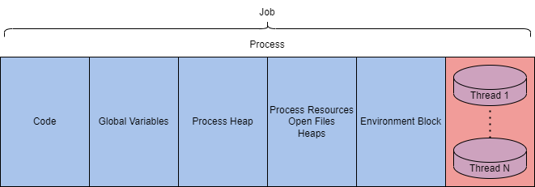
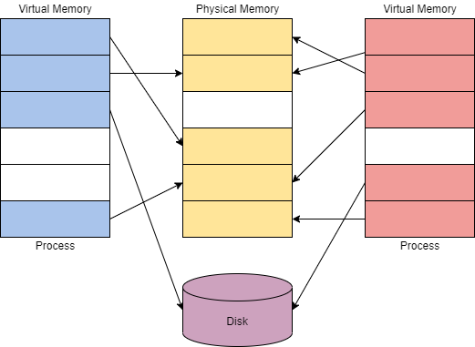
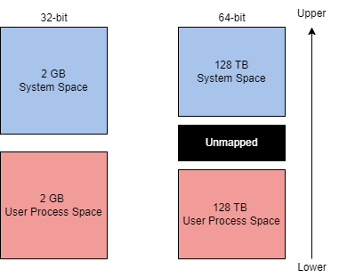

# Windows Internals 
Dies ist eine einführung zu dem TryHackMe Raum: [Windows Internals](https://tryhackme.com/r/room/windowsinternals)
# Task 1 - Introduction
Betriebssysteme haben viel mehr Technologie und Architektur hinter sich, als wir auf den ersten Blick sehen können. In diesem Raum werden wir die Windows-Betriebssysteme und gängige interne Komponenten beobachten.

## Lernziele

- Verständnis und Interaktion mit Windows-Prozessen und ihren zugrunde liegenden Technologien.
- Lernen Sie die Kern-Dateiformate und ihre Verwendung kennen.
- Interaktion mit Windows-Internas und Verständnis, wie der Windows-Kernel funktioniert.

Da Windows-Maschinen den Großteil der Unternehmensinfrastruktur ausmachen, müssen Red Teams die Windows-Internas verstehen und wie sie (miss)braucht werden können. Das Red Team kann Windows zur Unterstützung bei der Umgehung und Ausnutzung verwenden, wenn es offensive Tools oder Exploits erstellt.

Bevor Sie diesen Raum beginnen, machen Sie sich mit der grundlegenden Windows-Nutzung und -Funktionalität vertraut. Grundkenntnisse in C++ und PowerShell sind ebenfalls empfohlen, aber nicht erforderlich.

# Task 2 - Prozesse
Ein Prozess verwaltet und repräsentiert die Ausführung eines Programms; eine Anwendung kann einen oder mehrere Prozesse enthalten. Ein Prozess besteht aus vielen Komponenten, die aufgeteilt werden, um gespeichert und interagiert zu werden. Die [Microsoft-Dokumentation](https://learn.microsoft.com/en-us/windows/win32/procthread/about-processes-and-threads) zerlegt diese anderen Komponenten wie folgt: "Jeder Prozess stellt die für die Ausführung eines Programms benötigten Ressourcen bereit. Ein Prozess verfügt über einen virtuellen Adressraum, ausführbaren Code, offene Handles zu Systemobjekten, einen Sicherheitskontext, eine eindeutige Prozesskennung, Umgebungsvariablen, eine Prioritätsklasse, minimale und maximale Arbeitssetgrößen sowie mindestens einen Ausführungs-Thread." Diese Informationen mögen einschüchternd wirken, aber dieser Raum zielt darauf ab, dieses Konzept etwas weniger komplex zu gestalten.

Wie bereits erwähnt, werden Prozesse durch die Ausführung einer Anwendung erstellt. Prozesse sind entscheidend für die Funktionsweise von Windows; die meisten Funktionen von Windows können als Anwendung zusammengefasst werden und haben einen entsprechenden Prozess. Im Folgenden sind einige Beispiele für Standardanwendungen aufgeführt, die Prozesse starten:

- MsMpEng (Microsoft Defender)
- wininit (Tastatur und Maus)
- lsass (Speicherung von Anmeldeinformationen)

Angreifer können Prozesse ins Visier nehmen, um Erkennung zu umgehen und Malware als legitime Prozesse zu tarnen. Unten finden Sie eine kleine Liste potenzieller Angriffsvektoren, die Angreifer gegen Prozesse einsetzen könnten:

- Prozessinjektion ([T1055](https://attack.mitre.org/techniques/T1055/))
- Prozesshohlraum ([T1055.012](https://attack.mitre.org/techniques/T1055/012/))
- Prozessmaskierung ([T1055.013](https://attack.mitre.org/techniques/T1055/013/))

Prozesse haben viele Komponenten; sie können in Schlüsselmerkmale aufgeteilt werden, die wir verwenden können, um Prozesse auf hoher Ebene zu beschreiben. Die folgende Tabelle beschreibt jede kritische Komponente von Prozessen und ihren Zweck.

| Prozesskomponente            | Zweck                                                                                     |
| ---------------------------- | ----------------------------------------------------------------------------------------- |
| Private virtueller Adressraum | Virtuelle Speicheradressen, die dem Prozess zugewiesen sind.                               |
| Ausführbares Programm        | Definiert den Code und die Daten, die im virtuellen Adressraum gespeichert sind.          |
| Offene Handles               | Definiert Handles zu Systemressourcen, auf die der Prozess zugreifen kann.                 |
| Sicherheitskontext           | Das Zugriffstoken definiert den Benutzer, Sicherheitsgruppen, Berechtigungen und andere Sicherheitsinformationen. |
| Prozess-ID                   | Eindeutige numerische Kennung des Prozesses.                                              |
| Threads                      | Abschnitt eines Prozesses, der zur Ausführung geplant ist.                                 |

Wir können einen Prozess auch auf einer niedrigeren Ebene erklären, da er im virtuellen Adressraum vorhanden ist. Die Tabelle und das Diagramm unten zeigen, wie ein Prozess im Speicher aussieht.

| Komponente          | Zweck                                     |
| ------------------- | ----------------------------------------- |
| Code                | Code, der vom Prozess ausgeführt wird.    |
| Globale Variablen   | Gespeicherte Variablen.                   |
| Prozess-Heap        | Definiert den Heap, in dem Daten gespeichert werden. |
| Prozessressourcen   | Definiert weitere Ressourcen des Prozesses. |
| Umgebungsbereich    | Datenstruktur zur Definition von Prozessinformationen. |



Diese Informationen sind sehr nützlich, wenn wir uns tiefer mit der Ausnutzung und dem Missbrauch der zugrunde liegenden Technologien beschäftigen, aber sie sind immer noch sehr abstrakt. Wir können den Prozess greifbarer machen, indem wir ihn im Windows-Task-Manager beobachten. Der Task-Manager kann viele Komponenten und Informationen über einen Prozess anzeigen.

| Wert/Komponente | Zweck | Beispiel |
|-----------------|-------|----------|
| Name            | Definiert den Namen des Prozesses, normalerweise vom Anwendungsprogramm geerbt | conhost.exe |
| PID             | Eindeutiger numerischer Wert zur Identifizierung des Prozesses | 7408 |
| Status          | Bestimmt, wie der Prozess ausgeführt wird (ausgeführt, angehalten usw.) | Running |
| Benutzername    | Der Benutzer, der den Prozess gestartet hat. Kann auf die Privilegien des Prozesses hinweisen | SYSTEM |

Dies sind die Dinge, mit denen Sie als Endbenutzer am häufigsten interagieren würden oder die Sie als Angreifer manipulieren könnten.

Es gibt mehrere Dienstprogramme, die das Beobachten von Prozessen erleichtern, darunter [Process Hacker 2](https://github.com/winsiderss/systeminformer), [Process Explorer](https://learn.microsoft.com/en-us/sysinternals/downloads/process-explorer) und [Procmon](https://learn.microsoft.com/en-us/sysinternals/downloads/procmon).

Prozesse sind der Kern vieler interner Windows-Komponenten. Die folgenden Aufgaben erweitern die Informationen über Prozesse und wie sie in Windows verwendet werden.

## Fragen:
Öffnen Sie die bereitgestellte Datei: "Logfile.PML" in Procmon und beantworten Sie die folgenden Fragen.
```
Keine Antwort nötig
```

Wie lautet die Prozess-ID von "notepad.exe"?
```
5984
```

Wie lautet die übergeordnete Prozess-ID des vorherigen Prozesses?
```
3412
```

Wie hoch ist die Integrität des Prozesses?
```
High
```

# Task 3 - Threads
Ein Thread ist eine ausführbare Einheit, die von einem Prozess verwendet wird und basierend auf Gerätefaktoren geplant wird.

Gerätefaktoren können je nach CPU- und Spezifikationen des Arbeitsspeichers, Priorität und logischen Faktoren variieren.

Wir können die Definition eines Threads vereinfachen: "Steuerung der Ausführung eines Prozesses."

Da Threads die Ausführung steuern, handelt es sich um einen häufig angegriffenen Bestandteil. Threadmissbrauch kann allein zur Unterstützung der Codeausführung verwendet werden oder wird häufiger mit anderen API-Aufrufen als Teil anderer Techniken verknüpft.

Threads teilen dieselben Details und Ressourcen wie ihr übergeordneter Prozess, z. B. Code, globale Variablen usw. Threads haben auch ihre eigenen Werte und Daten, die in der folgenden Tabelle beschrieben sind

| Komponente            | Zweck                                                                                   |
|-----------------------|-----------------------------------------------------------------------------------------|
| Stack                 | Alle für den Thread relevanten und spezifischen Daten (Ausnahmen, Prozeduraufrufe usw.) |
| Thread Local Storage  | Zeiger zur Zuweisung von Speicher für eine eindeutige Datenumgebung                      |
| Stack-Argument        | Eindeutiger Wert, der jedem Thread zugewiesen ist                                        |
| Kontextstruktur       | Enthält von der Kernel verwaltete Maschinenregisterwerte                                 |

Threads mögen als einfache Komponenten erscheinen, aber ihre Funktion ist für Prozesse entscheidend.

## Fragen:
Öffnen Sie die bereitgestellte Datei: "Logfile.PML" in Procmon und beantworten Sie die folgenden Fragen.
```
Keine Antwort nötig
```

Wie lautet die Thread-ID des ersten von notepad.exe erstellten Threads?
```
5908
```

Was ist das Stack-Argument des vorherigen Threads? 
```
6584
```

# Task 4 - Virtueller Speicher
Virtualer Speicher ist eine entscheidende Komponente dafür, wie Windows-Internas funktionieren und miteinander interagieren. Virtueller Speicher ermöglicht es anderen internen Komponenten, mit dem Speicher zu interagieren, als wäre er physischer Speicher, ohne das Risiko von Kollisionen zwischen Anwendungen. Das Konzept von Modi und Kollisionen wird in Aufgabe 8 weiter erläutert.

Virtueller Speicher stellt jedem Prozess einen [privaten virtuellen Adressraum](https://learn.microsoft.com/en-us/windows/win32/memory/virtual-address-space) zur Verfügung. Ein Speicherverwalter wird verwendet, um virtuelle Adressen in physische Adressen zu übersetzen. Durch einen privaten virtuellen Adressraum und das direkte Schreiben in den physischen Speicher haben Prozesse ein geringeres Risiko, Schäden zu verursachen.

Der Speicherverwalter verwendet auch Seiten oder Übertragungen, um den Speicher zu verwalten. Anwendungen können mehr virtuellen Speicher verwenden als physischer Speicher zugewiesen ist; der Speicherverwalter überträgt oder paginiert virtuellen Speicher auf die Festplatte, um dieses Problem zu lösen. Sie können sich dieses Konzept in der folgenden Abbildung vorstellen.


Der theoretische maximale virtuelle Adressraum beträgt 4 GB auf einem 32-Bit-x86-System.

Dieser Adressraum ist in zwei Hälften aufgeteilt: Die untere Hälfte (0x00000000 - 0x7FFFFFFF) ist den Prozessen zugeordnet, wie oben erwähnt. Die obere Hälfte (0x80000000 - 0xFFFFFFFF) ist der Nutzung durch das Betriebssystem zugeordnet. Administratoren können dieses Zuordnungslayout für Anwendungen ändern, die einen größeren Adressraum benötigen, indem sie Einstellungen (increaseUserVA) oder die [AWE (Address Windowing Extensions)](https://learn.microsoft.com/en-us/windows/win32/memory/address-windowing-extensions) verwenden.

Der theoretische maximale virtuelle Adressraum beträgt auf einem modernen 64-Bit-System 256 TB.

Das genaue Adresslayout-Verhältnis aus dem 32-Bit-System ist dem 64-Bit-System zugeordnet.

Die meisten Probleme, die Einstellungen oder die AWE erfordern, werden mit dem erhöhten neuen theoretischen Maximum des 64-Bit-Systems gelöst.

Sie können beide Zuordnungslayouts für den Adressraum rechts visualisieren.


Obwohl dieses Konzept nicht direkt auf Windows-Internas oder -Konzepte übertragen wird, ist es wichtig zu verstehen. Wenn es korrekt verstanden wird, kann es dazu beitragen, Windows-Internas zu missbrauchen

## Fragen:
Lesen Sie den obigen Text und beantworten Sie die folgenden Fragen.
```
Keine Antwort nötig
```

Wie groß ist der theoretisch maximale virtuelle Adressraum eines 32-Bit-x86-Systems?
```
4 GB
```

Welches Standardeinstellungsflag kann verwendet werden, um den Adressraum von Benutzerprozessen neu zuzuweisen?
```
increaseUserVA
```

Öffnen Sie die bereitgestellte Datei: "Logfile.PML" in Procmon und beantworten Sie die folgenden Fragen.
```
Keine Antwort nötig
```

Wie lautet die Basisadresse von "notepad.exe"?
```
0x7ff652ec0000
```

# Task 5 - Dynamic Link Libraries
Die [Microsoft-Dokumentation](https://learn.microsoft.com/en-us/troubleshoot/windows-client/setup-upgrade-and-drivers/dynamic-link-library#:~:text=A%20DLL%20is%20a%20library,common%20dialog%20box%20related%20functions.) beschreibt eine DLL als eine Bibliothek, die Code und Daten enthält, die von mehr als einem Programm gleichzeitig verwendet werden können.

DLLs werden als eine der Kernfunktionen hinter der Ausführung von Anwendungen in Windows verwendet. Laut der [Windows-Dokumentation](https://learn.microsoft.com/en-us/troubleshoot/windows-client/setup-upgrade-and-drivers/dynamic-link-library#:~:text=A%20DLL%20is%20a%20library,common%20dialog%20box%20related%20functions.) fördert die Verwendung von DLLs die Modularisierung von Code, die Wiederverwendung von Code, die effiziente Nutzung des Speichers und den reduzierten Festplattenspeicherplatz. Dadurch laden das Betriebssystem und die Programme schneller, laufen schneller und belegen weniger Festplattenspeicher auf dem Computer.

Wenn eine DLL als Funktion in einem Programm geladen wird, wird die DLL als Abhängigkeit zugewiesen. Da ein Programm von einer DLL abhängig ist, können Angreifer die DLLs anstelle der Anwendungen angreifen, um bestimmte Aspekte der Ausführung oder Funktionalität zu steuern.

- **DLL-Hijacking ([T1574.001](https://attack.mitre.org/techniques/T1574/001/)):** Hierbei wird eine bösartige DLL anstelle der beabsichtigten DLL geladen.
- **DLL Side-Loading ([T1574.002](https://attack.mitre.org/techniques/T1574/002/)):** Dies tritt auf, wenn eine Anwendung eine DLL aus einem unerwarteten Pfad lädt.
- **DLL-Injection ([T1055.001](https://attack.mitre.org/techniques/T1055/001/)):** Dabei wird eine DLL in den Speicher eines laufenden Prozesses injiziert.

DLLs werden nicht anders erstellt als andere Projekte/Anwendungen; sie erfordern nur geringfügige Syntaxänderungen, um zu funktionieren. Im Folgenden finden Sie ein Beispiel für eine DLL aus dem Visual C++ Win32 Dynamic-Link Library-Projekt.
```C++
#include "stdafx.h"
#define EXPORTING_DLL
#include "sampleDLL.h"
BOOL APIENTRY DllMain( HANDLE hModule, DWORD ul_reason_for_call, LPVOID lpReserved
)
{
    return TRUE;
}

void HelloWorld()
{
    MessageBox( NULL, TEXT("Hello World"), TEXT("In a DLL"), MB_OK);
}
```

Hier ist die Header-Datei für die DLL; sie definiert, welche Funktionen importiert und exportiert werden. Wir werden die Bedeutung der Header-Datei (oder das Fehlen davon) im nächsten Abschnitt dieser Aufgabe besprechen.
```C++
#ifndef INDLL_H
    #define INDLL_H
    #ifdef EXPORTING_DLL
        extern __declspec(dllexport) void HelloWorld();
    #else
        extern __declspec(dllimport) void HelloWorld();
    #endif

#endif
```

Die DLL wurde erstellt, aber das wirft immer noch die Frage auf, wie sie in einer Anwendung verwendet werden.

DLLs können in einem Programm entweder mit Load-Time Dynamic Linking oder Run-Time Dynamic Linking geladen werden.

Bei Load-Time Dynamic Linking werden explizite Aufrufe der DLL-Funktionen aus der Anwendung heraus gemacht. Diesen Typ des Linkings erreichen Sie nur, indem Sie eine Header-Datei (.h) und eine Importbibliotheksdatei (.lib) bereitstellen. Im Folgenden finden Sie ein Beispiel für den Aufruf einer exportierten DLL-Funktion aus einer Anwendung
```C++
#include "stdafx.h"
#include "sampleDLL.h"
int APIENTRY WinMain(HINSTANCE hInstance, HINSTANCE hPrevInstance, LPSTR lpCmdLine, int nCmdShow)
{
    HelloWorld();
    return 0;
}
```

Wenn Sie Run-Time Dynamic Linking verwenden, wird eine separate Funktion (`LoadLibrary` oder `LoadLibraryEx`) verwendet, um die DLL zur Laufzeit zu laden. Sobald sie geladen ist, müssen Sie `GetProcAddress` verwenden, um die exportierte DLL-Funktion zu identifizieren, die aufgerufen werden soll. Im Folgenden finden Sie ein Beispiel für das Laden und Importieren einer DLL-Funktion in einer Anwendung.
```C++
...
typedef VOID (*DLLPROC) (LPTSTR);
...
HINSTANCE hinstDLL;
DLLPROC HelloWorld;
BOOL fFreeDLL;

hinstDLL = LoadLibrary("sampleDLL.dll");
if (hinstDLL != NULL)
{
    HelloWorld = (DLLPROC) GetProcAddress(hinstDLL, "HelloWorld");
    if (HelloWorld != NULL)
        (HelloWorld);
    fFreeDLL = FreeLibrary(hinstDLL);
}
...
```

In bösartigem Code verwenden Angreifer oft die Laufzeit-Dynamikverknüpfung häufiger als die Ladungszeit-Dynamikverknüpfung. Dies liegt daran, dass ein bösartiges Programm möglicherweise Dateien zwischen Speicherbereichen übertragen muss, und das Übertragen einer einzelnen DLL ist einfacher als das Importieren unter Verwendung anderer Dateianforderungen.

## Fragen:
Öffnen Sie die bereitgestellte Datei: "Logfile.PML" in Procmon und beantworten Sie die folgenden Fragen.
```
Keine Antwort nötig
```

Wie lautet die Basisadresse von "ntdll.dll", die von "notepad.exe" geladen wird?
```
0x7ffd0be20000
```

Wie groß ist die Datei "ntdll.dll", die von "notepad.exe" geladen wird?
```
0x1ec000
```

Wie viele DLLs wurden von "notepad.exe" geladen?
```
51
```

# Task 6 - Portable Executable Format
